# 部署问题:为什么我的 Flask Web 应用程序不能在 Google App Engine 上部署？

> 原文：<https://medium.com/analytics-vidhya/deployment-blues-why-wont-my-flask-web-app-just-deploy-2ac9092a1b40?source=collection_archive---------20----------------------->

# 介绍

公平的警告，这篇文章有点咆哮，如果你已经是一个经验丰富的开发者或者熟悉 Google Cloud 应用引擎，你可能会翻白眼

我将详细介绍我的开发运营“兔子洞”之旅，以及我使用 Google 的应用程序引擎以及我作为 n00b 数据科学爱好者发现有用的任何在线资源(Stackoverflow 帖子或其他技术博客)在线部署一个简单的 Flask Web 应用程序所经历的故障排除。

最终，我没能解决我的问题，因为我最终部署的不是谷歌应用引擎，而是一个谷歌计算引擎实例(可能会花费我更多的美元，但嘿，我想这仍然是一件事)

 [## 文本分析器

### 编辑描述

34.126.83.61](http://34.126.83.61/) 

然而，我在解决其他问题的时候确实学到了一些东西，所以希望通过写这篇文章，其他人可能会受益。

我知道 Medium.com 不是 StackOverflow，但是任何读到这篇文章的人，如果有什么建议，请在评论中给我留言。

我的 GitHub repo 在这里(注意——在我修复了下面的大部分问题之后，它已经包含了文件的重构版本):-

[](https://github.com/ZhijingEu/Text_Analyzer_FlaskWebApp) [## ZhijingEu/Text _ Analyzer _ FlaskWebApp

### 这是一个 Python Flask Web 应用程序，接受用户提供的文本或 URL 地址…

github.com](https://github.com/ZhijingEu/Text_Analyzer_FlaskWebApp) 

# 概述

## 0。背景

## [1。修复由于酸洗模型导致的属性错误](#c18b)

## [2。解决 Python 3.6.4 和 3.7 之间的库兼容性问题](#1752)

## [3。添加 WGSI 服务器库](#8bdc)

## [4。内存泄露(可能)？](#43b3)

## [5。将应用部署在谷歌计算引擎上](#74af)

## [6。结论](#42e8)

# 0.背景

在最近的一篇文章中，我分享了一个文本分析 Flask 应用程序，它是我在自己的机器上运行的。

[](/analytics-vidhya/building-a-text-analysis-web-app-with-medium-claps-prediction-2ce2d59153ef) [## 构建一个具有中等评分预测的文本分析 Web 应用程序

### 为了看看数据科学/ ML 技术是否能帮助我提高写作水平，我构建了一个简单的 Python Flask，基于…

medium.com](/analytics-vidhya/building-a-text-analysis-web-app-with-medium-claps-prediction-2ce2d59153ef) 

不幸的是，这对于那些想利用你的机器学习模型、代码或其他任何东西，而不需要学习 python 或复制你的开发环境的人来说不是很有用。

因此，我开始探索如何将应用程序上线的部署选项。以前我在他们的免费服务上用过 pythonanywhere.com。然而这一次，我决定尝试谷歌云的应用引擎

根据下面的文档和示例教程(**请在阅读本文其余部分之前通读一遍，因为它将在后面变得相关**)，这似乎是一个足够简单的过程…

[](/@dmahugh_70618/deploying-a-flask-app-to-google-app-engine-faa883b5ffab) [## 将 Flask 应用程序部署到 Google App Engine

### 这篇文章讲述了如何将一个简单的 Python/Flask 应用程序部署到 App Engine 标准环境中。我已经做了很多…

medium.com](/@dmahugh_70618/deploying-a-flask-app-to-google-app-engine-faa883b5ffab) 

我走到了这一步。当消息说部署通过时，它看起来很有希望…

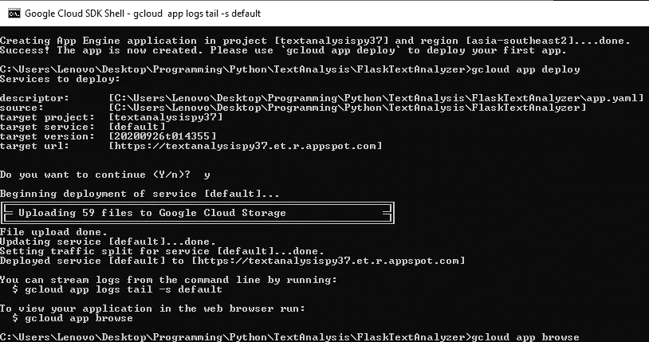

看起来很简单…

啊哦。

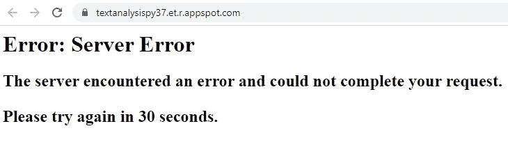

…但是没有: (

# 1.酸洗和属性错误

我在谷歌云的错误日志中快速搜索，发现了这条消息。

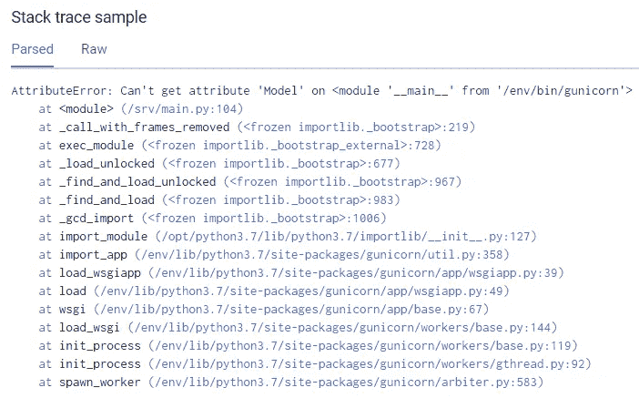

模型类是一个自定义类，它使用 RandomForestRegression 和 RandomForestClassifier 来预测大 5 人格特征。这是一个有人在网上发布的模型，我只是将他们预先训练好的(和腌制的)模型整合到我的网络应用程序中。

所以一些 stackoverdrive 拖网发现了这个金块:

*"当你直接在你运行的文件中定义一个类时，它被腌成来自模块****main****。然而，当您在 Flask web app 中取消选中它时，没有* ***主*** *模块，因此代码找不到定义“*

原来这是一个相当常见的新手错误，在几篇不同的文章中都有涉及。

[](https://rebeccabilbro.github.io/module-main-has-no-attribute/) [## 模块 Main 没有属性...(在管道和泡菜上)

### 众所周知，数据科学家喜欢 scikit-learn，它是 Python 机器学习库，提供了一个通用的…

rebeccabilbro.github.io](https://rebeccabilbro.github.io/module-main-has-no-attribute/) 

其要点是，如果您在一个项目中定义了一个类和函数(例如，我们称之为 FileA.py ),并试图将它加载到另一个项目 FileB.py 中，Python 将很难在模块"`__main__”`中找到相关的类，它现在与 FileB 相对应，而不是与它所在的 FileA 相对应。


来源:[https://www.istockphoto.com/photos/pickle](https://www.istockphoto.com/photos/pickle)

当我在本地机器上运行这个应用程序时，我从来没有注意到这个消息的原因是因为我总是使用> python main.py 命令运行这个应用程序。因此底部的这部分总是被执行:

```
if __name__ == "__main__":
    main()
```

然而，如果我不使用`flask run`和`set FLASK_APP=main.py`，我至少可以复制我在谷歌应用引擎日志中看到的错误，因为`flask run`命令通过从你的`main.py`模块导入一个`app`对象来工作。这个 StackOverflow 线程可能可以更好地解释它…

值得庆幸的是，总会有人有现成的解决方案..在深入研究 StackOverflow 之后，我发现一个用户发布了一个非常好的自定义 Unpickler 类

[](https://stackoverflow.com/questions/27732354/unable-to-load-files-using-pickle-and-multiple-modules) [## 无法使用 pickle 和多个模块加载文件

### 我正在尝试创建一个用户系统，它使用一个设置和 GUI 模块，当 Gui 模块请求文件时…

stackoverflow.com](https://stackoverflow.com/questions/27732354/unable-to-load-files-using-pickle-and-multiple-modules) 

```
import pickleclass CustomUnpickler(pickle.Unpickler):

    def find_class(self, module, name):
        try:
            return super().find_class(__name__, name)
        except AttributeError:
            return super().find_class(module, name)

pickle_data = CustomUnpickler(open('file_path.pkl', 'rb')).load()
```

这是可行的，因为它覆盖了`pickle.Unpickler`的`find_class`函数，并显式地指示它在当前模块的名称空间中查找，这样就避免了关于引用哪个`"___main___"`的混乱。

所以现在至少我可以在我的本地机器上‘Flask Run’这个应用程序而不会出错。我更新了 main.py 并上传到 Google App Engine，急切地等待结果。


arrrrgggggggggghhhhhh

# 2.解决库兼容性问题

回到错误日志——我发现了这条神秘的消息。

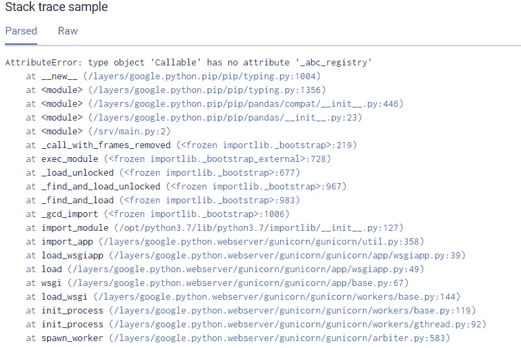

???

回到网上寻求帮助，我偶然发现了一些相关的 github 帖子:

[](https://github.com/modin-project/modin/issues/647) [## AttributeError:类型对象' Callable '没有属性' _abc_registry '问题#647 …

### 解散 GitHub 是超过 5000 万开发者的家园，他们一起工作来托管和审查代码，管理项目，以及…

github.com](https://github.com/modin-project/modin/issues/647) [](https://github.com/ethereum/eth-abi/issues/131) [## AttributeError:类型对象' Callable '没有属性' _abc_registry '问题#131 …

### 解散 GitHub 是超过 5000 万开发者的家园，他们一起工作来托管和审查代码，管理项目，以及…

github.com](https://github.com/ethereum/eth-abi/issues/131) 

显然，这是因为我使用 Python 3.6.4 构建了我的应用程序，但我使用的是默认为 Python 3.7 环境的谷歌应用程序引擎的“免费层”，这个“键入”包在 Python 3.6 之后是多余的，仅用于在早期版本中反向移植该功能。

我甚至不记得在构建我的应用程序时在我的本地虚拟环境中安装过这个特定的库，但是当我使用`pip freeze > requirements.txt`命令取出所有相关的包时，它肯定在那里。

所以很快删除并重新上传后，我等待结果加载。

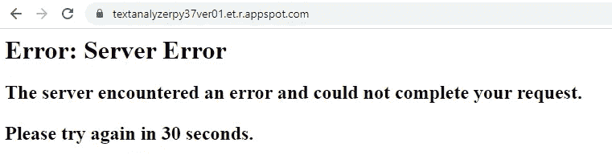

不不不


# 3.(显式)在 WSGI 服务器中添加…

我设法消除了所有的属性错误信息。该应用程序仍然无法工作，但这是一种进步。

我回到日志中，注意到有一条消息是 ***早些时候就已经出现了*** ，但是我在处理属性错误问题时从来没有仔细看过。

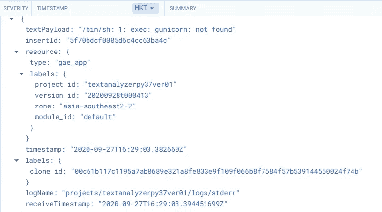

在示例[教程中，我使用的是](/@dmahugh_70618/deploying-a-flask-app-to-google-app-engine-faa883b5ffab)，甚至是谷歌云自己的[“Hello World”示例](https://github.com/GoogleCloudPlatform/python-docs-samples/tree/master/appengine/standard_python3/hello_world)，你只需在 requirements.txt 文件中指定 Flask，而 [app.yaml 文件](https://cloud.google.com/appengine/docs/standard/python3/config/appref)(类似于一个配置文件，告诉谷歌应用引擎如何设置容器)中唯一的东西是一个单独的 LINER `runtime:Python37`

当然，我所构建的要复杂一些，但我认为 GAE 会在我没有明确说明的情况下“猜测”我在做什么。

不管怎样，我回到我的 requirements.txt 文件，添加了:`gunicorn==20.0.4`，还将这一行添加到我的 app.yaml 文件:`entrypoint: gunicorn -b :$PORT main:app`

为了确保我可以在日志中“看到”应用程序是否加载，我在 main.py 文件的最后写了一行:`print(“Hey, At Least I Loaded Up…”)`

正如你所料，事情并没有按计划进行。

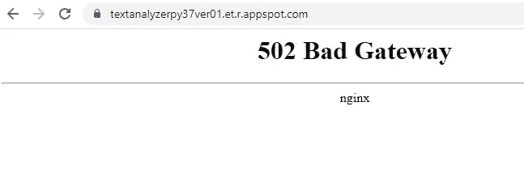

嘿——这是新的……哪个好？

回到日志文件…

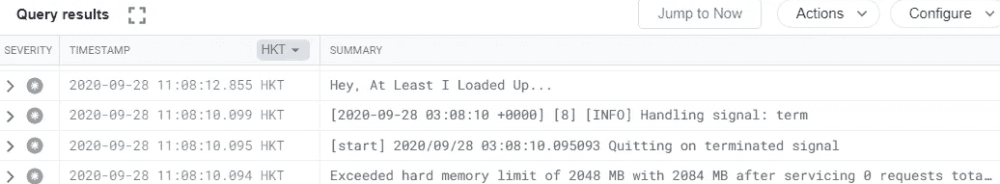

我想还不算完全失败。至少我知道它在做一些事情，即使应用程序没有加载。

# **4 记忆力下降？**


[资料来源:Dreamstime](https://www.dreamstime.com/illustration/brain-missing-piece.html)

根据帮助文件:

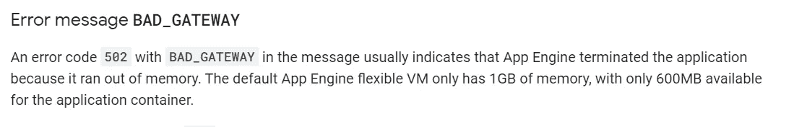

扩展内存限制超出警告，我收到一条消息，说“*在处理这个请求时，处理这个请求的进程被发现使用了太多的内存，并被终止。这可能会导致对应用程序的下一个请求使用新的进程。如果您经常看到此消息，则您的应用程序可能存在内存泄漏，或者可能正在使用一个内存不足的实例。考虑在 app.yaml 中设置一个更大的实例类*"

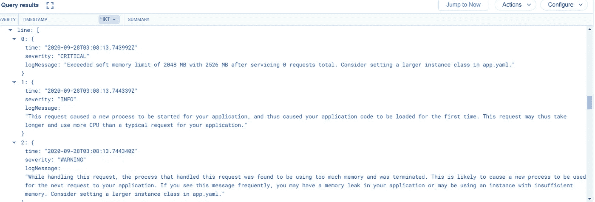

问题是，在修复所有其他错误的过程中，我已经升级到了最大的实例(即 F4 1G，有 2048MB ),只是为了排除任何内存问题，所以我不知道如何才能设置更大的实例

看起来好像我在应用程序处理信息的方式上遇到了某种内存泄漏。

[](https://en.wikipedia.org/wiki/Memory_leak) [## 内存泄漏

### 在计算机科学中，内存泄漏是一种资源泄漏，当计算机程序错误地管理…

en.wikipedia.org](https://en.wikipedia.org/wiki/Memory_leak) 

我在 StackOverflow 中发现了这个线程，有人编写了一个函数，帮助识别代码中消耗内存的“顶部”行 Python 的默认`tracemalloc`模块

[](https://stackoverflow.com/questions/552744/how-do-i-profile-memory-usage-in-python/33631986) [## 如何在 Python 中分析内存使用情况？

### Python 3.4 包含了一个新模块:tracemalloc。它提供了关于哪个代码分配最多的详细统计数据…

stackoverflow.com](https://stackoverflow.com/questions/552744/how-do-i-profile-memory-usage-in-python/33631986) 

所以我在我的代码中添加了一个基于 StackOverflow 帖子的自定义函数，该函数提取了前 10 个内存垃圾…

```
import linecache
import os
import tracemalloc

def display_top(snapshot, key_type='lineno', limit=10):
    snapshot = snapshot.filter_traces((
        tracemalloc.Filter(False, "<frozen importlib._bootstrap>"),
        tracemalloc.Filter(False, "<unknown>"),
    ))
    top_stats = snapshot.statistics(key_type)

    print("Top %s lines" % limit)
    for index, stat in enumerate(top_stats[:limit], 1):
        frame = stat.traceback[0]
        # replace "/path/to/module/file.py" with "module/file.py"
        filename = os.sep.join(frame.filename.split(os.sep)[-2:])
        print("#%s: %s:%s: %.1f KiB"
              % (index, filename, frame.lineno, stat.size / 1024))
        line = linecache.getline(frame.filename, frame.lineno).strip()
        if line:
            print('    %s' % line)

    other = top_stats[limit:]
    if other:
        size = sum(stat.size for stat in other)
        print("%s other: %.1f KiB" % (len(other), size / 1024))
    total = sum(stat.size for stat in top_stats)
    print("Total allocated size: %.1f KiB" % (total / 1024))# OTHER CODE GOES HERE
# ...if __name__ == '__main__': tracemalloc.start() app.run(debug = True) print('Top prefixes:', most_common)
    snapshot = tracemalloc.take_snapshot()
    display_top(snapshot) 
```

它吐出了这个:—

```
TOP 10
#1: <frozen importlib._bootstrap_external>:487: 66267.8 KiB#2: gensim\utils.py:1398: 65934.3 KiB
  return _pickle.load(f, encoding='latin1')#3: main.py:107: 10321.5 KiB
    cv = CustomUnpickler(open('./MTBIModels/cv.pickle', 'rb')).load()#4: core\completer.py:174: 9945.4 KiB
    names.append(unicodedata.name(chr(c)))#5: xlrd\xlsx.py:144: 5979.9 KiB
    t = elem.text#6: main.py:161: 2161.0 KiB
    models['OPN'] = CustomUnpickler(open('BigFiveModels/OPN_model.pkl', 'rb')).load()#7: main.py:164: 2160.9 KiB
    models['AGR'] = CustomUnpickler(open('BigFiveModels/AGR_model.pkl', 'rb')).load()#8: main.py:165: 2160.9 KiB
    models['NEU'] = CustomUnpickler(open('BigFiveModels/NEU_model.pkl', 'rb')).load()#9: main.py:162: 2160.4 KiB
    models['CON'] = CustomUnpickler(open('BigFiveModels/CON_model.pkl', 'rb')).load()#10: main.py:163: 2160.2 KiB
    models['EXT'] = CustomUnpickler(open('BigFiveModels/CON_model.pkl', 'rb')).load()74040 other: 61565.3 KiBTotal allocated size: 230817.6 KiB
```

查看输出，主要原因是预训练的 Gensim Doc2Vec 模型加载了 65MB 的内存，importlib 加载了 66MB 的内存，以加载所有相关模块，但 Tracemalloc 说我只使用了 231MiB 的内存，这应该远远低于我选择的 F4 1G 实例中的 2048MB 内存…

嗯……那很奇怪。

# **5。在谷歌计算引擎上的部署**

我在谷歌应用引擎上没有取得任何进展，所以我想尝试一些不同的东西，并试图让我的 flask 应用程序在谷歌计算引擎(GCE)上运行，而不是谷歌应用引擎。

我遵循了本文中的说明:

[](https://towardsdatascience.com/deploying-a-custom-ml-prediction-service-on-google-cloud-ae3be7e6d38f) [## 在 Google 计算引擎上部署 ML 模型

### 使用 Flask 在 Google 计算引擎上部署一个对象检测模型作为 API，并使用…

towardsdatascience.com](https://towardsdatascience.com/deploying-a-custom-ml-prediction-service-on-google-cloud-ae3be7e6d38f) 

这显然是一种非常粗糙(也更昂贵)的部署方式，并且不会扩展，但我希望对正在发生的事情有更多的了解。

我最终发现了问题所在——这与内存泄漏无关。

这是因为我使用 NLTK _ data“punkt”和“stopwords”语料库，这些语料库早些时候在我从事另一个项目时已经下载到我的本地机器上，但我从未在 Google App Engine 上安装过它们！

奇怪的是，下面的错误消息从未出现在谷歌应用引擎日志中，因为当我试图运行应用程序时，它出现在我的谷歌计算引擎命令提示符上。

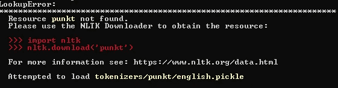

当我在谷歌计算引擎上运行时，这两行代码修复了我的应用程序

`python -m nltk.downloader punkt`

`python -m nltk.downloader stopwords`

因此，我试图通过添加 ntlk_data 文件夹并更改`app.yaml`文件，将此修复“复制”回 Google App Engine，如下所示

```
runtime: python37entrypoint: gunicorn -b :$PORT main:app --timeout 120instance_class: F4_1Genv_variables:
    NLTK_DATA: './nltk_data'
```

手指交叉…这次应该能成功。


fffffffffffffffffffffffffffffffffffffffffffffffffffffffffffffffffffffffffffffffffffffffff

# 6.结论


哇啊啊

我知道 Medium.com 不是 StackOverflow，但是任何读到这篇文章的人，如果有什么建议，请在评论中给我留言。