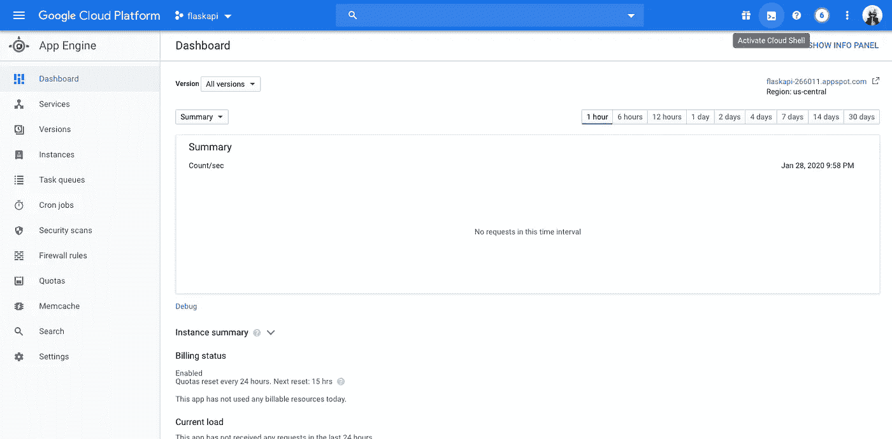
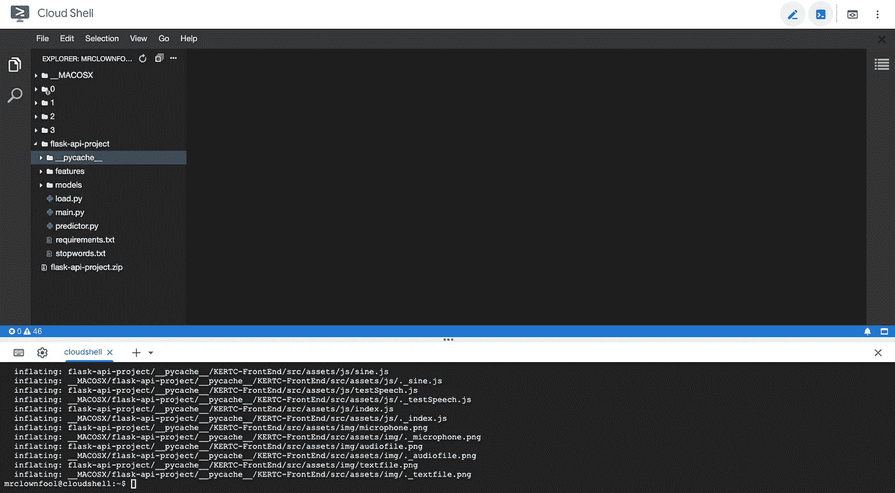

# 如何使用 Flask API 在 Google App Engine 中部署机器学习和深度学习模型

> 原文：<https://medium.com/analytics-vidhya/deployment-ml-and-dl-models-in-google-app-engine-using-flask-api-c4cd40a4c679?source=collection_archive---------9----------------------->


[JESHOOTS.COM](https://unsplash.com/@jeshoots?utm_source=medium&utm_medium=referral)在 [Unsplash](https://unsplash.com?utm_source=medium&utm_medium=referral) 上拍照

***注意:在本文中，我将只展示您的 Flask API 在 Google App Engine 中的部署，以了解如何在 GCP 创建项目和启用计费。您可以前往此*** [***文档***](https://cloud.google.com/appengine/docs/standard/nodejs/building-app/creating-project) ***。***

第一步:去 GCP 控制台，去任何项目或选择一个现有的项目，你会看到如下图。我选择了 **flaskapi** 命名项目。


第二步:现在去导航栏，选择谷歌应用引擎仪表板计算部分。


第三步:现在，点击**云壳**选项。



第四步:点击**启动编辑器**选项。


我们将得到新的标签，看起来像下面的图片。你可以看到四个项目已经是他们的名字 0，1，2，3 我会上传新的项目。


步骤 5:现在我们将上传我们已经在本地主机上使用 flask API 测试过的压缩项目文件夹。请记住，我们必须在项目中创建 requirements.txt 文件，这样 app engine 才能安装软件包。


第六步:我们将解压**云壳中输入以下命令的文件夹。**

```
unzip <zip file name>
```


我们可以在侧边栏看到解压后的文件夹。在这个文件夹中，我已经创建了必要的文件，比如用于预测的 **requirements.txt、predictor.py 和用于加载模型的 load.py。**



第 7 步:现在我们将创建一个新的文件[**app . YAML**](https://cloud.google.com/appengine/docs/standard/python/config/appref)**，其中保存了我们的**main . py**fille**。**这个文件帮助我们设置应用引擎的配置，比如我们需要多少内存，我们应该使用哪个版本的 python 等等。**

****

**步骤 8:现在，对于 google app engine 标准版本中的基本部署，我们将键入以下命令并保存它。要添加更多配置，你可以去[谷歌 YAML 文档](https://cloud.google.com/appengine/docs/standard/python3/config/appref)。**

```
# How we launch our file
entrypoint: gunicorn -b :$PORT main:app# Which runtime we will used i have used python 3.7
runtime: python37# These setting are for Deep Learning Models
# cpu for our processor
# memory_gb for our ram
instance_class: F4
  resources:
  cpu: 2
  memory_gb: 4
```

****

*****注意:如果使用机器学习模型，您可以对实例类、资源、CPU 和 memory_gb 进行注释，因为设置越高，消耗的资金就越多。*****

**步骤 10:我们将转到控制台，键入命令来选择要在哪个项目下部署我们的 API。**

```
# You can get your project id on your project dashboard.
gcloud config set project [PROJECT ID]
```

****

**我的项目 id 是 **flaskapi-266011** 你的可以不同。**

**第 11 步:现在从控制台，我们将进入文件夹，并键入以下命令。**

```
# app means our app.yaml file 
# --version [number]
gcloud app deploy --version 1
```

**它会告诉我们选择我选择的服务器**美国中部。**然后它会向我们展示部署过程，如下图所示。**

****

**我们将输入 **Y** ，我们可以在**目标 url 中看到我们的 API。**然后，我们将等待我们的部署流程。**