# 在 AWS-EKS 集群上部署 Webapp

> 原文：<https://medium.com/analytics-vidhya/deployment-of-webapp-over-aws-eks-cluster-e2fc4d3f65aa?source=collection_archive---------20----------------------->

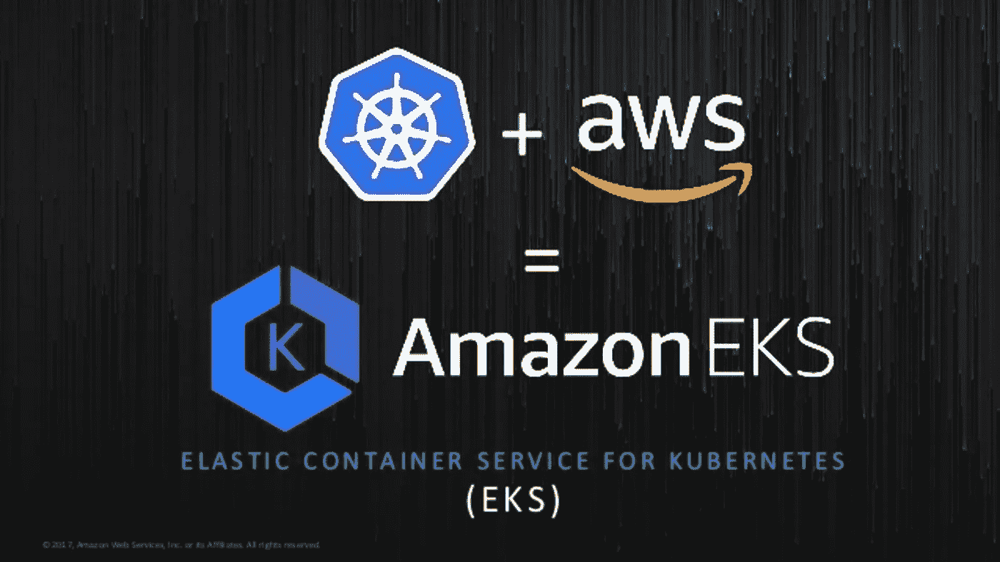

> AWS-EKS

一个**mazon EKS(Kubernetes 的弹性容器服务)——**允许您在 AWS 上使用 **Kubernetes，而无需安装和管理您自己的 Kubernetes 控制平面。**

EKS 本身在自己的基础设施内私下管理主节点。只有我们需要担心我们的从属环境(比如实例类型)。

在这里，我们可以启动从属环境的各种实例类型，也称为节点组，在这个节点组中，我们可以启动尽可能多的各种实例类型的节点。

## 使用 EKS 自动气象站的好处

*   好用。
*   灵活。
*   性价比高。
*   可靠。
*   可扩展和高性能。
*   安全。

## 目标:-

创建一个 EKS 集群，在该集群中启动三个不同的实例类型节点，然后在该节点中启动两个 pod，一个是 Mysql 数据库，另一个是 Joomla(web 应用程序)。为了平衡我们的应用程序，我们将把这个应用程序单元与 AWS 的 ELB 服务提供的负载平衡器连接起来，对于两个单元的存储，我们将使用 AWS 的 EFS 存储。

所以，让我们开始创造我们的整个环境…

## 在 AWS 中创建 IAM 角色。

1.打开 *IAM 控制台*。

2.选择**角色>创建角色。**

3.从服务列表中选择 EKS >在 EKS 下选择使用案例，因为**允许 EKS 代表您管理集群。**

4.然后给出一些标签并复习。

## 创建亚马逊 EKS 集群

我们可以通过两种方式在 AWS 中创建 EKS

1.  使用 aws eks create-cluster 命令:该命令没有为创建具有不同实例类型的集群(从属)提供更多定制。
2.  使用 eksctl 命令:我们将使用这个命令来创建我们的集群，因为它在创建从属环境时提供了更多的定制。

其次，我们将需要一个软件，将联系主(Kubernetes 集群)。

因此，下载 eksctl 和 kubectl 软件，很容易通过 google 获得，保存在一个文件夹中，并向您的环境变量提供该文件夹的位置。

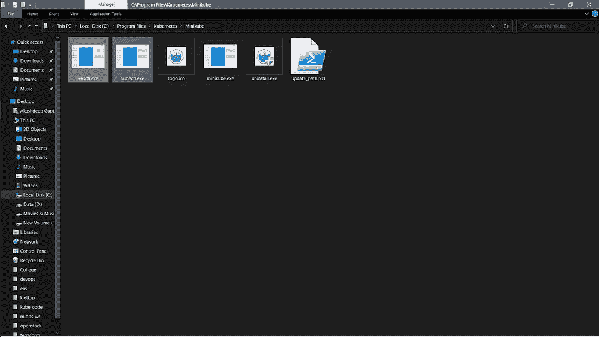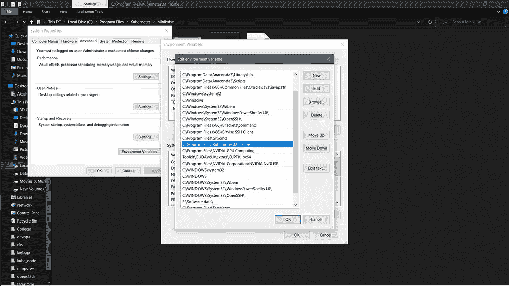

eksctl 和 kubectl 文件

为了创建集群，我们必须用 yml 代码创建一个文件，给出集群名称、区域(我们启动集群的位置)，为节点组提供不同的实例类型和容量，并且在每个节点组中提供一个 aws-key，以便进一步登录。

```
apiVersion: eksctl.io/v1alpha5
kind: ClusterConfigmetadata: 
 name: ak-cluster
 region: ap-south-1nodeGroups:
 — name: ng1
 desiredCapacity: 2
 instanceType: t2.micro
 ssh: 
 publicKeyName: key1
 — name: ng2
 desiredCapacity: 1
 instanceType: t2.small
 ssh:
 publicKeyName: key1
```

创建集群的命令→

`eksctl create cluster -f cluster.yml`

这里，cluster.yml 是我上面创建的代码的文件名。

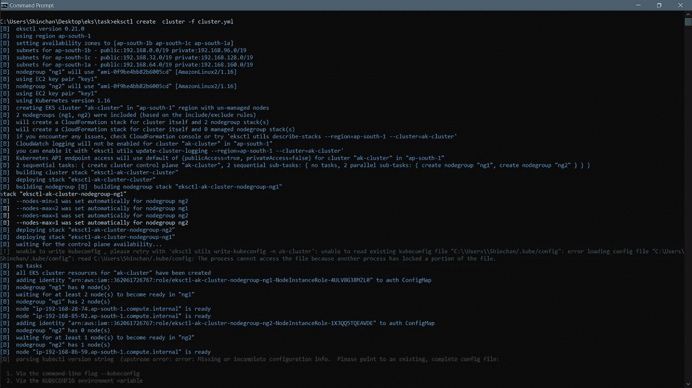

cluster.yml

我们还可以检查通过以下命令创建的集群和节点组:-

`eksctl get cluster`

`eksctl get nodegroup --cluster ak-cluster`

***ak-cluster*** 是您在代码中提到的集群名称。

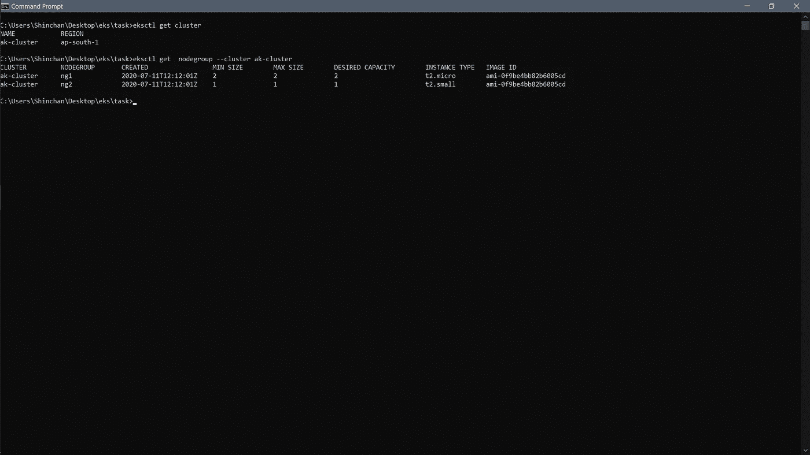

集群和节点组

创建集群和节点组的 WEBUI 视图。

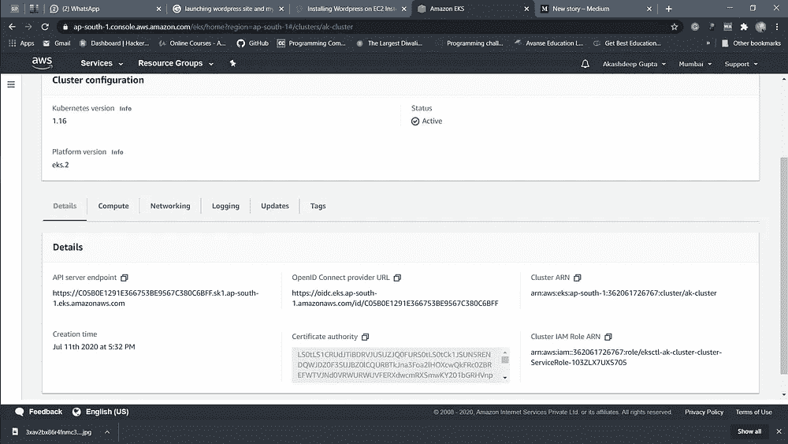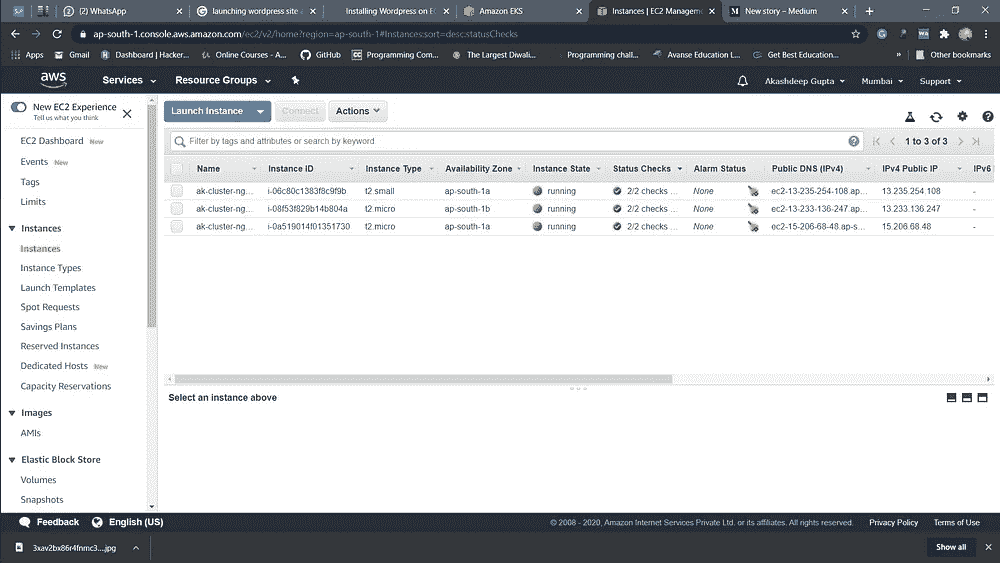

现在，将这个集群连接到 kubectl，为此我们必须更新我们的 kubeconfig 文件→

`aws eks update-kubeconfig --name ak-cluster`

## 创建用于存储数据的 EFS

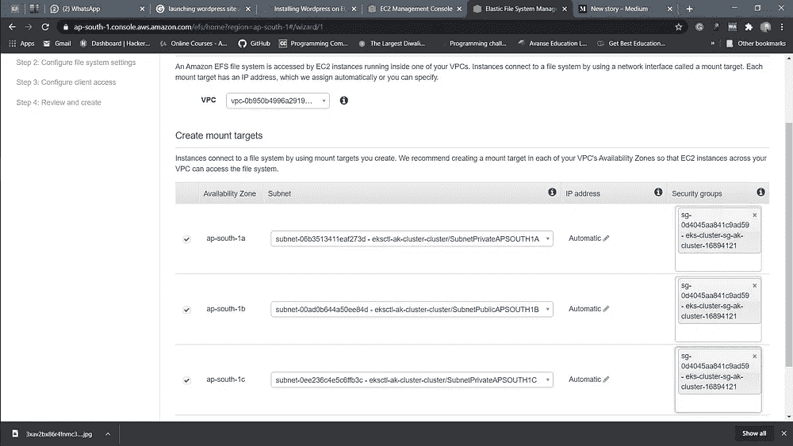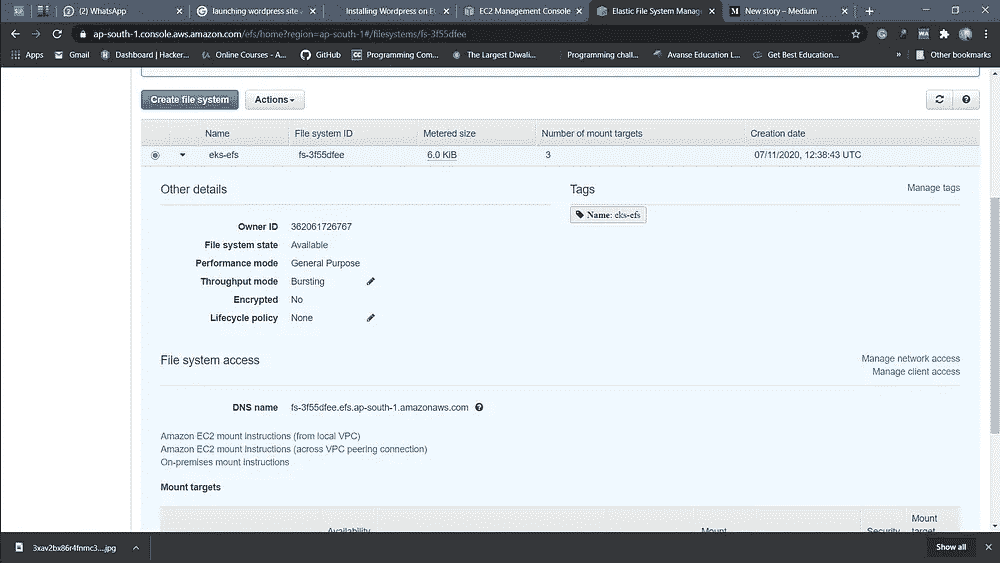

创建群集后，将自动为该群集创建 VPC，并使用该群集创建我们的 EFS。

此外，要使用由集群创建的同一个安全组。

> 为了将我们的 EFS 存储连接到我们的 pods，我们必须在所有的从节点上手动安装 amazon-efs-utils。

`yum install amazon-efs-utils -y`

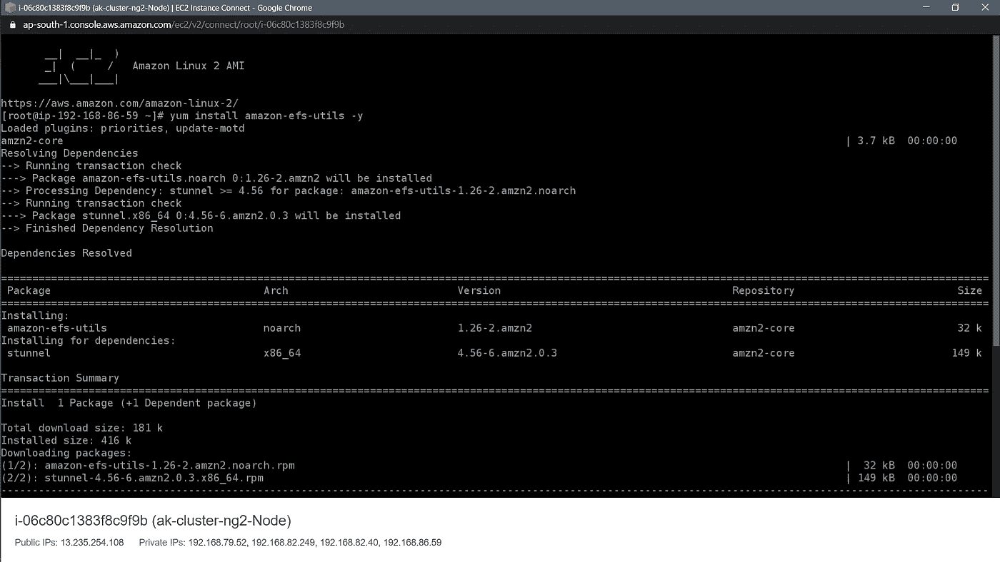

:

> 注意:-
> 
> 建议使用单独的名称空间来启动我们的不同项目，或者在默认名称空间中运行。
> 
> `kubectl create namespace ak-eks`
> 
> 将其更新为默认值。
> 
> `kubectl config set-context --current --namespace=ak-eks`

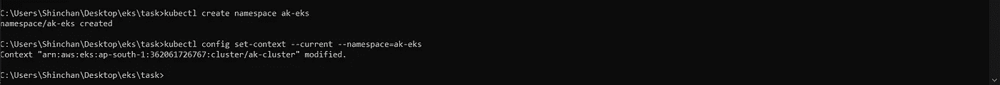

## 创建 EFS 置备程序

```
apiVersion: apps/v1
kind: Deployment
metadata:
 name: efs-provisioner
spec:
 selector:
 matchLabels:
 app: efs-provisioner
 replicas: 1
 strategy:
 type: Recreate
 template:
 metadata:
 labels:
 app: efs-provisioner
 spec:
 containers:
 — name: efs-provisioner
 image: quay.io/external_storage/efs-provisioner:v0.1.0
 env:
 — name: FILE_SYSTEM_ID
 value: fs-3f55dfee
 — name: AWS_REGION
 value: ap-south-1
 — name: PROVISIONER_NAME
 value: ak/aws-efs
 volumeMounts:
 — name: pv-volume
 mountPath: /persistentvolumes
 volumes:
 — name: pv-volume
 nfs:
 server: fs-3f55dfee.efs.ap-south-1.amazonaws.com
 path: /
```

用创建的 efs 和服务器的 id 替换文件系统 ID。该置备程序将帮助我们的 kubectl 连接到 EFS 以进行存储。

## 修改 RBAC

使用基于角色的访问控制修改某些权限(RBAC)。

```
apiVersion: rbac.authorization.k8s.io/v1beta1
kind: ClusterRoleBinding
metadata:
 name: nfs-provisioner-role-binding
subjects:
 — kind: ServiceAccount
 name: default
 namespace: ak-eks
roleRef:
 kind: ClusterRole
 name: cluster-admin
 apiGroup: rbac.authorization.k8s.io
```

## 创建存储类和 PVC

我们将创建一个存储类，它将创建我们的 pod 存储数据所需的 PVC。将创建一个动态 PV，它将联系所需存储的存储类。

```
apiVersion: storage.k8s.io/v1
kind: StorageClass
metadata:
 name: aws-efs
provisioner: ak/aws-efs
 — -
kind: PersistentVolumeClaim
apiVersion: v1
metadata:
 name: wordpress-efs
 annotations:
 volume.beta.kubernetes.io/storage-class: “aws-efs”
spec:
 accessModes:
 — ReadWriteMany
 resources:
 requests:
 storage: 10Gi
 — -
kind: PersistentVolumeClaim
apiVersion: v1
metadata:
 name: mysql-efs
 annotations:
 volume.beta.kubernetes.io/storage-class: “aws-efs”
spec:
 accessModes:
 — ReadWriteMany
 resources:
 requests:
 storage: 10Gi
```

## 创建秘密盒子

我已经创建了一个存储我们的数据库根密码的秘密盒子，我不会透露，但我会告诉如何创建存储您的密码和其他重要凭证的秘密盒子。

```
apiVersion: v1
kind: Secret
metadata:
 name: mysecure
data:
 password: xxyyzz
```

## Mysql(数据库 pod)的部署

```
apiVersion: v1
kind: Service
metadata:
 name: wordpress-mysql
 labels:
 app: wordpress
spec:
 ports:
 — port: 3306
 selector:
 app: wordpress
 tier: mysql
 clusterIP: None
 — -
apiVersion: apps/v1 # for versions before 1.9.0 use apps/v1beta2
kind: Deployment
metadata:
 name: wordpress-mysql
 labels:
 app: wordpress
spec:
 selector:
 matchLabels:
 app: wordpress
 tier: mysql
 strategy:
 type: Recreate
 template:
 metadata:
 labels:
 app: wordpress
 tier: mysql
 spec:
 containers:
 — image: mysql:5.6
 name: mysql
 env:
 — name: MYSQL_ROOT_PASSWORD
 valueFrom:
 secretKeyRef:
 name: mysecret
 key: password
 ports:
 — containerPort: 3306
 name: mysql
 volumeMounts:
 — name: mysql-persistent-storage
 mountPath: /var/lib/mysql
 volumes:
 — name: mysql-persistent-storage
 persistentVolumeClaim:
 claimName: mysql-efs
```

## WordPress(Webapp)的部署

```
apiVersion: v1
kind: Service
metadata:
 name: wordpress
 labels:
 app: wordpress
spec:
 ports:
 — port: 80
 selector:
 app: wordpress
 tier: frontend
 type: LoadBalancer
 — -
apiVersion: apps/v1 # for versions before 1.9.0 use apps/v1beta2
kind: Deployment
metadata:
 name: wordpress
 labels:
 app: wordpress
spec:
 selector:
 matchLabels:
 app: wordpress
 tier: frontend
 strategy:
 type: Recreate
 template:
 metadata:
 labels:
 app: wordpress
 tier: frontend
 spec:
 containers:
 — image: wordpress:4.8-apache
 name: joomla
 env:
 — name: WORDPRESS_DB_HOST
 value: wordpress-mysql
 — name: WORDPRESS_DB_PASSWORD
 valueFrom:
 secretKeyRef:
 name: mysecret
 key: password
 ports:
 — containerPort: 80
 name: wordpress
 volumeMounts:
 — name: wordpress-persistent-storage
 mountPath: /var/www/html
 volumes:
 — name: wordpress-persistent-storage
 persistentVolumeClaim:
 claimName: wordpress-efs
```

*   使用负载平衡器的 AWS ELB 服务作为我们的 web 应用程序连接到外部世界的服务类型。

> 要运行上述所有代码，您可以使用:-
> 
> `kubectl create -f 'file_name'`
> 
> 现在，使用以下命令检查所有文件是否已成功创建:-
> 
> `kubectl get all`

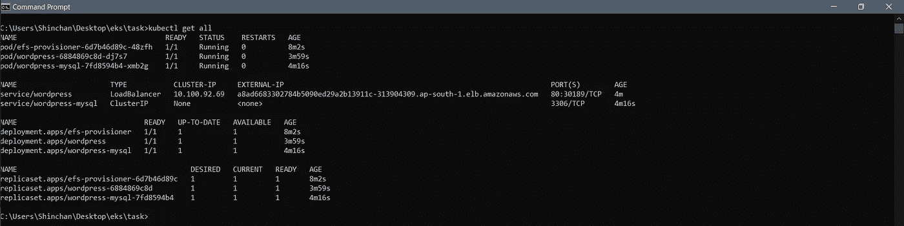

*   使用 AWS 负载平衡器 DNS 主机名，我们可以看到我们部署的 webapp(WordPress)。

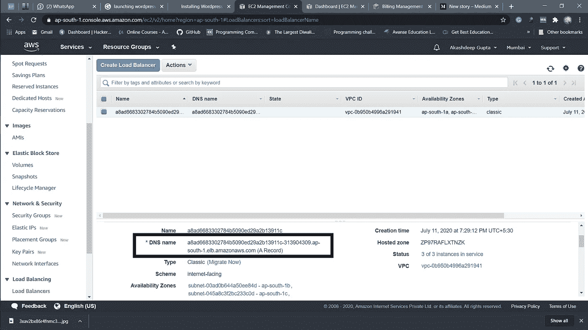

AWS ELB

*   最后，我们的已经在 aws_eks 集群中部署…

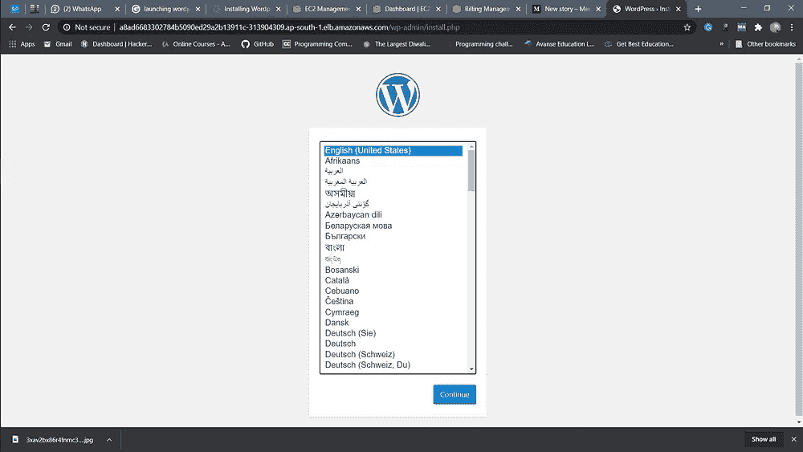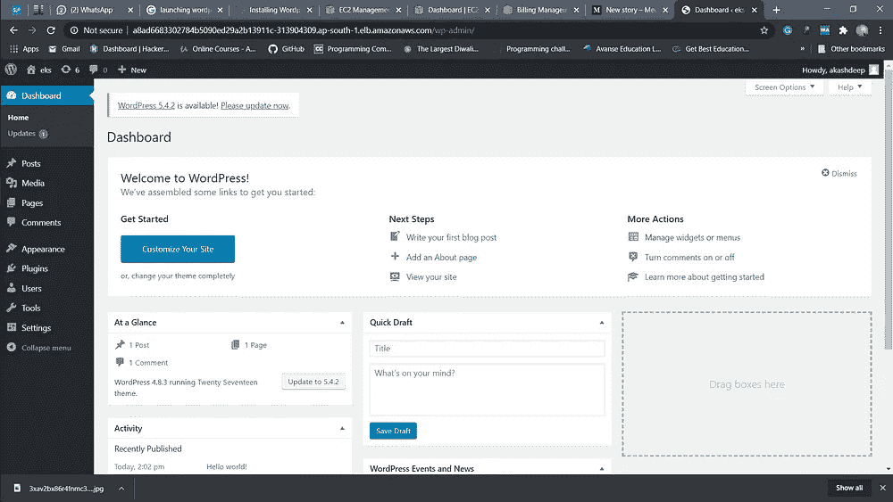

AWS 上的 WORDPRESS _ EKS

## 感谢阅读！！！

热烈欢迎所有的建议和掌声。

> Github 知识库，以获得代码中的更多帮助:-

[](https://github.com/Akashdeep-47/AWS_EKS.git) [## 阿卡什迪普-47/EKS 自动气象站

### 在 AWS EKS 亚马逊 EKS(Kubernetes 的弹性容器服务)部署 web app(WordPress)-允许您使用…

github.com](https://github.com/Akashdeep-47/AWS_EKS.git)