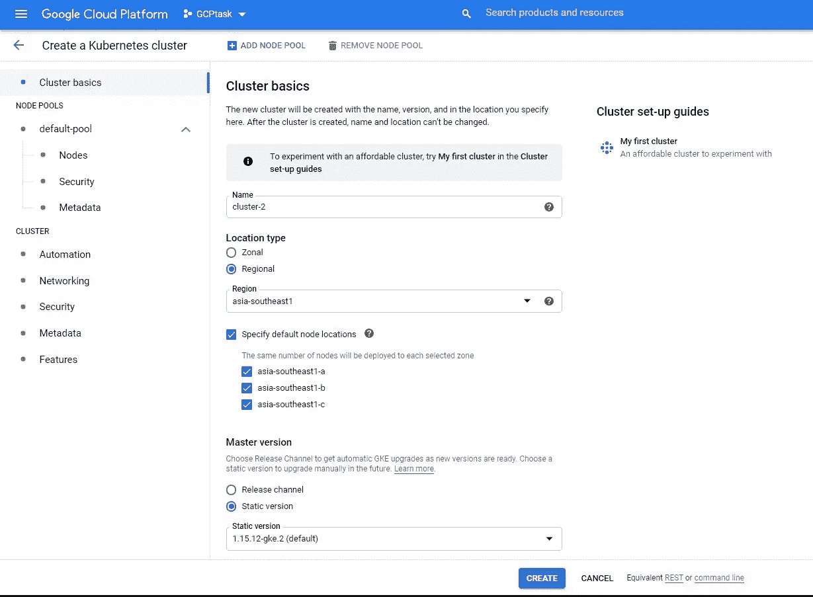
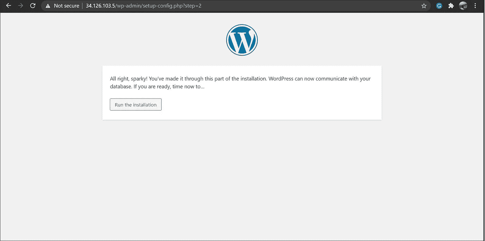

# 在谷歌云平台(GCP)上部署 WordPress，集成 VPC 和 Kubernetes

> 原文：<https://medium.com/analytics-vidhya/deployment-of-wordpress-on-google-cloud-platform-gcp-with-vpc-and-kubernetes-integration-ee0e25f89ad6?source=collection_archive---------20----------------------->

GCP

此博客包含以下任务流程和详细信息:

1.创建一个项目。

2.在项目中创建两个 VPC 网络。

3.使用 VPC 对等在两个 VPC 网络之间创建链路。

4.在一个 VPC 中创建一个 Kubernetes 集群，并通过使用 Docker 镜像和负载均衡器来启动 WordPress。

5.在另一个 VPC 中创建 SQL server 并创建数据库。

6.将 SQL 数据库连接到 Kubernetes 集群中启动的 web 应用程序。

> **等等，为什么是云计算？**

→提供各种资源和服务，是一种按使用量付费的模式。

→您不再需要支付专家员工的工资

→您的能源消耗成本可能会降低

→时间延迟较少。

→您的企业可以快速扩大或缩小运营和存储需求，以适应您的情况

还有更多…

> **1。项目创建:**

我们已经创建了一个名为 **GCPtask** 的新项目

> **2。创建两个 VPC 网络**

> ***什么是 VPC？***

虚拟专用云(VPC)使我们能够将资源部署到您定义的虚拟网络中。它类似于您在自己的数据中心运行的传统网络，并具有 GCP 的优势。我们不需要使用公共互联网，可以使用 GCP 的专用网络来执行任务。

> 创建了两个 VPC 网络— **vpcwp(用于 Wordpress)** 和 **vpcdb(用于数据库)。**

> 我们可以在仪表板上看到两个 VPC 网络

> **3。VPC 对等**

> 什么是 VPC 对等？

在不同的 VPC 之间创建连接，简单来说就是 VPC 对等。它允许跨两个 VPC 网络的内部 IP 连接，无论它们属于同一个项目还是同一个组织。

> **注意:**必须从两端(两个网络)建立 VPC 对等。

我们可以看到连接已经从两端建立，并且处于活动状态(如果其中任何一端显示为非活动状态，则意味着双向连接尚未完成)

> **4。库伯内特星团**

> **什么是 Kubernetes？**

Kubernetes 基本上是一个容器管理工具 **( Docker、Podman、Crio 等)**。有些需求可以通过不同的容器来解决。但是如果由于某种原因环境恶化了呢？我们无法手动监控。为此，我们需要一些智能工具。库伯内特就是这样做的。它具有**自动缩放**功能，还内置了**负载平衡器**。与之相关的一些术语:

**→节点:** Kubernetes 通过将容器放入 pod 中在*节点*上运行来运行您的工作负载。根据群集的不同，节点可以是虚拟机或物理机。每个节点都包含运行由控制平面管理的 [p](https://kubernetes.io/docs/concepts/workloads/pods/) ods 所需的服务。 **Kubernetes** 是一个**主** - **从**类型的架构，有一定的组件。

**→Pod:**Pod 是 Kubernetes 集群的一个节点内的容器及其存储的集合。Kubernetes 中的每个 pod 都被分配了一个集群中唯一的 *Pod IP 地址*，这允许应用程序使用端口而没有冲突的风险

我们已经使用 **GKE ( Google Kubernetes 引擎)**创建了一个 Kubernetes 集群

我们已经指定了每个区域中需要的节点数量

我们的节点映像的架构

> 我们可以有两种类型的位置/中心:**区域**(启动一个区域中的所有节点)和**区域**(分布在不同区域中)

我们使用了区域位置

我们已经在 **vpcwp** 网络中创建了集群，因为我们计划在这里发布 WordPress。

我们可以看到我们的集群已经创建，并且三个实例已经启动:

> **在 Kubernetes 集群上启动 Wordpress**

我们需要使用 **Google Cloud Shell** 连接到集群。为此，我们需要在 shell 中运行以下命令。

我们已经使用了 Docker 的映像并为 WordPress 创建了部署:

之后，将为 WordPress 创建一个 pod。但是如果 pod 被删除或者有高流量呢？**副本**和**负载平衡器**用于处理；

我们可以看到，最初在我们的 GCP 上没有创建任何负载平衡器

但是一旦我们使用负载均衡器公开了我们的 pod，它就会在 GCP 自动创建。我们可以把负载均衡器提供的 IP 地址给我们的客户来访问这个站点。

> **5。在另一个 VPC 中创建 SQL server**

**为什么不使用集群在节点池中启动我们的数据库服务器呢？**

→我们知道数据库是任何业务中最重要的部分。我们将不得不管理一切，也考虑到高安全性。因此，我们可以使用 GCP 的托管服务来创建和管理我们的关键数据库。GCP 管理与安全、资源、扩展等相关的一切。我们可以使用实例创建我们的前端，并将其连接到数据库服务。

MySQL 数据库的创建:

在配置选项中，我们已经连接到私有 IP，因为我们希望在我们的 **vpcdb** 网络中创建它

为我们的 WordPress 站点创建新的用户和数据库:

要连接到我们的数据库，我们必须在 shell 中运行以下命令:

> mysql -h <ip of="" your="" database="" server="">-u <username>-p</username></ip>

输入给用户的密码，我们将得到 SQL 终端。我们可以看到，对于我们的 WordPress 数据库，最初没有可用的表。

> **6。将数据库连接到我们的网站**

使用负载平衡器 IP 地址访问 WordPress 站点。

输入连接到数据库的详细信息:

MySQL 数据库现在已经附上了。我们可以使用 WordPress 来创建我们的博客！！！

此外，如果我们现在检查数据库，就会创建一个表:

谢谢大家！

如有任何疑问，请通过 Linkedln 与我联系。