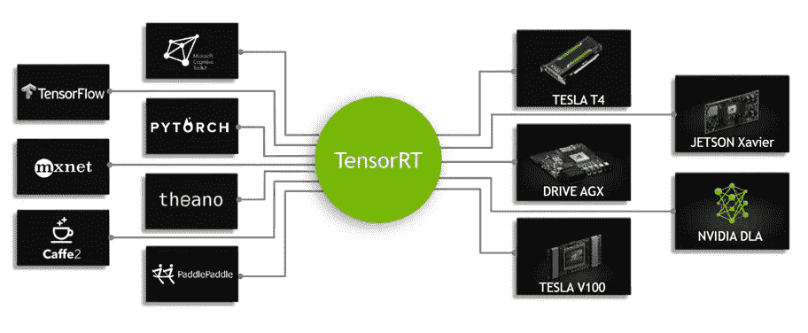
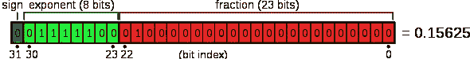
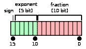

# TensorRT 的部署就绪深度学习模型

> 原文：<https://medium.com/analytics-vidhya/deployment-ready-deep-learning-models-with-tensorrt-aff26c778566?source=collection_archive---------9----------------------->

《机器人商业评论》供图

深度学习具有广泛的应用，例如自动驾驶汽车、空中监控、实时人脸识别解决方案、实时语言处理解决方案等等。但是这些应用程序之间只有一个相似之处。**实时**。考虑到这些模型的实时性能(吞吐量)的需要，我们需要优化训练的模型，以便它是精简的，但提供接近训练的准确性。

TensorRT 是英伟达的深度学习推理平台。它基于 NVIDIA CUDA 编程模型构建，有助于我们利用 NVIDIA GPUs 提供的巨大并行性能。几乎所有流行框架的深度学习模型都可以使用 TensorRT 在 NVIDIA GPUs 上进行低延迟和高吞吐量推理的解析和优化。

照片由英伟达提供

使用 TensorRT，我们可以毫不费力地进行各种优化。以下是使用 TensorRT 可以完成的一些重要优化。

1.混合精度推理

2.层融合

3.定量

**混合精度推断**

单精度浮点或简称 FP32 是深度学习训练时精度的选择。

图片由维基百科提供

图片由维基百科提供

FP32 有 8 位表示指数，23 位表示分数，非常适合所有这些梯度计算和更新。在推断过程中，如果模型给出接近训练精度，并且如果它是训练过程中的一半重，那么我们具有较少的存储器使用和高吞吐量的优势。使用 TensorRT，我们可以创建 FP16 精度或 INT 8 或 INT 4 精度的生产模型。

**图层融合**

在讨论层融合之前，让我们看看指令是如何处理的。为了处理一条指令，存储器中的操作数必须传送到寄存器，然后由处理器执行操作，结果再次复制回存储器。有了这个粗略的想法，让我们看看层融合。

层融合

大多数深度学习模型中的层遵循一个序列。例如，卷积层之后是批处理规范化层，然后是激活层。这里我们有三个操作要顺序执行。通过层融合，我们不再针对每个操作在内存和寄存器之间来回传输数据，而是将数据从内存传输到寄存器，按顺序执行所有三个操作，并将最终结果传输回内存。通过这样做，我们节省了四个昂贵的数据传输周期。

**配料**

GPU 有上千个处理核心；只是我们需要有效地使用它们。通过根据部署的目标平台规划适当的输入数据批量，我们可以最佳地利用大量的可用内核。

# **我和 TensorRT 的实验**

我尝试用 TensorRT 做实验，结果和 NVIDIA 声称的一样好。我用的是 NGC 的 NVIDIA GeForce GTX 1650 GPU 和 PyTorch 容器。稍后我会单独写一篇关于 NGC 的文章。PyTorch 容器装载了我实验所需的所有库，消除了所有安装障碍。

对于这个实验，我使用了 CIFAR10 数据集和一个简单的定制 CNN。达到 95%以上的准确率并不是这项工作的目的。因此，我并不太关注架构和超参数，但我有兴趣与 TensorRT 合作，体验它带来的性能提升。

**工艺流程**

1.  在 CIFAR10 数据集上训练 CNN
2.  将最佳模型保存在中。pth 格式
3.  创造。已保存模型的 onnx 版本
4.  从 ONNX 模型创建一个 TensorRT 引擎，并将其保存为. plan 文件以供重用
5.  使用 TensorRT 引擎进行高性能深度学习推理

*我已经把 github 链接附在了我用于这个实验的 Jupyter 笔记本上。*

 [## 拉吉-普拉桑纳/滕索特

### 在 GitHub 上创建一个帐户，为 Raj-Prasanna/TensorRT 的发展做出贡献。

github.com](https://github.com/Raj-Prasanna/TensorRT) 

**我在 FP16 中使用 TensorRT 引擎的观察精度**

1.当我的模型很浅时，性能并没有太大的提高。例如，只有 6 个卷积层，后面是各自的 ReLU 激活层和几个完全连接的层，我看不到任何可观的吞吐量增益。

2.当我将模型的深度增加到 20 个卷积层，然后是相应的 ReLU 层和几个完全连接的层时，我能够看到稳定的性能增益。我注意到吞吐量增加了 3 倍。

3.TensorRT 发动机的尺寸大约是原 PyTorch 型号的一半。

*感谢阅读。请留下你的建设性意见，关注我关于深度学习的文章。*