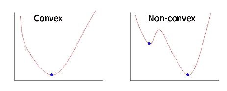
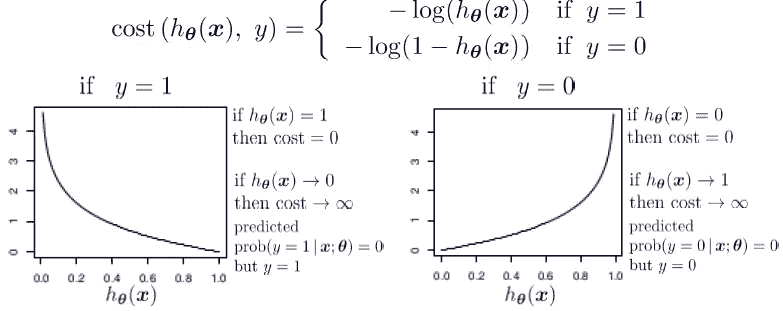

# 逻辑回归的成本函数导数

> 原文：<https://medium.com/analytics-vidhya/derivative-of-log-loss-function-for-logistic-regression-9b832f025c2d?source=collection_archive---------0----------------------->

# **简介:**

线性回归使用**最小平方误差**作为损失函数，给出凸损失函数，然后我们可以通过找到其顶点作为全局最小值来完成优化。然而，对于逻辑回归，假设被改变，通过使用应用于原始模型输出的 sigmoid 函数进行计算，最小平方误差将产生具有局部最小值的非凸损失函数。

左(线性回归均方损失)，右(逻辑回归均方损失函数)

然而，我们非常熟悉线性回归成本函数的梯度。它有一个非常简单的形式，如下所示，但我想在这里提到一点，即尽管有一个复杂的对数损失误差函数，逻辑回归损失函数的梯度也有相同的形式。

线性回归损失函数的梯度

为了保持损失函数的凸性，为逻辑回归设计了对数损失误差函数。成本函数分为 y=1 和 y=0 两种情况。

对于 y=1 的情况，我们可以观察到，当假设函数趋于 1 时，误差最小化为零，当假设函数趋于 0 时，误差最大。这个标准完全符合我们想要的标准

价值函数

结合这两个方程，我们得到如下所示的凸对数损失函数

组合成本函数

为了优化这个凸函数，我们可以用梯度下降法或牛顿法。对于这两种情况，我们都需要导出这个复杂损失函数的梯度。下面给出的步骤显示了推导梯度的数学方法

# **成本函数的导数:**

由于逻辑回归的假设函数本质上是 sigmoid，因此，第一个重要步骤是找到 sigmoid 函数的梯度。从下面的推导中我们可以看出，sigmoid 函数的梯度遵循一定的模式。

假设函数

s 形函数的导数

# **第一步:**

应用链式法则和偏导数写作。

# 第二步:

使用 sigmoid 函数的导数模式计算偏导数。

# **第三步:**

用乘法简化术语

# **第四步:**

通过将求和项转换成关于包括偏差项在内的所有权重的梯度的矩阵形式来移除求和项。

# **结论:**

这个小微积分练习表明，线性回归和逻辑回归(实际上是一种分类)达到了相同的更新规则。我们应该理解的是，成本函数的设计是这种“巧合”发生的部分原因。

# 感谢您的阅读！！！！

如果你喜欢我的工作并想支持我:

1-支持我的最好方式是在****中关注我。****

**2-在 [**LinkedIn**](https://www.linkedin.com/in/saket-thavanani-b1a149a0/) **上关注我。****