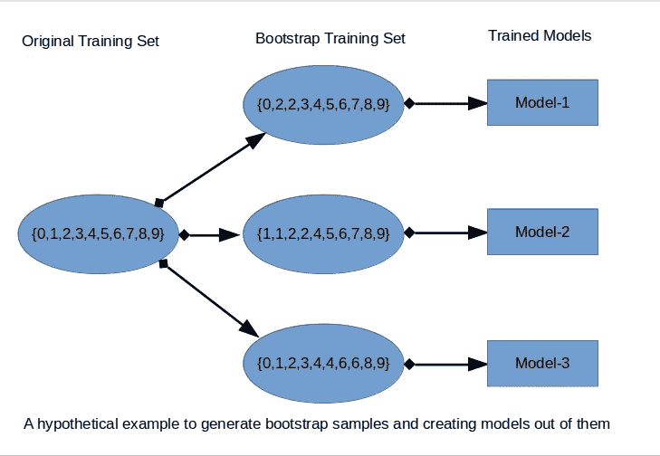

# 使用交叉验证和 Bootstrap 聚合导出最终预测模型。

> 原文：<https://medium.com/analytics-vidhya/deriving-final-model-using-cross-validation-and-bootstrap-aggregation-8d1dd3a38264?source=collection_archive---------8----------------------->

这篇文章讨论了机器学习中一个非常常见的问题，即“在给定训练数据的情况下，我如何获得最终的模型，以便它可以在测试集上很好地执行/推广？”或者“我如何使用 k 倍交叉验证获得预测模型？”。这些常见问题的常见答案是交叉验证和/或集成方法。但是，我很少发现任何一篇文章将所有的细节结合起来，一步一步地告诉你如何去做同样的事情。在这里，我试图将各种帖子/博客中的所有细节结合起来，以最简单的方式减少麻烦。

在我们继续深入讨论之前，让我们先来看看两个朋友，圣诞老人和班塔之间的简短问答故事:

**圣诞老人**:我有训练数据。我没有测试数据的标签。我想知道支持向量机(SVM)和前馈神经网络(FNN)哪个模型在测试数据上会好？

**Banta** :我认为你应该使用两种模型进行 k 倍交叉验证。无论哪个模型能给你更好的平均交叉验证准确性，那个模型都将是你的测试数据的好选择。

**圣诞老人**:是的，当然。我做到了。我发现 FFN 做得更好。所以，我会用 FFN 作为测试数据。但是等等，我还有一个问题，我怎么知道哪个学习率(超参数)会对我的模型有好处？比如 0.1 和 0.01 哪个选择更好？

Banta :我想你可以再次进行 k 倍交叉验证，以获得最佳的超参数，如学习率。您可以分别使用学习率 0.1 和 0.01 来估计 k 倍交叉验证的平均准确度。无论哪一个给你更好的性能，学习率的值将最适合测试数据。

**圣诞老人**:我按照你的建议做了，发现 0.01 比 0.1 好。谢了。但是，我还有一个疑问。我将如何选择我的最终模型来评估测试数据？交叉验证并没有说最终的模型，对吗？

**Banta** :是的，交叉验证并不是说得到最终的模型。为了得到最终的模型，你必须学习一些集成技术，如 Bootstrap Aggregation(也称为 bagging)。这将为您提供测试数据的最终预测模型。

圣诞老人:非常感谢你的帮助。现在，在引导汇总之后，我已经为测试数据准备好了最终的预测模型。

— — — — — — —故事结束

所以，从上面的故事中，人们可以得出如下结论:

**Step1** :对训练数据进行 k 重交叉验证，估计哪种方法(模型)更好。

**第二步**:对训练数据进行 k 重交叉验证，估计哪个超参数值更好。

**第三步**:使用交叉验证得到的方法(模型)和超参数，对整个训练数据应用集成方法，得到最终的预测模型。

让我们逐一详细讨论每个步骤:

**第一步**:

让我们从交叉验证的定义开始:

“交叉验证是一种评估 ML 模型的技术，通过在可用输入数据的子集上训练几个 ML 模型，并在数据的互补子集上评估它们。使用交叉验证来检测过度拟合，即未能归纳出一个模式。”[1]

现在，让我指出人们在阅读这个定义时犯的一个普遍错误。在定义中,“ML 模型”指的是特定的方法(线性判别分析(LDA)或支持向量机或 CNN 或 LSTM ),而不是作为不同模型的该方法的特定实例。因此，我们可能会说‘我们有一个 SVM 模型’,但我们不应该把两组不同的训练系数称为不同的模型。至少不是在模型选择的背景下[2]。

现在，让我们假设我们有两个模型，比如一个 SVM 和一个 FNN。我们的任务是定义哪种模式更好？我们可以进行 k 重交叉验证，看看哪一个在预测验证设定点方面总体上更好。但是，一旦我们使用交叉验证来选择性能更好的模型，我们就在整个训练数据上训练该模型(无论是 SVM 还是 FNN)(我们如何训练将在后面讨论)。我们不使用我们在交叉验证期间为最终预测模型训练的实际模型实例。

因此，当我们进行 k-fold 交叉验证时，本质上我们是在衡量我们的模型的能力，以及我们的模型能够通过一些数据进行多好的训练，然后对它以前没有见过的数据进行预测。要了解更多不同类型的交叉验证及其优势，请阅读这篇[文章](https://en.wikipedia.org/wiki/Cross-validation_(statistics))。

**第二步**:

与步骤 1 类似，k 重交叉验证可用于获得超参数的值，该值在看不见的测试数据上概括得很好。这里我们寻找更好的超参数，而不是更好的方法(模型),不像第一步。

**步骤 1 和步骤 2 的交叉验证总结:**

1.  交叉验证的目的不是得出我们最终的预测模型。
2.  交叉验证的目的是模型检查，而不是模型构建[2]。
3.  交叉验证的另一个目的是超参数调整。
4.  但是如果你愿意，你"**可以**"使用交叉验证得到你的最终模型如下:(a):你可以使用交叉验证期间表现最好的模型作为最终模型。您可能需要这样做，因为多次训练神经网络模型在计算上非常昂贵。(b):来自交叉验证的训练模型可以被组合以提供交叉验证集成，该集成被认为比给定的单个模型平均具有更好的性能。例如，在分类的情况下，你可以采取多数投票的最终决定，在回归的情况下，你可以采取平均。
5.  理想情况下，我们不应该使用我们模型的这 k 个训练实例来做任何真正的预测。为此，我们希望使用所有的训练数据，并提出尽可能最好的模型。这可以通过集合方法来完成，如自举聚合(Bagging)。

**第三步**:

有各种技术来执行模型的集成。要了解各种集成方法及其各种优势(比如它减少了最终预测模型的方差)，请阅读这篇[文章](https://en.wikipedia.org/wiki/Ensemble_learning)。在本帖**、**中，我们将讨论 **Bootstrap Aggregation** (通常简称为‘bagging’)，这是使用整个训练数据获得最终预测模型的集成技术之一，它可以很好地概括看不见的数据(测试数据)。

自举方法如下。设有一个大小为 N 的样本 *X* ，我们可以通过随机均匀抽取 N 个元素进行替换，从原样本中得到一个新样本。换句话说，我们从大小为 N 的原始样本中选择一个随机元素，并重复 N 次[3]。所有元素被选择的可能性相等，因此每个元素以相等的概率 1/ *N.* 绘制。下图显示了引导汇总过程的虚拟示例。

生成的自举样本数(M)为 3 时的自举汇总示例

例如，假设我们有一个装有 100 个球的袋子(训练数据)。假设我们想从原始训练数据中创建 5 个新的样本训练数据。这 5 个新样本训练数据的大小可以等于或小于原始训练数据。通常，我们可以采用与原始数据相同的新样本训练数据的大小。为了创建每个新的样本训练数据，我们从袋子中一次抽取一个球。在每一步，所选择的球被放回袋中，使得下一次选择是等概率的，即从相同数量的球(100) *中选择。*请注意，因为我们将球放回原处，所以新样本中可能会有重复的球。让我们称这个新的样本训练数据为 *X* 1。通过重复该过程 5 次，我们创建 5 个引导样本训练数据 X1、X2、X3、X4、X5。他们每个人都有 100 个球(当然任何样本中的一些点都是重复的)。这些新的训练集被称为引导样本。使用上述 5 个引导样本拟合 5 个模型，并且通过多数投票方案组合输出用于最终分类。在给定的 bootstrap 样本中没有选择的例子被用作验证集来估计模型的性能。当我们训练神经网络时，学习标准可以是在确认集合上确认损失的早期停止。

**这 5 个模型的组合(分类中的多数投票和回归中的平均)是测试数据的最终预测模型。**

[1][https://docs . AWS . Amazon . com/machine-learning/latest/DG/machine learning-DG . pdf #交叉验证](https://docs.aws.amazon.com/machine-learning/latest/dg/machinelearning-dg.pdf#cross-validation)

[2][https://stats . stack exchange . com/questions/52274/how-to-choose-a-predictive-model-after-k-fold-cross-validation](https://stats.stackexchange.com/questions/52274/how-to-choose-a-predictive-model-after-k-fold-cross-validation)

[3][https://www . ka ggle . com/kashnitsky/topic-5-ensembles-part-1-bagging](https://www.kaggle.com/kashnitsky/topic-5-ensembles-part-1-bagging)