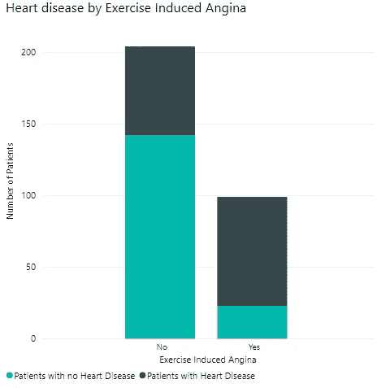

# 心脏病的描述性分析

> 原文：<https://medium.com/analytics-vidhya/descriptive-analysis-of-heart-disease-8332e676075?source=collection_archive---------16----------------------->

**简介**
心脏病，也被称为心血管疾病(CVD)，被世界卫生组织(世卫组织)认为是世界上导致死亡的首要原因，因为每年死于心血管疾病的人数超过任何其他原因。在全球范围内，2016 年估计有 1790 万人死于心血管疾病，占全球死亡人数的 31%(世卫组织，2016 年)，预计到 2030 年心血管疾病患者人数将增长至 2330 万人(Bansilal，2015 年)。

我确信你直接或间接地认识患有或曾经患有心脏病的人。我自己都记不清有多少次我听说过人们在任何地方死于心脏病的故事，在浴室里，在打电话的时候，在睡觉的时候，甚至在演讲的时候，真的可以在任何地方。

这一惊人的死亡率不仅引起了卫生工作者和研究人员的关注，也引起了所有人的关注。心脏病有许多相关的变量，这使得一类人比其他人更容易患心脏病。这些变量被称为风险因素，与心脏病相关的一些常见风险因素是高血压或高血压、高胆固醇水平、年龄、家族史等。由于存在大量的心脏病风险因素，这使得检测更加困难。研究人员因此求助于使用更有效的方法来应对这一挑战，如数据分析和人工智能，以更好地了解这种疾病。通过这种理解，他们能够用大量患者数据训练机器，使其能够比医生通常更快地检测疾病，从而为医生提供更长的干预窗口，防止死亡。

因为了解风险因素在预防心脏病中起着重要作用，所以在本文中，我将使用 Microsoft Excel 和 Power BI 分析从 Kaggle 获得的数据集(来自 UCI 仓库的 Cleveland 心脏病数据集),以发现风险因素和心脏病之间的相关性。

来自 UCI 档案馆的克里夫兰心脏病数据集

**数据变量解释** 数据集由 14 列和 303 条记录组成。实际数据集有 76 个特征，但对于这项研究，只选择了 14 个，这是因为它们是影响心脏病的重要因素。

*   年龄:衰老会导致心脏和血管的变化，使 65 岁以上的人比年轻人更容易患心脏病或中风(美国国家卫生研究院，2015 年)
*   **性别**:显示性别，其中
    1 =男性
    0 =女性
    众所周知，心脏病在男性中比女性更为普遍。65 岁以上女性患心脏病的风险几乎与男性相同。然而，国家健康和营养检查调查(NHANES)的最新数据显示，在过去二十年中，中年(35 至 54 岁)女性的心肌梗死患病率有所增加，而同龄男性的患病率则有所下降(Towfighi，2009 年)
*   **胸痛**:显示个人经历的胸痛，疼痛分为 4 种，其中:
    0=无症状
    1=非典型心绞痛
    2=非心绞痛疼痛
    3 =典型心绞痛
    心绞痛是由于流向心脏的血液减少而引起的一种胸痛。心绞痛感觉像挤压，压力，沉重，胸闷或疼痛。胸痛是心脏病的常见症状，但也可能是由心脏病以外的原因引起的。
*   **静息血压**:显示个人的静息血压值，单位为 mmHg(单位)。血压超过 120 毫米汞柱被认为是高血压，高血压患者患心脏病的风险更高
*   **血清胆固醇**:以毫克/分升(单位)表示胆固醇。胆固醇并不全是坏事，它在身体中扮演着重要的角色。然而，过量的胆固醇开始在动脉壁上堆积，导致动脉粥样硬化，这是一种心脏病，动脉变窄，流向心肌的血液流速减慢或受阻。通常情况下，胆固醇水平高于 240 毫克/分升的人患心脏病的风险更高。

动脉粥样硬化图解来源:Quora

*   **空腹血糖(FBG)** :描绘个体的空腹血糖(FBG)，单位为 mg/dl(单位)。该表将空腹血糖表示为 1 或 0，其中
    1 = FBG>120 毫克/分升
    0 = FBG<120 毫克/分升
    FBG > 120 是典型糖尿病患者，且糖尿病患者患心脏病的可能性是正常人的两倍。
*   **静息心电图**:显示静息心电图结果，其中:
    0=无症状
    1=正常
    2= ST 波异常
    心电图(ECG 或 EKG)是一种通过测量心脏的电活动来检查心脏功能的测试。随着每一次心跳，一个电脉冲(或电波)穿过你的心脏。这种波动导致肌肉挤压并从心脏泵出血液。它提供关于您的心率和节律的信息，并显示是否存在由于高血压或以前心脏病发作的证据而导致的心脏增大

心电图程序图解

*   **达到的最大心率**:最大心率是通过从 220 中减去您的年龄计算出来的。例如，如果你 45 岁，从 220 减去 45，得到最大心率 175。最大心率是在体育活动中达到的。医生用平板心电图负荷试验测量病人的最大心率。据说，心率每分钟增加 10 次与心脏死亡风险增加至少 20%有关(Christine，2019)

患者在跑步机上跑步，同时测量心率和运动诱发的心绞痛值的图示

*   **运动诱发的心绞痛**:这是当运动导致心绞痛(是当你的心肌没有获得足够的富氧血液时引起的胸痛或不适)。在数据集中，运动诱发的心绞痛显示为，
    1 =是
    0 =否

显示 ST 段的心电图波形

**斜率峰(ST 段斜率峰):**ST 段是心电图在 S 波结束(J 点)和 T 波开始之间的平坦等电段。ST 段相对于运动诱发的心率增量的偏移，即 ST/心率斜率(ST/HR slope)，已被提出作为诊断重大冠状动脉疾病(CAD)的更准确的 ECG 标准。

在这个数据集中，斜率峰值表示为:
0=下坡
1=平地
2=上坡

*   **透视着色的主要血管数量(0-3)**:透视是对运动身体结构的研究，类似于 x 光“电影”连续的 X 射线束穿过被检查的身体部位。光束被传送到一个类似电视的监视器上，这样就可以详细地看到身体部位及其运动。荧光检查显示的血管代表狭窄的血管。
*   **铊**:铊压力测试是一种核成像测试，可以显示你在运动或休息时血液流入心脏的情况。这项测试也被称为心脏或核负荷测试。这是一种用于检测瓣膜性心脏病患者冠状动脉疾病的有用的非侵入性试验。
    在该数据集中，它被表示为:
    1=固定缺陷
    2=正常
    3=可逆缺陷

希望您现在已经很好地理解了数据，是时候进行分析了。

**数据集分析** 从上面的描述可以推断出，数据特征可以分为风险因素和检测心脏病的测试。在这项分析中，我试图找出风险因素和心脏病之间的相关性。我将试图回答几个问题，如:

1.  危险因素真的会影响心脏病的前景吗
2.  这些测试能有效检测出心脏病吗

**风险因素与心脏病的关系**
年龄:下图显示年龄确实在疾病的存在中起着重要作用，因为 45 岁以下的患者受心脏病的影响最小。

性别:根据下图，男性患心脏病的风险更高，因为该图显示，患心脏病的男性是患心脏病的女性的三倍。

胸痛:数据显示，无症状心绞痛患者比典型心绞痛患者更易患心脏病，这乍一看似乎与直觉相反，但请记住，我们也提到过，并非所有心绞痛都是心脏病所致。这可以解释这种差异。

静息血压:该图阐明了高血压患者比非高血压患者患心脏病的风险更高，因为患心脏病的高血压患者是患心脏病的非高血压患者的大约 3 倍

血清胆固醇:在用图像表示胆固醇水平之前，胆固醇水平分类如下:
低于 200 毫克/分升=理想胆固醇水平
200–239 毫克/分升=临界胆固醇水平
240 毫克/分升及以上=高胆固醇水平

如下所示，胆固醇的增加显著导致患心脏病的机会增加，因为胆固醇水平高的患者患心脏病的人数最多，而胆固醇水平符合要求的患者患心脏病的人数最少。

空腹血糖:与所有其他风险因素不同，患者的空腹血糖似乎不符合预期，因为 FBG 低于 120mg/dl 的患者似乎比血糖水平高于 120mg/dl 的患者更多。然而，相对于每组测试患者，葡萄糖水平高于 120mg/dl 的患者仍然具有较高比例的心脏病患者。

**与心脏病相关的测试**

静息心电图:左心室肥厚或肥大是心脏主泵室(左心室)壁的扩大和增厚(肥大)。左心室肥大可能是对某些因素(如高血压或心脏疾病)的反应，这些因素导致左心室工作更加努力(Mayoclinic)。这清楚地解释了为什么在下面的图表中，可以看到肥大的患者导致了最多的心脏病患者。

运动诱发的心绞痛:运动诱发的心绞痛也称为稳定型心绞痛，通常由爬楼梯等身体活动引发。体育活动导致心脏需要更多的血液，但狭窄的动脉会减缓血液流动，导致胸痛(Mayoclinic)。这可以解释为什么如下图所示，经历过运动诱发的心绞痛的患者比没有经历过运动诱发的心绞痛的患者具有更高的心脏病发病率。

ST 段斜率:正常 ST 段略向上凹陷。平坦、向下倾斜或凹陷的 ST 段可能表明[冠状动脉缺血](https://en.wikipedia.org/wiki/Coronary_ischemia)(一种心脏病)。下图显示了该井，因为坡度平缓和下降的患者患病人数较多。

荧光透视:彩色血管表示动脉变窄，这就是为什么如图所示，彩色血管的增加导致患心脏病的可能性更高。

铊:铊测试的结果表明，无论是可逆的还是固定的缺陷患者比血流正常的患者更容易患心脏病。

**结论**

危险因素会影响心脏病的前景吗？
对该数据集的分析证明，危险因素极大地影响患心脏病的概率，因为具有危险因素的患者患心脏病的几率更大。导致心脏病的最大危险因素是年龄，导致 165 名患病患者中有 124 名心脏病患者，胸痛也是主要原因，165 名患病患者中有 120 名胸痛患者。然而，高空腹血糖导致的心脏病最少，165 人中有 22 人患心脏病。
什么检查能最有效地检测出心脏病？根据该分析，ST 段斜率峰值被证明是最有效的心脏病诊断测试，因为它检测到最多的心脏病患者。它在 165 名患者中发现了 103 名患者。这些结果证实了本文之前的陈述，即 ST 段斜率被认为是诊断重大冠状动脉疾病(CAD)的更准确的心电图标准。紧随其后的是铊检测，在 165 个病例中检测出 100 个病例。运动诱发的心绞痛导致的心脏病最少，165 例中有 76 例。
分析数据有助于将数据转化为有用的信息，描绘出导致疾病的最大因素和最小因素，这是预防疾病的重要信息。它还强调了最有效的诊断测试，以确保早期检测。