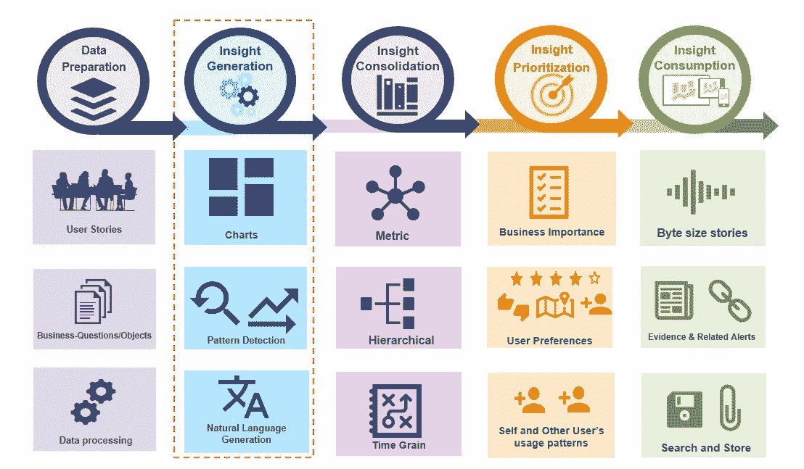
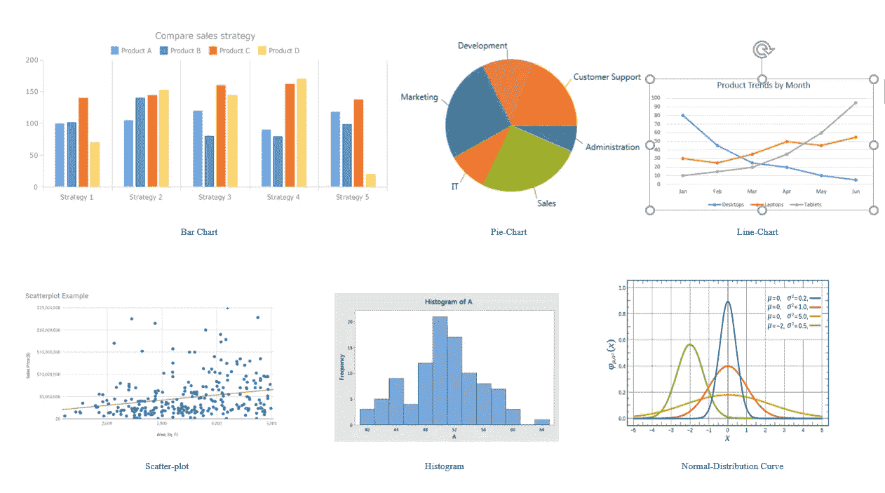
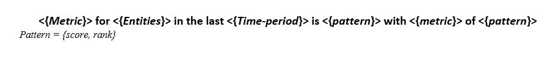
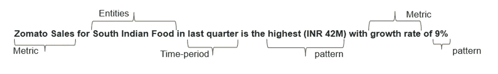

# 基于描述性分析的图表统计整合，生成简明摘要

> 原文：<https://medium.com/analytics-vidhya/descriptive-analytics-based-statistical-consolidation-of-graphs-and-charts-into-concise-summary-81acc73ae8f?source=collection_archive---------2----------------------->

**简介:**

各种形式和格式的数据在专业到跨学科领域的所有领域都非常普遍。它现在是数据科学、机器学习、深度学习、物联网和人工智能等领域不可或缺的一部分。所有这些都是由海量的结构化和非结构化数据驱动的。显然，大部分获取或生成的数据都不是简单的格式，不能根据需要快速使用，它们需要转换成所需的格式，以便对任何预期的应用程序都有用。这篇博客提出了一个类似的问题，即如何克服繁琐、费力和费时的方法，以最务实的方式利用统计算法提取有意义的信息。我将更多地关注数据的图形表示，其范围仅限于*条形图、折线图、饼图、直方图、点状图、散点图和频率分布曲线*。类似的策略也可以用于其他变体。

对于像按需数字媒体流(*网飞、Hotstar* )、在线送餐( *Foodpanda、Zomato* )和叫车服务(*优步、Ola、Waymo* )这样以闪电般速度发展的市场和企业来说，必须有一种统计整合方法来帮助销售和报告团队了解他们的客户行为和偏好。这是一个案例研究分析，属于*描述性分析***【1】**的范畴，其思想是创建历史数据的摘要，以产生有用的信息，用于进一步分析以做出有力的业务决策。*描述性分析*是数据预处理的首要阶段之一，应用于数据聚合之后，数据挖掘之前**【2】**。诊断分析是对历史数据中事件和行为的因果部分进行更深入的解读。有了所有的定义，我现在将进一步列举从上述所有数据的图形格式中导出和提取有用信息的最有效的逐步方法**【3】**。

完整的数据洞察工作流

**1)**图表分组&图表:

这一步更强调将相似类型的图形和图表分组并组合到不同的桶中，以便于参考。它有助于将大量数据分成小而易管理的组，以便于处理。一个桶可以包含所有条形图，而另一个桶可以包含饼图。我们有现成的 python 包装器库，可以根据某些预先训练好的特征来检测图形的可视化类型。它将识别模式，并将它们分类到不同的桶中，以便进行下一阶段的处理。基于 OpenCV 的图像特征检测也是将标签分配给作为图像的输入图形数据的常用方法之一。各种条形之间的间隙是条形图和直方图之间的关键区别特征之一。饼图的圆形性质环绕一个圆形曲线，使其在其他曲线中脱颖而出。同样，我们需要为在本博客范围内考虑的所有其他类型选择不同的参数。在终点，我们将得到 7 组组，它们的标签分别被指定为条形图、折线图、饼图、直方图、点状图、分散相关图和频率分布曲线。

数据可视化的类型(非穷举)

**2)** **分析群体中特有的趋势**

继续下一步，我们现在需要操作在*步骤 1* 中创建的桶。这一步背后的关键是捕捉所有组中的所有异常值和主要变化趋势。例如，描绘 *Hotstar* 中观众(游客)数量的上一季度急剧下降或上升的折线图是一个影响数据点的关键商业决策，不容忽视。同样，柱状图中稳定或恒定高度的柱可能描述市场中良好稳定的产品，该产品需要改进位置以提高利润。一个最大面积的饼图突出显示了无味精加工和熟食产品的需求增加，这可能有助于通过 *Zomato* 供应的转移来开发和利用需求。经常发生的情况是，在一个给定的图表中，不是所有的数据点都在提供有用信息方面起主要作用。只有某些异常或异常行为的少数数据点被放置为奇数-1-out 可能传达比其余更多的相关信息。我称它们为“*趋势*”，但本质上它们是引领变革的先锋，这些变革需要级联到后续步骤中。最受欢迎的方法是以 *csv* 格式获取图表趋势，并将其导出以实现无缝兼容。

**3)** **用统计和数学量化趋势**

一旦我们对趋势有了更好的定位，我们需要为排名和优先级分配统计分数。在统计学和数学的刺激下，量化某些评价矩阵和参数的趋势势在必行。为了简化和便于计算，可以从平均值、众数、中位数、标准差、绝对误差变化、误差变化百分比、均方根误差和随机度开始。这些是一些基本的统计规则，这些规则将实体纳入趋势并应用公式来计算分数。趋势通常可以是异常附近的一组数据点，或者是精心挑选的样本，它最好地代表了有限空间约束域中的整个数据簇。当趋势的导出结果与在其余数据中应用相同的统计方法得出的结果进行比较时，我们可能会期望一些偏差，这些偏差最有可能代表标度分数，而不是歪曲。标度分数只是一个从 1 到 10 的数字，根据以相同方式迭代计算的统计结果的变化程度按比例分配。分数越高意味着报告的重要性越高，忽略可能会影响业务收入。此外，基于分值和所使用的统计方法来进行排名。例如，对于描绘给定地理、地区或州的*70%需求增加的饼状图来说，描绘相对于非素食者的素食者食品需求增加 85% 的得分“ ***8.5*** ”比描绘相对于非素食者食品需求增加的得分“ ***2.7*** ”更具有相关性。简而言之，第一个信息更具体地谈论它所代表的内容，因此比第二个信息排名更高，第二个信息不太具体，更多的是对产品需求模式的高层次描述。商业规则极大地影响量化分数的排名和选择。根据管理选择的业务性质，可能有其他规则。这些规则非常具体，精心制作，符合博客中谈到的描述性模型。值得注意的是，排名仅在相似的可视化类型中完成，而不是跨越它。饼图的等级可能与代表相同信息的直方图的等级有很大不同。只有最高等级需要被选择用于进一步的步骤。根据数据应用程序的要求，可以删除其他日志或将其存储为日志。*

***4)** **选择带有相关占位符的正确汇总模板。***

*到目前为止，这种复杂步骤背后的最终目的是获得一个简化的趋势评分和排名版本，这将有助于我们在众多趋势中选择最佳趋势。选择绝对分数最高和绝对排名最低的人(*分数—递减，排名—递增*)是至关重要的一步。{score，rank}的典型组合可能看起来像{5.7，8}。现在应该注意的是，排名是整数，但是分数是十进制格式的浮点数。在线食品交付服务可能具有与在线数字媒体流服务不同商业模式。因此，它们都有不同的规则，如上一步所强调的。我更进一步，为这些规则创建了一个基于占位符的模板，其中{score，rank}可以作为简单的可替换项，以从填充的模板中获得有意义的想法。所有这些模板都可以通过一次代码迭代从 python 列表或字典中自动填充，并应转发给销售报告团队。*

**

*空白洞察模板示例*

***5)** **生成合并汇总表——简洁而全面***

*对于给定的{score，rank}对，它可以适合一对多模板，每个模板代表一些规则。销售专家介入，在所有指标和实体中交叉验证标记化模板，以确定报告方法。推荐的最佳方法是将所有此类模板合并为一个{score，rank}对，并使用所有相关参数生成一个具有完美意义的报告短语。这将是一个简明而全面的陈述，描述了大约 100，000 个数据点。例如，如果你有 1000 万个输入数据，那么按照这个博客的方法，很有可能 10 次迭代 100，100 个数据条目，最后只得到 10 个模板。它极大地减少了工作量，并加速了所考虑的业务中的决策过程。*

**

*样本填充洞察模板*

*如果你一直在仔细关注这个博客，我已经陈述了当图形数据作为描述性分析的一部分被消费时，管理和处理图形数据的最直观的方法。对于任何由图形和图表组成的大量历史数据，我们可以应用前面提到的步骤，以使数据科学家的生活更加轻松。*

*如需更多此类分析内容、文章和讨论，请随时联系我的个人资料。此外，读者可以参考参考文献**【4–8】**中的类似博客，以了解更多内容及其重要性。*

***参考文献***

*1.[https://what is . techtarget . com/definition/descriptive-analytics](https://whatis.techtarget.com/definition/descriptive-analytics)*

*2.[https://halo bi . com/blog/descriptive-predictive-and-prescriptive-analytics-explained/](https://halobi.com/blog/descriptive-predictive-and-prescriptive-analytics-explained/)*

*3.[https://medium . com/the-data-experience/analyze-data-6-ways-to-combine-graphics-with-text-beb 003 B2C 0 e 3](/the-data-experience/analyze-data-6-ways-to-combine-graphics-with-text-beb003b2c0e3)*