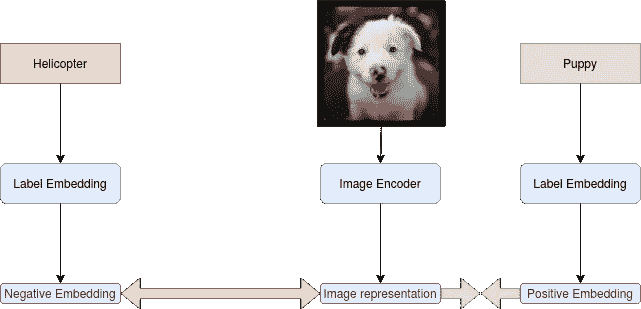
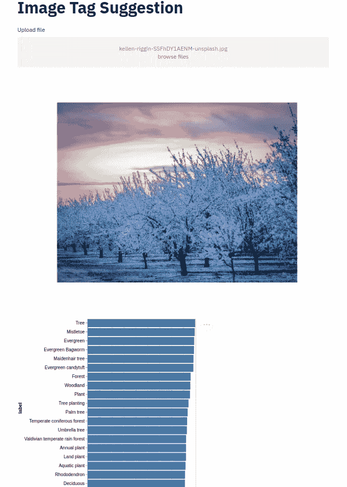
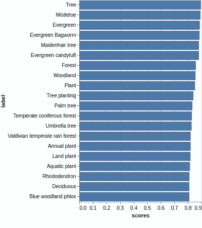
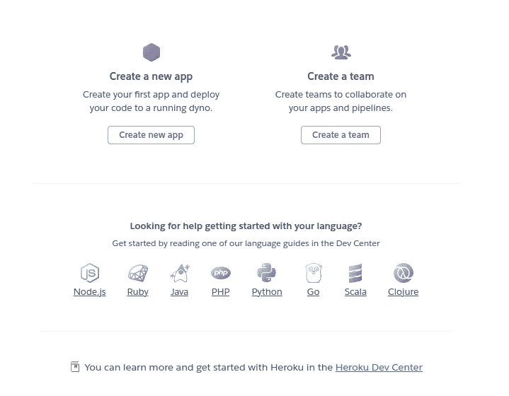
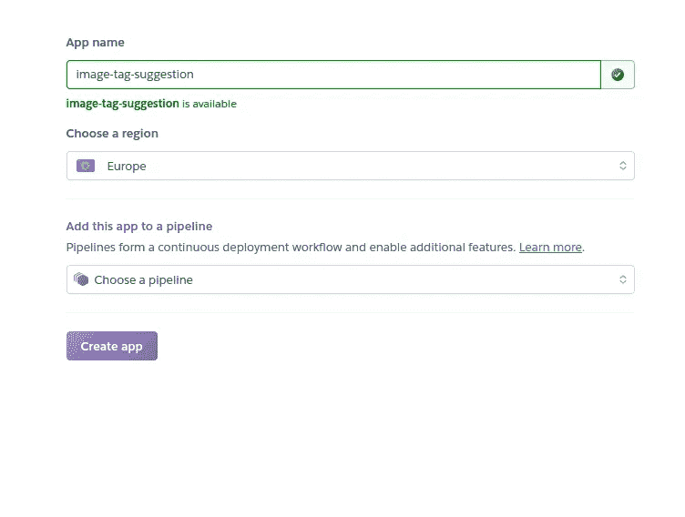
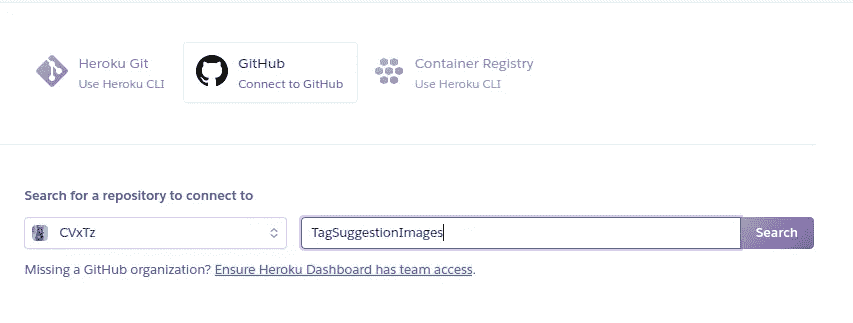
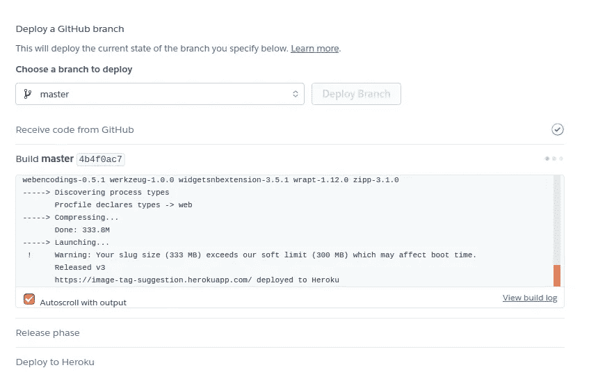
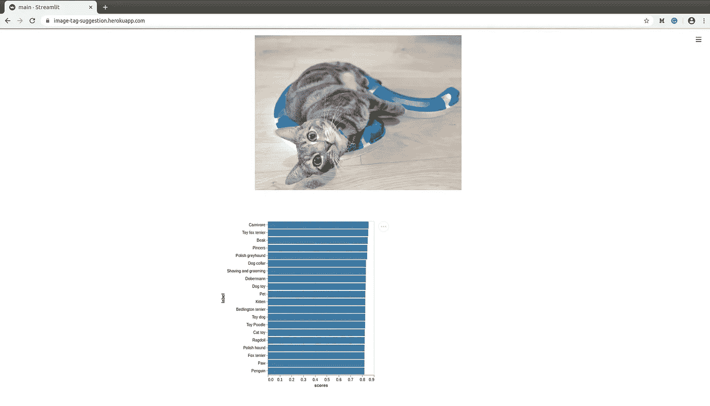

# Streamlit 应用程序中的描述性图像标签建议

> 原文：<https://medium.com/analytics-vidhya/descriptive-image-tag-suggestion-in-a-streamlit-app-a17f09b49c4e?source=collection_archive---------6----------------------->

使用 Tensorflow 和 Streamlit 构建一个基于 Web 的图像标签建议应用程序


照片由[蒙](https://unsplash.com/@ideasboom?utm_source=unsplash&utm_medium=referral&utm_content=creditCopyText)在 [Unsplash](https://unsplash.com/s/photos/nature?utm_source=unsplash&utm_medium=referral&utm_content=creditCopyText)

我们将建立一个系统，可以使用视觉模型对图像进行自动标签建议。这意味着有一个图像作为输入，它将预测描述这个图像的标签的排序列表。这对于应用于图像集合的图像搜索或推荐是有用的。这个项目将基于一个叫做开放图像 V6:[https://storage.googleapis.com/openimages/web/download.html](https://storage.googleapis.com/openimages/web/download.html)的惊人图像数据集。它有 7，337，077 个带有边界框、类别信息和图像级标签的图像。

7，337，077 百万幅图像中的每幅图像都有一个或多个与其相关联的标签，这些标签来自总共 19，958 个标签的集合


图片来自 Unsplash

例如，该图像可能有树木、雪、天空等标签……这些类型的标签可用作弱监督，以构建一个视觉模型，尝试预测最能描述图像的标签。

# 模型

这里使用的模型与我在之前的一篇文章中描述的模型非常相似([https://towards data science . com/building-a-deep-image-search-engine-using-TF-keras-6760 beed bad](https://towardsdatascience.com/building-a-deep-image-search-engine-using-tf-keras-6760beedbad))。

所使用的模型具有一个将每个图像编码成(50，1)向量的 MobileNetV2 子模型，以及将正标签和负标签编码成两个独立的(50，1)向量的嵌入子模型。

我们使用三重损失，其目的是将图像表示和阳性标记的嵌入拉得更近。



由 Unsplash 修改的小狗图像

图像子模型产生锚 **E_a** 的表示，嵌入子模型输出正标签 **E_p** 的嵌入和负标签 **E_n** 的嵌入。

然后，我们通过优化以下三重损失进行训练:

**L = max( d(E_a，E_p)-d(E_a，E_n)+alpha，0)**

其中 d 是欧几里德距离，α是在该实验中等于 0.4 的超参数。

基本上，这种损失允许做的是使 **d(E_a，E_p)** 变小，使 **d(E_a，E_n)** 变大，使得每个图像表示接近其标签的嵌入，而远离随机标签的嵌入。

当进行预测时，我们计算一次图像的表示，并计算它到每个标签嵌入的距离。然后，我们将距离转换为“分数”，并从最高到最低对分数进行排序。我们返回前 k 个得分最高的标签。

# 构建用户界面

我们将使用 Streamlit python 库来构建一个 web 应用程序，该应用程序允许我们上传一个 jpg 图像，然后接收前 20 个最可能的标签。

Streamlit 使得直接从浏览器构建用 python 构建的类似“演示”的应用程序变得容易。

这个软件包的使用非常简单。我们想做的是:

*   上传图像文件。
*   预测图像的前 20 个最可能的标签。
*   在一个漂亮的图中显示结果。

首先，我们加载预测器类:

```
image_predictor = predictor.ImagePredictor.init_from_config_url(predictor_config_path)                       label_predictor = predictor.LabelPredictor.init_from_config_url(predictor_config_path)
```

1.  上传图像文件:

```
import streamlit as st
import matplotlib.pyplot as plt # To plot the image
import altair as alt # To plot the label rankingfile = st.file_uploader("Upload file", type=["jpg"])
```

2.预测前 20 个标签:

```
if file:
    # Compute image representation
    pred, arr = image_predictor.predict_from_file(file)
    plt.imshow(arr)
    plt.axis("off")
    # Plot the image to the web page
    st.pyplot()
    # predict the labels
    data = label_predictor.predict_dataframe_from_array(pred)
```

3.显示结果:

```
bars = (
        alt.Chart(data)
        .mark_bar()
        .encode(x="scores:Q", y=alt.X("label:O", sort=data["label"].tolist()),)
    )text = bars.mark_text(
        align="left",
        baseline="middle",
        dx=3,
    ).encode(text="label")(bars + text).properties(height=900)st.write(bars)
```

搞定了。

结果是:



Unsplash 中的树木图像



预测图

有些建议非常准确，比如树、植物或陆生植物，但其他建议一般，我猜处理 19，000 个可能的标签对于一个小小的 MobileNet 来说太多了😅。

## 码头工人

您可以使用 docker 轻松地在本地运行这个应用程序。只需克隆帖子末尾引用的 repo，并构建此 docker 映像:

```
FROM python:3.6-slim
COPY image_tag_suggestion/main.py image_tag_suggestion/preprocessing_utilities.py /deploy/
COPY image_tag_suggestion/predictor.py image_tag_suggestion/utils.py /deploy/
COPY image_tag_suggestion/config.yaml /deploy/
COPY image_tag_suggestion/image_representation.h5 /deploy/
# Download from [https://github.com/CVxTz/TagSuggestionImages/releases](https://github.com/CVxTz/TagSuggestionImages/releases)
COPY image_tag_suggestion/labels.json /deploy/
# Download from [https://github.com/CVxTz/TagSuggestionImages/releases](https://github.com/CVxTz/TagSuggestionImages/releases)
COPY requirements.txt /deploy/
WORKDIR /deploy/
RUN pip install -r requirements.txt
EXPOSE 8501ENTRYPOINT streamlit run main.py
```

然后构建并运行:

```
sudo docker build -t img_tag_suggestion .
docker run -p 8501:8501 img_tag_suggestion
```

## 部署在 Heroku

Heroku 允许您直接从 GitHub repo 部署 python 应用程序。
你只需要指定三个文件:

*   setup.sh: Helper 文件，用于下载模型并为 streamlit 设置一些参数。
*   runtime.txt:指定想要使用的 python 版本。
*   Procfile:指定应用程序的类型和运行它的命令。

所有这些文件都可以在本页末尾链接的 Github Repo 中找到。

然后你只需要在 Heroku 上创建一个免费账户，并按照以下步骤操作:

*   创建应用程序:



创建应用程序

*   选择应用程序名称:



名字

*   指定 Github repo:



*   选择一个分支并部署:



部署

*   Tadaaaa！



我的猫

至少它把小猫、猫玩具和食肉动物排进了前 20 名😛。

# 结论

在这个项目中，我们构建了一个具有 web UI 的应用程序，并且可以预测最适合图像的顶级描述性标签。机器学习部分仍然需要一些改进，但这里的主要焦点是展示使用 Streamlit 为我们的模型构建一个干净的基于 web 的用户界面并将其部署在 Heroku 上是多么容易。

参考资料:

[1][https://Gilbert tanner . com/blog/deploying-your-streamlit-dashboard-with-heroku](https://gilberttanner.com/blog/deploying-your-streamlit-dashboard-with-heroku)

复制结果的代码可从这里获得:[https://github.com/CVxTz/TagSuggestionImages](https://github.com/CVxTz/TagSuggestionImages)