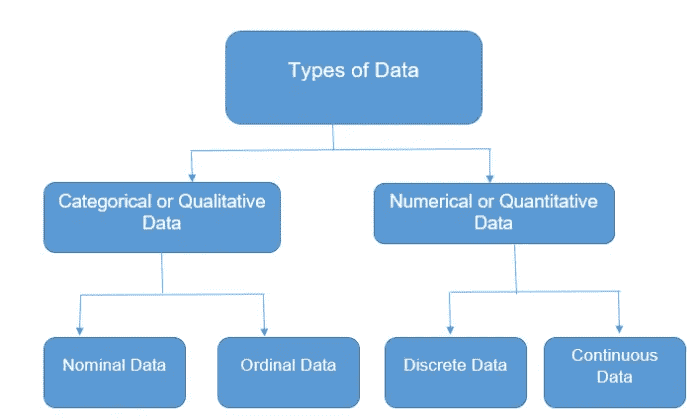
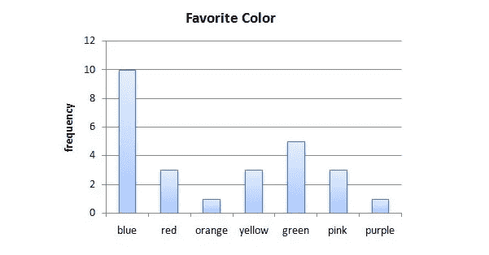
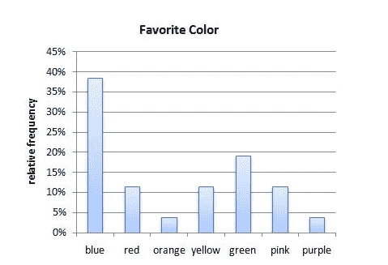
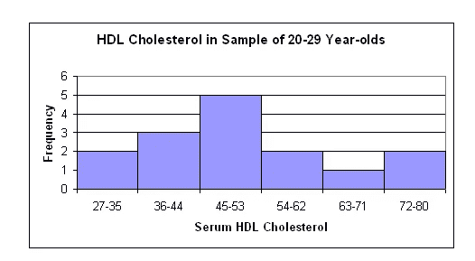

# 描述统计学

> 原文：<https://medium.com/analytics-vidhya/descriptive-statistics-17f322ac82e?source=collection_archive---------28----------------------->

样本数据是实际数据的一小部分。每个样本由许多属性组成，每个属性被称为一个变量。每个样本的属性可能因其特征而异。例如，手机可以根据内存、摄像头、存储、电池等进行分类。每个属性都是一个变量

基本上有两种类型的数据

1.  质量数据
2.  数据

Q **定性数据**:任何你可以用类别、属性等而不是数字来衡量的东西都是定性数据

有两种类型的定性数据

a) **序数** —如果数据范围之间是序数，则可以比较的任何数据。这里举个例子会有助于更好地理解。在一个在线销售手机的网站上搜索，可以将手机分为几类。基于等级排序的移动电话是有序的。

b) **标称值**:任何无法比较的数据都属于标称值。在相同的移动示例中，移动属性的品牌可以是名义数据。品牌 A 或 B 或 C 没有可比性，它们是独立的

Q **定量数据**:任何可以用数字来衡量的数据都是定量数据。它们也有两种类型。

a) **离散**:任何具有整数和非小数值的数据都是离散的。那么移动电话中的摄像机数量是离散的。它可以是 1 或 2 或 3，但不能是 1.5 或 2.5

b) **连续**:任何有分数值的数据都是连续的。手机的折扣是连续的。虽然是整数，但有 6.5%或 4.5%的可能。

**描述定性数据**

定性数据一般是定数中的唯一值。所以它回答的问题是这个发生的频率有多高。例如，下面是对人们最喜欢的颜色的假想调查。如前所述，蓝色、红色、橙色是名义定性数据。

这张图表足以描绘出最喜欢的颜色。万一我们需要知道有多少%的人喜欢蓝色。我们可以推导出

(喜欢蓝色的人数/回答的总人数)* 100 = %喜欢蓝色的人数

也就是 10/26 = 0.38

其图表如下所示:

**描述量化数据**

定量数据可能被转换成定性数据。比方说，移动设备的价格范围从 10k 到 15k 为低范围，15k 到 25k 为中范围。10k 到 15K 是定量的，它被转换为会导致数据丢失的低范围类别。当一部手机被称为低端时，我们可能不知道它的实际价格。

在上面的图表中，没有考虑离散值，而是考虑了绘制条形图的范围值。间隔是非常主观的，是根据数据需要如何显示来决定的。数据不应该显示太多或太少，预计是适度的。直方图是描述定量数据的首选。

**描述数据**

假设一个班有 10 名学生，他们在某一科目上的分数是 67，58，97，36，45，88，99，72，81，51

我们将基于这些描述几个定义

这 10 个标志或一个量变量的观察值称为**分布**

让我们按升序排列这些值，这将有助于我们更好地定义

36,45, 51,58,67,72,88,88,97,99

**范围**是从最大值到最小值的差值，即 99–36 = 63

**Mean** 是分布的平均值。(36+45+51+58+67+72+88+88+97+99)/10 = 70.1

**中位数**是排序时分布的中间值。目前，我们有 10 个分数，这是一个偶数，因此，如果我们取第 5 和第 6 个分数的平均值，则中位数= > (67 + 72) / 2 = 69.5

**模式**是分布中最流行的值。目前是 88 岁