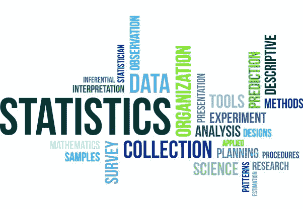

# 描述统计学:初学者指南

> 原文：<https://medium.com/analytics-vidhya/descriptive-statistics-a-beginners-guide-d9ca0ac97f63?source=collection_archive---------21----------------------->

资料来源:vectorstock.com

“数据”一词被定义为不同的信息片段。数据以多种不同的形式存在，如文本、视频、电子表格、图像、音频以及更多不同的形式。数据被用来理解和改善我们生活的几乎每一个方面。利用数据是世界的新方式。因此，当我们获得数据时，我们应该首先通过应用不同的统计技术来理解数据，而不是应用不同的算法来做出任何决定并实现您的目标。

本文的主要目的是了解以下问题:

1.  什么是描述性统计？
2.  有哪些不同的数据类型？
3.  定量数据及其不同类型？
4.  分类数据及其不同类型？
5.  在处理定量数据时，我们使用了哪些不同的方面？

我们开始吧。

# 什么是描述性统计？

描述性统计是一种以有意义的方式组织和总结数据的技术，这样数据就容易理解。描述性统计允许对数据进行更简单的解释。它只是描述我们数据的一种方式。描述统计学不像推断统计学那样以概率为基础。

# 有哪些不同的数据类型？

有两种主要的数据类型:

1.  数据
2.  分类数据

我们将进一步详细分类这些数据类型

# 定量及其不同的数据类型？

定量数据被定义为数字数据的集合。这种类型的数据主要包含数字和值。这种方法用于回答基于“多少”、“什么”等的问题。通常以普查、表格等形式收集定量数据以进行统计分析。

定量数据进一步分为两大类。

1.  离散数据
2.  连续数据

现在我们来详细讨论一下。

**A .离散数据**

可计数的数据称为离散数据。这种类型的数据无法测量。离散数据可以是可数有限的，也可以是可数无限的。身高、体重和长度等测量数据不包括在离散数据中。此外，离散数据不能进一步分解成更小的单元。它是用整数度量的，不包括半值

这类数据的一个例子是:班级中的学生人数。

**2。连续数据**

连续数据可以取数值，这些数值可以进一步分解成更小的单元。它还可以接受十进制值和负值。连续的数据可以用秤测量(如身高、体重、长度)。对于选定的范围，它有无限多的值。

这种类型的数据的一个例子是:大学学生的 CGPA 值是 10 分。

# 分类数据及其不同类型？

分类数据是一种可以根据类别进行分类的数据。当数字按组或项目集收集时，这种类型的数据称为分类数据。分类数据中使用的数字通常没有意义(例如 1 代表“是”，0 代表“否”)。

分类数据可以进一步分为两大类。

1.  序数数据。
2.  标称数据

现在，让我们详细讨论一下这种数据类型。

1.  **序数数据**

遵循某种层次结构或有序结构的数据称为有序数据。经过排序的分类值属于这种类型的数据。这两个类别之间的距离不能通过序数数据来确定。

这类数据的一个例子是:分类为 1 的产品评级。非常糟糕，2。不好，3。平均，4。很好，5。非常好。

**2。名义数据**

在名义数据的帮助下，变量可以被标记而不提供任何定量值。这种类型的数据不像顺序数据那样遵循任何排序顺序。即使是它们也无法衡量。

这类数据的一个例子是:头发的颜色可以是黑色、棕色、白色、金色等。

# 在处理定量数据时，我们使用了哪些不同的方面？

在分析定量数据(即离散和连续数据)时，我们通常倾向于四个不同的方面。这四个方面如下:

1.  中心
2.  传播
3.  形状
4.  局外人

我将在下一篇文章中详细讨论最后一个问题。我希望你学会或修改了这些概念。如果你喜欢我的文章，那么请鼓掌，这将激励我写更多，并与媒体家庭分享。谢谢，祝你平安快乐！

以下是我的 LinkedIn 链接:【https://www.linkedin.com/in/ruchit-sherathiya-0817b1148/

我很乐意与你联系。