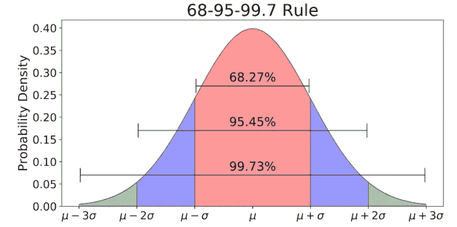

# 数据科学的描述性统计摘要

> 原文：<https://medium.com/analytics-vidhya/descriptive-statistics-acba9c2f8e5b?source=collection_archive---------3----------------------->

顾名思义，它通过图表和总体总结来总结原始数据，并且易于人类理解。简而言之，它帮助我们理解“发生了什么？”

它包含了定义、公式及其优缺点的总结，给出了各种统计在什么情况下使用的感觉。

## 人口与样本

**Population** :一个数据集包含一个指定组的所有成员(数据值的整个列表)。

例如:人口可能是生活在印度的所有人。

**样本**:样本数据集包含总体的一部分或子集。样本的大小总是小于被抽取样本的总体大小。

例子:样本可能是一些生活在印度的人。

> 描述性数据类型

汇总数据

> 集中趋势的度量

## **的意思是**

通常被称为平均值。一组数据值的平均值是所有数据值的总和除以数据值的总数。

**公式:**

**优点:**

*   Mean 不需要对数据进行排序，因为对数据进行排序的成本很高。
*   如果不是所有的点都有数据，众数和中位数就不能正确表示数据。
*   它可用于连续和离散数值数据。

**缺点:**

*   平均值可能会受到异常值的严重影响(具有极值的数据点与其他数据点不同)。
*   无法计算分类数据的平均值，因为这些值无法相加。
*   无法用图形检查/发现。

## 中位数

一组数据值的中值是数据集按升序排列时的中间值，对于数据集中的奇数个值，中间数给出中值，而对于数据集中的偶数个值，中间两个值的平均值或均值给出中值。

当数据按顺序列出时，中位数是 50%的情况高于或低于中位数的 50%的点，也称为第 50 百分位。

**公式:**

它不受异常值的影响，对于对称分布，平均值和中值是相同的。

在偏斜数据中，平均值比中位数更偏向偏斜，如下所示。

**优点:**

*   受异常值和偏差数据的影响较小
*   可以用图形表示数据
*   即使编号系列不完整也可以计算

**缺点:**

*   它不能被分类的名义数据识别，因为它不能被逻辑排序。
*   数据的分类有时会很昂贵。
*   不能解释所有的观察结果。

## 方式

众数只不过是任何给定数据集或总体中最流行的数字。它是在一组观察值中出现频率最高的值。数据集可能是多模态的(具有一个以上的模态)，这意味着一个以上的观察具有相同数量的频率。

它可以给出最可能的体验，而不是“典型的”或“中心的”体验，例如，应该在商店中保存哪种尺寸的衬衫可以根据衬衫以前销售的模式值来决定。

**公式:**

**优势:**

*   它可以从数字和分类数据中获得
*   可以用柱状图来表示。

**缺点:**

*   一个数据集可以有一个或多个模式，或者根本没有模式。
*   对于浮动数据，很难计算模式
*   可能是不准确的数据表示，因为它不是基于所有的值。

> 变化的度量

## 范围

它是一个数据集(变量)的最低值和最高值之间的分布或距离。

**公式:**

**优点:**

*   这种离差度量的主要优点是易于计算。

**缺点:**

*   它对异常值非常敏感，并且不使用数据集中的所有观察值。
*   提供最小值和最大值比提供范围更能说明问题。

## 四分位间距

它被定义为第 **(Q1)** (第 25 位)和第**(第 3 位)**(第 75 位)之间的差值(也称为第一和第三个四分位数)。因此，四分位数范围描述了中间 50%的观察值。

如果四分位间距很大，这意味着中间 50%的观察值间隔很大。

**公式:**

**优点:**

*   如果没有准确记录极值(如在频率分布中的开放式类间隔的情况下)，它可以用作可变性的度量。
*   不受极值的影响。

**缺点:**

*   使用四分位距作为分散度的度量的主要缺点是它不适合数学处理。

## 差异

统计学中的方差(σ2)是对数据集中数字之间的分布的度量。也就是说，它测量集合中的每个数字离平均值有多远，因此离集合中的每个其他数字有多远。

**公式:**

统计学家使用方差来查看数据集中各个数字之间的关系，而不是使用更广泛的数学技术，如将数字排列成四分位数。

**优点:**

*   方差的优势在于，它对所有偏离均值的情况都一视同仁，不管它们的方向如何。偏差的平方和不能为零，因此数据看起来没有任何变化。

**缺点:**

*   它增加了离群值的权重，即远离平均值的数字。对这些数字求平方会扭曲数据。
*   当我们把数据平方，改变它的维度时，就不容易解释了。

## 标准偏差

方差的问题是，它不能给出偏差的正确表示，因为结果是平方的，并且与正态集的单位不同。为了解决这个问题，我们计算标准差

标准差(SD)是最常用的离差度量。它是关于平均值的数据分布的度量。SD 是平均值的偏差平方和除以观察次数的平方根。

**公式:**

**优点:**

*   标准差是非常有用的离差度量标准的原因是，如果观察值来自正态分布，则 68%的观察值位于平均值±1 标准差之间，95%的观察值位于平均值±2 标准差之间，99.7%的观察值位于平均值±3 标准差之间
*   SD 的另一个优点是，它可以与均值一起用于检测偏斜度。

**缺点:**

*   对于有偏差的数据来说，这是一种不恰当的离差度量。

## 箱形图

[箱线图](https://www.simplypsychology.org/boxplots.html)帮助我们以图形方式描绘描述性统计数据。

始终使用与比例相关的箱线图。

来源:

 [## 离差的度量

### 集中趋势的度量不足以描述数据。两个数据集可以有相同的平均值，但它们可以…

www.ncbi.nlm.nih.gov](https://www.ncbi.nlm.nih.gov/pmc/articles/PMC3198538/)  [## 使用方差方程

### 统计学中的方差(σ 2)是对数据集中数字之间的分布的度量。也就是说，它衡量的是…

www.investopedia.com](https://www.investopedia.com/terms/v/variance.asp)  [## 方框图告诉你什么？

### 作者索尔·麦克劳德，出版于 2019 年什么是盒子情节？最低分最低分，不包括异常值(显示在…

www.simplypsychology.org](https://www.simplypsychology.org/boxplots.html) 

祝所有媒体读者新年快乐，万事如意。感谢您阅读文章。快乐学习！！！