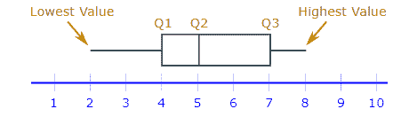

# 数据科学的描述统计学。

> 原文：<https://medium.com/analytics-vidhya/descriptive-statistics-for-data-science-1120807e15f4?source=collection_archive---------18----------------------->

# 简介:

统计学是数据科学的基石，对于数据科学家来说，掌握它非常重要。学习并达到标准是一项单调乏味的任务，也是数据科学家努力解决的问题。本文面向刚开始接触数据科学并需要一个概述的人。对其他人来说，这可能是对基础知识的复习。如果你觉得这个链接有帮助的话，请随时将它加入书签，并在需要的时候再回来。让我们开始吧。

# 异常值:

异常值可以定义为超出正常范围的值。例如，在系列中:4，7，19，999，8，14，999 将是异常值。对于特定数据集，分析师决定值是否为异常值。

# 模式:

众数可以定义为分布中出现频率最高的值。

在序列中，5，10，5，6，8，3，21，5 是众数，因为它出现的次数最多(两次)。

所有的值对于一个模式来说并不重要，因为我们只需要检查数字出现的频率，这也是为什么模式对于异常值是健壮的原因。假设我们在 5，10，5，6，8，3，21，900 系列中增加 900，模式保持不变。模式通常用于分类变量，类似于下面的例子。

让我们考虑 5 种颜色球的分布:红色、红色、绿色、蓝色、红色

这里，红色是众数，因为它出现得最频繁，即 3 次。

一个分布可以有一个或多个模式。单峰分布是单峰的，双峰分布是双峰的，多峰分布是多峰分布。

# 平均:

Mean 是分布中数字的平均值，或者一般来说:

平均值=(术语之和)/(术语数量)

平均值对异常值很敏感，因此它不是一个非常稳健的度量。

例子:让我们考虑一下以前的分布

1.  无异常值:5，10，5，6，8，3，21，平均值= 58/7 = 8.29
2.  含离群值:5，10，6，8，3，21，900，5 均值= 958/8 = 119.75。

如上例所示，添加异常值会显著改变平均值。均值一般用于连续变量。

# 中位数:

中位数可以定义为按升序排序的数值分布的绝对中心值。奇数长度序列的中位数是最中间的元素，偶数长度序列的中位数是中间两个元素的平均值

示例:

1.  3,5,5,6,8,10,21.这里序列长度是奇数，中间元素是 6，所以 6 是中间值。
2.  3,5,5,6,8,10,21,900.这里数列长度是偶数，中间元素是 6 和 8，所以是 6 和 8 的平均值，即 7 是中位数。

我们还可以从上面的例子中观察到，在第二个例子中添加异常值并不影响平均值。因此，中值可以作为均值的一个更可靠的替代

中位数通常也用于连续变量。

# 分位数和四分位数:

分位数是数据的任意点，而四分位数是将数据集分成四份的值。虽然我们主要在处理数据问题时处理四分位数，但最好理解两者之间的区别并消除混淆。

中位数将数据集分为两部分。中位数左边的数据的中位数是第一个四分位数，平均数右边的是分布的第三个四分位数。通过下面的例子可以清楚地理解这一点:

[https://www.mathsisfun.com/data/quartiles.html](https://www.mathsisfun.com/data/quartiles.html)

四分位数和其他重要值可以用如下所示的箱线图来表示:

【https://www.mathsisfun.com/data/quartiles.html 号

# 数据分布:

在进行数据科学项目时，我们可能需要检查我们的观察集合的相似性或差异性。有两种方法来计算这一点:

1.  范围:最大值和最小值之差。它与数据的传播成正比。范围对异常值敏感
2.  四分位数间距(IQR):是第三个四分位数和第一个四分位数之间的差值。它对异常值是稳健的，因为它考虑了四分位数，正如我们所知，四分位数来自中位数，中位数对异常值是稳健的

请注意，我们使用类似的方法来计算四分位数，如前所述。

示例:

1.  无异常值:3，5，5，6，8，10，21

四分位数 1: 5

四分位数 2(中位数):6

四分位数 3: 10

范围:21–3 = 18

IQR:10–5 = 5

2.有异常值:3，5，5，6，8，10，21，900

四分位数 1: 5

四分位数 2(中位数):(6+8)/2 = 7

四分位数 3: 21

范围:900–3 = 897

IQR:21–5 = 16

3.方差和标准差也可以用来衡量数据的分布。我们将在本文的后面讨论它们。

下表显示了测量值及其对异常值的敏感度。

# 方差和标准差:

让我们看看维基百科对这两个术语的定义

**方差**:随机变量与其均值的方差的期望值。通俗地说，它测量一组(随机)数从它们的平均值分散开多远。

**标准差**:一组数值的变化量或离差量的度量。低标准偏差表示这些值倾向于接近集合的平均值，而高标准偏差表示这些值分布在更大的范围内。

以下是公式:

[https://towards data science . com/intro-to-descriptive-statistics-and-probability-for-data-science-8 effec 826488](https://towardsdatascience.com/intro-to-descriptive-statistics-and-probability-for-data-science-8effec826488)

我们使用方差的平方来确保高于和低于平均值的偏差不会互相抵消，这可以通过下面的小例子来理解

将偏差之间的绝对差值相加，我们得到:-5+0+5 = 0。

加上偏离平均值的平方差，我们得到:25+0+25 = 50。

额外的好处是我们严重惩罚了离群值。但是，由于平方，方差与原始数据的度量单位不同。这就是我们通常使用标准差，即方差的平方根来计算的原因。

# 结论:

在这篇文章中，我们介绍了一些描述性统计的基础知识，希望你喜欢。我还没有介绍涉及中心极限定理和 Z 分数的部分，我打算在以后的文章中介绍，以及一些概率概念。在那之前，再见！