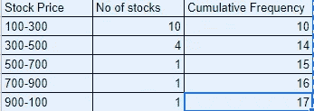
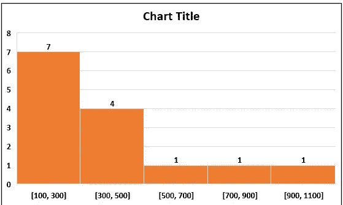
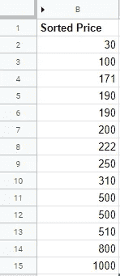
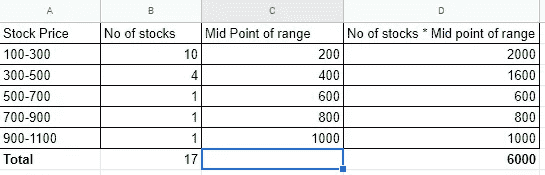
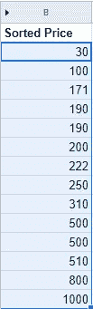

# 描述性统计——三

> 原文：<https://medium.com/analytics-vidhya/descriptive-statistics-iii-c36ecb06a9ae?source=collection_archive---------9----------------------->

1.  **直方图的中值**

从一系列值中计算中值很简单。回忆一系列值[10，12，13，15，17，20，21] =中间值为 15，即中心值

现在我们如何从直方图中计算中位数

比如说一个直方图

考虑第一列和第二列。我们有 5 箱值，包括股票数量及其价格范围。我们如何从这个直方图中计算出中位数

步骤 1:计算股票数量的累积频率—第 3 列

第二步:取 cum 的最后一个值。频率是 17。如果偶数使用 n/2，(n+1)/2，否则如果奇数使用(n+1)/2。17 是奇数，所以(17 + 1)/2 = 9

第三步:找出哪个价格范围包含值 9，即 100–300

第四步:找到中间值(100 + 300)\2 = 200，这是我们的中间值

对于实际值的中值，下面是原始数据

有 14 个值，中位数是[(n/2)+((n/2)+1)]/2 =[(14/2)+((14/2)+1)]=第 7 个+第 8 个元素也就是(200 + 222 )/2 = 422/2 = 211。

从直方图计算的中值是 200，从实际值计算的中值是 222。差异是(222–200)/222 * 100 =与实际中值相差 9.9 %，这是很小的

**2。直方图平均值**

让我们从他的图表中计算平均值

考虑 A 列和 B 列

**第一步**:计算范围的中点。如果范围是 100–300，中点是 200(c 列)

**步骤 2** :将中间品脱范围乘以库存数量= 200 * 10 = 2000(D 列)

**第三步:(**D 列之和)/(B 列之和)= 6000/17 = 352.94

平均值是 352.94。现在为了验证，我们可以看看从实际值计算出来的平均值是多少

平均值是 4973/14 = 355.21

从实际值 355.21 和从直方图计算的平均值的比较是 352.94。(355.21–352.94)/355.21 * 100 =与实际平均值相差 0.63 %

**3。直方图模式**

你能检查一下[这个直方图](https://cdn-images-1.medium.com/max/800/1*lrHBUqKKHTT_4NUTH1_bnw.png)并说出是什么模式吗？

.

.

.

.

.

.

乍一看，它显示 100–300 是模式，因为在该范围内有更多的项目。实际上，它们是更多数量的值，而不是相同的值。那么模式是什么呢？你可以从[实际数据](https://cdn-images-1.medium.com/max/800/1*j8H_XBJrD6mu-B5RvxnQlQ.png)中得知

分别是 190 和 500。那么如何在直方图中找到它呢？答案是我们无法从直方图中找到模式，除非面元大小为 1