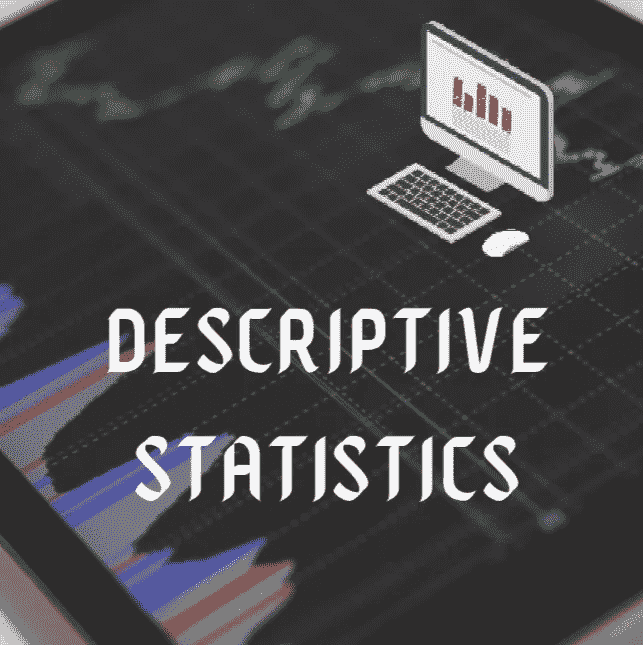

# 数据科学中的描述性统计——以“python”为例

> 原文：<https://medium.com/analytics-vidhya/descriptive-statistics-in-data-science-with-illustrations-in-python-efd5ccc152f1?source=collection_archive---------1----------------------->

## 数据科学家是掌握了从数据中学习以解决复杂问题的艺术的人。统计学是一门帮助数据科学家掌握艺术的学科。

## 统计数字