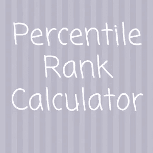

# 描述性统计——四

> 原文：<https://medium.com/analytics-vidhya/descriptive-statistics-iv-e445e41f9bf3?source=collection_archive---------28----------------------->

她的链接是关于描述统计学的前一系列文章的链接

**百分位数**:

我们可以用一个场景来理解百分位数。比如说，如果一所大学想根据入学考试来选择学生。他们有一个 70%的截止分数，任何分数高于或等于 70%的人都有资格参加小组讨论。可能有 3 种情况

1.  如果考试更容易，会有更多的学生得到 70%
2.  如果考试太难，很少或没有学生能达到 70%以上
3.  相当多的学生通过了考试

那么选择前 30%学生最好方法是什么呢？这不是正确的方法，因为我将无法解释什么是百分位数。让我们考虑一下，大学管理层决定选择所有成绩超过 70%的学生

下面是 20 名学生的分数。它们是为了计算百分位数而排序的

11,24,28,28,29,30,31,31,32,33,35,36,37,45,58,64,62,69,70,24

*百分位数的定义*:

样本的 p 百分位是一个值，使得数据中 p 个百分比的值小于或等于该值。

将我们的问题陈述与定义联系起来。上述样本数据的第 70 百分位是剩余值小于或等于 70%的数据。

让我们来计算百分比:

a)对数据进行分类(已经完成)

b)计算 P 百分位，公式为= P/100(n+1) = 70/100(20+1)=14.7

c) 14.7 是数据中元素的位置。我们要么把 14 号元素定为 45，要么把 15 号元素定为 58。为了计算第 14 个元素之后的第 0.7 个元素，我们可以

第 14 个元素+ 0.7(第 15-14 个元素)=第 70 个百分位数

45 + 0.7 * (58–47) =51.3

所以百分位数是 51.3。所有得分超过 51.3 的学生都有资格参加考试。咳

**四分位数:**

*四分位数将数据分成 4 等份*

学生的分数被分成四等份。学生人数较少，很容易在 Q1，Q2，第三季度的类别筛选。当有更多的值时我们该怎么办？使用相同的百分位数公式。Q1 是第 25 个百分点。所以，记住公式 P/100(n+1)

Q1 = 25/100(20+1)= 5.25 元= > 29+0.25(30–29)= 29.25

Q2 = 50/100(20+1)= 10.5 个元素= > 33+0.5(35–33)= 34

Q3 = 75/100(20+1)= 15.75 个元素= > 58+0.75(64–58)= 62.5

如果你记得中位数和 Q2 是一样的。

**百分位数排名:**

*数值的百分比等级是小于或等于该数值的数据值的百分比*

我们之前使用百分位数公式计算了第 n 个等级的数值。现在，如果我们给出一个数字，并询问它的百分位，比如上面结果中的 36。公式是:

PRs =( (Cs + 0.5 * Fs) / n )* 100

PRs =百分点等级

Cs =小于 s 的值的数量

Fs =等于 s 的值的数量

用上面的公式求 36=> ((11 + 0.5 *1) / 20 ) *100 = 57.5

36 属于大于 50 的第三季度的第二个元素，根据公式，排名为 57.5。