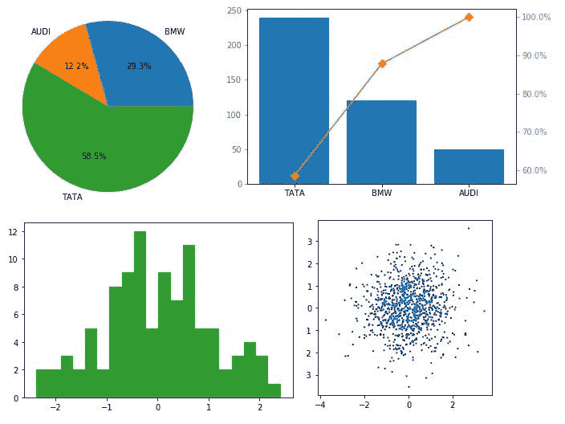

# Python 描述性统计:第 1 部分

> 原文：<https://medium.com/analytics-vidhya/descriptive-statistics-with-python-part-1-9f34e48abc05?source=collection_archive---------12----------------------->

作者图片

**简介**:学习数据科学或者机器学习，了解统计学是基本的必须。如今，如果有人参加数据科学或数据分析师面试，很明显会面临一些与统计相关的问题。如果有人是数据科学领域新手，他/她很难使用 python 代码来描述统计应用程序。