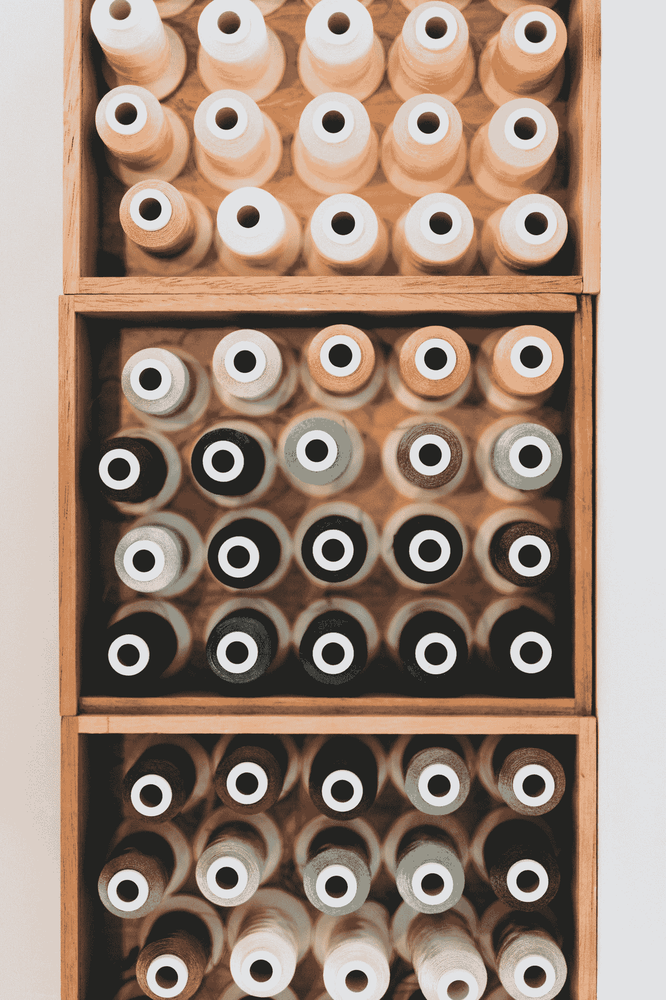

# 设计散列表—第一天(Python)

> 原文：<https://medium.com/analytics-vidhya/design-a-hashmap-day-1-python-8c5e463a0629?source=collection_archive---------7----------------------->

内森·杜姆劳在 [Unsplash](https://unsplash.com?utm_source=medium&utm_medium=referral) 上的照片

这是我参加 365 天编码挑战的第一天。我将尝试解决 leetcode 采访中最常见的问题。撰写媒体帖子的动机有两个，

a.这篇文章将留在我身边，我可以随时修改。

b.希望你能够理解这个解决方案，并且能够轻松地实现它们。