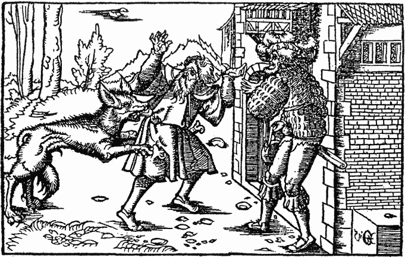
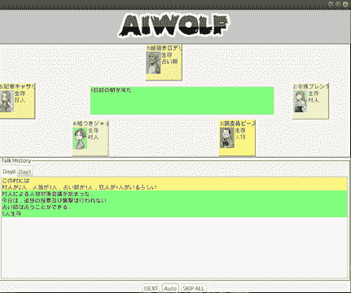
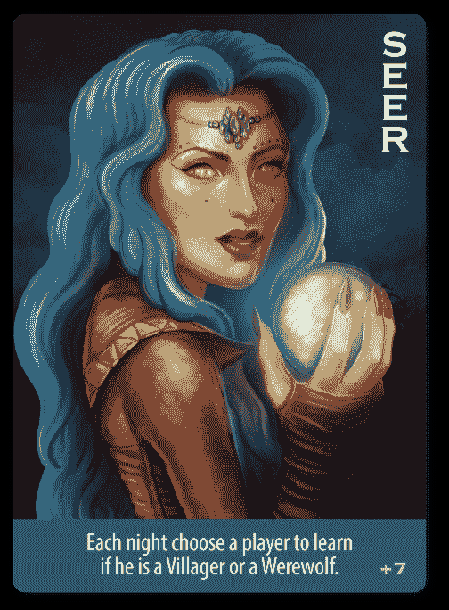
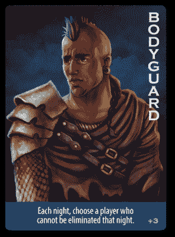
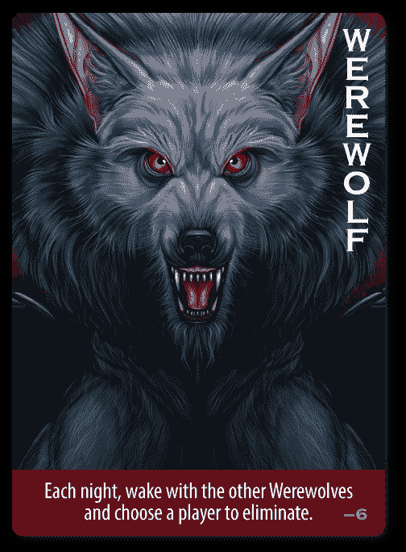
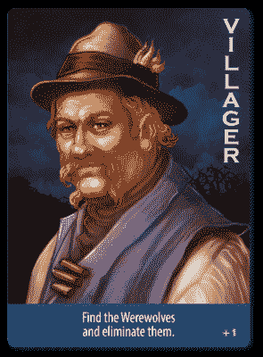
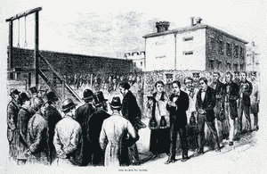
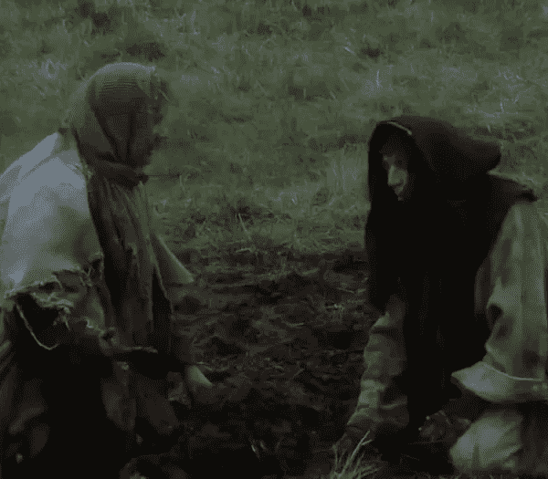
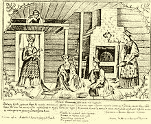

# 应用博弈论:为人工智能狼人设计一个聪明的代理

> 原文：<https://medium.com/analytics-vidhya/designing-a-clever-agent-for-ai-werewolf-67c43913d302?source=collection_archive---------1----------------------->

TLDR；博弈论的开源大纲启发了解决 AI 狼人游戏的约束。由[阿里·博恩施泰因](https://il.linkedin.com/in/aaron-ari-bornstein-22aa7a77)、[莫提·米凯利](https://www.linkedin.com/in/motymichaely/)、[诺阿·叶兹克尔·卢宾](https://www.linkedin.com/in/noalu/)和[多尔·赫斯特](https://www.linkedin.com/in/dor-hirst-498198174/)用 python 开发，作为他们与[巴尔伊兰大学](http://u.cs.biu.ac.il/~sarit/advai19.html)合作的一部分

# 什么是 AI 狼人？

《狼人》是一款派对游戏，由 Dmitry Davidoff 于 1986 年创作，模拟了两个群体之间的冲突:知情的少数群体和不知情的多数群体。

我们的任务是为一个与未知代理竞争的“狼人”游戏实现一个代理。在这个游戏中，每个玩家可以是两个物种之一:狼人或村民。

游戏服务器的代码可以在这里找到:

 [## aiwolf/AIWolfServer

### aiwolf.org 的服务器应用程序。在 GitHub 上创建一个帐户，为 aiwolf/AIWolfServer 的开发做贡献。

github.com](https://github.com/aiwolf/AIWolfServer) 

群体参差不齐，村民占多数，但对其他玩家的物种一无所知。狼人是少数，但他们知道其他玩家的种族。每个物种群落的目标都是消灭对方。如果一个玩家是没有被消灭的物种群落的一部分，他就赢了。此外还有特殊角色:先知、灵媒、保镖、附身。

游戏由两个阶段组成:

夜晚:当狼人可以交流(“耳语”)并投票给某个要被攻击的玩家。

这一天:当村民和狼人可以交流(“交谈”)并投票选择某个玩家被淘汰。

在游戏的每一个阶段，服务器都会调用代理返回一个与其相关的动作，如说话和投票(所有玩家)、先知(神圣)、守卫(贴身护卫)、耳语和攻击(狼人)。

关于 AI 狼游戏规则的更多信息，请查看游戏设计者的演示。

# 设计一个狼人特工

由于村民对狼人的信息不完全，而狼人对哪些村民是先知、灵媒和保镖的信息也不完全，为了选择一个理想的策略，我们需要一个灵活且计算高效的玩家评估策略，根据玩家的行为和我们的代理人对他或她当前角色的确定性，拼凑出玩家的角色。

我们首先探索使用我们在课堂上学到的方法，如[策略](https://www.youtube.com/watch?v=bJMib3EPwAE)、[值](https://artint.info/html/ArtInt_227.html)迭代和 [Q 学习](https://en.wikipedia.org/wiki/Q-learning)来帮助完善这些估计，此外还有基于我们自己玩的游戏的监督学习方法。

然而，我们很快发现，计算这些估计值和阈值所需的计算时间远远超过了游戏服务器提供给我们的 115 毫秒阈值。

为了构建一个能够正确估计的代理，我们应用了从我们自己对狼人游戏的分析中学到的以下策略。我们将博弈的阶段视为子博弈，并尝试使用我们所学的一些博弈论概念来估计最优策略。在下一节中，我们将概述这些不同角色的评估策略及其合理性。

需要注意的一点是，为了赢得游戏，我们不仅需要考虑游戏本身，还需要考虑其他竞争代理和他们的设计师如何与我们的代理互动。

**1。估计策略:**

我们的代理将估计角色的映射存储为确定的或估计的。

*   “某些”只是我们 100%确定的角色，而“估计”将包含我们只能估计的角色。地图为每个角色保存了确定的和估计的玩家。
*   我们将根据狼人玩家的谈话和耳语阶段更新评估。这种估计大致基于信号理论，因为我们没有阈值，但可以根据玩家行为推断出某些动作和类型。

**估计预言者:**

如果我的代理是先知，那么他/她对自己的角色很确定。否则，代理将根据游戏过程中哪些代理一致地说“出来”角色“狼人”/“村民”来估计预言者。假设是因为预言者是游戏中拥有最多信息的村民角色，持续分享这些信息符合他们的利益。普通玩家没有足够的信息或在游戏中坚持说出柜，而狼人有这些信息，这是他们说谎的动机，所以他们不太可能与他们呼唤其他玩家保持一致。

**估计媒介:**

我们的代理人根据代理人最常提到的关于先知角色的“出柜”来估计媒介，这一策略背后的基本原理是媒介有能力发现先知是谁，他/她将试图发现先知并让每个人都知道。媒介具有比其他玩家更好地估计先知的能力，因为他拥有关于死去的玩家的角色的最多信息(而其他玩家没有该信息),并且他可以用谁对玩家的角色最正确的历史来交叉验证该信息。

**估算保镖:**

我们的代理人通过查看代理人 X 的消息“请求保护”来估计保镖，并且没有人死亡，则 X 是保护者。如果没有人死亡，这意味着警卫成功地保护了某人，因为我们没有其他信息，所以我们最好的猜测是假设保镖保护了一个寻求帮助的人。

**估计着了魔/狼人:**

我们的特工对狼人的估计如下。如果代理是一个狼人，他/她将所有其他狼人标记为确定。如果代理人是预言者，他/她会将所有他/她预测的狼人标记为确定的。如果代理是一个媒介角色是媒介如果在一天结束的时候一个村民死了，代理标记那些投票给他/她的人是潜在的狼人。

**估算村民:**

如果代理是一个狼人代理标记所有村民为确定。如果代理是一个保镖，保护了一个村民，并且没有人死亡，这意味着他/她保护的玩家确实是一个村民，因此可以将他们标记为某个村民。如果代理人是一个预言家，他们会将所有被预言的村民标记为确定的。如果我们在某个列表中有一个先知，他/她会说什么。

**2。悄悄话攻略:**

在耳语阶段，我们的代理人说“出来”/“估计”目标，目标逻辑与计划投票给谁相同。因为游戏中有如此多的不确定性，而有效的沟通符合村民的利益，所以我们选择诚实作为最佳策略。

**3。攻击策略:**

作为一个狼人，如果代理人基于确定性将目标锁定在以下玩家身上，它将按照以下顺序锁定以下角色:先知、保镖、灵媒。

守卫的重要性随着游戏的进行而增加，因此如果天数大于 n/3，就改变守卫和先知的优先级。当我们对特殊角色没有任何估计的时候，代理人会和大多数其他狼人一起攻击，这意味着我们会附上最“被攻击”(攻击信息)的村民(而不是死的)，如果和其他狼人没有共识，我们就随机选择一个村民。

**4。谈话策略:**

如果代理人是一个狼人，在攻击策略中杀死一个有同样优先权的村民对我们有利。然而，如果我们总是告诉村民杀死最引人注目的目标，他们可能会因为看到我们的信号而产生怀疑，因此这是我们说谎的动机。

然而，如果我们总是在我们想杀死谁的问题上撒谎，就很难瞄准其他村民，而且可能会引起怀疑。

因此，被杀害的代理人会谎报其“出柜”/“估计”的概率 p= 20%。20%的阈值是通过经验实验确定的。要了解更多关于这种估计的信息，你应该看看混合贝叶斯策略。

否则，如果代理不是狼人，我们说“出来”/“估计”，如果我确定/估计一个狼人角色-就像耳语策略。我们有 10 次机会，每次我们不应该说同样的话，我们应该按这个顺序说

1.  告诉所有人给狼人投票
2.  召唤出剩下的某些狼人
3.  估计估计列表里的狼人。
4.  闭嘴，因为我们不想向狼人透露谁是谁

**5。投票策略:**

如果代理是一个狼人，那么他们的投票策略和攻击策略是一样的。如果代理是一个村民，那么他/她会随机选择一个他们确定的狼人。如果没有他们确定的狼人，他们会随机选择一个狼人。如果他们没有关于潜在狼人的信息，他们会投票给一个随机的没有被估计或确定死亡的村民，一个先知，一个灵媒，一个保镖，或者不是某个村民，他们会选择一个随机的非确定的村民。

**6。守卫策略:**

先知和保镖是村民游戏中两个最重要的角色，因此如果代理人是保镖，并且知道先知是谁，并且先知还活着，保护先知保护你自己。

**7。神策:**

如果代理人认为在“评估”列表中有一个狼人/附身者，那就神圣他们，否则在当前代理人之外随机选择一个村民。

# **结论**

上述估计和行动策略使我们能够构建一个适应性强的代理，它可以利用游戏过程中显示的信息，同时使自己适应每个角色。由于上述原因，我们相信这种智能体将比竞赛组织者提供的简单智能体以及做出统一行动决策的智能体表现得更有竞争力。

这个解决方案帮助我们更简洁地思考我们在课程的博弈论部分学到的概念，如零和(只有一个团队可以赢)，团队合作和团队间竞争，混合策略和处理不完美信息。

上述策略中概述的状态约束使用基于搜索的模拟方法(例如蒙特卡罗树搜索)来调整它们自己，以用于将来的探索。

有关人工智能搜索算法的更多信息，请参见。

 [## 每个数据科学家都应该知道的人工智能搜索算法

### TL；下面的帖子概述了人工智能中的一些关键搜索算法，为什么它们很重要，它们是什么…

towardsdatascience.com](https://towardsdatascience.com/ai-search-algorithms-every-data-scientist-should-know-ed0968a43a7a) 

如果您有兴趣了解更多信息，请随时在 twitter 上联系我。这项工作的代码是开源的，将在比赛结束后不久提供。

**参考:**

黑手党博弈的理论研究，姚二林，中国科学院计算技术研究所智能信息处理重点实验室，100190 北京。

# 关于作者

[**亚伦(阿里)**](https://www.linkedin.com/in/aaron-ari-bornstein-22aa7a77/) 是一个狂热的人工智能爱好者，对历史充满热情，致力于新技术和计算医学。作为微软云开发倡导团队的开源工程师，他与以色列高科技社区合作，用改变游戏规则的技术解决现实世界的问题，然后将这些技术记录在案、开源并与世界其他地方共享。