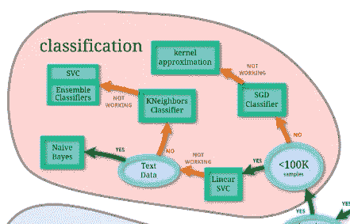

# 用 Python、Github 和 Heroku 在 Telegram 中设计上下文聊天机器人—第 1 部分

> 原文：<https://medium.com/analytics-vidhya/designing-a-contextual-chatbot-in-telegram-with-python-github-heroku-part-1-39e24e7c7723?source=collection_archive---------7----------------------->

电报机器人是运行在应用程序内部的第三方应用程序。用户可以通过向机器人发送消息、命令和内嵌请求来与它们进行交互。上下文聊天机器人是一类只通过内嵌请求进行通信的机器人。它们是上下文相关的，因为它们维护一个上下文，用户只能在预定义的上下文中导航。这些在提供客户服务时特别有用。在本帖中，我们将看看如何使用 Python 在 Telegram 中设计这样的机器人。

这将由两部分组成。在第一部分中，我们将使用 Telegram 注册我们的机器人，设置我们的本地编码环境并为机器人编写代码。在第二部分中，我们将讨论如何在 Heroku 上托管 bot，Heroku 是一种基于云的服务，对于托管基于 web 的小型应用程序非常有用。

# 用电报注册一个新的机器人

要注册一个新的机器人，请进入手机上的 Telegram 应用程序，然后按照以下步骤操作。在搜索栏中搜索“僵尸父亲”。“机器人父亲”是一个可以帮助你创建和管理所有机器人的机器人。启动 BotFather 并键入/help。这显示了这个机器人能够处理的所有可能的命令
3。键入/newbot 或点击列表中的该命令
4。按照说明设置一个新的机器人，基本上就是为你的机器人选择一个名字和用户名。【提示:选择一个与你的机器人能做什么相关的用户名】
5。一旦 bot 成功创建，bot 父亲将返回一个令牌来访问 HTTP API。请妥善保管这个令牌。我们将使用这个令牌从 python 脚本中授权我们的 bot

# 设置新的 Python 虚拟环境

为 python 项目创建虚拟环境是一个很好的实践。虚拟环境有助于将不同项目所需的依赖关系分开。虚拟环境还有助于轻松创建一个 *requirements.txt* 文件，Heroku 使用该文件在云中创建 python 环境。

虽然虚拟环境工具的选择很少，但我们将在我们的项目中使用 virtualenv。按照以下步骤使用 virtualenv 创建一个 Python 虚拟环境

*   在 macOS 或 Linux 中打开您的终端，并创建一个新的项目目录

```
mkdir telegram-bot && cd telegram-bot
```

*   检查系统中是否安装了 virtualenv。如果安装了 virtualenv，该命令将返回安装路径，否则不会返回任何内容。如果没有安装，您可以使用此[链接](https://virtualenv.pypa.io/en/latest/installation.html)中提到的方法进行安装

```
virtualenv --v
```

*   创建一个新的虚拟环境并激活它

```
virtualenv venv
source venv/bin/activate
```

虽然您可以为您的环境使用任何名称，但是 venv 是一个常用的约定。环境激活后，继续安装项目所需的 python 包

我们将使用这个项目的[*python-telegram-bot*](https://github.com/python-telegram-bot/python-telegram-bot)库。这个库为[电报机器人 API](https://core.telegram.org/bots/api) 提供了一个纯 Python 接口。要安装该库，请使用以下命令

```
python -m pip install -U python-telegram-bot
```

# 在项目文件夹中初始化 Git 存储库

需要在项目文件夹中初始化 git 存储库，因为 Heroku 使用本地 git 存储库在他们的云服务中部署代码。虽然 Heroku remote 通常被添加到本地 git 存储库来推送提交，但对于这个项目，我们将从 Github 添加一个 remote，并进一步将 Github 存储库连接到 Heroku 应用程序。

在您的项目文件夹中初始化本地 git 存储库

```
git init
```

另外，创建一个. gitignore 文件。的。gitignore file 列出了应该在所有提交中忽略的那些文件的名称。我们可以稍后更新该文件

```
touch .gitignore
```

现在我们将在 Github 中创建一个新的存储库。访问您的 Github 帐户并创建一个新的存储库。您可以将存储库设为公共或私有。我们将假设您创建的 Github 存储库的名称与您的项目文件夹相同。创建存储库后，复制它的 URL。

现在我们需要将本地存储库与新创建的 Github 存储库连接起来。

```
git remote add origin URL-to-your-Github-repository
```

一旦建立了到远程存储库的连接

```
git pull origin master
```

本地存储库现在可以将提交推送到 Github 存储库了

# 编写 Python 应用程序

万岁！现在我们终于可以开始为机器人编写 Python 脚本了。这个机器人将有一个非常简单的设计。有一个非常著名的 scikit-learn [机器学习图](https://scikit-learn.org/stable/tutorial/machine_learning_map/index.html)可以帮助数据科学家根据数据决定尝试哪种估计器。虽然原始映射对于本教程来说是广泛的，但是我们只修改了分类部分(其他部分是聚类、回归和维度减少)。



分类流程图([https://sci kit-learn . org/stable/tutorial/machine _ learning _ map/index . html](https://scikit-learn.org/stable/tutorial/machine_learning_map/index.html))

鉴于其大小，脚本不可能完全在这里托管。请点击这个[链接](https://gist.github.com/escapist21/52346423fdeb0b1c49d6ccbb66a9cfe2)来访问这个代码的 Github 要点。在您的项目文件夹中创建一个名为 *telegram_bot.py 的新文件。*在您最喜欢的代码编辑器中打开该文件，并将文件中的代码粘贴到 Github 链接中。

```
touch telegram_bot.py
```

# 解释代码

在这里，我们将查看部分代码，并试图理解发生了什么

```
from telegram.ext import Updater, CommandHandler, MessageHandler, Filters, CallbackQueryHandler, ConversationHandlerfrom telegram import InlineKeyboardButton, InlineKeyboardMarkup
import os
```

首先，我们从 python-telegram-bot 库中导入必要的类。第一行导入了该程序所需的各种处理程序。你需要阅读这些处理程序是做什么的。第二行导入与创建内联键盘相关的模块。由于这是一个上下文聊天机器人，只有内嵌键盘将用于与机器人通信。


内置键盘标记的机器人

```
#States
FIRST, SECOND = range(2)#Callback data
ONE, TWO, THREE, FOUR, FIVE = range(5)
```

“States”是所有对话步骤的列表，稍后将在设置 *ConversationHandler* 时使用。“回调数据”是当按下内联键盘时从该键盘返回的回调列表。“状态”和“回调数据”将从各种函数中返回，这些函数将构成我们的对话逻辑。这里我们只是初始化这些变量供以后使用。

```
def start(update, context):
    fname = update.message.from_user.first_name # Build inline keyboard
    keyboard1 = [InlineKeyboardButton("<100K samples",
                                      callback_data=str(ONE))]
    keyboard2 = [InlineKeyboardButton(">100K samples",
                                      callback_data=str(TWO))]

    # create reply keyboard markup
    reply_markup = InlineKeyboardMarkup([keyboard1, keyboard2]) # send message with text and appended inline keyboard
    update.message.reply_text(
        "Welcome {}. Let's figure out the best possible classifier for you data.\n\nHow many samples do you have?".format(fname),
        reply_markup=reply_markup
    )
    # tell ConversationHandler that we are in state 'FIRST' now
    return FIRST
.
.
.def end(update,context):
    """Returns 'ConversationHandler.END', which tells the CoversationHandler that the conversation is over"""
    query = update.callback_query
    query.answer()
    query.edit_message_text(
        "Goodbye, and all the best\n\nIf you need my help again click on /start"
    )
    return ConversationHandler.END
```

start()函数是从我们稍后将定义的 *ConversationHandler* 中调用的第一个函数。它在响应/start 命令时被激活。一旦 *ConversationHandler* 被激活，它就使用从每个函数返回的“状态”和“回调数据”变量来控制对话流。

start()函数之后是作为对话的一部分调用的其他函数，每个函数都有一个唯一的内联键盘、附加的消息文本并返回“状态”和“回调数据”。参考脚本来研究这些函数。

这些函数后面是 end()函数。当 *ConversationHandler* 中的逻辑流到达对话的末尾时，将调用 end 函数。它返回 *ConversationHandler。END* 信号，有效终止对话。

```
def main():
    #setting to appropriate values
    TOKEN = "YOUR ACCESS TOKEN"
    # set up updater
    updater = Updater(token=TOKEN, use_context=True)
    # set up dispatcher
    dispatcher = updater.dispatcher
    #print a message to terminal to log successful start
    print("Bot started") # Set up ConversationHandler with states FIRST and SECOND
    conv_handler = ConversationHandler(
        entry_points=[CommandHandler(command='start',
                                     callback=start)],
        states={
            FIRST: [CallbackQueryHandler(linear_svc, pattern='^' + str(ONE) + '$'),
                   .
                   .
                   .
                   ],
            SECOND: [CallbackQueryHandler(end, pattern='^' + str(ONE) + '$'),
                   .
                   .
                   .
                   ]
                },
            fallbacks=[CommandHandler(command='start',
                                      callback=start)]
        ) # add ConversationHandler to dispatcher
    dispatcher.add_handler(conv_handler)

    # start the bot
    updater.start_polling() # run the bot until Ctrl+C is pressed
    updater.idle() 
```

*Updater* 类不断从 Telegram 中获取新的更新，并将其传递给 *Dispatcher* 类。一旦*更新器*对象被创建，它就被用来创建*调度器*对象，然后它们在一个队列中被链接在一起。Dispatcher 可以注册不同类型的处理程序，然后根据注册的处理程序对从 Telegram 收到的所有更新进行排序。例如，这里我们向调度程序添加了一个 *ConversationHandler* 。

*ConversationHandler* 管理其他处理程序的四个集合。在这个例子中，使用了三个这样的集合，即*入口点*、*状态*和*回退*。

*入口点*集合是用于发起对话的列表。在本例中，使用了一个 *CommandHandler* 类来响应“开始”命令。

*states* 集合是一个包含不同对话步骤和一个或多个相关处理程序的字典。在这个例子中，所有的对话步骤都与 *CallbackQueryHandler* 相关联，因为应用程序的所有更新都是以与按下内嵌键盘按钮相关联的回调的形式进行的。


左边的流程图用于设计在*状态*集合中定义的对话步骤。

*fallbacks* 集合是一个列表，如果当前对话中的用户返回的更新不是预期的类型，则使用该列表。例如，当预期的更新是命令时，将发送文本更新。这可以防止机器人崩溃。

点击这个[链接](https://vimeo.com/405917388)观看机器人的视频

通过键入`python telegram_bot.py`从终端运行 python 文件，你的机器人就会活跃起来，准备好与你对话。

这就是这篇长文的内容。对于本教程的第二部分，点击此[链接](/@sourav90.adhikari/designing-a-contextual-chatbot-in-telegram-with-python-github-heroku-part-2-8e444c8a8386)。