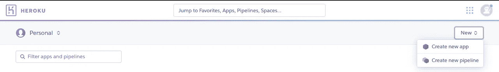
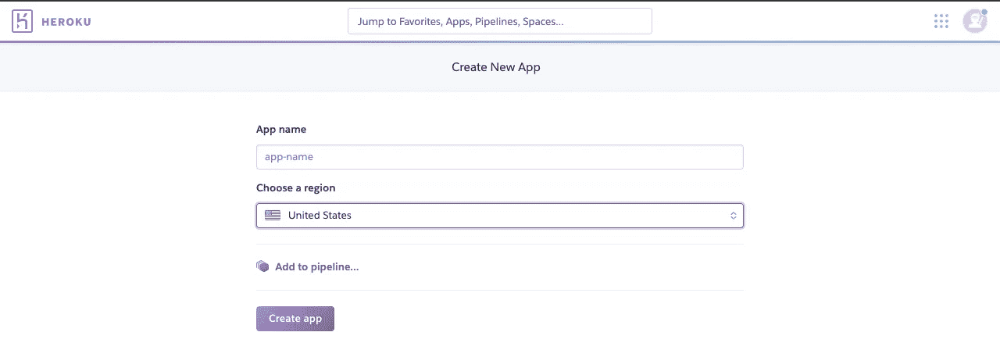
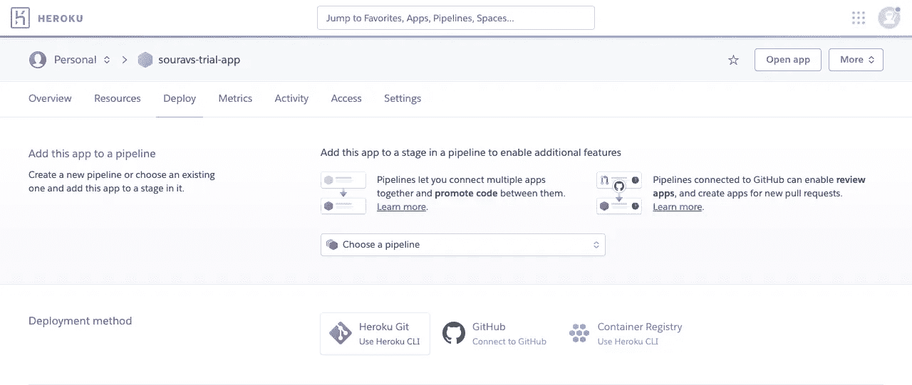

# 用 Python、Github 和 Heroku 在 Telegram 中设计上下文聊天机器人—第 2 部分

> 原文：<https://medium.com/analytics-vidhya/designing-a-contextual-chatbot-in-telegram-with-python-github-heroku-part-2-8e444c8a8386?source=collection_archive---------28----------------------->

在[的最后一部分](/@sourav90.adhikari/designing-a-contextual-chatbot-in-telegram-with-python-github-heroku-part-1-39e24e7c7723)，我们弄清楚了如何设置编码环境，并编写了实际运行机器人逻辑的 Python 脚本。在这一部分中，我们将在 Heroku 中创建一个新的应用程序，在 Python 脚本中设置一个 webhook，并将本地 git 存储库推送到我们已经设置好的远程 git。最后，我们将设置 Heroku 应用程序来直接访问 Github 存储库并部署应用程序。


行动中的机器人

# 在 Heroku 创建新应用程序

Heroku 是作为 PaaS(平台即服务)运营的云应用平台。它使开发人员能够完全在云中构建、运行和操作应用程序。如果你没有一个免费的 Heroku 开发者帐号，你可以点击这个[链接](https://signup.heroku.com/)来创建一个。

登录您的 Heroku 帐户，您的应用仪表板将呈现在您面前。应用仪表板显示您的所有应用，并允许您管理它们。要创建新应用程序，请单击右上角的“新建”,并从下拉列表中选择“创建新应用程序”



在下一步中，输入应用程序的名称，然后单击“创建应用程序”



成功创建应用程序后，您将进入应用程序管理屏幕



此页面允许您部署应用程序、查看日志等。在其他操作中。我们稍后将回到这一页。

# **设置 webhook**

webhook 是一个 HTTP push API，用于向其他应用程序实时传送数据。这是对典型 HTTP 推送 API 的改进，因为不需要频繁推送来模拟实时感觉。Telegram bot API 提供了设置 webhook 的内置方法。

要设置 webhook，请打开编写 bot 逻辑的 python 脚本，并仅在 main 函数中添加以下代码。文件的其余部分保持原样。

## 解释附加的代码

第 6 行:将上一节中在 Heroku 中创建的应用程序的名称设置为 APPNAME 变量

第 27–30 行:通过调用`updater.start_webhook()`方法启动一个 webhook，并将参数设置为示例中所示的值

第 31 行:通过调用`updater.set.Webhook()`方法设置 webhook，并传递 Heroku 应用程序的 URL，如示例所示

第 36 行:注释掉`updater.start_polling()`方法。因为已经设置了 webhook，所以不再需要这样做

第 39 行:同样注释掉`updater.idle()`方法。

# 将代码推送到 Github 存储库

我们现在准备将我们的代码推送到 Github repo。但是需要创建前三个附加文件

*   requirements.txt:这个文件列出了 Heroku 将在其环境中安装的所有 python 包。我们已经在一个虚拟环境中工作，要创建这个文件，只需从终端键入以下命令

```
pip freeze > requirements.txt
```

*   Procfile:所有 Heroku 应用程序都包含一个 Procfile。Procfile 指定了应用程序在启动时要执行的命令。它通常遵循以下格式:

```
<process type>: <command>
```

通过运行`touch Procfile`创建 Procfile

在您的编辑器中打开这个 Procfile 并添加`web: python telegram_bot.py`

*   。gitignore:这个文件维护了一个列表，列出了所有不需要推送到 Github repo 的文件。通常，这将包含所有本地环境文件。因为我们一直在使用一个名为 venv 的 virtualenv，所以我们的文件应该会列出

```
venv/
.venv
venv.bak
```

一旦创建了这三个文件，从您的终端发出这些命令

```
git add .
git commit -m "first commit"
git push -u origin master
```

本地 git repo 中的所有文件现在都可以在远程 Github 存储库中获得。

# 在 Heroku 上部署应用程序

现在回到你的 Heroku 应用程序页面。在“**部署**选项卡下，会列出三种部署方式。我们将选择 **Github 方法**。

授予 Heroku 访问您的 Github 个人资料的必要权限。一旦设置了授权，从搜索栏中搜索您的存储库的名称，然后单击“**Connect**”。

一旦存储库连接到 Heroku 应用程序，点击'**手动部署**'部分下的'**部署分支**，指向'**主**分支。该应用程序现在将建立自己，如果所有的步骤都是正确的，你的机器人将被托管。

**请注意**访问您的应用程序 URL 将返回一个“ **404:找不到页面**”错误，但这没关系，因为脚本不一定返回任何内容。如果在启动应用程序时遇到问题，访问 URL 将显示错误消息。

所以，这个教程到此为止。编码快乐！