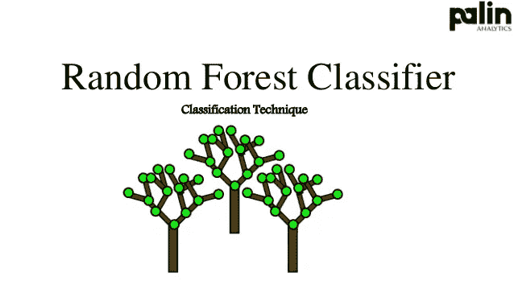
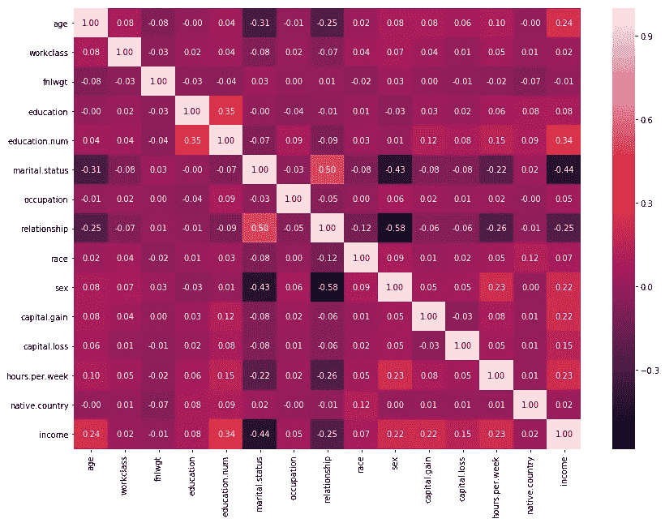
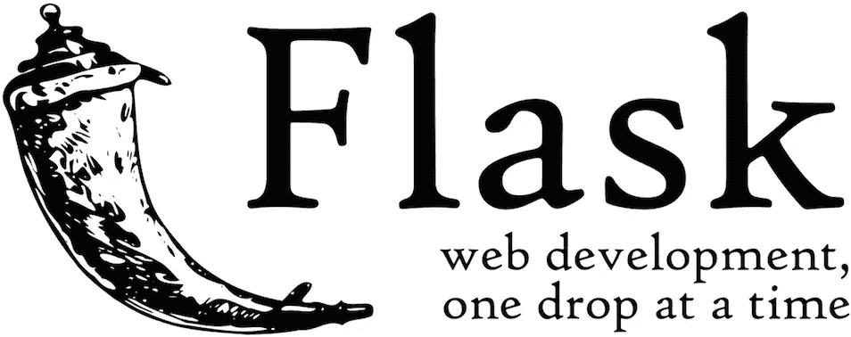

# 设计一个机器学习模型并使用 Flask 在 Heroku 上部署它

> 原文：<https://medium.com/analytics-vidhya/designing-a-machine-learning-model-and-deploying-it-using-flask-on-heroku-ac94455f38c7?source=collection_archive---------13----------------------->

模型部署和模型构建一样重要。机器学习模型在生产和消费者积极使用时也是有效的。在本文中，我将训练机器学习模型，使用 Flask 在其上创建 web 应用程序，并使用 Heroku 部署它。

随机森林是由许多决策树组成的监督机器学习算法。随机森林结合了成百上千的决策树，在样本的不同子集上训练每一个，分裂是在考虑有限特征的情况下完成的。通过平均每棵树的预测来获得最终输出。这个概念是自举。

数据集=成人人口普查收入数据集。
属性:共有 15 个属性，下面很少给出。
收入:> 50k，≤50k
年龄:连续
工作阶层:私营、自我雇佣非公司、自我雇佣公司、联邦政府、地方政府、州政府、无薪、从未工作过
fnlwgt:连续

有关属性[的详细信息，请点击此处](https://archive.ics.uci.edu/ml/datasets/adult)。

预测任务是确定一个人一年的收入是超过 50k 还是更少。

## **加载库**

## 加载数据

## 检查空值

## 看着这些数据

## 一些特征工程

## 编码数据

## 相关特征

## 移除相关特征并将数据分为训练和测试

## 拟合模型

这样我们可以达到大约 85%的准确率。我们将保存模型，以便稍后使用 python 中的 pickle 库预测我们的值。

下一步是使用 flask 创建简单的 web 应用程序。

我们将创建表单页面来收集人们的数据。该表单将包含不同的选项供每个属性选择。[此处代码](https://github.com/nidhi988/Deploying-ML-Algo-using-Flask-on-Heroku/tree/main/templates)

创建虚拟环境来运行 flask 脚本。

> *mkdir 收入
> cd 收入
> python 3-m venv venv
> #激活环境
> source venv/bin/activate*

pip 安装烧瓶

创建包含 html 文件(index.html，result.html)的文件夹“模板”。

## 烧瓶脚本

## 运行脚本

> *导出 FLASK_APP = script.py
> 运行 flask*

当提交表单时，使用我们之前创建的 model.pkl 文件预测收入值。

在创建 web app 之后，我们将使用 heroku 来部署它。

## 使用 Heroku 部署 flask 应用程序

Heroku 是一个平台即服务(PaaS ),使开发人员能够在云中构建、运行和操作应用程序。另外，我们需要在系统中安装 git 和 Heroku CLI。去 Heroku 创建你的账户。

将 gunicorn 下载到虚拟环境 venv

> *pip 安装 gunicorn*

初始化 git 存储库，如下面的命令所示。

> *$git init
> $git add。
> $ git commit-m‘初始提交’*

我们需要告诉 heroku 项目需要像 flask，gunicorn，sklearn 等库。为此，我们创建需求文本文件。

> *pip 冻结>需求. txt*

接下来，在应用程序的根目录中创建 procfile 文本文件，以明确声明应该执行什么命令来启动应用程序。

现在项目已经准备好部署了。

打开终端并执行以下命令—

> *heroku 登录*

这将需要我们之前用来创建 Heroku 帐户的登录凭证。

> *#创造英雄 ap
> 英雄创造
> 饭桶推英雄主人
> 英雄开启*

这将在 heroku 上推送整个应用程序，并在浏览器中打开 url。

**任务完成！**

希望我的文章对初学者有意义。

谢谢你