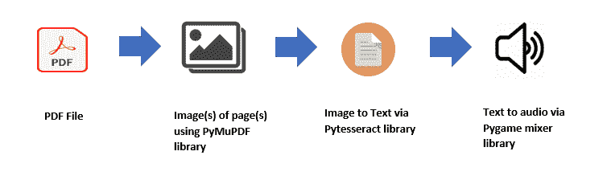

# 使用 Python 设计有声读物

> 原文：<https://medium.com/analytics-vidhya/designing-an-audiobook-using-python-cfa03b5f0759?source=collection_archive---------18----------------------->

在这个项目中，我介绍了一种简单的方法来组合不同的 Python 库，以创建有声读物，该有声读物以 PDF 文件路径作为输入，并通过音频向用户朗读 PDF 文件中的文本。Python 编程语言被用来创建这个项目。

# **简介**

阅读故事、文章或任何文本可能会很困难，但是文本的有声阅读很方便，不需要像阅读那样集中注意力。在这个项目中，我实现了一个简单的 PDF 音频转换器。此代码扫描 PDF 页面，并使用音频向用户朗读。虽然这个项目对于简单的文本阅读来说很好，但如果给它一篇带有方程的科学论文，它的表现就不好了，因为我用来将图像转换为文本的 Pytesseract OCR 库中不支持阅读方程。

# **项目流程**

以下是项目流程图:

1.  首先，我获取 PDF 文件，并使用 PyMuPDF 库将每个页面转换成图像。
2.  然后，我获取图像，并使用 Pytesseract OCR(光学字符识别)库扫描图像中的文本。
3.  然后我使用谷歌文本到语音(gTTS)库将文本转换成音频文件。
4.  最后，我得到 Pygame 混音库来播放电脑上的音频文件。

# **先决条件**

运行此代码所需的软件库可以通过以下方式安装:

1.  pip 安装枕头— — — —图像阅读器库
2.  pip 安装 PyMuPDF — —将 PDF 页面转换为图像的库
3.  图像到文本转换光学字符识别库
4.  pip 安装 py game———py game 播放音频
5.  pip 安装 gTTS — — — —谷歌的文本到语音转换库

# **工作**

以下代码显示了如何使用 PyMuPDF(以前的 Fitz)保存 PDF 页面中的图像。

以下代码显示了如何使用 Pytesseract 光学字符识别(OCR)库将图像中的文本转换为字符串。

以下要点显示了文本到语音的实现，并将其保存在计算机中。

最后我用 Pygame 库在电脑上播放转换成音频的 PDF 文本。

完整代码可以在 Github 上查看，网址为[https://Github . com/shayanalibhatti/PDF-audio book-using-Python](https://github.com/shayanalibhatti/PDF-Audiobook-using-Python)。

# **结论**

可以看出，这段代码在阅读简单的 PDF 文本文件时表现得非常好。然而，如果文本中包含复杂的数学方程，那么这个软件就不能像人一样正确地阅读这些方程。因此，这种代码对于简单的文本是好的，但是对于科学论文就不好了，因为它会笨拙地阅读复杂的方程。我希望读者会发现这个项目是有帮助的。

# 未来的工作

在这一点上，代码没有暂停或停止功能，我打算添加这些功能，并在有声读物中应用机器学习做更多更酷的事情。