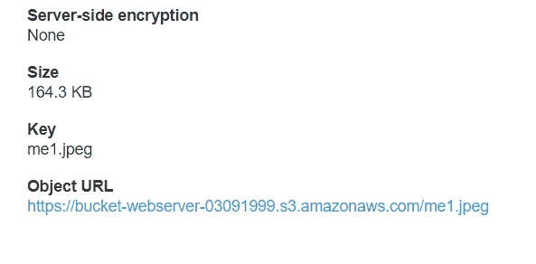

# 利用 S3 和 CloudFront 设计高可用性架构

> 原文：<https://medium.com/analytics-vidhya/designing-high-availability-architecture-with-s3-and-cloudfront-67684d6aa879?source=collection_archive---------16----------------------->

# AWS 云锋


**CloudFront** 是一个 **CDN(内容交付网络)**。它从亚马逊 S3 桶中检索数据，并将其分发到多个数据中心位置。它通过名为**边缘位置**的数据中心网络传递数据。当用户请求数据时，路由最近的边缘位置，导致最低延迟、低网络流量、快速访问数据等。

# AWS CloudFront 如何交付内容？

AWS CloudFront 通过以下步骤交付内容。

**步骤 1** 用户访问一个网站，请求下载一个像图像文件一样的对象。

**步骤 2** DNS 将您的请求路由到最近的 CloudFront edge 位置，为用户请求提供服务。

**第 3 步**在边缘位置，CloudFront 检查其缓存中所请求的文件。如果找到，则将其返回给用户，否则执行以下操作

**步骤 4** 对象现在处于边缘缓存中 24 小时或文件头中提供的持续时间。这也被称为 TTL(生存时间)

# 先决条件:

*   创建了一个 AWS 帐户。
*   安装 AWS CLI。
*   使用 IAM 用户配置 AWS CLI。

有关使用 CLI 启动 EC2 实例和附加 EBS 卷的更多信息，可以参考我的博客。

[](/analytics-vidhya/launching-ec2-instance-using-cli-and-attaching-ebs-volume-6ce00456e55d) [## 使用 CLI 启动 EC2 实例并连接 EBS 卷

### 先决条件:

medium.com](/analytics-vidhya/launching-ec2-instance-using-cli-and-attaching-ebs-volume-6ce00456e55d) 

在上面的博客中，我在 IAM 和 CloudFront 不可用的地方使用了 AWS Educate。

# 问题陈述:

*   EC2 实例上配置的 web 服务器
*   通过安装在 EBS 块设备上使文档根(/var/www/html)持久化。
*   代码中使用的静态对象，如存储在 S3 的图片
*   使用 CloudFront 建立内容交付网络，并将源域用作 S3 存储桶。
*   最后，为了安全和低延迟，将云前端 URL 放在 web 应用程序代码上。

# 启动了 EC2 实例

(参考我上面的[博客](/analytics-vidhya/launching-ec2-instance-using-cli-and-attaching-ebs-volume-6ce00456e55d?source=friends_link&sk=2f35d4841272ded769b75bb5164e2b49))


# 创建了一个 EBS 卷并连接到正在运行的 EC2 实例

(参考我上面的[博客](/analytics-vidhya/launching-ec2-instance-using-cli-and-attaching-ebs-volume-6ce00456e55d?source=friends_link&sk=2f35d4841272ded769b75bb5164e2b49))


# 登录您的 EC2 实例

*   登录到您的 root 帐户

```
sudo su - root
```

*   安装 httpd web 服务器


*   键入 fdisk -l 以检查是否添加了 2 GB 卷

```
fdisk -l
```


*   创建分区


*   格式化分区并挂载到/var/www/html 文件夹


*   现在，您可以看到在/var/www/html 上又安装了一个 2 GB 的分区


*   创建具有唯一名称的 S3 存储桶


S3·巴特创造了

*   将内容复制到 s3 存储桶，只有读取权限


me1.jpeg 成功复制了



访问图像的公共 url

*   我在文件夹/var/ww/html 里面写了一个简单的 index.html，包含一个简单的标题和图片标签


*   现在复制 EC2 实例的公共 URL 并访问 web 页面


# 现在，使用 CloudFront 建立内容交付网络，并将源域用作 S3 存储桶。

*   创建内容传递网络

```
aws cloudfront create-distribution --origin-domain-name <bucket name>.s3.amazonaws.comaws cloudfront create-distribution --origin-domain-name bucket-webserver-03091999.s3.amazonaws.com
```


*   转到 AWS 管理控制台的 CloudFront 部分，您会看到域名。


*   复制域名并替换为之前配置的 S3 存储桶 url。


*   现在再次访问图像

