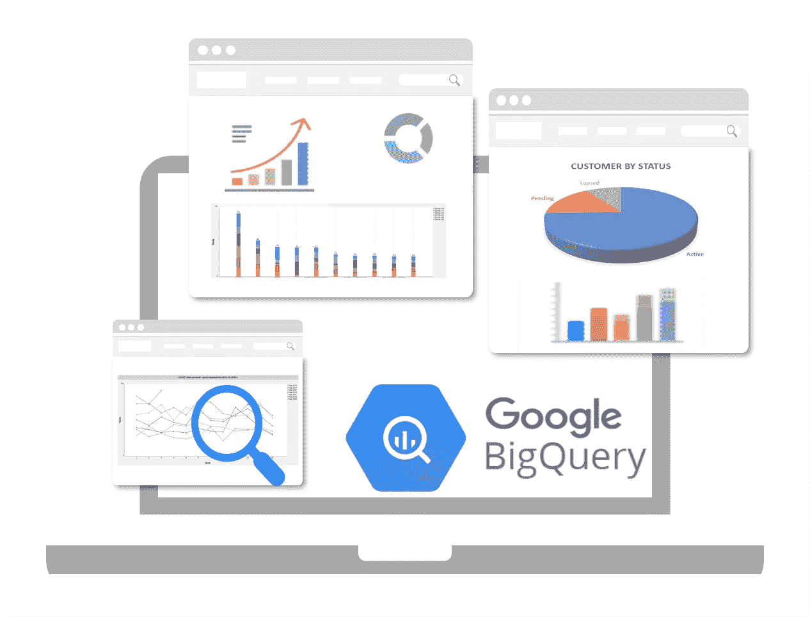
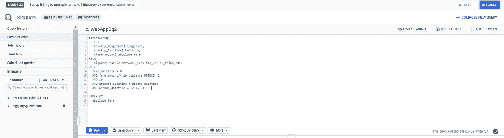
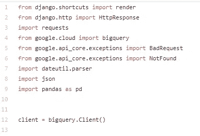
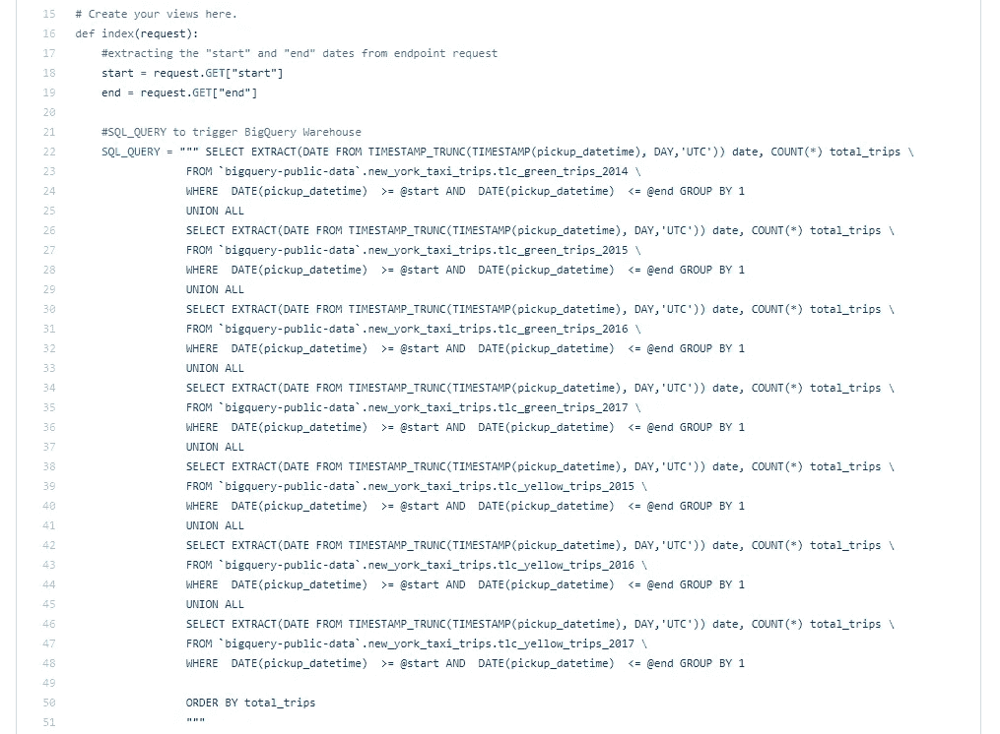
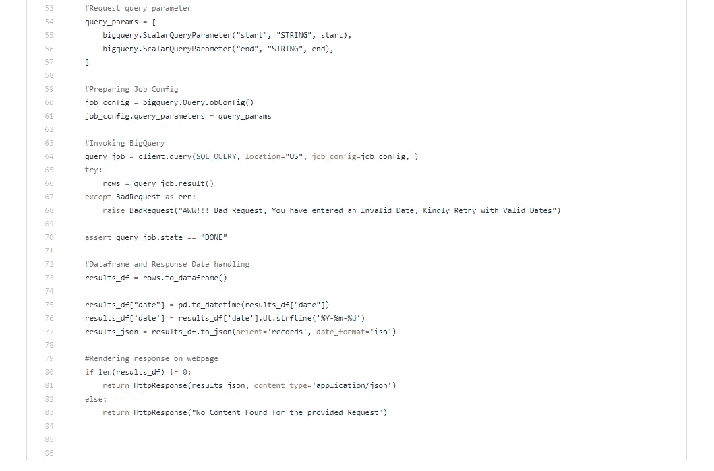

# 使用公共数据集和 BigQuery 设计 Web 服务端点

> 原文：<https://medium.com/analytics-vidhya/designing-web-service-endpoints-using-public-data-set-and-bigquery-40425cf85477?source=collection_archive---------11----------------------->

你们中的许多人都有过这样的经历:在处理海量数据集时，需要克服获得限时响应的延迟。众所周知，数据具有巨大的潜在潜力，可以为我们提供直观而有价值的见解，有助于解决业务问题。由于缺乏存储、管理、检索和处理大规模数据块的基础设施，许多这些见解无法正确提取。传统上，人们习惯于拥有内部能力，但随着数据的指数级增长，它很快就过时了。隐私问题和数据中信息的敏感性是企业屈服于数据技术新进步的主要阻碍因素。

如今，像 BigQuery 这样的时髦词正变得越来越流行，它有望解决现有数据生态系统的缺点和不足。

## **什么是 BigQuery？**

BigQuery 是 Google 的无服务器、高度可扩展的企业数据仓库，专门用于以无与伦比的性价比提高数据分析师的工作效率。因为没有需要管理的基础设施，所以您可以使用熟悉的 SQL 专注于发现有意义的见解，而不需要数据库管理员。

透视大查询

使用 BigQuery，人们可以在空前的时间内以更高的质量获得输出。为了强调其功能，我展示了一个下图，使用纽约出租车和豪华轿车服务的公共数据集，设计并集成了一个简单的基于 Django 的 Web 服务端点。

**注**:点击[这里](https://console.cloud.google.com/marketplace/details/city-of-new-york/nyc-tlc-trips)链接到纽约市的出租车和豪华轿车出行数据集。

## **设计动机**

Django 是一个最流行的基于 python 的 web 设计框架，可以轻松地连接后端和前端接口。它是免费的、开源的、快速的、完全加载的、安全的、可扩展的和通用的。

该框架主要由 MVC(模型视图控制器)驱动，MVC 是一种架构范式，允许程序员将 web 应用程序的用户界面(UI)和业务逻辑层分开。这种方法进一步帮助程序员简化和加速大型 web 应用程序的开发。

BigQuery 在这里作为基于 REST API 的服务引入和接口，使用标准 SQL 命令查询纽约市的海量数据集。Google 还提供了一个交互式 UI 来测试和管理云上的海量数据查询。这对于在生产部署之前随时测试查询很有帮助。

典型的 BigQuery UI

## **开始使用 NYC 的数据集和 BigQuery**

体验 BigQuery 的最佳方式是用一个新的空白项目创建一个 Google Cloud 的自由层帐户。可以从下面的说明中复制进一步的步骤，以便于理解。

1)因为我已经使用 Google BigQuery 的 python 客户端对 BigQuery 进行了免费层访问，所以必须有一个带有 json 凭证文件的 Google 服务帐户来验证从客户端到 BigQuery 服务器的连接。

2)这个 json 凭证文件对于运行已部署项目的任何 Linux 生产服务器都很重要，必须将其设置为正在使用的操作系统的环境变量。

json 凭证文件可以使用这里提到的[步骤](https://cloud.google.com/docs/authentication/getting-started)获得。

4)在此之后，您应该可以很好地开始了解项目的运行环境。您可以通过浏览到项目文件夹中的“ *manage.py* ”文件的目录，在生产中启动 Django 服务器，并根据需要运行以下命令来运行具有本地主机绑定的服务器。

*>>$ python manage . py runserver*

**注意**:完整的 GitHub 托管项目可以在这里[访问。](https://github.com/Shashank545/Gojek_Assignment_2019/blob/master/Gojek_Assignment/total_trips/views.py)

## **查询 BigQuery**

一旦基础设施就绪，您就可以开始在 Django 内部编写简单到复杂的标准 SQL 查询命令，以使用 breeze 对数据运行各种假设测试或数据分析。这里需要注意查询结果的响应时间和处理的数量。几秒钟内就可以处理数 TB 的数据，这是一个惊人的数字。为简单起见，我将使用以下列举的步骤分析两个用户定义的日期之间的总出租车行程。

步骤 1:导入所需的库

步骤 2:执行 SQL 命令从 BigQuery 检索数据

步骤 3:使用 BigQuery 的 python 客户端

## **结论**

如果您一直在密切关注，您现在应该会发现自己处于一个有利的位置，可以利用 BigQuery 的巨大潜力来满足您自己的定制应用程序需求。我在这里只是举例说明了 Web 服务，但是 BigQuery 可以很容易地集成到各种基于数据处理和数据分析的任务中。机器学习和数据科学从业者也经常使用它来节省他们的宝贵时间和精力，从数周到数小时，从而避免了这一磨难。

我坚信我已经触动了数据分析师、数据科学家和数据工程师的好奇心。自己试试，分享一下学习心得。