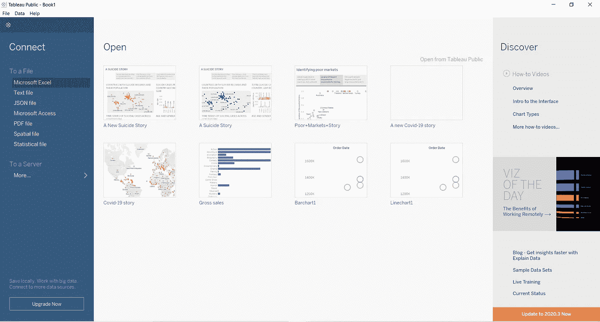
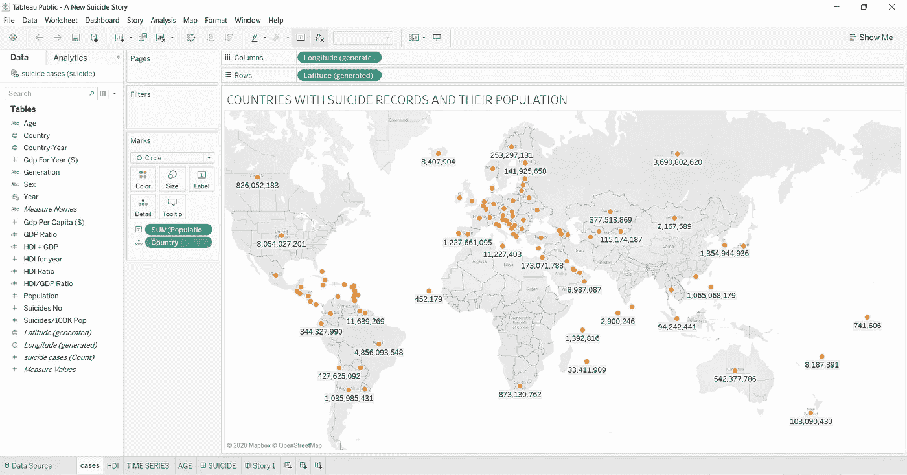
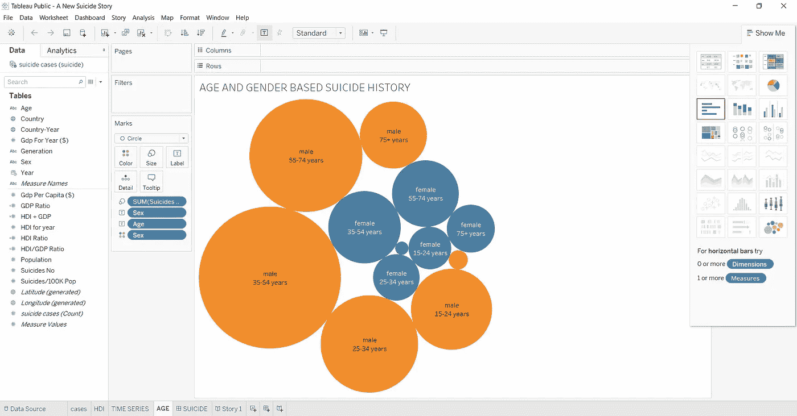
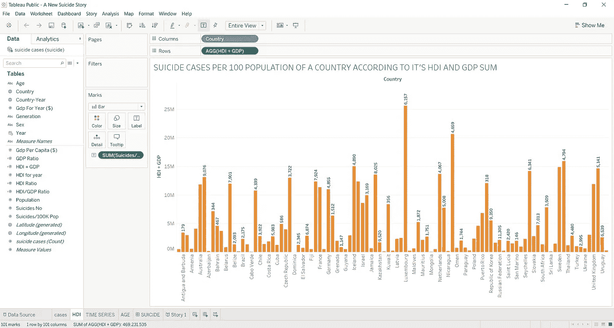
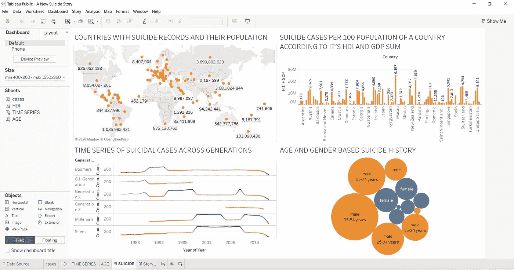

# 自杀率的详细分析

> 原文：<https://medium.com/analytics-vidhya/detailed-analysis-of-suicide-rates-1da117b3e985?source=collection_archive---------13----------------------->

该分析基于 1987 年至 2014 年间的自杀死亡记录。使用 Tableau 绘制见解。

[Eva Blue](https://unsplash.com/@evablue?utm_source=medium&utm_medium=referral) 在 [Unsplash](https://unsplash.com?utm_source=medium&utm_medium=referral) 上的照片

我将解释如何绘制一个交互式仪表板，并使用仪表板旁边的每一张数据来讲述一个故事。但是首先，下载画面[在这里](https://www.tableau.com/products/desktop/download)和阅读自杀的故事从我的个人资料[在这里。](https://public.tableau.com/profile/lois.choji#!/vizhome/ANewSuicideStory/Story1?publish=yes)

**根据世界卫生组织:**

*   欧洲是世界上自杀率最高的国家，而地中海是最少的。
*   男性自杀率高于女性。它是双倍的。
*   每年有近 80 万人死于自杀。
*   摄入杀虫剂、绞刑和枪支、毒品是每年自杀的最常见原因。

Tableau 的主页

这是 Tableau 下载后的样子。我使用的数据集是一个 excel 数据集，Tableau 提供了可用数据类型的选项。我使用 Tableau public，选项有限。**打开**包含仪表板和发布的故事，可以很容易地用 Tableau 打开。你的可能会不同，但不要担心。

显示有自杀记录的国家人口的地图

上图是一张包含地图的表格，使用**演示**下拉菜单或双击表格左侧的国家表格可以轻松创建地图。每当我与国家打交道时，我倾向于用地图来展示它们，因为这样更容易形象化。在其他标签上显示人口；

*   我只需将人口表拖到标签上。
*   在“标记”选项卡中，圆形选项更可取。
*   从橙色选项卡中选择橙色。

## 气泡图

我用一个包装好的气泡图来显示数据。这里的橙色圆圈显示雄性集群，而蓝色圆圈显示雌性集群。

下面是要做的事情:

*   点击工具栏上的**演示**，选择打包气泡图。
*   将性别和年龄表拖到标签上。
*   从调色板中选择要使用的颜色(在本例中为橙色和蓝色)。

泡泡图

## **从气泡图可视化中获得洞察力**

自杀在男性中更为普遍，而非致命的自杀行为在女性和年轻、未婚或患有精神疾病的人群中更为普遍。事实上，在许多国家，老年人(65 岁及以上)的自杀行为是一个主要的公共卫生问题。在一个人的生命过程中，由于特定的健康状况、配偶死亡造成的孤独感、压力因素等，自杀率会增加。

年龄在 35-54 岁之间的人承担着太多的责任，工作过度，这个特殊的群体通常很沮丧。对于(15-24)岁的人来说，最常见的自杀原因是压力(包括社会压力和学业压力)。我的大学预科朋友自杀了，因为他考试不及格，无法面对他的父亲。感到孤立和疏远，特别是对于那些刚刚离开家的人来说，精神问题如抑郁、焦虑、饮食失调等是常见的原因。最后，吸毒或酗酒是青少年自杀的主要原因，这一点怎么强调也不过分。

条形图可视化

## 条形图可视化

在 Tableau 中创建条形图非常容易。右上角的**演示**选项卡提供不同种类的可视化图形。下面是要做的事情:

1.  创建一个**计算字段**，在**分析**菜单中，将 HDI 和 GDP 相加，称之为 HDI + GDP。
2.  将自杀/100k 表拖到标签选项卡上。
3.  将国家表拖到列上，将人类发展指数+国内生产总值拖到行上。

从条形图中，我们可以有把握地假设，国内生产总值(GDP)和人类发展指数(HDI)合理的国家应该记录较低的自杀死亡率，对吗？统计数据表明，生活水平低的人比生活水平高的人更容易自杀。然而，这些原因因地区或人而异，因此，反复有自杀想法(想到自杀但没有自杀)的抑郁或过度紧张的人，在神经紧张时不会想到奢侈品。

我观察到，卢森堡是欧洲的一个西北部国家，在收集数据时，其 GDP + HDI 相当合理，每 10 万人口中有 6157 例病例。俄罗斯联邦的国内生产总值和人类发展指数不如卢森堡高，但每 100，000 人中有 11，305 例病例。因此，GDP + HDI 的好坏与一个人口的自杀记录关系不大。

## 基于世代的自杀记录时间序列分析。

Tableau 平台通过内置的日期和时间功能提供全面的时间序列分析，允许您拖放以分析时间趋势，并轻松执行时间比较，如同比增长和移动平均。

**创建时序图的步骤:**

*   点击 **Show Me** 选项卡，其中包含任何时间序列的面积图、折线图等。
*   将年份表拖到列中，这样年份表就可以在 x 轴上。
*   将“生成”和“自杀案例”表一个接一个地拖动到行中，这意味着它们将显示在 y 轴上。

时间序列图

## 这几代产品的快速概述:

**G.I 世代**:世代一般定义为 1901 年至 1927 年出生的人。也被称为最伟大的一代，二战一代。

**沉默的一代**:这一代人一般被定义为 1928 年至 1945 年出生的人。

婴儿潮一代出生于 1944 年至 1964 年间。他们现在年龄在 56-76 岁之间。

X 一代:出生于 1965-1980 年之间，目前年龄在 41-55 岁之间。

千禧一代:也称为 Y 一代，出生于 1981 年至 1996 年之间。他们目前年龄在 26-40 岁之间。

**Z 世代**:Z 世代是被命名的最新一代。1995-2015 年出生。他们目前年龄在 5-25 岁之间。

**分析:**

20 世纪 90 年代初，自杀记录最多的是婴儿潮一代、美国第一代和 X 一代，分别为 256 至 300 例。另一方面，千禧一代和沉默一代的自杀死亡人数在 2000 年初至 2010 年期间有所增加，从 172 例到 352 例不等，与其他几代人相比，X 一代人的死亡人数仍然很高。请注意，X 一代在 2000 年代初才 20 多岁，他们中 90%的死亡原因是毒品。X 世代在 1995 年之前有空记录，因为他们那时还没出生。然而，在 2007 年至 2011 年期间，有记录的 172 起案件下降到 2015 年的 124 起。

# Tableau 仪表板

仪表板是多个视图的集合，用于比较各种数据。仪表板就像工作表一样，可以在工作簿的底部访问。我喜欢 Tableau 中的仪表板的地方在于，当工作表发生任何变化时，它们会自动进行修改。

**在其他创建仪表板:**

*   点击工作簿底部的**新仪表板**选项卡。
*   将 sheet 1、sheet 2、sheet 3 和 sheet 4(我命名为 mine cases、HDI、Time Series 和 Age)拖到空的仪表板上。
*   重命名仪表板(我的被重命名为自杀)
*   调整仪表板的大小以适合屏幕。
*   删除或允许标题。我去掉了这个标题，因为它会让我的作品看起来杂乱无章。

# 结论:

用 Tableau 创建仪表板有很多不同的方法。然而，为了更好地查看，我更喜欢仪表板上最多有四(4)张。我选择像蓝橙调色板的颜色，因为它们更明亮，更容易可视化。

感谢您的阅读！