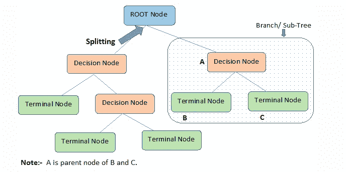
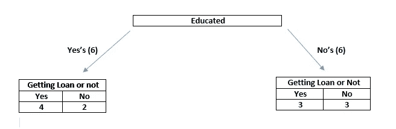

# 决策树构建背后的详细解释和数学(中等水平的学习者)

> 原文：<https://medium.com/analytics-vidhya/detailed-explanation-and-math-behind-the-building-of-decision-trees-learners-at-medium-level-2f6779a6fd3a?source=collection_archive---------26----------------------->

在进入决策树之前，您应该熟悉两件事:

1.  什么是分类？
2.  什么是回归？

为了熟悉这两件事，只需浏览一下[我以前的帖子](/@iamvishnu.varapally/a-brief-introduction-to-machine-learning-learners-at-medium-level-4a3d91200b60)。

什么是决策树？

决策树是一种受监督的机器学习算法，遵循树状结构，可用于分类和回归问题…

现在，我希望你知道决策树属于哪一类，它是什么…

决策树的结构

如上图所示，最顶层的节点是根节点。决策节点也称为内部节点或简称为“节点”。终端节点也称为叶节点。

任何决策树都将基于 ID3 算法构建。根据这个算法，任何决策树的建立都是基于熵的减少和信息增益的增加(我会解释它是什么)。

但是在这里，我不是从信息增益的角度(用人工智能的公式)来解释，也不是从 CHAID 树的角度来解释(关于 CHAID 树的更多细节，可以通过[这个东西](https://sefiks.com/2020/03/18/a-step-by-step-chaid-decision-tree-example/))。

注意:——从这里开始，实际的事情就要开始了。把一张纸放在一边，按照我解释的每一步，把它写在纸上。如果不是，那么你从这篇文章中得不到任何用处。彻底遵循每一个步骤，不要错过任何东西。我再说一次，如果你只是在纸上算出来，你会得到这个决策树。在这篇文章中，我只做了少量的数学计算，我把大量的数学实现留给你在纸上完成。当你解数学题时要集中注意力。

现在让我们开始实施:

这里，我将用一个例子来解释它，让我们考虑有 4 个分类特征(我解释这个只是为了让你理解这个概念，这就是为什么我只考虑容易理解的分类特征。然而，在现实世界中，您不会遇到只有分类要素的数据集。因此，我将在以后的文章中解释如何处理混合了分类和数字特征的数据集，它可以预测一个人是否能获得银行贷款。

让我们来看一些特征，比如受教育程度、性别、已婚、个体经营…

所以为了理解，只要记住这些事情:

**信息增益:-** 信息增益对于一个特性来说应该是很高的，以便在构建决策树时保持它在节点的顶部。

所以为了实现，让我们考虑一下-

1.  受过教育(班级是，否)
2.  已婚(班级分为是、否)
3.  自由职业者(课程分为是、否)
4.  性别(班级为男性、女性)
5.  将获得贷款与否(类是，否)(**我们的输出**)

现在从训练数据中，对特征的每个特征类(是(或)否，男性(或)女性)进行划分，多少人将获得贷款，多少人没有获得贷款。

**举例** :-

想想看，受过教育有六个是和六个不是。对于受过教育的人来说，有 6 个“是”,考虑一下获得贷款的人有 4 个“是”和 2 个“否”。对于受过教育的人来说，有 6 个“否”,考虑一下获得贷款的人有 3 个“是”和 3 个“否”。

像这样

像这样，划分每一个特征(受教育、已婚、自营职业、性别),也划分与所选特征(受教育、已婚、自营职业、性别)相关的产出(是否获得贷款)。

当我们这样做时，我们将得到 4 个东西(受教育的输出、结婚的输出、自雇的输出、性别的输出)，即每个特征的分离，以及关于特征的输出。

现在，我们需要判断在上述 4 件事情中，哪个特征将是最佳特征，对于该最佳特征，信息增益将非常高(熵将非常低)。

这里要测量的是**杂质**。

因此，为了判断这些事情，我们有 3 个衡量标准:

1.  基尼系数。
2.  熵。
3.  卡方检验。(它用于 CHAID 决策树)

在这里，我们将使用一种流行的衡量标准来衡量，即**基尼**

让我们将下面的公式应用于两片树叶的**受教育输出**图..

基尼杂质公式为= 1 -(是'的概率)(否'的概率)。

在这里，你知道**是**和**否**属于贷款与否。

所以，如果我们计算:

对于左边的叶子，

基尼= 1(4/(4+2))——(2/(4+2))

也为右叶计算..

现在，计算两片叶子杂质的加权平均值

W.A = (yes 的/ (yes 的+ no 的))*(左叶的杂质)+ (no 的/ (yes 的+ no 的))*(右叶的杂质)

所以你会得到教育产出的 W.A 值。

对其余的线对也执行相同的步骤(先执行)。

对于哪一对杂质将是低的(信息增益是高的)，这是构建决策树的根节点。

让我们想象一下，你受过教育，但产出比其他人低。

现在，构建决策树的根节点已经完成

你知道受过教育一栏有 6 个是和 6 个不是

这意味着在构建决策树时，左叶(是)有 6 个，右叶(否)有 6 个。

从进行配对(受教育输出、结婚输出、自雇输出、性别输出)到此，对根节点(受教育)的左右叶的剩余配对进行相同的上述程序，直到与分割后的杂质相比，杂质较低…

这是构建决策树的过程。

决策树的代码片段:-

正如引言中所说，决策树既可以作为分类器，也可以作为回归器。我给出了如何在训练和测试数据上应用决策树的代码片段。

**对于分类** :-
从 sklearn.tree 导入决策树分类器
分类器=决策树分类器()
分类器. fit(X_train，Y_train)
y_pred =分类.预测(X_test)

**For Regression**:-
from sk learn . tree import DecisionTreeRegressor
regressor = DecisionTreeRegressor()
regressor . fit(X _ train，y _ train)
y _ pred = class ification . predict(X _ test)

我希望你理解了构建决策树的核心概念。

我将在以后的文章中解释混合了**分类**和**数字**特征的决策树的应用。

__________________________________________________________________

快乐阅读！✌✌