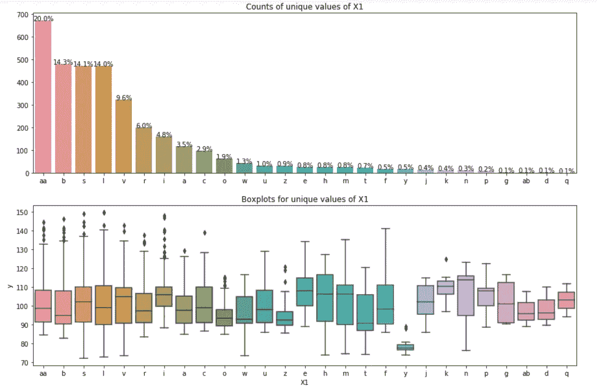

# 卡格尔奔驰绿色制造竞赛的详细解决方案

> 原文：<https://medium.com/analytics-vidhya/detailed-solution-to-mercedes-benz-green-manufacturing-competition-on-kaggle-7b85c84a3ff5?source=collection_archive---------15----------------------->

# **目录:**

1.  商业问题
2.  问题陈述
3.  数据准备
4.  探索性数据分析
5.  特征工程
6.  数据预处理
7.  特征选择
8.  建模
9.  摘要
10.  测试数据预测
11.  结论和未来工作
12.  参考

# **1。业务问题:**

车辆测试是汽车制造过程中的一个重要方面。每辆车在交付给客户之前都必须通过一定的标准。梅赛德斯·奔驰提供各种各样的定制车辆。每辆车都必须经过测试，以确保车辆满足安全要求和排放标准。由于定制的原因，每个型号需要不同的试验台配置。由于型号较多，需要进行大量的试验。更多的测试导致在测试台上花费更多的时间，增加了梅赛德斯-奔驰的成本，并产生更多的二氧化碳(温室污染气体)。

在 Kaggle 上举办的梅赛德斯-奔驰绿色制造竞赛旨在通过开发一种机器学习模型来优化车辆测试过程，该模型可以预测车辆在测试台上花费的时间。最终目标是减少花费在测试台上的时间，从而减少测试阶段的二氧化碳排放。这项研究的数据集是由奔驰公司提供的。数据可以从这个[链接](https://www.kaggle.com/c/mercedes-benz-greener-manufacturing/data)下载。

# **2。问题陈述:**

任务是开发一个机器学习模型，可以根据车辆配置预测汽车在测试台上花费的时间。车辆配置被定义为为特定车辆选择的一组定制选项和特征。问题背后的动机是，一个准确的模型将能够通过允许具有相似测试配置的汽车连续运行来减少测试车辆所花费的总时间。这个问题是一个有监督的机器学习回归任务，因为它涉及到通过对有标签的训练数据进行学习来基于一组独立变量预测连续的目标变量。

评估度量是 R 平方，也称为决定系数。它量化了由特征解释的目标变量的变化百分比。r 平方值可以介于 0 和 1 之间。R 平方的最佳可能值为 1，表示目标变量的所有变化都可以由输入要素来解释。

# **3。数据准备:**

梅赛德斯-奔驰为此比赛提供了两个数据集，即 train.csv 和 test.csv。文件 train.csv 是机器学习模型必须在其上开发的标记数据集。test.csv 文件是进行预测的数据集。训练和测试数据都包含 377 个特征，这些特征代表了车辆测试阶段的车辆配置。这些特征有诸如“X0”、“X1”、“X2”等名称。有一个特征“ID ”,代表分配给每个车辆试验的 ID。这些特征是匿名的，没有任何物理表示。数据描述表明，这些功能是配置选项，如悬架设置、自适应巡航控制、全轮驱动和许多不同的选项，它们共同定义了一个汽车模型。下图显示了训练数据的子集。

```
#Load dataset
data = pd.read_csv('train.csv')
data.head()
```


有 377 个特征，其中 368 个是二元的，8 个是分类的，1 个是连续的。目标变量 y 是连续值，代表车辆进行试验所用的时间，单位为秒。数据集中不存在缺失值。train.csv 文件分为训练集和验证集。下图显示了该操作的代码。

```
#Separate the dependent and independent features
X = data.drop(columns=['y'])
Y = data['y']#Split the dataset
X_train, X_val, y_train, y_val = train_test_split(X, Y, 
test_size=0.2, random_state=25)#Concatenate X_train and y_train
train_data = pd.merge(X_train,y_train.to_frame(),left_index=True, right_index=True)
train_data.head()
```


对上述代码中提到的 train_data 执行探索性数据分析(EDA)。

# **4。探索性数据分析:**

**4.1。分析目标/因变量:**

下图包含目标变量的直方图和箱线图。


目标变量的平均值为 100 秒。目标值高于 137.5 的点可以从箱线图中推断为异常点。对于这个比赛，高于 150 的点被分类为异常点，并且它们被从训练集中移除。

**4.2。分析分类变量:**

有 8 个分类特征，即 X0、X1、X2、X3、X4、X5、X6 和 X8。对于这些特征中的每一个，绘制了唯一值的计数直方图和唯一值的箱线图。

4.2.1。X0 特性:


从上述图中观察到:

1.  aa，ab，g 和 ac 只出现一次。
2.  z、y、t、o、f、n、s、al、m、ai、e、ba、aq、am、u、I、ad 和 b 的箱线图几乎相同。这些类别的平均值接近 93。
3.  ak、x、j、w、af、at、a、ax、I、au、as、r 和 c 的箱线图几乎相同。这些类别平均值接近 110。
4.  因此，在 X0 的不同类别之间似乎存在分组。

**4.2.2。X1 功能:**



从上述图中观察到:

1.  X1 的大多数类别的平均值为 100。
2.  X1 类别的 y 与其他类别明显分开。

**4.2.3。X2 专题:**


从上述图中观察到:

1.  ae 类别在 X2 占据主导地位。39%的 X2 值为 ae。
2.  与 X0 相似，X2 似乎也有分组。X2 的分组比 X0 少。
3.  X2 的大多数类别的平均值接近 97。

**4.2.4。X3 专题:**


从上述图中观察到:

1.  c 类在 X3 占主导地位。X3 46%的值是 c
2.  几乎所有 X3 的分类都有 100 的平均值。
3.  在 X3 的各个类别中，因变量 y 的变化似乎较小。X3 的大多数类别的箱线图是匹配的。

4.2.5。X4 特性:


从上述图中观察到:

1.  X4 中 d 品类占主导地位。X4 的 99.9%的值是 d。
2.  必须删除此功能，因为该功能中不存在差异。

**4.2.6。X5 特性:**


从上述图中观察到:

1.  x，h，g，y 和 u 在数据中很少出现。
2.  X5 所有类别的平均值接近 98。
3.  在 X5 的类别中，因变量 y 的变化似乎较小。X5 的大多数类别的箱线图是匹配的。

**4.2.7。X6 特性:**


从上述图中观察到:

1.  j、g、d 和 I 的箱线图相互匹配。
2.  X6 的大多数类别的平均值在 100 左右。
3.  在 X6 的类别中，因变量 y 的变化似乎较小。X6 的大多数类别的箱线图是匹配的。

4.2.8。X8 特性:


从上述图中观察到:

1.  X8 的大多数类别的平均值接近 100。
2.  在 X8 的类别中，因变量 y 的变化似乎较小。X8 的大多数类别的箱线图是匹配的。

**分类特征总结:**

具有 X3、X5、X6、X8，并且在一定程度上 X1 显示了在不同级别中非常相似的分布。

**4.3。分析二进制变量:**

下图显示了每个二元特征中零的百分比。


99%的值为 0 或 1 的二进制特征在建立任何机器学习模型时都没有多大用处。因此，这些要素将从数据集中删除。在训练集中，有 146 个这样的二元特征。

在这些二元特征中，某些特征是重复的。为所有特征绘制相关矩阵。相关系数大于 99%的要素将从数据集中删除。在训练集中，识别了 27 个这样的特征。

移除冗余和重复特征后，二进制特征的数量为 195(368–146–27)。

**4.4。分析“ID”特征:**

下图是 ID 特征的 Reg-plot。


y 是上图中的目标变量。y 相对于 ID 略微减小。因此，ID 在估计目标变量时是一个有用的特征。

**5。特征工程:**

特征工程是建立机器学习模型之前的主要步骤之一。在此步骤中，从现有特征设计特征。在此竞赛中，数据集中的二元特征用于设计合成特征。创建新功能有两种方式，如下所示。

1.  每个二元特征被添加到剩余的二元特征之一。将发展的特征和目标变量之间的相关性与阈值进行比较。如果相关系数大于阈值，则开发的特征包括在数据集中。本次比赛选择的阈值为 0.65。下面是这个过程的代码。

因为有 195 个二元特征，所以对于每个二元特征，将有 194 个合成特征。在这 194 个特征中，挑选相关系数(目标变量和合成特征之间)大于 0.65 的特征。运行上述代码后获得的特征数是 5。

2.每个二元特征被添加到剩余的两个二元特征中。将发展的特征和目标变量之间的相关性与阈值进行比较。如果相关系数大于阈值，则开发的特征包括在数据集中。本次比赛选择的阈值为 0.65。下面是这个过程的代码。

运行上述代码后获得的特征数是 354。

因此，从以上两个步骤获得的总特征是 359。在这 359 个特征中，某些特征是重复的。识别并移除 45 个重复特征。因此，从特征工程获得的总特征是 314。

# **6。数据预处理:**

**6.1。分类特征的标签编码:**

在标签编码中，特定特征的每个唯一类别被分配一个编号。对于本次竞赛，出现次数少于或等于 5 次的类别将被忽略。为每个分类特征创建一个以关键字为类别、以值为标签的字典。标签从 1 开始分配。为字典中不存在的类别分配了 0 标签。

**6.2。归一化非二进制特征**

为了确保所有特征都在相同的范围内，所有非二进制特征都被归一化为具有 0 和 1 之间的值。非二进制特征包括 ID、X0、X1、X2、X3、X5、X6 和 X8。

**7。功能选择:**

经过 EDA、特征工程和数据预处理后，训练集中的特征数为 517。特征的数量很大。如果所有的特征都作为任何机器学习模型的输入，那么很有可能会遇到维数灾难。模型的训练时间随着特征数量的增加和模型复杂度的增加而增加。

为了克服上述障碍，可以进行特征选择以挑选出那些在它们之间具有高度可变性并且在预测目标变量中有用的特征。随机森林算法用于特征选择。随机森林回归算法在所有 517 个特征上被训练。该模型也被调整以获得最佳的超参数集。下表列出了最佳超参数集的值。


随机森林回归器的 sklearn 实现有一个获取特征重要性的方法。下面是具有相对重要性的前 10 项功能的条形图。


前 10 个特征主要包括在特征工程过程中创建的合成特征。X119、X232 和 ID 是已经存在的特征。该模型针对不同的算法在前 10 个或 20 个特征上进行训练，这确保避免了维数灾难问题，并且时间复杂度显著降低。

# **8。造型:**

该模型基于不同的算法进行训练，即线性回归、支持向量机(SVM)、k-最近邻(k-NN)、决策树、随机森林、XGBoost、多层感知器(深度学习)和各种形式的堆叠。对于每个算法，都要进行超参数调整，以获得最佳的超参数集。

**8.1。线性回归:**

sklearn 的 SGDRegressor 类用于训练线性回归模型。下表列出了线性回归的最佳超参数集。


获得的性能指标如下:


**8.2。支持向量机:**

8.2.1。线性 SVM:

sklearn 的 LinearSVR 类用于训练线性 SVM 模型。下表列出了该模型的最佳超参数集。


获得的性能指标如下:


**8.2.2。内核 SVM:**

sklearn 的 SVR 类用于训练核 SVM 模型。使用的核是径向基函数(RBF)。

RBF 核定义如下:


下表列出了该模型的最佳超参数集。


获得的性能指标如下:


**8.3。k-最近邻:**

sklearn 的 KNeighborsRegressor 类用于训练 k-NN 模型。下表列出了该模型的最佳超参数集。


获得的性能指标如下:


**8.4。决策树:**

sklearn 的 DecisionTreeRegressor 类用于训练决策树模型。下表列出了该模型的最佳超参数集。


获得的性能指标如下:


**8.5。随机森林:**

sklearn 的 RandomForestRegressor 类用于训练随机森林模型。下表列出了该模型的最佳超参数集。


获得的性能指标如下:


**8.6。XGBoost:**

xgboost 库的 XGBRegressor 类用于训练 XGBoost 模型。下表列出了该模型的最佳超参数集。


获得的性能指标如下:


**8.7。多层感知器(MLP):**

该模型考虑了从特征选择中获得的前 8 个特征。该模型由输入层、输出层和 5 个隐含层组成。模型架构如下图所示。


模型总结如下:


MLP 模型是使用 Keras 库构建的。获得的性能指标如下:


**8.8。堆叠:**

Ensemble 是一种机器学习模型，它结合了在同一训练数据集上训练的两个或更多模型的预测。堆叠是一种集成学习技术，它通过元分类器或元回归器将多个分类或回归模型(称为基础模型)结合起来。基础模型在完整的训练集上被训练，然后元模型在这些基础模型的输出上被训练。

所采用的不同种类的堆叠是用 k-fold 交叉验证的堆叠、用 StackingCVRegressor 的堆叠和用整体装袋的堆叠。

**8.8.1。k 重交叉验证叠加:**

k 重交叉验证技术包括将训练数据集分成 k 组，然后在维持集或测试集上使用 k 组示例中的每一组，而剩余的示例用作训练集。这意味着 k 个不同的模型被训练和评估。训练数据集中的每个样本都被分配到一个单独的组中，并一直留在该组中，直到模型被训练好。因此，训练数据集中的每个样本在维持集中出现一次，在训练集中出现 k-1 次。

出折叠(OOF)预测是在 k 折叠交叉验证过程中对维持集进行的预测。聚集的 OOF 预测提供了有关模型在不用于训练模型时如何对训练数据集中的每个示例执行的信息。

对每个基础模型执行 k 倍交叉验证过程，并且收集所有 OOF 预测。对于每个模型，将训练数据同样分割成 k 个折叠。因此，对于每个基本模型，训练数据集中的每个示例都有预测。(这些预测是从 k 重交叉验证技术中的维持集获得的)

k 重交叉验证堆叠中使用的程序可总结如下:

1.整个数据集(train.csv)分为训练数据集和验证数据集。

2.对于每个基本型号:

a.对训练数据集进行 k 重交叉验证。

b.收集每个维持集的 OOF 预测。这些预测被用作训练元模型的输入特征。

c.对在 k 重交叉验证期间训练的每个 k 模型的验证数据集进行预测。因此，验证数据集有 k 个预测。这 k 个预测的平均值作为验证数据集的输出。

3.元模型是根据基础模型的预测来训练的。元模型的特征数量等于基础模型的数量。

上述过程如下图所示。


下表列出了本次比赛中使用的模型。


获得的性能指标如下:


**8.8.2。使用 StackingCVRegressor 进行堆叠:**

mlxtend 库的 StackingCVRegressor 类实现了 k 重交叉验证的堆叠。StackingCVRegressor 可以与 sklearn 库的 GridSearchCV 结合使用，用于调优基模型和元模型的超参数。

下图显示了 StackingCVRegressor 的流程图。


图片来源:[http://rasbt . github . io/mlx tend/user _ guide/regressor/StackingCVRegressor/](http://rasbt.github.io/mlxtend/user_guide/regressor/StackingCVRegressor/)

数据集被分成 k 倍。在 k 个连续回合中，k-1 个折叠用于拟合第一级回归量，剩余的 1 个折叠用于进行预测。然后，预测值被叠加，并作为输入输入到二级回归变量，称为元回归变量。元回归模型被训练并用于生成最终预测。

下表列出了本次比赛中使用的模型。使用 GridSearchCV 对基本模型和元模型的 max_depth 参数和 XGBoost 进行了超调优。


获得的性能指标如下:


**8.8.3。使用集合打包或自举聚合的堆叠:**

这种建模方法与使用 k-fold 交叉验证的叠加非常相似，只是稍有修改。在堆叠 k 重交叉验证的情况下，完整的训练数据用于 k 重交叉验证。在使用集合装袋进行堆叠的情况下，仅提供一个数据样本进行 k 倍交叉验证。对于这个比赛，90%的训练数据被取样并提供给交叉验证。

整体装袋堆垛中使用的程序可总结如下:

1.整个数据集(train.csv)分为训练数据集和验证数据集。

2.对于每个基本型号:

a.从训练数据集中抽取 90%的数据。对采样的训练数据集进行 k 重交叉验证。未被采样的数据被称为样本外数据集。

b.收集每个维持集的 OOF 预测。在 k 重交叉验证期间，对每个 k 模型的样本外数据集进行预测。因此，样本外数据集有 k 个预测。这 k 个预测的平均值作为样本外数据集的输出。聚集的 OOF 预测和样本外数据集的输出一起用作训练元模型的输入特征。

c.对在 k 重交叉验证期间训练的每个 k 模型的验证数据集进行预测。因此，验证数据集有 k 个预测。这 k 个预测的平均值作为验证数据集的输出。

3.元模型是根据基础模型的预测来训练的。元模型的特征数量等于基础模型的数量。

上述过程如下图所示。


下表列出了本次比赛中使用的模型。


验证 R 平方小于 0.595 的基本模型将被删除。然后，元模型根据剩余基础模型的预测进行拟合。

获得的性能指标如下:


**9。概要:**

不同算法的验证 R 平方值总结如下。


**10。测试数据预测:**

test.csv 文件提供了预测所需的数据。线性回归和线性 SVM 的验证 R 平方远低于其他模型。因此，在对试验数据进行预测时，这些模型被忽略。

当堆叠模型与集合装袋一起使用时，观察到测试数据的最佳得分。在进行预测时，考虑了除 MLP 以外的所有基础模型的平均值。下面是 Kaggle 评分截图。


**11。结论和未来工作:**

考虑到除 MLP 之外的所有模型的平均值，用系综打包获得的堆积模型的私人得分是 0.55246。在 Jupyter 笔记本上写的全部代码可在[这里](https://github.com/NitishVSawant/Mercedes-Benz-Green-Manufacturing)获得。

为改进该解决方案，可以做出如下改进:

1.  对分类变量使用不同种类的编码
2.  增加堆叠中基本型号的数量
3.  CNN-LSTM 模型的使用
4.  使用特征工程开发新特征

**12。参考文献:**

1.[https://www . ka ggle . com/sudalairajkumar/simple-exploration-notebook-Mercedes](https://www.kaggle.com/sudalairajkumar/simple-exploration-notebook-mercedes)

2.[https://www . ka ggle . com/deads kull 7/78 th-place-solution-private-l b-0-55282-top-2](https://www.kaggle.com/deadskull7/78th-place-solution-private-lb-0-55282-top-2)

3.[https://www.kaggle.com/umbertogriffo/deep-learning](https://www.kaggle.com/umbertogriffo/deep-learning)

4.[https://www . ka ggle . com/eike dehling/stack-of-SVM-elastic net-xgboost-RF-0-55](https://www.kaggle.com/eikedehling/stack-of-svm-elasticnet-xgboost-rf-0-55)

5.[https://www.appliedaicourse.com/](https://www.appliedaicourse.com/)

6。https://machinelingmastery . com/out-of-fold-predictions-in-machine-learning/

7 .[。https://www . analyticsvidhya . com/blog/2016/03/complete-guide-parameter-tuning-xgboost-with-codes-python/](https://www.analyticsvidhya.com/blog/2016/03/complete-guide-parameter-tuning-xgboost-with-codes-python/)

领英简介:【https://www.linkedin.com/in/nitish-sawant-a991b8154/ 

电子邮件:menitishsawant@gmail.com