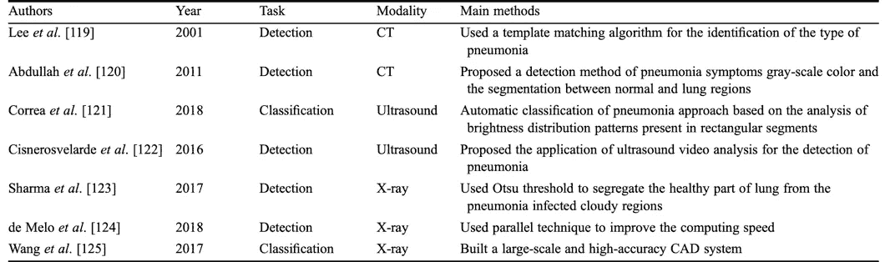

# 用深度学习检测新冠肺炎——肺部医学影像深度学习综述

> 原文：<https://medium.com/analytics-vidhya/detect-covid-19-with-deep-learning-a-survey-on-deep-learning-for-pulmonary-medical-imaging-4cc1c63b6d6a?source=collection_archive---------24----------------------->

谁知道深度学习在全球危机期间会对我们如此有用？

目前还没有针对 2019 年新型冠状病毒(新冠肺炎)的疫苗或任何有效的治疗方法，但生殖深度学习正在通过胸部 [CT](https://www.ncbi.nlm.nih.gov/pmc/articles/PMC7187882/) [筛查](https://pubs.rsna.org/doi/10.1148/radiol.2020200905)帮助检测和监测冠状病毒患者。

[使用 Grad-CAM 方法生成的热图](https://pubs.rsna.org/doi/10.1148/radiol.2020200905)

看看这个由 Daksh Trehan 撰写的很酷的实用指南，使用 CNN 的[https://towards data science . com/detecting-新冠肺炎-using-deep-learning-262956 b6f 981](https://towardsdatascience.com/detecting-covid-19-using-deep-learning-262956b6f981)

现代生活方式的改变、污染和全球变暖引发了许多其他威胁生命的呼吸系统疾病。然而，这种疾病的早期临床表现并不明显，并且在它们的早期阶段不会表现出任何迹象，并且许多人错过了早期治疗的这一时期，并且只有当它变得严重时才意识到。因此，肺部疾病的早期发现和预防性治疗非常重要。

深度学习已经在图像、自然语言处理和增强现实等几个领域展示了有前途的方法。深度学习还被广泛用于通过改进的医学成像进行疾病筛查和诊断。

这项由 [Jiechao 等人在 2019 年](https://link.springer.com/content/pdf/10.1007/s11684-019-0726-4.pdf)完成的调查，阐述了用于检测各种肺部疾病、肺癌、肺炎、结核病的最先进的深度学习技术，及其对肺部医学疾病的分类、检测和分割的贡献。在本文中，我们将深入探讨深度学习的概述、深度学习在医学成像中的应用、可用于增强深度学习的现有数据集的详细回顾，以及最后的性能和挑战。

# 深度学习概述

深度学习算法倾向于从大量数据中自动学习。放射学领域是该领域的自然应用，因为它基于从图像中提取的信息提供结果。在医学影像学中，准确的诊断依赖于图像采集，其计算机辅助诊断(CAD)主要依靠医生过去的经验和知识。现在已经开发了各种技术来帮助医生和专业人员理解与这些疾病相关的特征。

1993 年，深度学习算法首次应用于医学成像，其中使用了神经网络。那时，DL 在这个领域还没有被接受，因为它需要更多的计算能力和大量的数据。

医学图像的检测标准主要包括发现可能的病变(遭受损伤的区域/器官)和肿瘤。在肺结节中检测它们具有挑战性，主要是因为它们的形状、大小和密度各不相同。其次，由于两种疾病之间相似的纹理特征。

各种病变(在绿色方框中)。

深度学习神经网络在 20 世纪 40 年代被称为控制论。Hubel 等人在 1962 年研究了大脑对图像的理解和检测。这个模型有助于理解大脑的功能。下表简要描述了网络的历史观点-

网络上的历史

# 医学图像分析中的深度学习包括 3 个主要部分-

***分类***——对疾病严重程度(正常或异常)进行分类和分期。二进制或多类。

***检测***——这是分割的一个预处理步骤。检测感兴趣区域(ROI)。

***分割***——CNN 用于分割有意义的部位、器官、亚结构、病变，并提取特征。下图是由 [Ronneberger 等人发表的 U-net](https://doi.org/10.1007/978-3-319-24574-4_28)成为医学图像分割最著名的卷积神经网络架构。左部使用卷积进行图像提取，右部进行反卷积以恢复原始图像大小。

优信网

# 医学肺部图像的深度学习

## 使用深度学习检测肺癌:

肺癌是最严重和威胁生命的癌症类型，如果肺部的肺结节被早期检测到并被正确诊断，则可以容易地预防。在本节中，我们将了解如何使用深度学习来完成肺结节的分类、检测和分割。

## 肺结节分类:

CNN 具有很强的自学习和泛化能力，因此被广泛用于结节分类任务(良性或恶性)。下面是由 [Netto 等人](https://doi.org/10.1016/j.compbiomed.2012.09.003)提出的结节图像网络结构，用于识别三种类型的结节——实性结节、半实性结节和毛玻璃样结节。在最后一步，使用 SVM 将结核分为结核和非结核。CNN 的分类网络结构如下图所示。许多伟大的研究人员使用迁移学习和 3D CNN 提出并实现了各种分类技术。

分类网络

## 肺结节检测:

研究人员主要关注结核检测的两级网络，因为高性能网络必须具有高灵敏度和高精度。下面是一个一般的检测过程和一个建议的去卷积结构，使用 R-CNN 的候选检测和 3D DCNN 的假阳性减少。

用于病变检测的管道

检测网络结构

## 肺结节分割:

上述 U-net 架构和无监督学习被广泛用于分割任务。由于分割标签难以获得，研究人员提出了一种弱监督方法来生成精确的体素水平的结节分割。

# 致命肺部疾病及其深度学习诊断

## 肺栓塞

当肺部的动脉部分或完全堵塞时，就会导致肺栓塞(PE)。每年大约有 650000 个病例发生，它是第三大威胁性疾病。医生对其诊断的传统方法是仔细追踪每一个可疑的肺动脉——这被称为 CT 肺动脉造影(CTPA)。每个图像代表肺的一个切片，很难区分并且是一项复杂的任务；因为这可能导致错误诊断和高假阳性结果。因此，计算机辅助设计来拯救，被称为神经超网络的方法被使用。为了达到更好的效果，使用了很多基于知识的混合学习算法。以下是通过深度学习解决这种疾病的既定方法

## 肺炎

这种疾病在儿童中很常见，是他们死亡的主要原因。医疗水平较低的国家和地区缺乏对这种疾病的及时诊断。这种疾病的早期发现可以挽救许多生命。胸部 x 光检查是最常用的方法；然而，这种方法很费力，并且完全依赖于专业人员的经验。由于肺炎的图像非常相似，所以对观察到的组织进行粗略估计。然而，深度学习中的许多模板匹配算法用于仔细诊断和区分这种组织。CUDA 和其他 CNN 架构已经显示出有希望的结果。以下是提出的其他著名方法-

## 肺结核

是一种通过呼吸道传播的慢性传染病。病原体“结核分枝杆菌”侵入人体，导致这种疾病。目前的诊断方法主要依赖于症状和体征、X 射线和痰(唾液或粘液)结核分枝杆菌病原体的检查。CNN 因对不同种类的图像进行精确分类而广受欢迎。很多机器学习的方法，如多示例学习结合 RNN 的 DL 架构，都取得了很好的效果。

## 间质性肺病(ILD)

这组异质性非肿瘤性和非感染性疾病是病理变化的结果。这些疾病的准确分类非常重要，因为它们涉及异常的成像模式。为了准确地分割和检测这种疾病，人们提出了许多深度学习方法。随着越来越多的常见疾病的出现，大量用于生物医学图像分割的深度学习模型应运而生。

## 这些疾病的现有数据集

上面讨论的疾病有开源数据集可用，并为尝试现有模型和开发新的深度学习模型提供了独特的机会。我在下面提供了这些数据集的链接。

*   [LIDC-肺部影像数据库联盟](https://wiki.cancerimagingarchive.net/display/Public/LIDC-IDRI) -由 1018 例研究病例的胸部医学影像组成。
*   [LUNA16](https://luna16.grand-challenge.org/data/) -它是上述数据集的子集，包含低剂量肺部 CT 图像。
*   [美国国立卫生研究院的肺炎数据集](https://www.kaggle.com/nih-chest-xrays/data)(大小- 42GB)。
*   [深圳医院结核病数据集](https://www.kaggle.com/raddar/tuberculosis-chest-xrays-shenzhen)(大小- 4GB)。
*   [日内瓦数据库](http://medgift.hevs.ch/wordpress/databases/ild-database/)有间质性肺病数据集。

LIDC- IDRI 和 LUNA16 两个肺结节数据集的性能如下-

数据集的性能

## 结论

对于像我们这样的深度学习研究人员和有抱负的爱好者来说，医学图像处理这一新兴领域有着广阔的前景。计算机和医学领域的这种交叉可以增强并彻底改变传统的医疗保健系统。衷心感谢马杰超、、、田、华怡婷、、对[肺部医学影像深度学习](https://rdcu.be/b4dL6)的广泛调查。这是一个定义在这个领域的突破和使用的各种数据集的详细分析的综合指南。我希望这篇文章能激励很多人在深度学习的帽子上添加更多的羽毛。

> **故事寓意-** 机器能代替医生吗？
> 
> **我的答案**——作为一个机器学习爱好者，我不会回答不！专业的监督和经验是必要的，但机器肯定可以减轻医生的工作，并提供精确度和更高的生产率。
> 
> 感谢阅读！

参考

马军，宋，杨，田，徐等*肺部医学影像深度学习研究综述*。*正面。医学。* (2019)。[https://doi.org/10.1007/s11684-019-0726-4](https://doi.org/10.1007/s11684-019-0726-4)

厄兹图尔克 T，塔洛 M，耶尔德勒姆 EA，巴洛格鲁 UB，耶尔德勒姆 O，拉金德拉阿查里亚 u。使用深度神经网络和 X 射线图像自动检测新冠肺炎病例[提前在线出版，2020 年 4 月 28 日]。*计算机生物医学*。2020;103792.[https://doi.org/10.1016/j.compbiomed.2020.103792](https://doi.org/10.1016/j.compbiomed.2020.103792)

窦，陈，余，秦，陈平，“多层上下文三维细胞神经网络减少肺结节检测中的假阳性”，载于 *IEEE 生物医学工程汇刊*，第 64 卷，第 7 期，第 1558-1567 页，2017 年 7 月，[10.1109/tbme . 2016](https://doi.org/10.1109/TBME.2016.2613502)

Magalhã es Barros Netto S，Corrêa Silva A，Acatauassú Nunes R，Gattass M .使用生长神经气体和支持向量机自动分割肺结节。计算机生物医学 2012；42(11):1110–1121[https://doi.org/10.1016/j.compbiomed.2012.09.003](https://doi.org/10.1016/j.compbiomed.2012.09.003)

生物医学图像分割的卷积网络。国际医学图像计算和计算机辅助介入会议。斯普林格。2015.234–241[https://doi.org/10.1007/978-3-319-24574-4_28](https://doi.org/10.1007/978-3-319-24574-4_28)