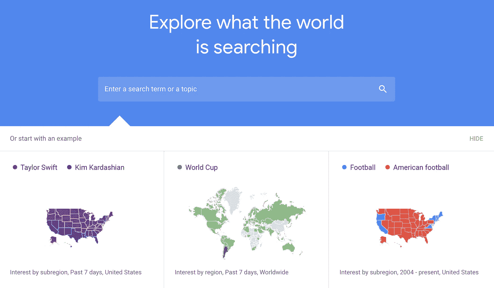
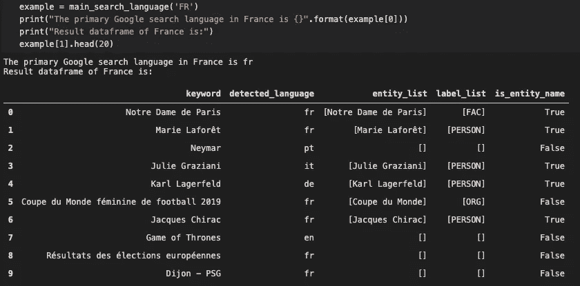
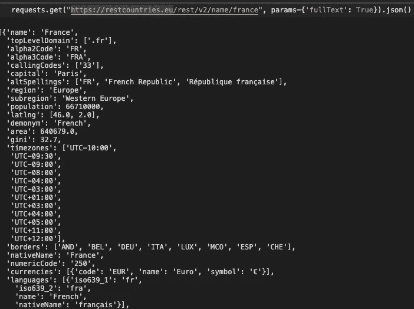
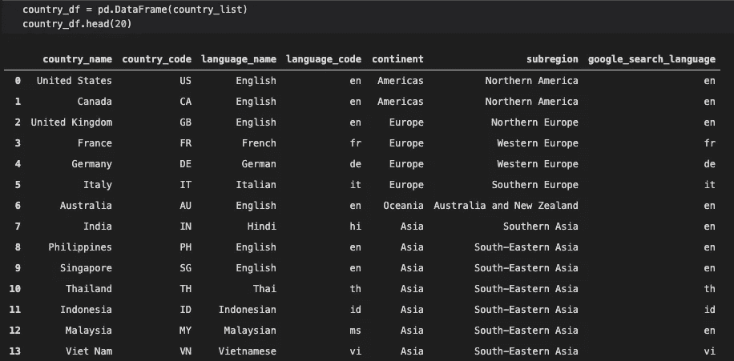

# 检测主要的 Google 搜索语言:一个简单的 Python 解决方案

> 原文：<https://medium.com/analytics-vidhya/detect-primary-google-search-language-a-simple-python-solution-dc37de2c5eab?source=collection_archive---------18----------------------->

一个用 Python 写的简单函数，用来检测不同国家的人用什么语言谷歌

在本文中，我将定义一个函数来找出不同国家的 Google 搜索中主要使用的语言。该函数的结果可用于了解人们在互联网上的行为或增加谷歌趋势分析的相关性。

总体而言，该功能使用谷歌趋势中的[热门关键词，确定关键词是否为*实体名称*，检测关键词的语言，并识别热门关键词中最常用的语言。为此，我使用了几个不同的 Python 包:](https://trends.google.com/trends/yis/2019/US/)

*   [**【py trends】**](https://pypi.org/project/pytrends/):加载某个国家特定年份的谷歌搜索排名
*   [**googletrans**](https://py-googletrans.readthedocs.io/en/latest/) :检测那些搜索的语言
*   [**空间**](https://spacy.io/usage/linguistic-features) :用于名称实体识别

所有这些软件包都可以通过 pip 安装。

## 1.导入所有需要的包

关于包导入的几点注意事项:

*   **pytrends** :在 TrendReq()中， *hl* 只是表头语言，不会影响 pytrends 函数的结果； *tz = 0* 表示时区为 UTC*重试次数*表示尝试运行的次数；*补偿因子*是从 urllib3 继承的参数。为了谨慎地避免 Google 强加的任何速率限制，这里我将 *backoff_factor* 设置为 5，稍后在任何涉及 pytrends 的循环中，我将设置睡眠时间: *time.sleep(6)*

> 第二次尝试后在两次尝试之间应用的补偿因子(大多数错误会通过第二次尝试立即解决，不会有延迟)。urllib3 将休眠:
> 
> {退避因子} *(2 * *({总重试次数} — 1))
> 
> 秒。如果退避因子是 0.1，那么`***sleep()***`将在重试之间休眠[0.0s，0.2s，0.4s，…]

*   在这次实践中，这个包对我来说足够好了。可以查看 Google 的[官方翻译 API](https://cloud.google.com/translate/docs) 找一个稳定的 API 选项。
*   **SpaCy:** 加载 en_core_web_sm 的脚本专门用于 Jupyter 笔记本，如果使用其他 ide，请使用 SpaCy 官方文档指示的语法:*NLP = SpaCy . load(" en _ core _ web _ sm ")*

## 2.定义函数

下面是我的函数的流程:

*   使用 *pytrends.top_charts()，*加载去年某个国家的热门谷歌搜索查询，返回一个熊猫数据帧。
*   使用 googletrans 获取这些搜索的检测语言。
*   在搜索查询中标出实体名称。
*   排除英文实体名称的搜索，假设在 Google 上搜索的选项是英文或其他语言。

该函数将 [country_code](https://en.wikipedia.org/wiki/ISO_3166-1_alpha-2) 作为唯一的输入，返回一个元组，其中第一项是该国家的主要 Google 搜索[语言代码](https://en.wikipedia.org/wiki/ISO_639-1)，第二项是一个 pandas 数据帧，包括热门搜索及其实体名称标签以及它们检测到的语言。

以下是法国的函数结果示例

## 3.测试不同国家的功能

该函数的执行带来了两个问题:

*   如何找到对应于国家名称的国家代码并传递给输入
*   如何知道语言代码输出的语言名称

用 Python 解决有几个选项，一个是[py country](https://pypi.org/project/pycountry/)；但是，目前 pycountry 不支持国家名称和语言之间的映射。在这种情况下，我使用了一个免费的 REST API[https://restcountries.eu/](https://restcountries.eu/)，该 API 提供了关于一个国家的信息，如本国名称、全名、国家代码、货币、语言、首都、地区等。

按全名搜索时，API 的结果如下所示。请注意，对于一些国家，如美国或英国，您必须使用他们的官方名称进行搜索。

我将这 14 个国家作为我的谷歌趋势分析系列的目标:

['美国'，'加拿大'，'英国'，'法国'，'德国'，'意大利'，'澳大利亚'，'印度'，'菲律宾'，'新加坡'，'泰国'，'印度尼西亚'，'马来西亚'，'越南']

获取每个国家信息的脚本如下:

我得到了这些国家的主要谷歌搜索语言如下。结果显示，我名单上的欧盟国家包括法国、德国、意大利主要使用他们的国家语言。在我选择的 6 个东南亚国家中，泰国、印度尼西亚和越南用当地语言搜索，而新加坡、菲律宾和马来西亚更喜欢英语。

## 4.我是如何想出这个函数的，我要用它做什么

作为一名 Python 新手和数据分析从业者，我想从事一些项目，在这些项目中，我可以练习我的 Python 技能，从周围的数据集中提取一些有趣的事实。对于我的第一个项目，以谷歌趋势为数据源，我计划处理来自不同国家的数据。

我首先将英语作为所有国家的通用语言，但在一些国家，输入英语关键字并不能产生足够的数据输出。因此，我必须确定在每个国家我应该传递给谷歌趋势提取功能的语言。

函数背后的想法是基于这样的逻辑:我应该选择的语言应该是 Google Trends top keywords 中遇到的最常见的语言。

该函数的第一个版本只是检测所有关键字的语言，而没有过滤掉*实体名称。*用法国测试时，因为 top 关键字包含几个英文实体名，所以函数返回英文作为主要语言。对结果感到困惑，我检查了法国的热门关键词，发现很多热门搜索都是人名、组织名、事件名等。因此，我意识到我需要从函数输入中排除实体名称，以获得更准确的结果。

在没有任何 NLP 经验的情况下，通过在谷歌搜索中键入一个简单的问题，比如“从文本中排除人名”,我开始了解 SpaCy 和嵌入式*命名实体识别*包。我从未听说过使用黑盒 NLP 包的想法，起初听起来让我害怕，但后来我意识到，在他人的工作基础上进行编程是一种常见的做法。

现在，在熟悉了我在本文中提到的新包几天之后，我更有动力继续我的 Python 之旅。