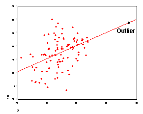
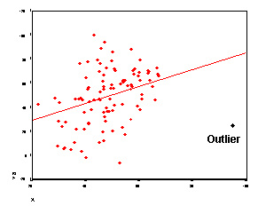
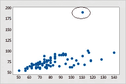
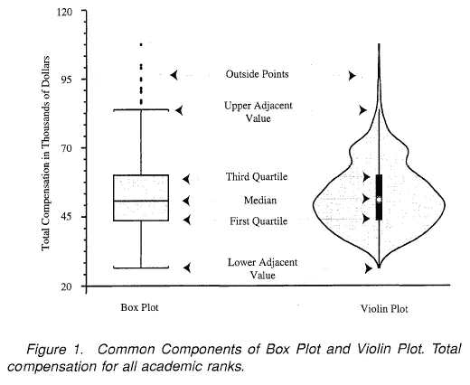
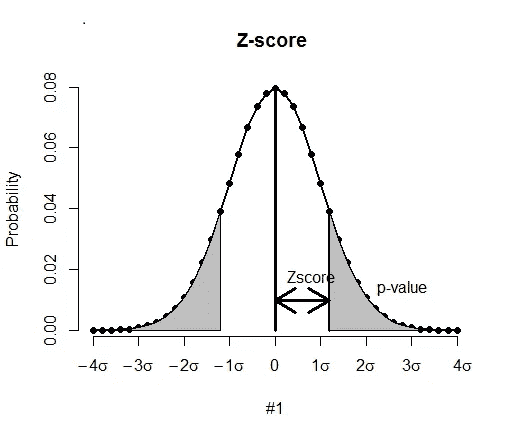

# 检测和移除异常值。

> 原文：<https://medium.com/analytics-vidhya/detecting-and-removing-outliers-7b408b279c9?source=collection_archive---------11----------------------->

## 什么是异常值，它如何影响您的模型？

异常值是与数据中存在的其他点显著不同的数据点。

> 我所说的显著不同是指数据点不属于数据集中存在的观察范围。**例:** 20，21，22，23，24，25， ***6*** ， ***90*** ，29，这里的值 6 和 90 被认为是异常值，因为它们与其他观测值的范围非常不同。

正如在[维基百科](https://en.wikipedia.org/wiki/Outlier)中提到的，异常值的产生是由于系统行为、欺诈行为、人为错误、仪器错误的改变，或者仅仅是由于群体的自然偏差。

Randy Fath 在 [Unsplash](https://unsplash.com?utm_source=medium&utm_medium=referral) 上拍摄的照片

**异常值对数据集的影响:**

数据中存在噪声是一个问题，无论是在目标变量中还是在某些特征中。在较小的数据集中，离群值非常危险，很难处理。

根据具体情况，离群值要么值得处理，要么应该完全忽略。

> 在数据科学或统计学中，有三种主要不同类型的异常值，如果你想对它们有一个简要的了解，请查看此[链接](/@abhigyan.singh282/different-types-of-outliers-dd6363983744?sk=46101447c0776e08ee0c099beb9f1e7b)。

如果数据集包含相当数量的异常值，重要的是要么使用对异常值鲁棒的建模算法，要么过滤掉异常值。出现主要问题是:

1.  它增加了数据的平均值，该值高于数据中的大多数观察值。如果数据包含空值，并且您使用平均值来输入空值，这可能会造成阻碍。
2.  它影响数据的相关性。相关系数可能增加或减少。

> 位于回归线正常位置附近的异常值必然会增加相关系数的大小。

> 偏离原始回归线一定距离的异常值会减小相关系数的大小。

## 检测异常值的简单方法。

1.  **箱线图:**

在维基百科*中，一个* ***方框图*** *是一种通过四分位数图形化描绘数字数据组的方法。箱形图还可以具有从箱形图垂直延伸的* ***线****(*须状图 *)* ***)，指示上下四分位数之外的*** ***可变性*** *，因此称为箱形图和箱形须状图。*

箱线图最大和最小范围之上和之下的单个点是异常值。

2.**散点图:**

在维基百科中， *A* ***散点图*** *，是一种使用笛卡尔坐标来显示一组数据的典型两个变量的值的图或数学图表。这些数据被显示为一个***的集合，每一个都有* ***的值其中一个变量*** *决定了***轴上的位置以及* ***其他*** ***的值*****

**远离图中点簇的点被认为是异常值。**

****

**3.**小提琴手:****

**紫线图是一种绘制数值数据的方法，可视为箱线图和核密度图的组合图。**

**异常值表示为图形密度宽度上方和下方的细线。**

****

**4. **Z 分数:****

**Z-Score 是标准偏差的数量，通过该数量，观察值或数据点的值高于或低于观察平均值。**

**Z 分数背后的直觉是通过找到它们与一组数据点的标准差和平均值的关系来描述任何点。**

**Z 得分的范围在 3 到-3 之间，因此，如果数据点的 Z 得分大于或小于该范围，该数据点将被视为异常值。**

********

> **位于+3σ和-3σ之外的数据点被视为异常值。**

## **如何处理离群值？**

**如上所述(根据上下文，离群值要么值得处理，要么应该完全忽略)。**

**让我们来看看一些处理异常值的简单方法。**

1.  **用数据集中出现频率最高(出现次数更多)的值替换离群数据点的值。**
2.  **只需删除该行。(请记住，这可能会导致某种类型的信息丢失)**
3.  **用零替换异常值。**

**当然，还有其他方法，对异常值进行封顶需要小心谨慎，因为这可能会影响预测的结果。**

**喜欢我的文章？请为我鼓掌并分享它，因为这将增强我的信心。此外，我每周日都会发布新文章，所以请保持联系，以了解数据科学和机器学习基础系列的未来文章。**

**此外，如果你愿意，可以在 linkedIn 上联系我。**

****

**[Alex](https://unsplash.com/@alx_andru?utm_source=medium&utm_medium=referral) 在 [Unsplash](https://unsplash.com?utm_source=medium&utm_medium=referral) 上的照片**