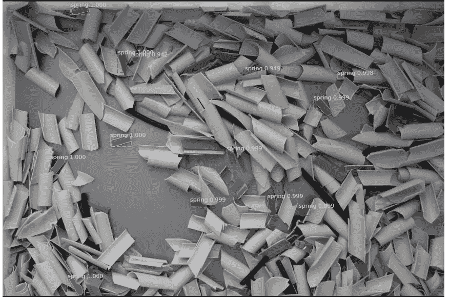
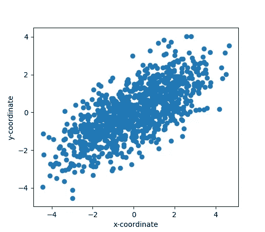
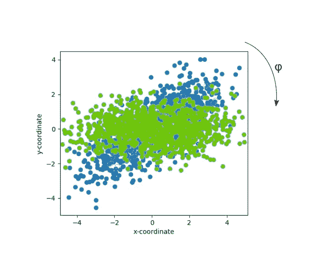
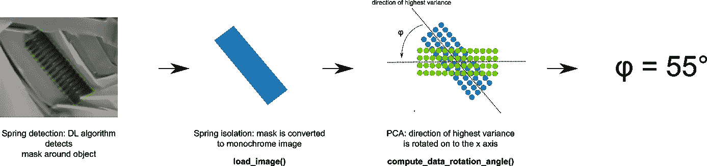
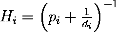
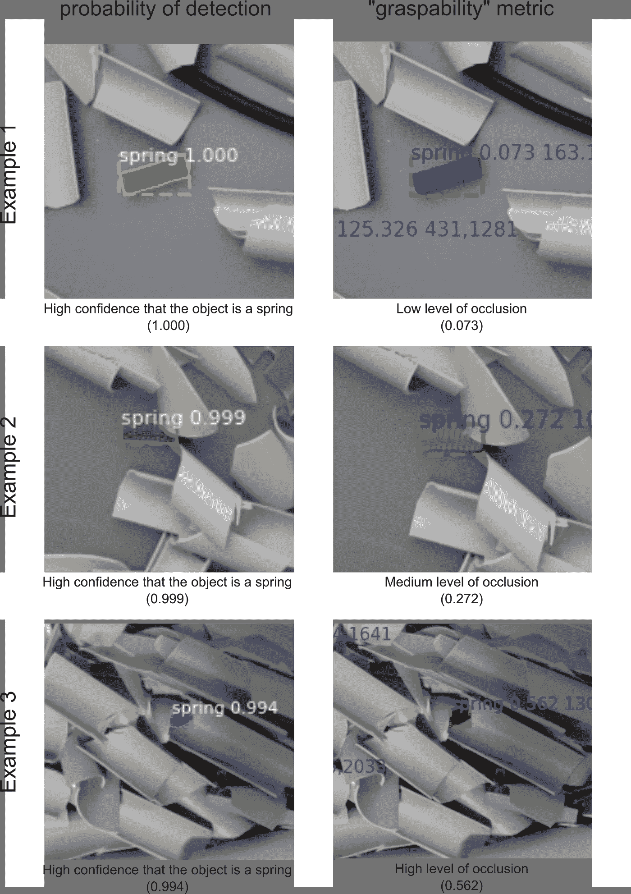
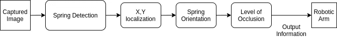

# 使用深度卷积神经网络检测和分类核废料

> 原文：<https://medium.com/analytics-vidhya/detecting-and-sorting-nuclear-waste-using-deep-convolutional-neural-networks-3ada9b402363?source=collection_archive---------10----------------------->

这篇文章是一条结合了深度学习和经典计算机视觉技术的管道的演练，以便使用机器人从废料池中挑选出放射性弹簧。



在废料池中检测到弹簧

# 介绍

由于其危险性，核退役很少由人来执行，因此需要机器人自动化。根据一项[回顾研究](https://www.researchgate.net/publication/241674528_Robots_in_the_nuclear_industry_A_review_of_technologies_and_applications)，大多数用于核退役应用的机器人系统实际上没有采用自主性，甚至没有编程运动。这部分归因于缺乏认知，这可以通过引入额外的传感器来增加，无论是视觉的还是其他的，部分归因于高度的定制化，这降低了灵活性。

改善认知的一种流行且直接的方法是将光学感测与对象检测算法相结合。在这方面，研究工作主要集中在经典的计算机视觉算法上，例如使用 Hu 矩进行核废料分类的形状识别方法。

我们的工作展示了放射性 Magnox spring 检测和实例分割管道，集成在 Minotaur-R 机器人系统中，输出以下参数:

*   弹簧位置
*   碎片造成的弹簧堵塞水平
*   弹簧定向，便于机器人抓取

该系统的最终版本可以高精度地拾取和放置弹簧，这大大推动了使用机器人进行核废料分类的界限。除了 spring detection 之外，它还包括许多其他功能，本文不会详细介绍，因为我们将只关注视觉管道。

看看最终的系统:

# 用于弹簧检测的工具

我们算法的主干是掩模 R-CNN 模型，它通常用于实例分割。掩模 R-CNN 设计用于网络输入和输出之间的像素到像素对准，为每个实例返回高质量的分割掩模。该特征提供了在废料背景中以高精度检测弹簧(即使是部分遮挡的弹簧)的能力。

# 训练数据集

该模型使用 Mask R-CNN 的一套效用函数进行训练。训练过程使用各种参数化进行几次，以便最快地收敛到损失函数最小值。ResNet50 是 ResNet101 的一个更小、更快的版本，使用 resnet 50 作为主干网络可以获得最佳效果。图像大小也是我们必须确定的一个标准；建议输入图像的大小为 2048 x 2048 像素，因为任何更大的尺寸都会导致无法接受的处理时间。

增加了数据的异质性，以提高泛化能力和减少模型偏差。用于训练目的的数据集由 32 幅图像组成，总共包含 222 个手动标记的弹簧，来自不同的高度、方向和不同的光照条件。这些图像被仔细标注，以避免数据集污染。

数据集被分为训练(80%)、验证(10%)和测试(10%)子集，并被馈入两个不同的主干网络 ResNet50 和 ResNet101，以便分别评估它们各自的性能。

该模型成功检测了 220 个弹簧(真阳性)，未检测到 2 个弹簧(假阴性)。此外，该模型没有检测到任何弹簧废料(零假阳性)。

# 后处理

这个问题的本质要求精确了解 **1)** 弹簧的方向，以便机器人的末端执行器准确知道如何接近和抓住弹簧，以及 **2)** 被碎片遮挡的程度。后者很重要，因为系统需要将可见的(因此可抓取的)弹簧优先于不可见的或半可见的弹簧。让我们一次研究一个。

1.  **计算弹簧方位**

后处理阶段将预测的弹簧多边形作为输入，并提取弹簧 *(x，y)* 位置、方向 *φ* 和遮挡级别*遮挡级别*。为了获得第*个弹簧的位置，我们计算掩模质心如下:*

```
mask_centroid = (np.mean(mask[:,0]), np.mean(mask[:,1]))
```

接下来，通过获得 *(x，y)* 坐标并通过主成分分析(PCA)算法运行它们来计算弹簧方位 *φ* 。PCA 是一种降维方法，可用于获取数据集(在我们的例子中，是 x-y 散点图)变化最大的方向。它可以用来计算弹簧形状的主要组成部分的方向，即它的长度。值得注意的是，当检测到的弹簧被部分遮挡时，这种方法将会失败，因为它将不会保持其原始的长宽比(大约。在我们的例子中是 3:1)。以下代码生成一个类似下图的散点图，



生成的 x-y 数据

并使用主成分分析获得集中数据的协方差矩阵的特征向量矩阵和对应的对角特征值矩阵。从特征向量矩阵中，我们可以获得将散射数据映射到 x 轴所需的旋转角度，如下所示:



生成的旋转了角度φ的 x-y 数据

以下代码可用于生成 x-y 数据集，并计算将散点数据映射到 x 轴所需的变换，从而获得相对于 x 轴的角度φ。

让我们一步一步地了解功能。函数 **generate_sample_data** 将生成一条线 f(x) = β₀ x + β₁，其中β₀是斜率(相当于 tan(φ))，β₁是偏移量，在我们的例子中是β₁~N(0,1)，这意味着它正态分布，均值为 0，标准差为 1。该函数返回我们生成的点的 x-y 坐标数组。

函数 **load_image** 可用于加载我们想要转换为 x-y 坐标数组的单色图像，这样我们就可以将它输入我们的核心算法函数**compute _ data _ rotation _ angle**。函数 **load_image** 对图像的动态范围做出某些假设，以便于处理。这些假设是:1)动态范围是从 0 到 255，或者从 0 到 1。在前一种情况下，任何大于 127.5(或 127，如果使用整数除法)的值都被赋值为 1，其他值都为 0。这允许我们提取一组 x，y 坐标，我们将把这些坐标馈送给**compute _ data _ rotation _ angle**。

函数**compute _ data _ rotation _ angle**是果汁所在。该函数接收在 **load_image** 中生成的像素的 x，y 坐标，并输出弹簧的角度(以度为单位)。



计算弹簧方向

2.**计算碎片的遮挡程度**

机器人需要知道优先选择哪个弹簧，以最大化抓住它的机会。这里我们需要问自己的问题是，决定把握成功最重要的标准是什么？答案是，遮挡程度。弹簧被其他物体遮挡的程度如何？机器人的末端执行器是否能够靠近它并将其隔离，而无需在此过程中抓住其他物体？这个怎么解决？

我们已经知道弹簧具有特殊的形状，也就是说，它是矩形的，长/宽比约为 3:1。此外，除非我们融化弹簧，否则形状不太可能改变。在典型情况下，弹簧不会变形，因此这是一条我们可以用来进一步评估弹簧闭塞程度的信息。如果我们的 DL 模型输出一个生日气球形状的面具，那么我们可以说两件事:1)要么这个模型悲惨地失败了，要么 2)我们已经检测到弹簧的*部分。(2)还不能被轻易忽略。然而，我们可以针对(1)安全行事，并且丢弃检测概率低于某个阈值(比如 0.85)的所有预测。我们剩下的几乎可以肯定是泉水。现在，我们需要做的是根据弹簧与弹簧模板*的*相似性对弹簧进行排序。一个被探测到的物体越像我们所认为的弹簧的样子，它就越容易被发现。*

一种方法是使用图像匹配。首先，我们必须对图像进行拓扑分析，以生成轮廓(或者图像的更高级摘要)，然后将结果输入形状匹配算法。

在我们的实现中，我们决定使用 **OpenCV** 库，它提供了一套用于轮廓检测和相异分数计算的算法。这些轮廓检测算法之一是铃木的边界检测算法。这是在[**find contours()**](https://docs.opencv.org/3.4/d3/dc0/group__imgproc__shape.html#ga17ed9f5d79ae97bd4c7cf18403e1689a)**函数中实现的。这个算法的分步描述可以在 [**这里**](https://theailearner.com/tag/suzuki-contour-algorithm-opencv/) 找到。在我们获得一个轮廓之后，我们将其提供给函数[**【match shapes()**](https://docs.opencv.org/3.4/d3/dc0/group__imgproc__shape.html#gaadc90cb16e2362c9bd6e7363e6e4c317)，该函数使用 Hu 矩方法来计算两个轮廓的相似性。 [**Hu 矩**](https://en.wikipedia.org/wiki/Image_moment) 可用于生成图像属性的汇总，如质心和面积等。我们的最终相异度分数作为衡量一个弹簧可见/被遮挡程度的标准。**

# **定义“可抓取性”指标**

**现在，我们已经确定了弹簧的角度和遮挡级别，我们需要定义一个度量，系统将根据该度量对弹簧进行排序，以确定首先选择哪一个。我们有两个指标可以使用:**

1.  **检测概率**
2.  **遮挡水平**

**我们需要以某种方式将它们结合起来，以确保在一个指标中有效地总结这两者。为了将它们结合起来，我们可以使用调和平均值的变体，其表示为**

****

**弹簧遮挡度量**

**其中**pi**是由 DL 模型产生的检测概率，而**di**是由匹配算法产生的相异度度量。下图显示了这一指标的表现。请注意，当我们向下移动图像行时，弹簧变得更加闭塞，这导致闭塞度量增加。数字越小，弹簧越明显。较高的数值意味着弹簧被严重堵塞，因此不容易抓住。**

****

# **整体管道**

**在结合前面两个阶段之后，我们能够知道 a)每个弹簧的精确位置(x，y ), b)每个弹簧相对于 z 轴的角度，c)弹簧咬合的程度。下面的流程图显示了该过程的概述。**

****

**弹簧检测管道**

# **最后的话**

**在核退役环境中探测特定类型的物体是一项具有挑战性的任务，这是因为需要探测和隔离的潜在不同类别物体的数量，还因为辐射水平可能会损坏设备，从而对整个系统的设计造成更多限制。然而，拥有一个用于检测和抓取一类需要安全存放的物体的工作管道，仍然是一个有希望的开始。**

# **确认**

**母机器人项目 [**Minotaur-R**](http://minotaur-r.iknowhow.com) 由 [ESMERA](http://www.esmera-project.eu/welcome/) 资助，通过欧盟的 Horizon 2020 研究和创新计划，根据第 780265 号赠款协议，由 iknohow SA 的机器人团队开发。**

**团队:**

**[**Michal is Logothetis**](https://www.linkedin.com/in/michalis-d-logothetis/)—机器人控制与实现**

**[**尼科斯·瓦尔曼托尼斯**](https://www.linkedin.com/in/nikos-valmantonis-843323134/) —机械设计**

**[**or feas ky pris**](https://www.linkedin.com/in/kypris/)—视觉流水线设计与实现**

**[**left Eris gry Paris**](http://linkedin.com/in/eleftherios-gryparis-9bb106196)—视觉管道训练和调整**

**[**【Angeliki Pilalitou】**](https://gr.linkedin.com/in/pilalitou)—提案开发和项目管理**

**[**Makis Pachos**](https://gr.linkedin.com/in/efthymios-pachos-3525241b)—项目管理**