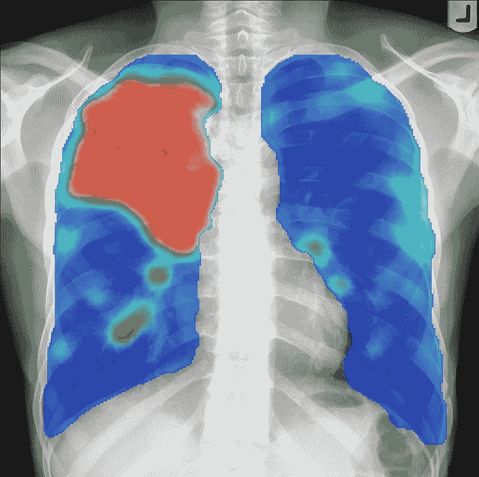
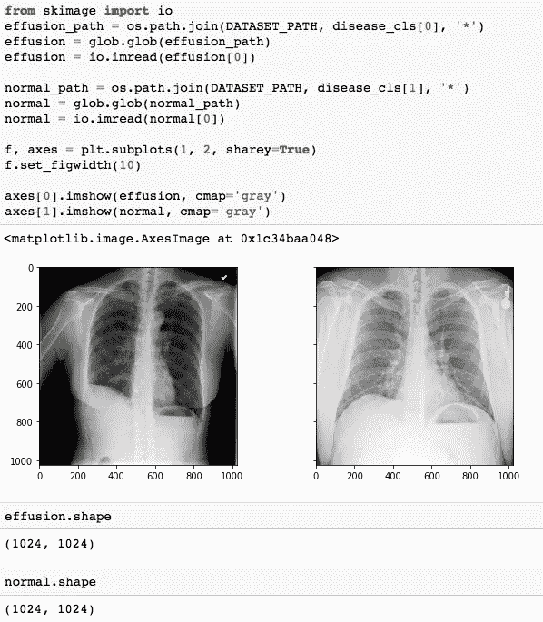
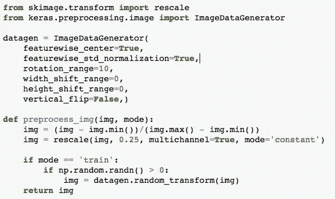
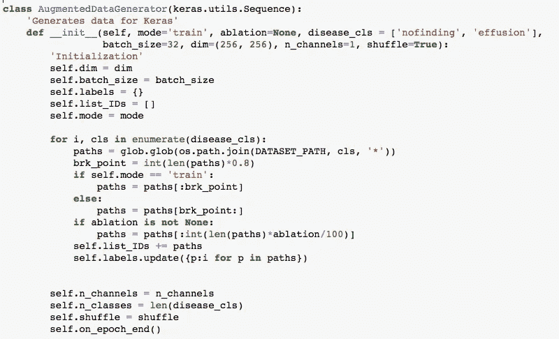
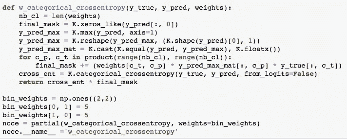
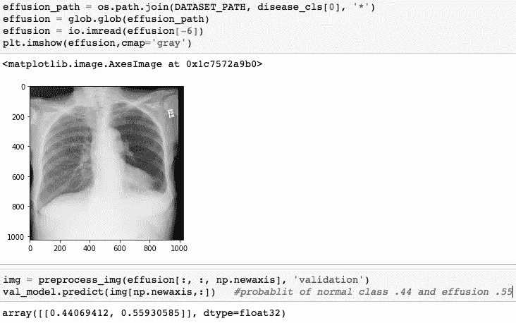

# 用 CNN 检测 X 射线中的异常。

> 原文：<https://medium.com/analytics-vidhya/detecting-anomalies-in-x-ray-using-cnn-1e4c2e49f23a?source=collection_archive---------4----------------------->

在神经网络中，卷积神经网络(ConvNets 或 CNN)广泛用于图像识别、图像分类、物体检测和人脸识别。CNN 为医疗行业带来了革命性的变化，在医疗行业中，成像是 X 射线、CAT 扫描、结核病诊断、X 射线预诊断、MRI、乳房 X 线照片等形式的医疗数据的快速增长来源。

这篇文章是关于发现胸部 x 光图像异常。当我们谈到上述问题时，问题就出现了。我们要找出哪个异常点？这些异常是什么样子的？在开源图像的帮助下，深度学习可以有效地用于发现 X 射线中的异常，以检测各种疾病。

# **数据**

本文使用 [CXR 数据集](https://www.kaggle.com/nih-chest-xrays)作为训练数据集，分为“积液”和“无发现”两类。积液是一种医学状况，其中液体由于各种疾病如肺结核和正常图像而聚集在肺部。

让我们看看正常和渗出的 x 光片是什么样的-

训练数据-正常和溢出的 X 射线。

左侧 X 射线图像中白色液体沉积清晰可见，而右侧图像是正常的 X 射线样本。

# **数据增强。**

这是数据预处理步骤之一，通常在训练数据很小并且很容易过拟合时进行。CNN 架构中的[池层](https://www.analyticsvidhya.com/blog/2018/12/guide-convolutional-neural-network-cnn/)增加[不变性](https://stats.stackexchange.com/questions/208936/what-is-translation-invariance-in-computer-vision-and-convolutional-neural-netwo)。如果一张狗的图片在图片的左上角，通过池化，你将能够识别出狗是否在左上角的左/右/上/下。但是训练数据由像 ***翻转、旋转、裁剪、平移、照明、缩放、添加噪声*** 等数据扩充组成。模型学习所有这些变化。这大大提高了模型的准确性。因此，即使狗出现在图像的任何角落，模型也能够以很高的准确度识别它。

[数据归一化](https://towardsdatascience.com/understand-data-normalization-in-machine-learning-8ff3062101f0)确保每个输入参数(本例中为像素)具有相似的数据分布。这使得在训练网络时收敛速度更快。数据归一化是通过从每个像素中减去平均值，然后用标准偏差除以结果来实现的。此类数据的分布类似于以零为中心的高斯曲线。对于图像输入，我们需要像素数为正，因此我们可以选择缩放[0，1]或[0，255]范围内的归一化数据。

keras 的 ImageDataGenerator 类允许用户对 x 射线图像执行图像增强。然而，CXR 数据有特定的限制，如宽度/高度偏移设置为 0，中心裁剪设置为 false，垂直翻转设置为 False，因为这些图像具有自然的方向。

由于 CXR 图像不是“自然图像”，我们不使用“除以 255”策略。相反，我们采用最大-最小法进行归一化。因为您不能确定每个像素的范围是 0–255，所以您使用最小-最大值进行归一化。

# **网络大厦**

数据类高度不平衡。“积液”与“找不到”的比率几乎是 10 (107/1000)。由于大部分数据仅属于一个类别，简单的培训将不起作用，因为模型将主要学习大部分数据并将其归类为“找不到”，从而导致高精度。

90%(1000/1107)的数据是“找不到的”,如果它将所有数据分类为相同的，准确率将为 90 %,接近我们获得的 87%的准确率。因此，正确分类“积液”的目标没有实现。高精度显然误导了我们，因此 AUC 是验证结果的更好性能矩阵。

构建模型的基本步骤:

1.  导入 resnet 代码

“ResNet builder”模块用于导入[ResNet](https://arxiv.org/pdf/1603.05027.pdf)(ResNet-18，ResNet-34 等)的变体(所有构建模块)。).Keras 的 ResNet 实现不是首选，因为它不能提供从这些变体中进行选择的灵活性。本文使用的 resnet.py 模块取自[此处为](https://github.com/raghakot/keras-resnet)

2.运行增强数据生成器

Keras generator 希望每个类中的图像都在一个独立的目录中(在多标签问题中是不可能的，比如在上下文、分割问题等中)。)并创建原始数据的副本，还必须将`dtype`从`uint8`转换为`float64`，这增加了 GPU 上的内存过载。然后，根据问题陈述，使用适当的用户输入构建定制的 ImageDataGenerator。

定制数据生成器

Datagenerator 类初始化为分类类——无发现和渗出，模式为训练数据的训练，通道为 1(黑/白图像)的 i/p。

3.执行消融运行

来自训练和验证数据集的小批量数据在各种超参数上进行训练，以找到最佳学习率并观察模型在功能上的表现。

4.符合模型。

验证 AUC 而不是准确性被用作评估度量以避免过度拟合，并且模型被训练以保持一切相同，例如网络层、数据扩充、预处理等

该模型在 AUC(我们选择的衡量标准)上表现不佳。

1.  造成这种情况的主要原因是普遍性问题。数据集中的异常案例并不多(类别不平衡)。
2.  为了解决这个问题，我们引入了“加权分类交叉熵”。

**加权交叉熵损失**对低流行等级的错误分类的惩罚比其他等级更重。因此，每当模型在异常类别(在本例中为“渗出”)上出错时，它会通过将损失乘以高权重值而受到严重惩罚。这导致错误分类类别的损失增加，因此由于反向传播而导致的权重变化更大。因此，对错误分类负责的权重的学习曲线更多。

加权分类交叉熵

假设“没有发现”是 0 级，“积液”是 1 级。

**bin_weights[0，0]:** 实际类:0，预测类:0，所以没有惩罚，只是正常的**权重 1。**

**bin_weights[1，1]:** 实际类:1，预测类:1，所以没有惩罚，只是正常的**权重为 1。**

出现异常情况时:

**bin_weights[1，0]** —实际类为 1，预测类为 0，**按权重 5 处罚。**

**bin_weights[0，1]** —实际类为 0，预测类为 1，**按权重 5 处罚。**

# 最终模型

在最终运行**中，kera 的模型检查点**仅在验证准确性增加时保存模型权重，并使用 **keras 回调调用。** AUC 已经*从 0.51(无权重)显著增加到 0.72(有权重)。*

在初始化架构和权重后，根据来自验证数据集(此处为最后 20%的数据)的未知数据预测模型。结果显示正常类的概率为. 44，渗出类的概率为. 55。

对验证数据集的预测。

创建这篇文章的源代码可以在[这里](https://github.com/snehabhatt/MachineLearningProjects/blob/master/XRAY-Submit/Working_With_Chest_XRay_Images-2.ipynb)找到。我将很高兴收到关于上述任何反馈或问题。