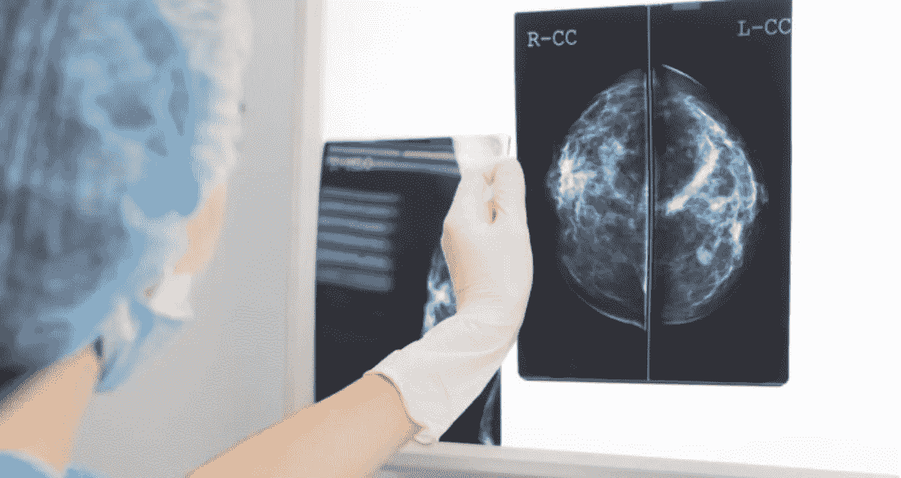

# 使用机器学习检测乳腺癌

> 原文：<https://medium.com/analytics-vidhya/detecting-breast-cancer-using-machine-learning-ab23e719f7fa?source=collection_archive---------12----------------------->

> 决策树在乳腺癌威斯康星州(诊断)数据库中的应用

评估乳房 x 光片的专家[5]

***免责声明:*** *这是一个教程，任何具有 python 编程和信息论基础知识的人都可以重新创建它。这篇文章的灵感来自我在巴斯大学完成的课程。因此，一些代码片段直接取自它(用*上的***表示)