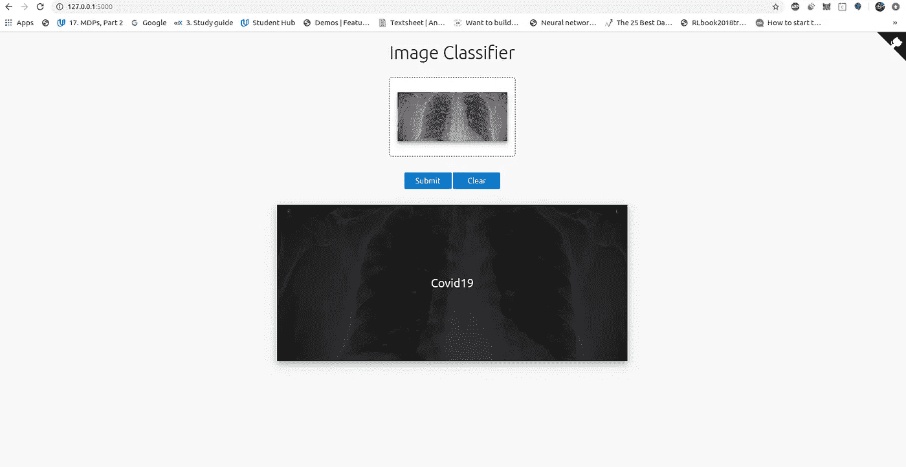

# 使用 Keras/Tensorflow 中的注意力地图从胸部 X 射线中检测新冠肺炎，并使用它制作 Flask web 应用程序。

> 原文：<https://medium.com/analytics-vidhya/detecting-covid-19-from-chest-x-rays-using-attention-maps-in-keras-tensorflow-and-making-a-flask-a2f68a9ebf65?source=collection_archive---------15----------------------->


照片由[皮勒-张力尹·普里斯克](https://unsplash.com/@pillepriske?utm_source=medium&utm_medium=referral)在 [Unsplash](https://unsplash.com?utm_source=medium&utm_medium=referral) 拍摄

> 2015 年 3 月，比尔盖茨先生做了一个题为:[“下一次爆发？我们还没准备好。”](https://www.ted.com/talks/bill_gates_the_next_outbreak_we_re_not_ready/transcript?language=en#t-500745)。2015 年 3 月 18 日，他在自己的博客 GatesNotes 上发表了一篇[帖子](https://africacheck.org/fbcheck/bill-gates-did-warn-in-2015-of-possible-global-virus-outbreak-but-not-coronavirus-specifically/)。这篇文章包括了他的 TED 演讲。他写道，下一次全球疫情可能比 2014 年至 2016 年的埃博拉病毒爆发更糟糕，那次爆发导致约 11，000 人死亡。

快进 5 年，我们正在见证一个超越了我们对末日世界的所有想象的世界，让我们面临终极的生存危机。在世界各地，随着死亡人数的增加，封锁正在有序进行，这是人类团结起来的关键时刻。

冠状病毒是一个大的病毒家族，可以引起从普通感冒到更严重疾病的疾病。2019 年 12 月下旬，中国发现了一种新毒株的爆发，命名为[“2019-nCoV”](https://www.who.int/emergencies/diseases/novel-coronavirus-2019)，被称为“新型冠状病毒”。这种病毒导致了新冠肺炎的疾病。

截至 2020 年 3 月 28 日，全球新冠肺炎确诊病例近 65 万例，死亡近 3.1 万人。


来源:路透社

在这一点上，我们可能采取的最佳防御措施是呆在家里，不惜一切代价避免社交聚会。在目前的情况下，社交距离似乎是唯一的出路。然而，随着确诊病例呈指数增长，截至目前，许多国家的医疗机构因患者数量庞大而不堪重负 [**缺乏治愈方法**](https://www.theguardian.com/world/2020/mar/28/coronavirus-vaccine-when-will-it-be-ready) 。

中国最近开发了一种人工智能头盔，可以测量 5 米以外人群的体温。

其他基于人工智能的解决方案正在被广泛深入研究和[研究](https://www.sciencedaily.com/releases/2019/09/190930104505.htm)。但是，即使这些模型据报道具有很高的灵敏度和特异性，这些模型也不应该在没有人类干预的情况下孤立运行，因为研究表明，在将新冠肺炎病毒与其他类型的病毒疾病进行比较时，这些模型的预测可能非常不稳定。

在本文中，我们将探索实现这样一个过程的方法，并分析所获得的结果。我们将使用一个与视觉注意力机制相结合的转移学习过程，以便深度学习代理只关注图像的一部分，而不是同等重要地看待图像的每一部分。但是首先，我们将讨论视觉注意力是如何工作的，然后我们将直接进入代码[(完整的 github 报告在这里)](https://github.com/sagarnildass/covid_19_xray_classification)。

该数据集由阿德里安·易捷·许编译。你可以在这里找到他的实现方法[。这是蒙特利尔大学的约瑟夫·保罗·寇恩博士收集的](https://towardsdatascience.com/detecting-covid-19-induced-pneumonia-from-chest-x-rays-with-transfer-learning-an-implementation-311484e6afc1) [Kaggle 胸部 x 光数据集](https://www.kaggle.com/paultimothymooney/chest-xray-pneumonia)和 [COVID19 胸部 x 光数据集](https://github.com/ieee8023/covid-chestxray-dataset)的组合。数据集包含 4 个类别:

1.  COVID19: 60 幅训练图像，9 幅测试图像
2.  正常:70 幅训练图像，9 幅测试图像。
3.  肺炎(细菌性):70 幅训练图像，9 幅测试图像
4.  肺炎(病毒性):70 幅训练图像，9 幅测试图像

一些图像样本如下所示:


新冠肺炎（新型冠状病毒肺炎）


正常/健康


肺炎

这种方法的一个主要问题是在 X 射线图像中没有太多 COVID19 的阳性实例。因此，即使可以创建一个具有高测试准确性的模型，它也可能无法很好地推广到现实世界，因为我们根本不知道当我们查看一个被明确识别的患者的 x 光片时会有多大的差异。但话虽如此，这个模型已经达到了 85%的高验证准确率和 100%的测试准确率。所以我们只能希望我们走在正确的道路上。那么事不宜迟，我们先来了解一下什么是视觉注意。

# 卷积神经网络中的视觉注意

视觉注意力的工作方式与我们的视觉非常相似。让我们考虑一个场景。假设有人告诉你:“嘿，看，有一只老虎！”你转向他/她所指的方向，然后当视觉皮层向你的大脑发送刺激时，首先你把你的整个视野看做一个图像。但是然后你开始聚焦，你开始聚焦在老虎身上，因为你知道它看起来像什么(我必须说，迁移学习的历史很长！).当你把注意力锁定在老虎身上，并开始对它投入注意力时，你的周边视觉变得模糊。

现在想想吧。为了在你的大脑中识别或处理老虎的形象，你是否一部分一部分地吸收和处理了整个场景？不，你立即知道去哪里看，并锁定你的焦点，直到你的外围设备变得越来越模糊。这是你自己实施视觉注意的部分。神经网络与此并无太大不同。

我们理解视觉注意的主要参考是这篇论文:“[学会注意](https://arxiv.org/pdf/1804.02391.pdf)”。在视觉注意机制中，有两种流行的类型。

1.  **硬注意**:该方法对感兴趣的区域进行图像裁剪。通常像[加强](https://towardsdatascience.com/an-intuitive-explanation-of-policy-gradient-part-1-reinforce-aa4392cbfd3c)这样的算法被用来训练严格的注意力机制。硬注意的输出是 0 或 1 的二进制值。1 对应于像素的保留，0 表示该像素已被裁剪掉。
2.  **软注意:**软注意使用软阴影来关注区域。输出贴图的值是一个介于 0 和 1 之间的十进制数。

论文*学会注意*用软注意解决了一个多类分类问题。作者证明了软可训练注意力在 [CIFAR-100](https://www.cs.toronto.edu/~kriz/cifar.html) 上将多类分类的性能提高了 7%，他们展示了示例热图，突出显示了注意力如何帮助模型专注于与正确的类标签最相关的图像部分。

下图描述了他们的模型架构:


由 [K. Scott Mader](https://www.kaggle.com/kmader) 建议的一种更新颖的方法是建立一种注意机制，在汇集之前打开或关闭间隙中的像素，然后根据像素的数量重新调整(Lambda layer)结果。基本想法是，全球平均汇集过于简单，因为一些地区比其他地区更相关。

在这项工作中，我们将做一些类似的方法来解决 X 射线分类问题。你可以在这里找到笔记本。

让我们写一些代码吧！我们将它细分为两个部分:

1.  深度学习部分
2.  web 应用程序创建部分

# 深度学习部分

## a)定义全局参数

由于数据集的图像太少，我们将使用图像增强，以便我们的模型不会过度拟合。为此，我们将使用 ImageDataGenerator 类。

## b)加载数据和扩充

我们将使用 keras 中的 ImageDataGenerator 类来加载和扩充图像。该类创建了内存的扩充，并且图像在驱动器中不会改变。

## c)模型架构

现在，我们将创建模型架构，并关注它。我们使用 VGG16 作为具有“imagenet”权重的预训练模型。在调用该模型时，我们将保持 **include_top** 参数为 **False** ，因为我们不会包括网络顶部的全连接层。这一层将跟随批量标准化层，批量标准化层是一种用于训练非常深的神经网络的技术，该神经网络对每个小批量的层的输入进行标准化。这具有稳定学习过程和显著减少训练深度网络所需的训练时期的效果。

在模型的注意力部分，我们将使用多个 1x1 卷积。这是因为我们希望避免大量的特征地图，因此我们希望对它们进行缩减采样。我们建立了一个注意机制，在汇集之前打开或关闭间隙中的像素，然后根据像素的数量重新缩放(Lambda 层)结果。该模型可以被视为一种“全球加权平均”池。在最终模型中，我们以线性方式组合了预训练的 VGG16 模型和注意力模型。下图展示了注意力模型。


注意力模型架构

这张图展示了最终的模型架构。


最终模型架构

创建此架构的代码如下:

## d)回访

对于这个模型，我们将使用两个回调。

1.  [**模型检查点**](https://www.tensorflow.org/api_docs/python/tf/keras/callbacks/ModelCheckpoint) :随着模型被训练，我们将用最佳权重递归地覆盖同一个文件。稍后我们将需要这个文件来创建 web 应用程序。

2.[**降低平稳状态下的学习率**](https://www.tensorflow.org/api_docs/python/tf/keras/callbacks/ReduceLROnPlateau) :该参数在指标停止提高时降低学习率。这在我们的例子中非常重要，因为我们的图像太少了，我们不想跳过[全局最小值而陷入局部最小值](https://www.i2tutorials.com/technology/maxima-vs-minima-and-global-vs-local-in-machine-learning/)。

## e)拟合模型

现在我们都准备好训练模型了。

[**steps_per_epoch** 它通常应等于 **ceil(样本数/批量大小)**](https://datascience.stackexchange.com/questions/47405/what-to-set-in-steps-per-epoch-in-keras-fit-generator)

## f)绘制损失函数和精确度

让我们为精确度和损失函数创建一个图。

## g)根据测试数据评估模型，并在一些样本上进行测试

我们将评估测试数据上的模型，并绘制一些图像以及预测的标签和标签的概率。

## h)创建主函数并调用它

让我们在主函数中以适当的顺序调用所有这些函数，然后执行主函数。

## I)损失和准确度图


注意地

我们看到这些图非常不稳定，但是模型有稳定的改进趋势。改善这些的主要方法之一是获得更多的训练数据。但是尽管如此，我们用这个数据达到了大约 85%的验证准确率。

在 github repo 中，你还会发现一个没有注意的方法。在一些样本测试数据上比较注意和不注意的测试结果:


咻！那是很长的一段。但这就结束了我们的深度学习部分。现在让我们转到 web 应用程序开发部分，我们将使用 flask 创建一个简单的 web 界面，在该 web 界面中，我们可以上传一张 x 光图像，它将在应用程序本身中被分类为[COVID19，普通或三级肺炎]。

# Web 应用程序创建部分

对于 web 应用程序创建部分，我使用了[keras-flask-deploy-web app](https://github.com/mtobeiyf/keras-flask-deploy-webapp)repo。但是，您需要对代码进行一些重要的修改，以使其适用于这种情况。所以我会一步一步地告诉你怎么做。

1.  克隆回购:

```
git clone [https://github.com/mtobeiyf/keras-flask-deploy-webapp](https://github.com/mtobeiyf/keras-flask-deploy-webapp)
```

2.更改目录

```
cd keras-flask-deploy-webapp
```

3.安装要求

```
pip install -r requirements.txt
```

4.将您的模型(h5 文件)复制并粘贴到 keras-flask-deploy-webapp 内的 models 目录中。这不仅是模型权重，也是模型架构。这就是为什么如果你使用上面的回调函数，你会发现我们设置了 save_weights_only = False 来保存整个模型，而不仅仅是权重。


模型文件夹(突出显示)

5.打开 app.py 文件。在这里你必须做一些改变。

a)在顶部导入行中，更改行

```
from tensorflow.keras.applications.imagenet_utils import preprocess_input, decode_predictions
```

无论你用的是哪种型号。所以如果你用的是 VGG16，那么应该是

```
from keras.applications.vgg16 import preprocess_input
```

另外，请注意，我在导入语句中去掉了 **decode_predictions** 方法。这是因为只有在对 Imagenet 数据进行分类以使标签成为人类可读形式时，才会使用此语句。但既然我们不是，我们就不需要这个了。

b)接下来，注释掉这两行:

```
#from keras.applications.mobilenet_v2 import MobileNetV2
#model = MobileNetV2(weights='imagenet') 
```

因为我们将使用自己的模型，所以不需要这两行。

c)在**模型路径**参数中，指定您在步骤 4 中保存在模型文件夹中的模型名称。例如

```
MODEL_PATH = 'models/covid_attn_weights_best_vgg16.h5'
```

d)在接下来的两行中添加注释，即

```
model = load_model(MODEL_PATH)
model._make_predict_function()
```

e)在 **model_predict** 函数中，将图像大小更改为 150，150，因为这是我们使用的图像大小。

```
img = img.resize((150, 150))
```

e)在**预测**函数中，去掉这两行:

```
pred_class = decode_predictions(preds, top=1)   # ImageNet Decode         result = str(pred_class[0][0][1])               # Convert to string 
```

改为添加以下几行:

```
pred_class = np.argmax(preds)
        # Process your result for human
pred_proba = "{:.3f}".format(np.amax(preds))    # Max probability

print(pred_class)
if pred_class == 0:
    result = 'COVID19'
elif pred_class == 1:
    result = 'NORMAL'
elif pred_class == 2:
    result = 'TERTIARY PNEUMONIA'
```

因此， **model_predict** 函数现在看起来像这样:

**预测**函数如下所示:

6.正在更改 utils.py —差不多了。现在，这对于 web 应用程序的运行来说已经足够好了。但是我们需要解决最后一个警告。当你在网络应用程序中上传一张图片时，它会以 **base64** 编码数据的形式进入我们的应用程序。我们用一个名为 **base64_to_pil** 的函数将它转换成 [PIL 图像](https://pillow.readthedocs.io/en/stable/reference/Image.html)格式，这个函数驻留在我们的 **utils.py** 文件中，以便我们用 keras 和 opencv 读取和预处理它。现在，我不知道这是一个怎样的常识，但由于我对 VFX 工业有些了解，我知道这是一个事实。JPG 和 PNG 文件在一个方面有所不同。PNG 文件除了通常的 R、G、B 通道之外，还有一个额外的通道。这个通道被称为阿尔法通道。在我们的数据集中，我们有 Jpeg 和 Png 文件。因此，当你上传一个 PNG 文件时出现的问题是，因为它包含一个额外的通道，解码图像的形状变成(150x150x4)而不是(150x150x3)，这将产生一个错误。所以解决这个问题的最好方法就是创建一个逻辑，如果 image.mode 不是 **RGB** ，那么就使它成为 **RGB** 。

所以转到 utils.py，重写函数 **base64_to_pil** 如下:

现在打开命令终端并运行

```
python app.py 
```

转到 [http://127.0.0.1:5000/](http://127.0.0.1:5000/) 一切应该正常。:)


7.上传一张图片，看看你的模型是如何分类的。



# 结束注释

希望这篇文章对你有所帮助。这种方法的主要问题是没有足够的数据。但最有可能的是，我们将在未来几天获得更多的数据，这将有助于我们以我们的方式帮助人类，无论它可能是多么微小。在这个黑暗的时代，我们每个人都需要通力合作。

恐惧是当今时代可能发生的最糟糕的事情。对更多人被感染的恐惧，对基本生存需求枯竭的恐惧，以及对我们明天命运的恐惧？在这些时候，我觉得也许这就是我如何为减轻和消灭这个本世纪以来最大的流行病贡献自己的一份力量。如果您认为您可以添加到这个数据集或改进我的程序，请派生这个 [repo](https://github.com/sagarnildass/covid_19_xray_classification) 并提交，然后提出一个拉取请求。如果你认为，你认识的某个医学领域的人可以从中获得帮助，请让我知道，或者如果你可以的话，按照要求为他/她的利益执行这个模型。这可以是一个非常好的健全检查，因为这将在微秒内预测，特别是当时间是如此的本质。

最重要的是，我们必须满怀希望，共同度过难关。正如他们所说:“黎明前的夜晚是最黑暗的。”

你并不孤单…

# 参考

1.  [https://health care-in-Europe . com/en/news/imaging-the-coronavirus-disease-covid-19 . html](https://healthcare-in-europe.com/en/news/imaging-the-coronavirus-disease-covid-19.html)
2.  [https://towards data science . com/detecting-新冠肺炎诱发的肺炎-从胸部 x 光检查-转移-学习-实施-311484e6afc1](https://towardsdatascience.com/detecting-covid-19-induced-pneumonia-from-chest-x-rays-with-transfer-learning-an-implementation-311484e6afc1)
3.  [https://arxiv.org/pdf/1804.02391.pdf](https://arxiv.org/pdf/1804.02391.pdf)
4.  [https://www.kaggle.com/kmader](https://www.kaggle.com/kmader/attention-on-pretrained-vgg16-for-bone-age)