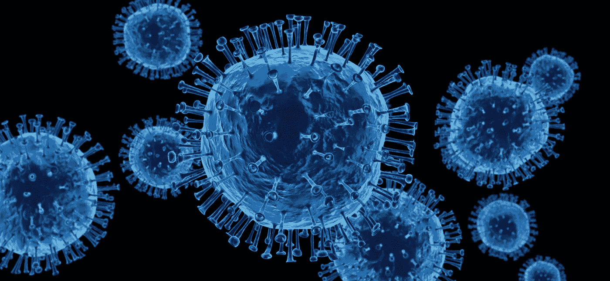
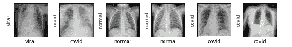
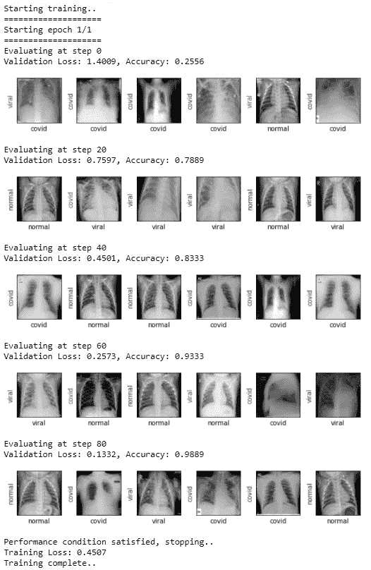
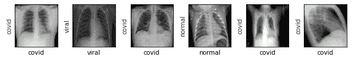
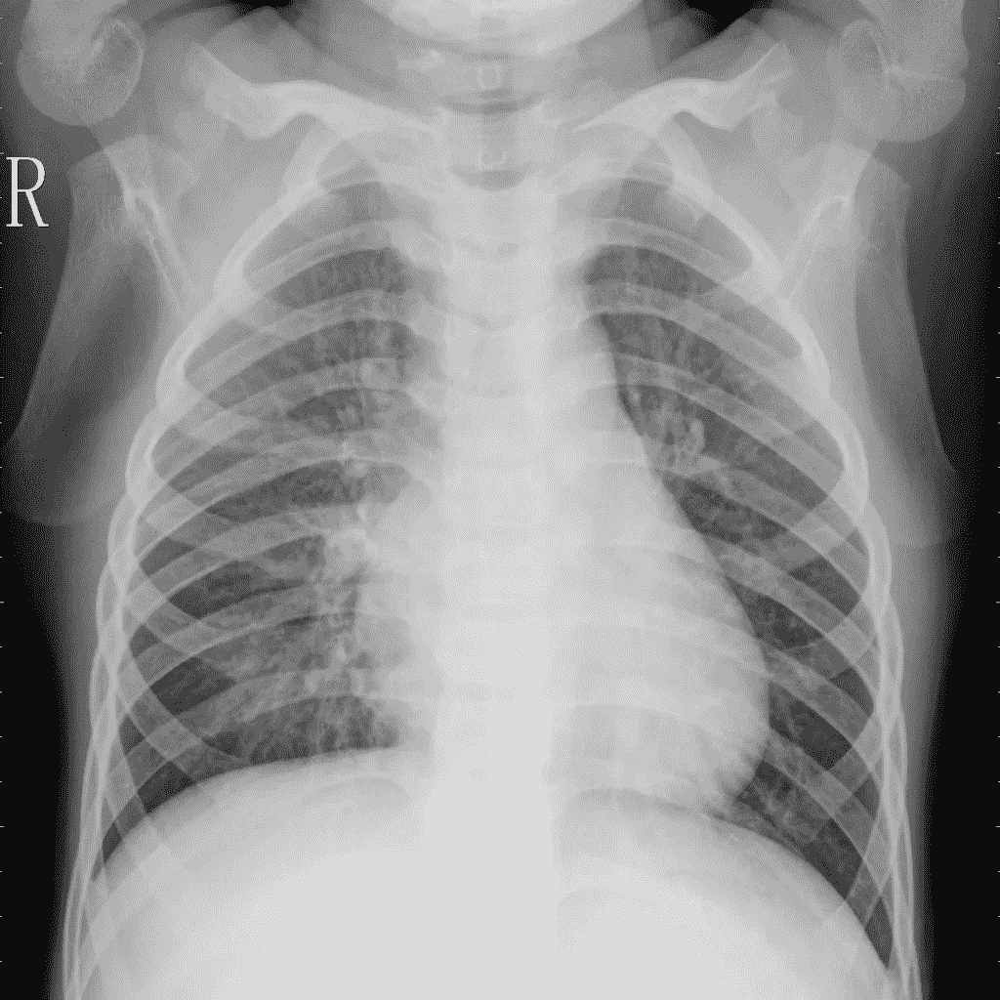

# 使用胸部 X 射线图像检测新冠肺炎

> 原文：<https://medium.com/analytics-vidhya/detecting-covid-19-using-chest-x-ray-images-a6fc822b73cc?source=collection_archive---------11----------------------->



# 介绍

新冠肺炎就像你小时候养成的坏习惯，现在无论如何都不愿意离开。显然，我们都是这种情况的受害者。但这次不一样。

这家伙在杀人。在过去的几个月里，我们听到的都是数字，说明一个地区的死亡人数，或者受影响的人数。最糟糕的是，这个数字增长如此之快，以至于我们不得不呆在家里过正常的生活。是啊，我知道。这不可能。此外，自疫情以来，许多人失去了工作，研究团队仍然没有积极的迹象。

有许多机构致力于检测新冠肺炎患者，并在必要时给予他们适当的药物治疗以增进健康。但问题是，该测试需要 3-4 天才能最终确定患者的报告，这是非常危险的，因为这种疾病非常容易传播(不像你高中时喜欢的人)。所以，我突然想到，如果有更好的方法来测试病人，不需要 3-4 天就能出报告，会怎么样？？

# 履行

经过一番研究，我发现了一个 [Kaggle](https://www.kaggle.com/tawsifurrahman/covid19-radiography-database) 数据集，里面有不同人的胸部 x 光图像，这些图像主要分为三类:<正常>、<病毒性肺炎>、<新冠肺炎>。现在，对于一些人来说似乎只是一组图像，对于像我这样的数据科学爱好者来说，却发现了分类问题。在深入研究完整的实现之前，需要导入一些库才能正常工作。下面是相同的代码片段。

```
%matplotlib inline
import os
import shutil
import random
import torch
import torchvision
import numpy as np

from PIL import Image
from matplotlib import pyplot as plt
torch.manual_seed(0)
from torch.autograd import Variable
print('Using PyTorch version', torch.__version__)
```

如果上面的代码运行良好，输出将显示如下:

```
Using PyTorch version 1.6.0+cpu
```

我开始处理数据集，首先要执行的操作是将数据分成训练集和测试集。下面是我如何执行任务的代码片段。

```
class_names = ['normal', 'viral', 'covid']
root_dir = 'archive/COVID-19 Radiography Database'
source_dirs = ['NORMAL', 'Viral', 'COVID-19']if os.path.isdir(os.path.join(root_dir, source_dirs[1])):
    os.mkdir(os.path.join(root_dir, 'test')) for i, d in enumerate(source_dirs):
        os.rename(os.path.join(root_dir, d), os.path.join(root_dir, class_names[i])) for c in class_names:
        os.mkdir(os.path.join(root_dir, 'test', c)) for c in class_names:
        images = [x for x in os.listdir(os.path.join(root_dir, c)) if x.lower().endswith('png')]
        selected_images = random.sample(images, 30)
        for image in selected_images:
            source_path = os.path.join(root_dir, c, image)
            target_path = os.path.join(root_dir, 'test', c, image)
            shutil.move(source_path, target_path)
```

准备数据集文件夹后的下一步操作是创建一个自定义数据集类，用于循环访问数据集。这个自定义类继承了一个抽象类**数据集**

并重写两个重要的方法:

1.  `**__len__**`以便`**len(dataset)**`返回数据集的大小。
2.  `**__getitem__**`支持索引，这样`**dataset[i]**`可以用来获取第 I 个样本

我们的数据集将接受一个可选参数 **transform** ，这样任何需要的处理都可以应用到样本上。

下面是我如何创建我的自定义类:

```
class ChestXRayDataset(torch.utils.data.Dataset):
    def __init__(self, image_dirs, transform):
        def get_images(class_name):
            images = [x for x in os.listdir(image_dirs[class_name]) if x[-3:].lower().endswith('png')]
            print(f'Found {len(images)} {class_name} examples')
            return images

        self.images = {}
        self.class_names = ['normal', 'viral', 'covid']

        for class_name in self.class_names:
            self.images[class_name] = get_images(class_name)

        self.image_dirs = image_dirs
        self.transform = transform

    def __len__(self):
        return sum([len(self.images[class_name]) for class_name in self.class_names])

    def __getitem__(self, index):
        class_name = random.choice(self.class_names)
        index = index % len(self.images[class_name])
        image_name = self.images[class_name][index]
        image_path = os.path.join(self.image_dirs[class_name], image_name)
        image = Image.open(image_path).convert('RGB')
        return self.transform(image), self.class_names.index(class_name)
```

遇到的一个问题是样本大小不同。大多数神经网络期望固定大小的图像。因此，我们对训练和测试数据集执行一些预处理，如下所示:

```
train_transform = torchvision.transforms.Compose([
    torchvision.transforms.Resize(size = (224,224)),
    torchvision.transforms.RandomHorizontalFlip(),
    torchvision.transforms.ToTensor(),
    torchvision.transforms.Normalize(mean =[0.485,0.456,0.406],std=[0.229,0.224,0.225]),    
])test_transform = torchvision.transforms.Compose([
    torchvision.transforms.Resize(size = (224,224)),
    torchvision.transforms.ToTensor(),
    torchvision.transforms.Normalize(mean =[0.485,0.456,0.406],std=[0.229,0.224,0.225]),    
])
```

接下来，我们创建一个字典，将关键字作为不同的类名(normal、viral 和 COVID)，每个关键字的值将是它们对应的目录，在该目录中存储该类的图像。之后，我们通过传递训练和测试字典以及它们各自的转换作为参数来创建自定义数据集类的两个对象。下面是相同的代码片段。

```
train_dirs = {
    'normal': 'archive/COVID-19 Radiography Database/normal',
    'viral': 'archive/COVID-19 Radiography Database/viral',
    'covid': 'archive/COVID-19 Radiography Database/covid'
}train_dataset = ChestXRayDataset(train_dirs,train_transform)test_dirs = {
    'normal': 'archive/COVID-19 Radiography Database/test/normal',
    'viral': 'archive/COVID-19 Radiography Database/test/viral',
    'covid': 'archive/COVID-19 Radiography Database/test/covid'
}test_dataset = ChestXRayDataset(test_dirs,test_transform)
```

如果一切正常，将显示以下输出:

对于培训对象:

```
Found 1311 normal examples
Found 1315 viral examples
Found 189 covid examples
```

对于测试对象:

```
Found 30 normal examples
Found 30 viral examples
Found 30 covid examples
```

下一步是将上一步中创建的对象传递给具有特定批处理大小的数据加载器。数据加载器的目的是允许更容易地实现块读取和动态批量大小(例如，通过每次产生一个批量样本)。下面是我如何定义我的数据加载器的代码片段

```
batch_size = 6dl_train = torch.utils.data.DataLoader(train_dataset, batch_size=batch_size, shuffle=True)
dl_test = torch.utils.data.DataLoader(test_dataset, batch_size=batch_size, shuffle=True)print('Number of training batches', len(dl_train))
print('Number of test batches', len(dl_test))
```

如果一切正常，将显示以下输出:

```
Number of training batches 470
Number of test batches 15
```

现在，是时候进行一些可视化了。让我们创建一个函数，该函数通过数据加载器迭代器获取真实标签、预测标签和一组图像，并显示一组图像，如果预测正确，即如果图像的预测标签与图像的真实标签匹配，则预测标签将以绿色显示在图像的一侧，如果预测错误，则预测标签将以红色显示。由于我们没有训练我们的模型，我们现在将把真实标签作为预测标签传递。

下面是相同的代码片段:

```
class_names = train_dataset.class_namesdef show_images(images, labels, preds):
    plt.figure(figsize=(8, 4))
    for i, image in enumerate(images):
        plt.subplot(1, 6, i + 1, xticks=[], yticks=[])
        image = image.numpy().transpose((1, 2, 0))
        mean = np.array([0.485, 0.456, 0.406])
        std = np.array([0.229, 0.224, 0.225])
        image = image * std + mean
        image = np.clip(image, 0., 1.)
        plt.imshow(image)
        col = 'green'
        if preds[i] != labels[i]:
#             print("label",labels[i])
            col = 'red'

        plt.xlabel(f'{class_names[int(labels[i].numpy())]}')
        plt.ylabel(f'{class_names[int(preds[i].numpy())]}', color=col)
    plt.tight_layout()
    plt.show()
```

现在，我们遍历 dataloader 来传递一批图像，并将其传递给我们刚刚创建的函数。

```
images,labels = next(iter(dl_train))
show_images(images,labels,labels)
```

如果一切正常，您将看到如下输出:



带标签的样本数据集

现在，我总是想为一个看起来很有前途的任务创建自己的神经网络模型，但后来我决定使用预先训练的模型，然后使用迁移学习来解决分类问题。我脑海中浮现的第一个名字是“Resnet18 ”,正如伊恩·古德菲勒和吴恩达所说，“这是我的想法，在这里会非常合适”。由于我使用 Pytorch，所以我很容易就获得了 resnet18 预训练模型。下面是我如何获得预训练 ResNet 模型的代码片段。

```
resnet18 = torchvision.models.resnet18(pretrained=True)
print(resnet18)
```

如果一切正常，将显示 Resnet18 的网络架构。

接下来，让我们修改预训练模型的最后一个 FC 层，它具有 512 个输入特征和 1000 个输出特征，因为 ResNet 被训练的类的数量是 1000。但是，在我们的例子中，只有三个。然后，我们将**交叉熵损失**分配给模型，因为它是分类任务的明显选择，并使用**亚当**作为学习速率为 **4e-5** 的优化器

下面是相同的代码片段:

```
resnet18.fc = torch.nn.Linear(in_features=512, out_features=3)
loss_fn = torch.nn.CrossEntropyLoss()
optimizer = torch.optim.Adam(resnet18.parameters(), lr=4e-5)
```

接下来，让我们创建另一个函数，该函数将通过迭代 dataloader 并向修改后的 ResNet 模型传递一批图像来进行预测，并使用我们之前创建的函数显示结果。下面是预测函数的代码片段:

```
def show_preds():
    resnet18.eval()
    images, labels = next(iter(dl_test))
    outputs = resnet18(images)
    _, preds = torch.max(outputs, 1)
    show_images(images, labels, preds)
```

然后，我们为最后一部分创建另一个函数，即模型的训练。我们只需循环遍历我们的数据迭代器，将输入馈送给网络并进行优化。

下面是我如何创建训练函数来训练模型的代码片段。

```
def train(epochs):
    print('Starting training..')
    for e in range(0, epochs):
        print('='*20)
        print(f'Starting epoch {e + 1}/{epochs}')
        print('='*20) train_loss = 0.
        val_loss = 0. resnet18.train() # set model to training phase for train_step, (images, labels) in enumerate(dl_train):
            optimizer.zero_grad()
            outputs = resnet18(images)
            loss = loss_fn(outputs, labels)
            loss.backward()
            optimizer.step()
            train_loss += loss.item()
            if train_step % 20 == 0:
                print('Evaluating at step', train_step) accuracy = 0 resnet18.eval() # set model to eval phase for val_step, (images, labels) in enumerate(dl_test):
#                     print(type(images),images)
                    outputs = resnet18(images)
                    loss = loss_fn(outputs, labels)
                    val_loss += loss.item() _, preds = torch.max(outputs, 1)
                    accuracy += sum((preds == labels).numpy()) val_loss /= (val_step + 1)
                accuracy = accuracy/len(test_dataset)

                print(f'Validation Loss: {val_loss:.4f}, Accuracy: {accuracy:.4f}') show_preds() resnet18.train() if accuracy >= 0.95:
                    print('Performance condition satisfied, stopping..')
                    break train_loss /= (train_step + 1)
        print(f'Training Loss: {train_loss:.4f}')
    print('Training complete..')
```

让我们称火车函数 py 通过时期=1:

```
train(epochs=1)
```

如果一切正常，训练将会开始，将会显示如下输出:



培训阶段

恭喜，培训已经完成，我们的模型现在可以保存和测试了。让我们首先保存模型:

```
torch.save(resnet18,'./model.pth')
```

记住，我们创建了一个预测函数。现在是打电话的最佳时机。

```
show_preds()
```

输出:



测试阶段

# 预测单幅图像上的类别标签

到目前为止，我们已经在不同批次的图像上训练了我们的模型。现在是在单个图像输入上测试它的时候了。为此，我们需要首先转换输入，就像我们转换测试图像一样。之后，我们加载保存的模型的权重，将模式更改为 evaluation，并将图像作为输入进行传递，以产生输出张量。然后，使用字典映射，我们返回预测的标签。

```
model = torch.load('./model.pth')
model.eval()loader = torchvision.transforms.Compose([
    torchvision.transforms.Resize(size = (224,224)),
    torchvision.transforms.ToTensor(),
    torchvision.transforms.Normalize(mean =[0.485,0.456,0.406],std=[0.229,0.224,0.225]),    
])
def image_loader(image_name):
    """load image, returns cuda tensor"""
    image = Image.open(image_name).convert('RGB')
    image = loader(image).float()
    image = Variable(image, requires_grad=True)
    image = image.unsqueeze(0)
    return image#pass the path of the image to be tested
image = image_loader('archive/COVID-19 Radiography Database/test/viral/Viral Pneumonia (416).png')res_dict = {0:"Normal",1:"Viral",2:"Covid"}
output = model(image)
# print(output)
_, preds = torch.max(output, 1)
# print(preds)
print(res_dict[preds.tolist()[0]])
```

# 输入图像



要验证的图像

# 输出

```
Viral
```

记住一件事，在创建输出字典时，我们需要注意训练时分配的类的顺序。这里[0]对应正常，[1]对应病毒性，[2]对应 COVID。

# 结论

就是这样。我们已经成功创建了一个分类模型，该模型可以对一个人进行胸部 x 光检查，并预测这个人是正常的，即健康的，还是有病毒的，或者是受 COVID 影响的。这个问题的完整代码实现可以在我的 [Github](https://github.com/sjaishanker/Covid19-Detection-Using-Chest-X-Ray-Images) 库中找到。

研究是当务之急，至少尝试成为希望让我们的生活更安全、更健康的群体的一员，这种感觉很好。