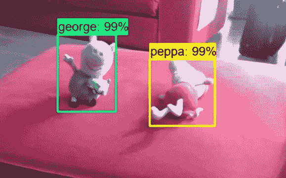
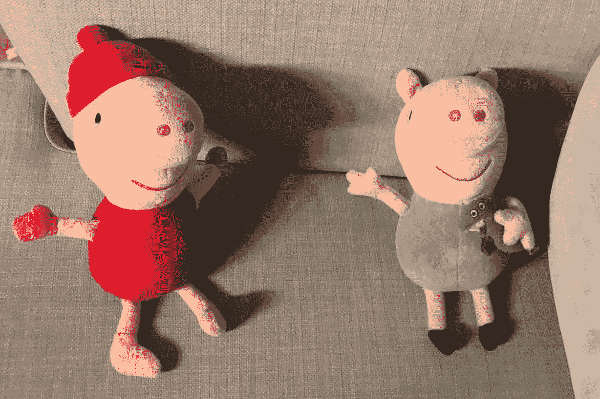
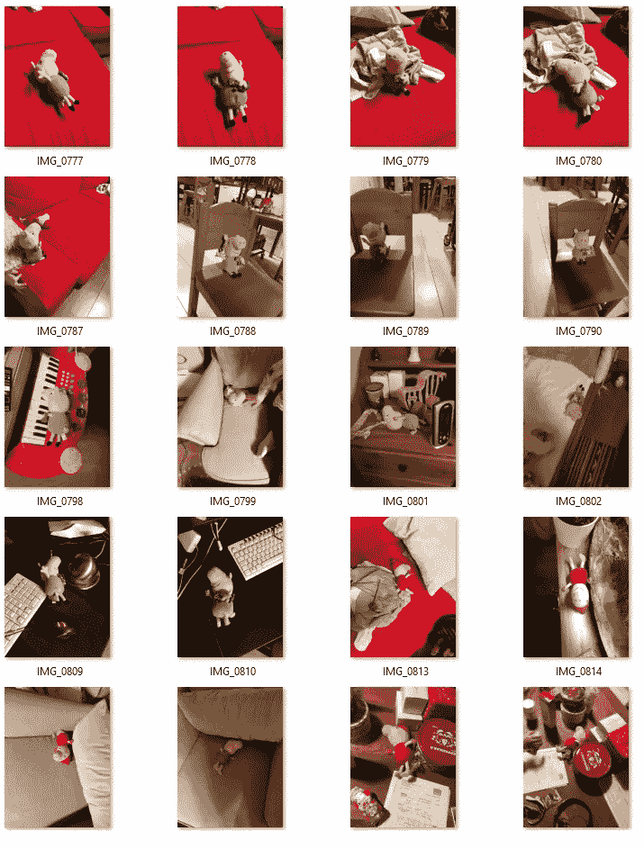
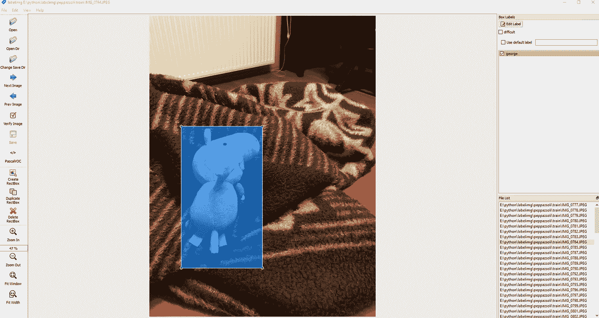
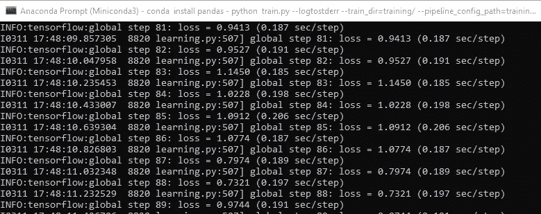
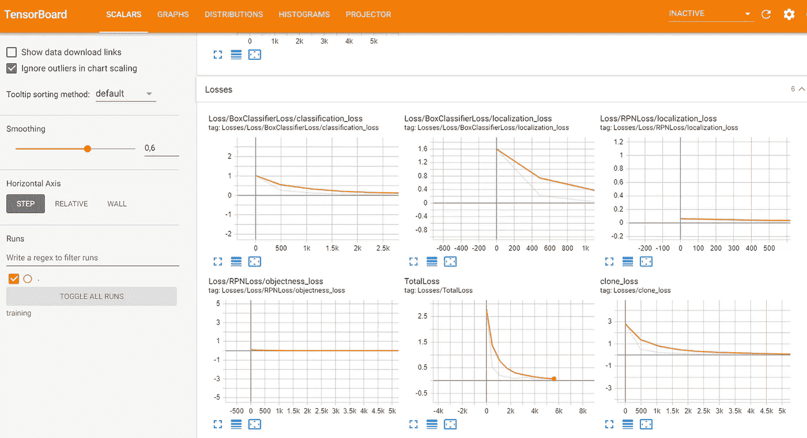
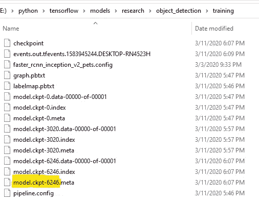

# 利用 Tensorflow 和 OpenCV 检测视频流中的自定义对象

> 原文：<https://medium.com/analytics-vidhya/detecting-custom-objects-on-video-stream-with-tensorflow-and-opencv-34406bd0ec9?source=collection_archive---------6----------------------->



在本系列的第一篇文章中，我在一台 Windows 10 机器上安装了 Tensorflow Object Detection API，并对静态图像进行了测试。在[的下一篇文章](/@daniel.schwalm/real-time-object-detection-with-tensorflow-object-detection-api-and-opencv-9c9430a18fdf)中，我向你展示了如何使用网络摄像头检测视频流中的基本对象。
在这篇文章中，我将向你展示如何在视频流中检测你自己的自定义对象。

# 先决条件

为了正确地遵循本教程，我建议阅读我以前的两篇文章，因为在本教程中，我将假设您已经设置了 Tensorflow 对象检测 API，并使用网络摄像机视频流通过内置模型运行。

# 定义自定义对象

任何预训练模型的限制，如我们在上一篇文章中使用的*SSD _ mobilenet _ v1 _ coco _ 2017 _ 11 _ 17*模型，都只能检测那些对其进行训练的图像类。*SSD _ mobilenet _ v1 _ coco _ 2017 _ 11 _ 17*模型在 **80 个不同的对象类**上进行训练，包括火车、人或者不同种类的水果。如果你想检测别的东西，你必须创建你自己的模型，并在你自己的物体上训练它。幸运的是，我们不必从头开始创建我们的模型，我们可以使用 Tensorflow 轻松地进行迁移学习，我将很快向您展示如何操作。

我的最终目标是为我的花园建造一个鸟类探测器。我花园里最常来的游客是喜鹊和斑鸠。它们是不同种类的鸟，但从物体探测的角度来看，它们有些相似。它们有头、翅膀和尾巴，区分它们不像比较橘子和火车。因此，在我的实验中，我想选择两个有些相似但能被人类区分的物体。我选择了卡通系列《粉红猪小妹》中我女儿最喜欢的两个角色——粉红猪小妹和乔治。我女儿两个玩具都有，所以我可以在客厅里玩。



# 拍摄图像

创建我们自己的模型的第一步是以不同对象的图像的形式获得训练数据。我在公寓的不同地点拍了大约 30 张乔治和 30 张粉红猪小妹的照片。我还拍了大约 30 张照片，在同一张照片中可以看到他们两个。

> 小贴士#1 :你拍的照片越多越好，但是一开始你不应该在这上面花太多时间。总共大约 100 幅图像对于第一轮训练应该足够了。确保你在不同的地点拍照，你的物体应该从不同的角度拍摄，有不同的背景。



拍摄图像后，将它们分成训练图像和测试图像。创建一个*训练*和一个*测试*文件夹，将 80%的图像放入*训练*文件夹，同时将 20%的图像放入*测试*文件夹。请确保将图像分为训练集和测试集，以便根据图像在整个图像集中的分布正确地表示图像。

# 标记图像

为了训练模型，我们必须在每张图像上标记出我们的对象的位置。我用了一个叫做 [LabelImg](https://tzutalin.github.io/labelImg/) 的工具来给图片加标签。下载最新版本，并通过在对象周围创建边界框来开始标记。



# 准备培训数据

给你的图片贴上标签后，你会有一个各自的。每个图像的 xml 文件。
这个。xml 格式不适合直接在 Tensorflow 中训练我们的模型，我们必须将。xml 文件转换成。csv 格式，然后将。csv 文件转换为 TFRecords。
我创建了一个小脚本来完成以上所有工作，你可以在我的 [github 资源库](https://github.com/dschwalm/deeplearning/blob/master/tensorflow/object_detection/scripts/configure_training.py)中找到它。
你可以这样称呼它:

```
python configure_training.py -imageRoot e:/python/labelimg/peppazsoli -labelMap "peppa:1,george:2" -labelMapOutputFile e:/python/tensorflow/models/research/object_detection/training\labelmap.pbtxt
```

它将:

*   转换。xml 文件转换成。csv 文件
*   转换。csv 文件转换为 TFRecords
*   为训练生成标签映射文件

# 配置我们的预训练模型

这次我们将使用与 [Tensorflow 模型 zoo](https://github.com/tensorflow/models/blob/master/research/object_detection/g3doc/detection_model_zoo.md) 不同的模型，即*faster _ rcnn _ inception _ v2 _ coco _ 2018 _ 01 _ 28*模型。
下载并提取 *object_detection* 文件夹中的模型。

在物体检测文件夹中创建一个*训练*文件夹。在这里，我们将收集培训所需的所有文件。
从 *sample* 文件夹复制*faster _ rcnn _ inception _ v2 _ pets . config*文件到 *training* 文件夹。打开文件，提供类的数量为 2，如下所示。还要根据您的路径修改需要文件路径的行:

```
…
num_classes: 2
…
fine_tune_checkpoint: "e:/python/tensorflow/models/research/object_detection/faster_rcnn_inception_v2_coco_2018_01_28/model.ckpt"
…
train_input_reader: {
  tf_record_input_reader {
    input_path: "e:/python/labelimg/peppazsoli/train.record"
  }
  label_map_path: "e:/python/tensorflow/models/research/object_detection/training/labelmap.pbtxt"
}
…
eval_input_reader: {
  tf_record_input_reader {
    input_path: "e:/python/labelimg/peppazsoli/test.record"
  }
  label_map_path: "e:/python/tensorflow/models/research/object_detection/training/labelmap.pbtxt"
  shuffle: false
  num_readers: 1
}
```

# 进行培训

最后，我们可以开始训练我们的模型。
将*object _ detection/legacy/train . py*复制到 *object_detection* 文件夹本身，并在该文件夹中用下面的命令调用它:

```
python train.py --logtostderr --train_dir=training/ --pipeline_config_path=training/faster_rcnn_inception_v2_pets.config
```

培训应该开始，根据您系统的性能，可能需要一段时间，直到损失达到可接受的水平。



您可以通过打开一个新的命令提示符并在 *object_detection* 文件夹*中发出以下命令来使用 TensorBoard 跟踪丢失*

```
tensorboard --logdir=training
```

因此，TensorBoard 应该可以从您的浏览器访问到 [http://localhost:6006/](http://localhost:6006/) 。

您也可以在图表上看到损失在减少:



> **提示#2** :我执行我的模型，直到损失达到 0.01 左右，这在我的 GPU 上花了大约 1.5 个小时。一般来说，你应该运行模型，直到损失明显减少。

按 Ctrl + C 按钮停止训练。

# 执行对象检测

作为培训的结果，在您的*培训*文件夹中创建了几个文件。搜索 *model.ckpt-xxxx* 文件的最高索引，并记下最高编号。我的情况是 6246。



为了运行模型，我们需要导出训练期间生成的推理图。您可以通过调用 *object_detection* 文件夹中的以下命令来实现:

```
python export_inference_graph.py --input_type image_tensor --pipeline_config_path training/faster_rcnn_inception_v2_pets.config --trained_checkpoint_prefix training/model.ckpt-6246 --output_directory inference_graph
```

因此，推理图将被导出到名为*freezed _ inference _ graph . Pb*的文件中的*推理图*文件夹中。我们将使用这个文件来运行我们在 github 资源库中找到的 [Jupyter 笔记本](https://github.com/dschwalm/deeplearning/blob/master/tensorflow/object_detection/webcam_detection_custom.ipynb)中的模型。

# 估价

根据上面的视频，你可以看到这个模型远非完美。主要问题是:

*   该模型经常混淆 Peppa 和乔治。这很自然，因为它们非常相似，尤其是从某些角度来看。为了解决这个问题，我们需要这两个人更多的训练图像。
*   该模型将其他对象分类为 Peppa 或 George，例如人、灯泡或狗。我认为，除了训练图像数量少之外，主要原因是这些图像的背景不够多样。为了解决这个问题，我们需要更多的训练图像来判断混淆的物体是否也存在。

感谢您关注这一系列。作为下一步，我将尝试使用 IP 摄像头来探测物体。