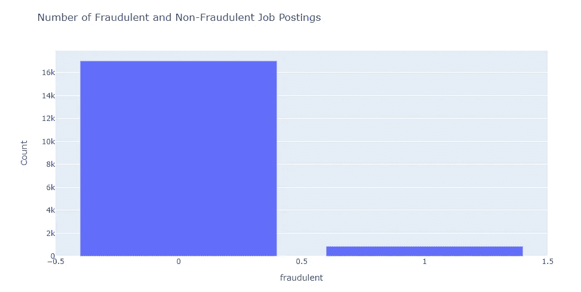
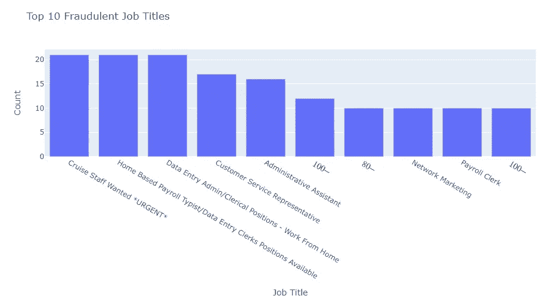
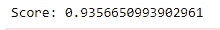

# 用随机森林模型检测虚假招聘

> 原文：<https://medium.com/analytics-vidhya/detecting-fake-job-postings-with-the-random-forest-model-c96493108901?source=collection_archive---------12----------------------->

申请工作不仅压力大，还需要向你申请的公司透露敏感信息，如你的姓名、联系方式和地址。

那么，如果你申请的公司根本不是一家公司，而是一个恶意的个人或组织在寻找利用你的个人信息的方法，会发生什么呢？


杰佛森·桑多斯在 [Unsplash](https://unsplash.com/s/photos/cybersecurity?utm_source=unsplash&utm_medium=referral&utm_content=creditCopyText) 上拍摄的照片

这个可怕的想法让我开始寻找数据集，我们可以利用数据科学的力量从招聘数据中检测出虚假职位。幸运的是，我在 Kaggle 上偶然发现了一个[数据集](https://www.kaggle.com/shivamb/real-or-fake-fake-jobposting-prediction)，由 Shivam Bansal 提供。这个数据集由近 18，000 个带有欺诈布尔列的职位发布组成，因此允许我们使用监督机器学习方法来预测职位发布是否具有欺诈性。

首先，我们将查看欺诈性职位发布与非欺诈性职位发布的比例。

```
import pandas as pd
import plotly.express as px# Read dataset
job_postings = pd.read_csv("fake_job_postings.csv")# Count fraudulent entries
count_fraudulent = job_postings.groupby('fraudulent').count()
count_fraudulent.reset_index(inplace=True)# Plot counts
fig = px.bar(count_fraudulent, x='fraudulent', y='job_id', 
             labels={'job_id': 'count'})
fig.show()
```



从图表中，我们可以看到 4.8%的招聘信息是虚假的。接下来，让我们看看哪些职位的欺诈性职位发布数量最多，因为有理由认为欺诈性职位发布与职位有关。

```
# Count fraudulent entries by job title
fraud_count_by_title = job_postings.groupby('title').sum()
fraud_count_by_title.reset_index(inplace=True)
fraud_count_by_title.sort_values('fraudulent', ascending=False, inplace=True)# Plot counts by top 10 job titles
fig = px.bar(fraud_count_by_title.iloc[:10], 
             x='title', y='fraudulent', 
             labels={'fraudulent': 'count'})
fig.show()
```



从这个图表中，我们看到大多数欺诈性招聘的职位名称是数据录入或巡航人员。还有一些数字没有标题，但用数值代替标题。这表明，如果你正在寻找一份更有可能合法的工作，避免巡航导弹工作人员或数据输入职位发布和那些没有合适的职位名称。

我们可以假设基于家庭或远程的职位发布更有可能是欺诈性的，因此我们将制作专栏来查看标题中是否包含“家庭”或“远程”字样。数据集中还有一个“远程办公”列，因此我们还将调查“家庭”和“远程”列与该列之间的关系。

```
# Extract into boolean columns job titles that contain 'home' or 'remote'
job_postings['home'] = job_postings['title'].str.contains('home')
job_postings['remote'] = job_postings['title'].str.contains('remote')# Check how many titles have 'home' or 'remote'
print(job_postings['home'].value_counts())
print(job_postings['remote'].value_counts())
print(job_postings['telecommuting'].value_counts())
```

“远程办公”列有 767 个真值，而“家庭”和“远程”列总共只有不到 50 个真值。尽管可能有更多的数据清理工作要做，但让我们继续努力，尝试预测欺诈性的职位发布。首先，我们的数据中有许多分类特征，因此我们将使用计数编码。

```
import category_encoders as cecount_enc = ce.CountEncoder()# Transform the features, rename the columns with the _count suffix, and join to dataframe
count_encoded = count_enc.fit_transform(job_postings[cat_features])
job_postings = job_postings.join(count_encoded.add_suffix("_count"))# Drop original categorical features and fill null values with 0
```

现在是有趣的事情！我们将使用随机森林分类器，根据我们的数据对招聘信息是否属于欺诈进行分类。

```
from sklearn.model_selection import train_test_split
from sklearn.ensemble import RandomForestClassifier
from sklearn.metrics import roc_auc_score# Make DataFrame for features
data = job_postings.drop(columns='fraudulent')# Split into train and test datasets
X_train, X_test, y_train, y_test = train_test_split(data,      job_postings['fraudulent'],                                           test_size=0.3, random_state=12)
rfc = RandomForestClassifier()
rfc.fit(X_train, y_train)predictions = rfr.predict(X_test)
score = roc_auc_score(y_test, predictions)
print('Score: {}'.format(score))
```



从这个模型中，我们得到 ROC 曲线下面积的 94%的分数。这相当不错，但我们必须记住，我们的数据中只有 4.8%是欺诈性的。未来的工作可能是使用自然语言处理从工作发布数据中提取更多的特征，并分层采样以解决采样不足的问题。

我希望这展示了机器学习和数据科学在欺诈检测中可以做的很酷的事情。我设想求职网站在接受招聘信息时可以使用这一点，这样更安全的招聘信息就会出现在求职网站上，更少的人成为骗局的受害者。