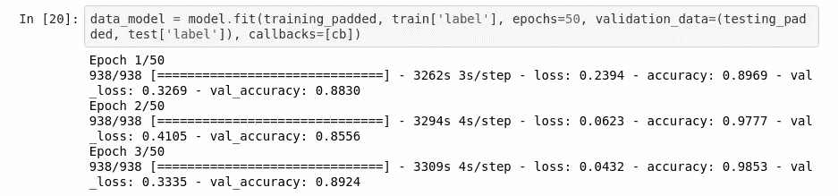

# 利用机器学习检测假新闻

> 原文：<https://medium.com/analytics-vidhya/detecting-fake-news-using-machine-learning-95efefab08e4?source=collection_archive---------13----------------------->


GIF [这里](https://www.google.com/url?sa=i&url=https%3A%2F%2Fgfycat.com%2Fgifs%2Fsearch%2Ftrump%2Bfake%2Bnews&psig=AOvVaw25OUcGmYa68TgzTIpaHotZ&ust=1592610370570000&source=images&cd=vfe&ved=0CAIQjRxqFwoTCKD7x43GjOoCFQAAAAAdAAAAABAa)

目前，最大的问题是 ***假新闻*** 。离开他们几乎是不可能的。

但是怎么用 ***机器学习*** 来预测什么是假新闻，什么不是呢？

在过去的 3 天里，我一直在研究这个问题，在这篇文章中，我将解释我如何构建一个能够仅凭新闻标题识别假新闻的机器学习模型。

> ***在开始之前:*** 这只是一个个人项目！我真的认为我们需要的不仅仅是标题来发现什么是 ***假新闻*** 什么不是！这里的*主要思想*是展示我们如何使用 ***机器学习方法******识别假新闻*** 。

基本上，这个项目分为 5 个步骤，让我们更好地看到它…

## 这些是我们在这个项目中的任务:

*   将数据输入我们的模型；
*   格式化数据；
*   将数据符号化；
*   建立我们的模型；
*   训练我们的模型；
*   做预测；

让我们开始吧，宝贝！

# 获取数据

对于这个项目，我使用了来自 [Kaggle](https://www.kaggle.com/) 的[假或真的新闻数据集](https://www.kaggle.com/clmentbisaillon/fake-and-real-news-dataset)。

这个 ***数据集*** 有 2 个 csv 文件，假的真的，我们可以下载合并成一个。

但是在将我们的数据集合并成一个之前，我们需要标记它们。我们想用 1 代表真，用 0 代表假。

为此，我们可以在每个名为“label”的 ***数据集*** 中添加一列，并将她的值指定为 1 代表真或 0 代表假，如下面的代码所示:

```
true[‘label’] = 1
fake['label'] = 0
```

其他好的做法是验证我们的 ***数据集*** 是否有 NaN 值，我们可以用*和 ***热图*** 图来验证它！*

```
*plt.figure(figsize=(12, 8))
sns.heatmap(data.isnull(), cmap='viridis')*
```

*这样做之后，我们可以使用下面的代码将我们的 ***数据集*** 合并成一个:*

```
**# Concating:*

data = pd.concat([true, fake], axis=0)
data*
```

*我在 ***数据集*** 中做了一些其他的修改，万一我将来再次使用它，你可以在[这个笔记本](https://github.com/gabrielmayers/fake_news-ai/blob/master/Data_Preparation.ipynb)中看到所有修改的笔记本。*

*现在我们可以保存我们的 ***数据集*** ，如下面的代码所示:*

```
**# To csv:* data.to_csv(‘data.csv’)*
```

*我们已经完成了前两个任务，现在，我们可以开始对 ***的*** 数据进行令牌化了！*

# *将数据符号化*

*基本上，当你将数据标记化时，你将单词转换成数字，即 ***机器学习模型*** 的语言。*

*你可以在[这本笔记本](https://github.com/gabrielmayers/fake_news-ai/blob/master/Model.ipynb)里看到 ***去符号化*** 的过程。*

*为了标记我们的数据，我们想要使用 Tensorflow 预处理库，首先我们想要导入它:*

```
***from** **tensorflow.keras.preprocessing.text** **import** Tokenizer
**from** **tensorflow.keras.preprocessing.sequence** **import** pad_sequences*
```

*我们想使用*填充序列*来使所有的数字向量具有相同的长度，你可以在[的](https://www.tensorflow.org/api_docs/python/tf/keras/preprocessing/sequence/pad_sequences)中阅读更多关于*填充序列*的内容。*

*现在，我们想通过使用下面的代码来标记我们的数据:*

```
*train = df[:30000]
test = df[30000:]

train_sentences = train['title'].tolist()
test_sentences = test['title'].tolist()vocab_size = 5000
embedding_dim = 16
max_length = 500
trunc_type = 'post'
padding_type = 'post'
oov_tok = '<OOV>'tokenizer = Tokenizer(num_words=vocab_size, oov_token=oov_tok)
tokenizer.fit_on_texts(train_sentences)
word_index = tokenizer.word_index

training_sequences = tokenizer.texts_to_sequences(train_sentences)
training_padded = pad_sequences(training_sequences, maxlen=max_length, padding=padding_type)

testing_sequences = tokenizer.texts_to_sequences(test_sentences)
testing_padded = pad_sequences(testing_sequences, maxlen=max_length, padding=padding_type, truncating=trunc_type)*
```

*现在，我们已经完成了数据 的 ***标记化过程，让我们构建我们的 ***模型*** 。****

# *构建模型*

*我们将用 ***LSTM 的*** 来建造我们的 ***模型*** 。*LSTM 的具有记忆的优势，这在我们处理语音、文本和股票价格等序列数据时非常有用。基本上，当过去对预测很重要时，我们有连续的数据！**

**你可以在[这篇文章](https://machinelearningmastery.com/time-series-prediction-lstm-recurrent-neural-networks-python-keras/)中了解更多关于 ***LSTM 的*** 。**

**你可以在[这个笔记本](https://github.com/gabrielmayers/fake_news-ai/blob/master/Model.ipynb)里看到 ***建筑模型*** 流程。**

**除此之外，我们将使用[***tensor flow***](https://www.tensorflow.org/)来构建我们的模型！**

```
**model = tf.keras.models.Sequential()

model.add(tf.keras.layers.Embedding(vocab_size, embedding_dim, input_length=max_length))
model.add(tf.keras.layers.Bidirectional(
    tf.keras.layers.LSTM(300, dropout=0.3, recurrent_dropout=0.3)
))
model.add(tf.keras.layers.Dense(1, activation='sigmoid'))

model.summary()**
```

**我们将使用[二元交叉熵](https://towardsdatascience.com/understanding-binary-cross-entropy-log-loss-a-visual-explanation-a3ac6025181a)损失函数和[亚当优化器](https://machinelearningmastery.com/adam-optimization-algorithm-for-deep-learning/)来编译我们的模型:**

```
**model.compile(optimizer='adam',
              loss='binary_crossentropy',
              metrics=['accuracy'])**
```

**我们将从我们的 ***型号*** 增加一个[回调](https://www.tensorflow.org/api_docs/python/tf/keras/callbacks/EarlyStopping)来提高火车的时间:**

```
**cb = tf.keras.callbacks.EarlyStopping(monitor='val_loss', patience=2)**
```

**而现在，是时候训练宝宝了！**

```
**data_model = model.fit(training_padded, train['label'], epochs=50, validation_data=(testing_padded, test['label']), callbacks=[cb])**
```

**让我们看看我们的结果:**

****

**还不错…**

**如你所见，我通过了设置为***validation _ data***的测试，但是可以随意使用它进行预测！**

**实际上，我们可以通过改变*的超参数或者使用文本而不仅仅是新闻标题来改进这个 ***模型*** 。***

**但是现在，这是一个很好的方法！**

**我希望你喜欢这个实际的例子！**

**目前，这就是全部！**

**下次见！**

 **[## 在我的 VIP 内容列表订阅！

gabrielmayer.mp](https://mailchi.mp/42ad4556e7c5/sub-medium)** 

# **在社交网络上与我联系**

**https://www.linkedin.com/in/gabriel-mayer-779b5a162/***领英:*****

**https://github.com/gabrielmayers***github:*****

**https://www.instagram.com/gabrielmayerl/***insta gram:*****

**https://twitter.com/gabrielmayerss***推特:*****