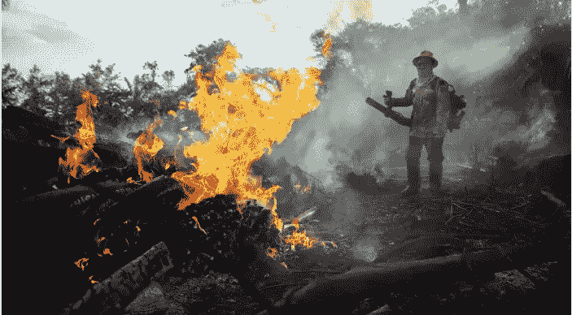
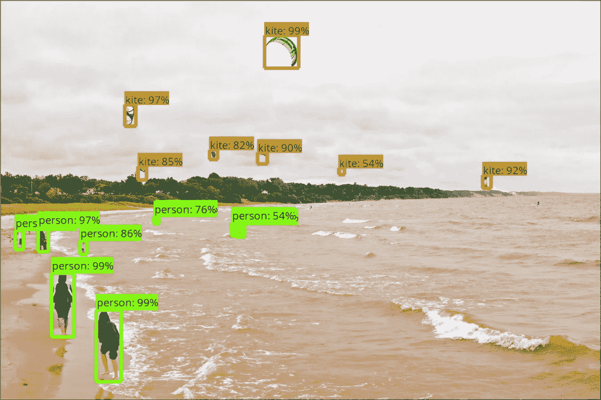

# 使用张量流检测火灾

> 原文：<https://medium.com/analytics-vidhya/detecting-fires-using-tensorflow-b5b148952495?source=collection_archive---------5----------------------->

来源:[https://www . ft . com/content/1 ba 48 B1 a-cd69-11e 9-b018-ca 4456540 ea 6](https://www.ft.com/content/1ba48b1a-cd69-11e9-b018-ca4456540ea6)

不言而喻，驯服火是人类最伟大的成就之一，并使我们成为今天这样一个社会。但是，尽管它有令人惊奇的积极作用，不必要的火灾仍然是我们每天面临的一个问题，在它们蔓延之前检测它们是绝对必要的。

本文旨在使用机器学习来检测视频中的火灾，具体讲讲如何在计算机视觉上使用 Tensorflow 的对象检测 API 和 google cloud 开始。让我们开始吧。

PS:与本文相关的所有文件都可以在这个 github 资源库中找到[ [这里](https://github.com/popoago/Fire-Detection) ]。

# 背景

来源:[https://github . com/tensor flow/models/tree/master/research/object _ detection](https://github.com/tensorflow/models/tree/master/research/object_detection)

Tensorflow 的[对象检测 API](https://github.com/tensorflow/models/tree/master/research/object_detection) 是一个基于 TensorFlow 构建的开源框架，可以轻松构建、训练和部署对象检测模型。它提供了经过预训练的模型，易于阅读的文档有助于构建和部署强大的应用程序，并且支持 [tensorflow lite](https://www.tensorflow.org/lite/models/object_detection/overview) 以帮助您在手机上运行该模型。

API 接受 png 或 jpeg 格式的图像，以及边界框的坐标，特别是 xmin、ymin、xmax 和 ymax。

我使用过数据集可以从这里下载:

 [## steffensbola/furg-fire-数据集

### 一个数据集，用于比较不同的基于非稳态视频的火灾探测器的性能。每个视频文件都有一个…

github.com](https://github.com/steffensbola/furg-fire-dataset) 

虽然存储库不再更新，但是它包含了足够的例子来开始使用。您会注意到的第一件事是，在存储库中有多个正面和负面例子的视频以及相应的 xml 文件。xml 文件包含与视频中每一帧相关联的注释(标签)。因为模型需要图像和相关边界框坐标形式的数据，我们必须将上面的数据转换成 [TFRecord 文件格式](https://www.tensorflow.org/tutorials/load_data/tfrecord)。

虽然有一些文件可以将您的数据转换成所需的格式，如[**create _ Pascal _ TF _ record . py**](https://github.com/tensorflow/models/blob/master/research/object_detection/create_pascal_tf_record.py)**，**但它可能需要根据您的数据集进行修改。在这里，我创建了自己的脚本，它读取视频中的每一帧和相应的注释，并将它们分别存储在一个 image 和 xml 文件夹中，每隔 20 个 image 和 xml 存储在单独的文件夹中进行测试/验证。

可从[https://github . com/Popo ago/Fire-Detection/blob/master/dataset _ creation . ipynb](https://github.com/popoago/Fire-Detection/blob/master/dataset_creation.ipynb)获得

下一步是将 xml 文件转换成 csv 文件，这是我从这个优秀的[资源库](https://github.com/datitran/raccoon_dataset)中获得的，也是这篇博客的灵感来源。一旦为训练和测试(验证)集生成了 csv 文件，我们就使用[这个文件](https://github.com/popoago/Fire-Detection/blob/master/create_tf.py)创建 TFRecords，得到 train.record 和 val.record 文件。

除了记录文件，我们还需要标签映射，这是我们在 fire_label_map.pbtxt 中定义的。

它包含一个标签

我们还需要设置一个项目谷歌云开始培训。[这个库](https://github.com/floydhub/object-detection-template/blob/master/object_detection/g3doc/running_pets.md)解释了如何为[牛津-IIIT Pets 数据集](http://www.robots.ox.ac.uk/~vgg/data/pets/)做这件事，我已经为这个特殊的问题做了相应的编辑。在遵循创建 GCS bucket 的步骤之后，我们可以将上面创建的文件上传到 google cloud。

上传 tfrecord 和。pbtxt 文件

# 培养

设置好输入文件后，我们就可以开始训练了。我们需要确定的第一件事是我们将使用的模型。有很好的资源可以解释它们，其中一些我已经在这篇博客的结尾提到了。我选择的是[更快的 RCNN](https://arxiv.org/pdf/1506.01497) ，一种广泛用于对象检测任务的网络架构。尽管 [SSD](https://arxiv.org/pdf/1512.02325) 相对更快(咳咳)，但前者以速度为代价提供了更好的精度。我们首先要做的就是编辑**faster _ rcnn _ resnet 101 _ coco . config**文件。除了将 num_classes 更改为 1 并编辑检查点的路径以及输入和标签路径。然后，我们可以将上面的配置文件上传到我们的 GCS bucket。

对于你的问题，使用预先训练好的模型总是明智的。虽然检测火灾显然不是 COCO 数据集中的一个标签，但模型学习和捕捉的特征几乎总是比从头开始训练要好。下载并解包 [COCO-pretrained 用 Resnet-101 model](http://storage.googleapis.com/download.tensorflow.org/models/object_detection/faster_rcnn_resnet101_coco_11_06_2017.tar.gz) 更快的 R-CNN 后，我们也可以把这些文件上传到云端。

上传权重和配置文件。

在遵循文档中的剩余步骤之后，即打包对象检测代码并为我们的 Google Cloud ML 作业编写集群配置，我们可以通过在我们的机器上运行 [Tensorboard](https://www.tensorflow.org/tutorials) 来监控进度。

开始谷歌云培训

# 导出模型

模型经过训练后，需要导出到 Tensorflow graph proto，以便可以用于推理。

将检查点编号替换为您停止训练的位置

# 后续步骤

虽然该模型在给定的数据集上表现得相当准确，但由于训练图像有限，它不会给出很高的准确性。我在这里忽略的另一个因素是人们在处理视频时会观察到的闪烁，我计划在未来处理这个问题。

# 参考资料/资源

1.  [https://towards data science . com/deep-learning-for-object-detection-a-comprehensive-review-73930816 d8d 9](https://towardsdatascience.com/deep-learning-for-object-detection-a-comprehensive-review-73930816d8d9)
2.  [https://towards data science . com/how-to-train-your-own-object-detector-tensor flows-API-bec 72 ecfe 1d 9](https://towardsdatascience.com/how-to-train-your-own-object-detector-with-tensorflows-object-detector-api-bec72ecfe1d9)
3.  【https://machinelearningmastery.com/what-is-computer-vision/ 号
4.  [https://towards data science . com/going-deep-into-object-detection-bed 442d 92 b 34](https://towardsdatascience.com/going-deep-into-object-detection-bed442d92b34)