# 利用机器学习检测信用卡欺诈

> 原文：<https://medium.com/analytics-vidhya/detecting-fraudulent-credit-card-operations-with-machine-learning-algorithms-88670bf00275?source=collection_archive---------4----------------------->

照片由 [Freepik](https://www.freepik.com/freepik) 拍摄

## 用逻辑回归和决策树对信用卡交易进行分类和评估

本文将解决银行和客户主要关心的信用卡欺诈问题，以及通过**机器学习**技术检测欺诈操作的过程。

当有人从不安全的网站或通过身份盗窃计划访问您的信用卡或借记卡号码，以骗取金钱或财产时，通常会发生骗局。鉴于交易的反复发生及其可能对个人和金融机构造成的伤害，采取预防措施以及识别交易欺诈行为至关重要。

很有可能在某些情况下，当你试图进行简单的购物时，你的信用卡被封了，导致压力和尴尬。当这种情况发生时，您的银行或信用卡发行商可能已经检测到可疑活动，这有时只是一个*误报*。

由于每个客户和每项金融活动都有大量数据可用，**人工智能**可用于有效识别交易中的可疑模式。为了提高分析的准确性，许多机构正在投资改进人工智能算法。

照片由 [fullvector](https://www.freepik.com/fullvector) 在 [Freepik](https://www.freepik.com/) 上拍摄

# 关于数据

本项目中使用的数据集由 [Kaggle](https://www.kaggle.com/mlg-ulb/creditcardfraud) 提供，包含 2013 年 9 月欧洲持卡人的信用卡交易。报告的交易发生在两天内。

该数据集非常不平衡，因为在 284，807 笔交易中有 492 笔(0.17%)欺诈。

数据集中的所有要素都是数字。出于对客户保密的考虑，这些列被重命名为 V1、V2、…、V28，并且其特征经过了 [PCA](https://jakevdp.github.io/PythonDataScienceHandbook/05.09-principal-component-analysis.html) 转换，该转换包括将一个或多个最小的主成分归零，从而产生数据的低维投影，保留最大的数据方差。仅有的两个例外是特性`Time`和`Amount`，它们分别包含每个事务和数据集中第一个事务之间经过的秒数，以及事务数量。

特征`Class`是因变量，取值为:

*   **0** 为常规交易
*   **1** 欺诈活动

# 探索性分析

在这个分析中，我们使用了以下库。

让我们先来看看定期交易和欺诈交易在一段时间内的分布情况。

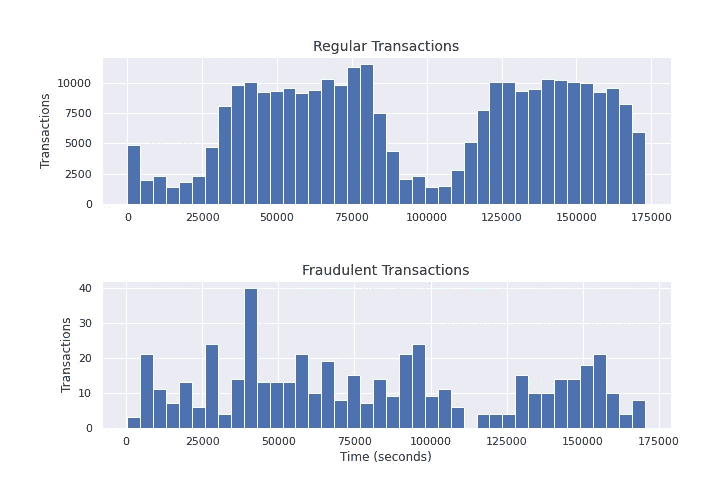

图表 1

虽然欺诈的数量明显少于正常交易的数量，但我们可以看到一种明显的行为，尤其是在 100，000 `Time`大关附近。

请注意，常规事务的数量在 90，000 秒左右急剧下降，在 110，000 秒左右再次激增。假设这段时间是在晚上，人们自然会比白天进行更少的购买和交易，这并不荒谬。

另一方面，在 100，000 马克左右发生了大量欺诈交易，这可以证实以前的假设，考虑到犯罪分子更喜欢在深夜实施欺诈，假设监控较少，受害者不会很快意识到自己被骗。当然，这只是一个假设。让我们拭目以待，看看我们的机器学习模型将如何解读这些数字。

用每笔交易的`Amount`做同样的分析，我们得到下面的结果。

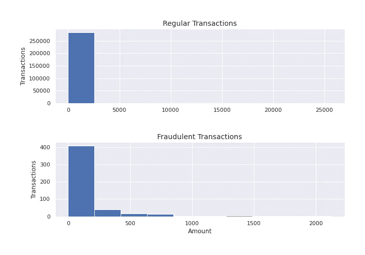

图表 2

至于交易的金额，显然我们无法从中获得重要的信息。大多数交易，无论是正常交易还是欺诈交易，都是“小额”交易。

但是，我们可以使用箱线图进行更深入的检查。

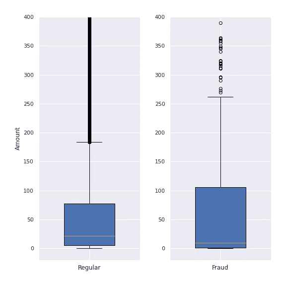

图表 3

同样，这两种分布之间没有很大的差异。现在让我们画一个相关矩阵来确定变量之间的相关性。

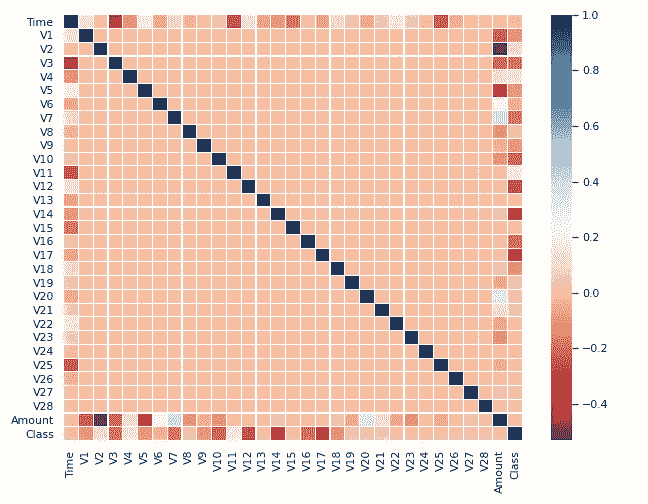

图表 4

我们没有观察到变量之间有任何强相关性。请记住，我们的数据是高度不平衡的。对数据进行预处理后，我们应该会看到一个*更好看的*相关矩阵*。*

现在我们可以开始处理我们的机器学习模型了。

# 机器学习模型

在建立机器学习模型之前，我们需要遵循三个步骤:

*   用`StandardScaler`对特征`Time`和`Amount`进行预处理
*   将数据集拆分为训练和测试数据
*   处理不平衡的数据集

## 预处理

`StandardScaler`将转换数据，使其分布具有平均值 0 和标准偏差 1。这是至关重要的一步，因为数据被转换为易于由机器学习算法解释。

## 分成训练和测试数据

在转换了`Amount`和`Time`特性之后，让我们将数据集分成训练和测试数据。测试数据的大小是默认值 0.25。

## 平衡数据集

正如我们之前提到的，数据集是高度不平衡的。由于类别分布中存在严重的偏斜(在 **Class = 0** 中有 284，315 个条目，在 **Class = 1** 中有 492 个条目)，我们的训练数据集可能会有偏差，并影响机器学习算法显示不令人满意的结果，例如，忽略条目较少的类别。

为了解决这个问题，我们将在`RandomUnderSampler`的帮助下随机平衡数据

让我们看看平衡数据集后我们的分布如何。

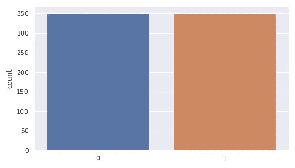

图表 5

注意，在数据集平衡的情况下，每个类有 351 个条目。让我们再次检查相关矩阵，看看我们是否能确定一些相关性。

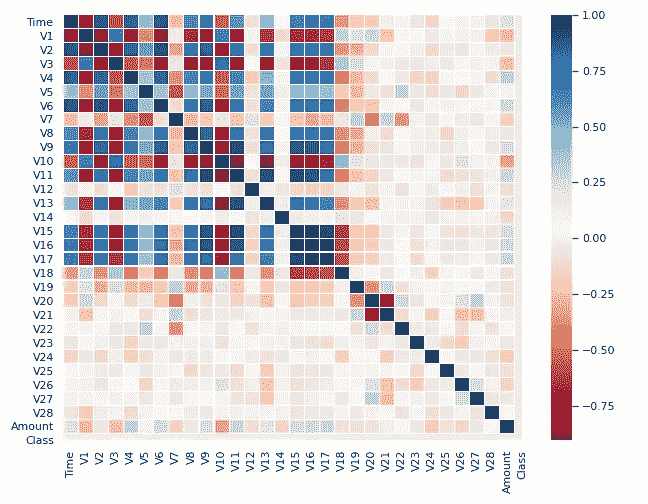

图表 6

请注意，对于平衡数据，我们的关联矩阵显示了一些特征之间有意义的关联，这与之前显示的关联矩阵不同。

完成这三个基本步骤后，我们就可以建立我们的机器学习模型了。

# 分类模型

我们将利用两种主要的机器学习分类方法:

*   逻辑回归
*   决策图表

## 逻辑回归

逻辑回归模型用于确定某一类别或事件存在的可能性。在我们的例子中，它将确定属于`Class` 0 或 1 的交易的概率，这是正常的还是欺诈的。

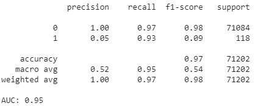

衡量预测的质量

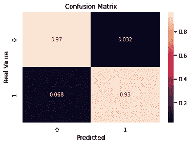

图表 7

请注意，该模型的准确率为 97%，ROC AUC 得分为 95%，这意味着我们的逻辑回归表现非常好。

从混淆矩阵中，我们可以得出结论，97%的常规交易被正确分类为常规交易(真否定)，93%的欺诈交易被准确分类为欺诈交易(真肯定)。

## 决策图表

我们已经看到逻辑回归模型表现良好。现在让我们看看决策树的表现。

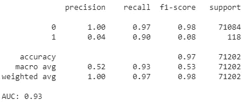

衡量预测的质量

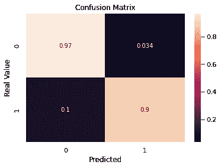

图表 8

决策树的表现也相当不错，准确率 97%，ROC AUC 评分 93%。真阴性和真阳性预测得很好，分别为 97%和 90%。

让我们绘制决策树，看看决策是如何通过其分支做出的。

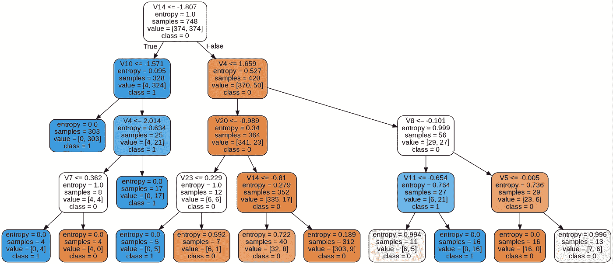

图表 9

注意决策是如何通过将输入划分成更小的决策节点和树叶来做出的。

# 结论

两个模型，**逻辑回归**和**决策树**在将信用卡活动分类为**常规交易**和**欺诈交易**时表现极佳，准确度、ROC AUC 得分和精确度均在 90%以上。虽然它们产生了相似的结果，但是**逻辑回归**显示了稍好的结果，具有更大的 ROC AUC 得分，这衡量了模型区分不同类别的能力。

必须指出预处理和平衡数据是多么重要。还记得在类数据平衡后，相关矩阵的表现有多好吗？

检测信用卡欺诈的机器学习算法非常高效，但仍有差距需要弥合。最大的问题之一是假阳性的发生，即当算法错误地检测到欺诈时。因此，我们一直在寻找减少超过 3%假阳性的方法。

完整代码请参考[笔记本](https://github.com/rmpbastos/data_science/blob/master/Credit_Card_Fraud_Detection.ipynb)。