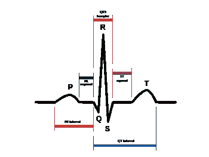

# 利用自回归特征检测心脏病

> 原文：<https://medium.com/analytics-vidhya/detecting-heart-diseases-using-auto-regressive-features-3fb4a7e53744?source=collection_archive---------17----------------------->

图片来自[freepik.com](https://www.freepik.com/free-photos-vectors/ecg)

在这篇文章中，我与 [Safwan Mansuri](https://medium.com/u/876d722660c0?source=post_page-----3fb4a7e53744--------------------------------) 和 [Nauman mansuri](https://medium.com/u/73c9d7177910?source=post_page-----3fb4a7e53744--------------------------------) 一起实现了一个使用患者心电信号的心跳分类系统。我们松散地实现了本文[https://doi.org/10.1111/exsy.12219](https://doi.org/10.1111/exsy.12219)中引用的程序，其中我们使用心电图信号的自回归特征来提取重要特征，以建立一个实质性的机器学习或深度学习模型。已经有多种方法可以实现这一任务，例如将 ECG 信号转换为图像，并将 ResNet、VGG16 或其他类型的 ConvNets 应用于训练。虽然所有这些方法都给出了有希望的结果，但它们在计算上相当昂贵，这就是我们使用的方法发挥作用的时候。

# 电脑起什么作用？

图片来自美国心脏协会

根据美国心脏协会的一份报告，每年有 356，000 例心脏骤停的紧急病例被报道。650 万 20 岁或 20 岁以上的人经历过心力衰竭并患有心力衰竭。在 2005 年至 2015 年期间，心力衰竭的发病率增加了惊人的 38%,预计这一数字在未来几年将呈天文数字增长。

在这个混乱的时期，每个人都有义务检查自己的健康，但不可能每隔几天就去医院检查一次。如果有一个移动应用程序或网络应用程序可以监测心跳，并提前警告人们潜在的心脏异常，这可能是整个世界的福音。记住人工智能系统已经变得多么精确，这在今天的时代是完全可能的！

# 心跳

人类心脏有 4 个腔室，包括 2 个心房和 2 个心室，它们交替收缩和舒张，将血液泵送到全身。我们心脏的这种收缩和放松就是我们所说的“心跳”，它导致我们心脏的电活动。心电图机通过产生如下所示的记录数据的电压-时间图来显示这种活动:

图片来自[维基百科](https://www.wikilectures.eu/w/Electrocardiogram)

如图所示，单个心跳波有 3 个子成分。这里有一个关于每一个组成部分的简要信息，没有进入太多的医学细节；

p 波:心房收缩的阶段。这是一个光滑、圆形的小肿块，表明心脏跳动的开始。

QRS 复合体:心室收缩的阶段。包括 3 个波

*   q 波:P 波之后的第一个负波，可能并不总是出现。
*   r 波:P 波或 Q 波之后的第一个正波。
*   s 波:R 波之后的第一个负波。

t 波:心室放松的阶段。标志着心跳的结束。

# 数据

我们使用了来自生理网的[麻省理工学院-BIH 数据集](https://physionet.org/content/mitdb/1.0.0/)，它包含 48 个心电图记录；每个 30 分钟，由 47 名受试者录制。每个记录以 360 Hz 的速率采样，并且有一个与每个心跳相关联的注释文件，该文件包含关于心跳类型的信息。注释文件的指南可以在[这里](https://archive.physionet.org/physiobank/annotations.shtml)找到。

现在我们来谈谈我们系统的实现阶段。

# 步骤 1:读取和解析数据

我们使用的数据是相当充实和平衡的，但问题是它是以一种有点非传统的格式存储的。该数据库中的每条记录都与一个包含患者元数据的头文件、一个包含 ECG 信号相关信息的数据文件(我们最感兴趣的那个)以及一个包含心跳位置和类型(即我们的目标变量)的注释文件相关联。

阅读这些数据并不容易，因为我们需要使用 PhysioNet 的人专门为此编写的' [wfdb 库](https://wfdb.readthedocs.io/en/latest/index.html)'。

*   **读取记录样本和注释文件:**

在这里，我们正在记录 119 号病人的前 2000 个样本及其注释。让我们看看这些文件是什么样子的。

图片来自作者

这里的记录文件，如你所见，包含了元数据，包括医生的评论。然而，我们需要的是包含 ECG 信号值的“p_signal”数组。

图片来自作者

另一方面，注释文件包含两个内容，每个心跳的 R 峰的位置(根据样本数量)和心跳的类型。在这里，我们只采集了数据的前 2000 个样本，所以我们只能看到最初的几次心跳。

让我们画出心跳图，看看它看起来怎么样。

图片来自作者

这更像是传统的 ECG 信号！

# 步骤 2:信号预处理

既然我们能够以更自然的格式读取数据，我们可以从信号预处理开始。它主要包括心电信号的滤波和平滑两个步骤

*   **滤波:**如上面提到的研究论文中所建议的，为了去除污染信号的一些伪像，我们将使其通过一系列 3 个滤波器:1 Hz 的高通滤波器；接着是大约 60 Hz 的带阻滤波器，最后是 100 Hz 的低通滤波器。我们将使用 Scipy 的信号模块相对容易地实现这一点。

(注:要了解过滤信号，我强烈推荐你阅读[这篇文章](/analytics-vidhya/how-to-filter-noise-with-a-low-pass-filter-python-885223e5e9b7))

*   **平滑:**在过滤掉信号后，我们将平滑它以去除任何异常或残留的伪像

过滤后(图片来自作者)

平滑后(图片来自作者)

# 步骤 3:提取自回归特征并制作可训练数据集

首先，在深入特征提取过程之前，让我们简单地了解一下什么是自动回归。自动回归模型用于从同一时间序列的过去值中回归出新的时间序列值。通俗地说，当我们必须预测股票或天气等时间序列数据时，自动回归真的很方便。

自回归模型给我们一些系数，有助于估计未来值。

基本自回归函数(图片来自作者)

在上式中，如果我们想通过使用先前的数据点( *yt-1* 和 *yt-2* )来预测 *yt* 的值，我们可以很容易地使用系数( *B0，B1* 和 *B2* )来预测它。这里，我们将使用 Levinson Durbin 算法(statsmodels 库)找出每个信号的自回归系数

根据研究论文，需要提取的特征有:

*   1.QRS 段的 AR 系数
*   2.ST/T 段的 AR 系数
*   3.前 RR 长度(前 R 峰值和当前 R 峰值之间的长度)
*   4.后 RR 长度(下一个 R 峰和当前 R 峰之间的长度)

另一件要记住的事情是我们如何分组心跳。有 15 种不同类型的心跳，但我们根据它们可能出现的症状将它们归为 5 大类。这 5 个宏观类别是:

*   早搏:常见且风险不大
*   捆绑式分支传导阻滞:同样常见，只有在头晕时才有风险
*   逸搏:高风险
*   融合搏动:发生在起搏器冲突时
*   正常节拍

在对所有记录运行上述代码后，我们的数据集开始看起来像这样:

图片来自作者

我们现在准备进入最后一步，即分类！

# 第四步:分类

可能是最激动人心的一步了，嗯？这是目前为止这个项目中最短也是最容易实现的一步！

由于我们的目标是提高计算效率，我们选择使用机器学习算法。我们尝试了 9 种不同的分类算法，并计算了它们的 F1 值来进行排序。

最终，随机森林分类器以 94.85%的 F1 分数和 95.24%的准确率名列榜首。

RFC 的 Acc 评分和混淆矩阵(图片来自作者)

# 结论

厉害！我们有一个强大而高效的机器学习模型供我们使用。我们现在想到的问题是在哪里以及如何应用它？

当我们考虑机器学习模型的应用时，可能性是无限的。例如，我们的这种模型可以与移动应用程序配合使用，该应用程序可以从无线心电图设备获取心电图输入，用户可以自己检查自己的心脏状况。另一个重大突破可能是将心电图机与这种系统集成在一起，以便对病人进行即时诊断。

从更广阔的角度来看，人工智能有可能成为全球医疗保健系统的一次巨大飞跃！

## 参考

[1]阿德纳尼，穆拉德&贝洛赫拉尼，阿德尔。(2017).利用 QRS 和 T 波自回归特征和 RR 间期特征的心跳分类。专家系统。34.e12219。10.1111/exsy.12219