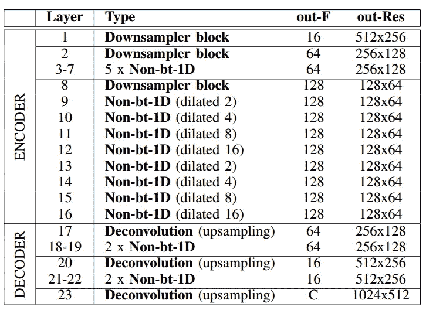

# 使用深度神经网络检测车道

> 原文：<https://medium.com/analytics-vidhya/detecting-lanes-using-deep-neural-networks-eebf2d9e3603?source=collection_archive---------2----------------------->

> 这篇文章解释了如何使用深度神经网络来检测高速公路车道。车道标志是公路上主要的静态组成部分。**他们指导车辆在公路上安全互动地行驶**。车道检测也是自动驾驶中的一项重要任务，它为汽车的控制提供定位信息。它也用于 **ADAS(高级驾驶辅助系统)**。

对于车道检测的任务，我们有两个可用的开源数据集。一个是 Tusimple 数据集，另一个是 CULane 数据集。让我们简单看一下其中一个数据集。

## t 简单数据集

该数据集是作为 Tusimple 车道检测挑战赛的一部分发布的。它包含 3626 个视频剪辑，每个剪辑时长 1 秒。这些视频剪辑中的每一个都包含 20 帧，其中最后一帧被标注。这些视频是通过安装在汽车仪表板上的摄像机拍摄的。你可以在这里从[下载数据集，或者访问](https://github.com/TuSimple/tusimple-benchmark/issues/3)[https://github.com/TuSimple/tusimple-benchmark/issues/3](https://github.com/TuSimple/tusimple-benchmark/issues/3)。

目录结构如下图所示，


数据集目录结构

每个子目录包含 20 个连续图像，其中最后一帧带有注释。label_data_(日期)。json 包含最后一帧的 **JSON 格式**的标签。JSON 文件中的每一行都是一个包含键值的字典…

**raw_file:** 字符串类型。剪辑中的文件路径

**车道:**是车道列表的列表。每个列表对应于一个车道，并且内部列表的每个元素是地面真实车道的 x 坐标。

**h_samples:** 对应车道的高度值列表。此列表中的每个元素都是地面真实车道的 y 坐标

在该数据集中，最多有四条车道被标注——两条 **ego 车道**(车辆当前所在的两条车道边界)以及 ego 车道右侧和左侧的车道。所有的车道都以相等的高度间隔标注，因此 h_samples 只包含一个列表，其元素对应于车道中所有列表的 y 坐标。对于 h_samples 中的一个点，如果该位置没有车道，其对应的 x 坐标为-2。例如，JSON 文件中的一行如下所示:

```
{
  "lanes": [
        [-2, -2, -2, -2, 632, 625, 617, 609, 601, 594, 586, 578, 570, 563, 555, 547, 539, 532, 524, 516, 508, 501, 493, 485, 477, 469, 462, 454, 446, 438, 431, 423, 415, 407, 400, 392, 384, 376, 369, 361, 353, 345, 338, 330, 322, 314, 307, 299],
        [-2, -2, -2, -2, 719, 734, 748, 762, 777, 791, 805, 820, 834, 848, 863, 877, 891, 906, 920, 934, 949, 963, 978, 992, 1006, 1021, 1035, 1049, 1064, 1078, 1092, 1107, 1121, 1135, 1150, 1164, 1178, 1193, 1207, 1221, 1236, 1250, 1265, -2, -2, -2, -2, -2],
        [-2, -2, -2, -2, -2, 532, 503, 474, 445, 416, 387, 358, 329, 300, 271, 241, 212, 183, 154, 125, 96, 67, 38, 9, -2, -2, -2, -2, -2, -2, -2, -2, -2, -2, -2, -2, -2, -2, -2, -2, -2, -2, -2, -2, -2, -2, -2, -2],
        [-2, -2, -2, 781, 822, 862, 903, 944, 984, 1025, 1066, 1107, 1147, 1188, 1229, 1269, -2, -2, -2, -2, -2, -2, -2, -2, -2, -2, -2, -2, -2, -2, -2, -2, -2, -2, -2, -2, -2, -2, -2, -2, -2, -2, -2, -2, -2, -2, -2, -2]
       ],
  "h_samples": [240, 250, 260, 270, 280, 290, 300, 310, 320, 330, 340, 350, 360, 370, 380, 390, 400, 410, 420, 430, 440, 450, 460, 470, 480, 490, 500, 510, 520, 530, 540, 550, 560, 570, 580, 590, 600, 610, 620, 630, 640, 650, 660, 670, 680, 690, 700, 710],
  "raw_file": "path_to_clip"
}
```

它说图像中有四个车道，第一个车道从(632，280)开始，第二个车道从(719，280)开始，第三个车道从(532，290)开始，第四个车道从(781，270)开始。

## 数据集可视化

```
# import required packages
import json
import numpy as np
import cv2
import matplotlib.pyplot as plt# read each line of json file
json_gt = [json.loads(line) **for** line **in** open('label_data.json')]
gt = json_gt[0]
gt_lanes = gt['lanes']
y_samples = gt['h_samples']
raw_file = gt['raw_file']# see the image
img = cv2.imread(raw_file)
cv2.imshow('image',img)
cv2.WaitKey(0)
cv2.destroyAllWindows()
```


**图片 1。**来自数据集的原始图像

现在看看图片上的 JSON 点可视化

```
gt_lanes_vis = [[(x, y) **for** (x, y) **in** zip(lane, y_samples)
                  **if** x >= 0] **for** lane **in** gt_lanes]
img_vis = img.copy()

**for** lane **in** gt_lanes_vis:
    cv2.polylines(img_vis, np.int32([lane]), isClosed=False,
                   color=(0,255,0), thickness=5)
```


**图片 2。**标记可视化图像

现在，我们已经理解了数据集，但是我们不能将上面的图像作为标签传递给神经网络，因为值从 0 到 num_classes -1 的 ***灰度图像将被传递给深度卷积神经网络，以输出包含预测车道的图像。*** 所以，我们需要为 JSON 文件生成标签图片。标签图像可以使用 **OpenCV** 通过绘制穿过 JSON 文件中的点的线来生成。

OpenCV 有一个内置函数，可以通过一组点绘制多条线。这里可以使用 OpenCV 的折线方法。首先，使用 numpy 创建一个高度和宽度等于原始文件高度和宽度的全零掩码。**在训练过程中，可以缩小图像尺寸以减少计算量，但不要忘记保持相同的宽高比。**

# **生成标签**

标签应该是灰度图像。从 JSON 文件中为每个片段生成一个标签。首先，创建一个黑色像素的遮罩，其形状类似于 JSON 文件中的 raw_file 图像。现在，使用 OpenCV 的折线方法，使用 JSON 文件中的车道和 h_samples 在遮罩图像上绘制不同颜色的线(每条线对应于车道中的每条车道)。从三通道掩模图像生成灰度掩模图像，其值为类别号。同样，为 JSON 文件中的所有图像创建标签。您可以将图像及其标签调整为较小的尺寸，以减少计算量。

```
mask = np.zeros_like(img)
colors = [[255,0,0],[0,255,0],[0,0,255],[0,255,255]]**for** i **in** range(len(gt_lanes_vis)):
    cv2.polylines(mask, np.int32([gt_lanes_vis[i]]), isClosed=False,color=colors[i], thickness=5)# create grey-scale label image
label = np.zeros((720,1280),dtype = np.uint8)
for i in range(len(colors)):
   label[np.where((mask == colors[i]).all(axis = 2))] = i+1
```


**图三。**生成的掩膜图像

# 构建和训练模型

车道检测本质上是一个图像分割问题。所以我在这个任务中使用了高效快速的 ERFNET 模型。ERFNET 最初是针对语义分割问题提出的，但它也可以扩展到其他图像分割问题。你可以在这里查看它的论文。这是一个具有编码器、解码器和扩展卷积以及非瓶颈剩余层的 CNN。模型架构见图 1。


**图一。**模型架构

构建并创建模型的对象。使用二进制交叉熵损失或自定义损失函数在上面创建的数据集上训练它足够数量的时期，从而最小化每像素误差。为了更好地使用内存，请创建一个数据集生成器，并在其上训练模型。生成器消除了将所有图像加载到内存中的负担(如果您的数据集很大，您应该使用生成器)，这种负担会导致所有内存耗尽，其他进程无法正常工作。图 2 显示了具有输入和输出维度的 ERFNET 的各层。



**图二。**具有输入和输出形状的模型层

# 评估模型

训练之后，使用下面的代码片段获得模型的预测。我已经在 Pytorch 中实现了这个。我使用 color_lanes 方法将模型的输出图像(两个通道的值作为类编号)转换为三个通道的图像。im_seg 是图 4 中所示的最终叠加图像。

```
# using pytorchimport torch
from torchvision.transforms import ToTensordef color_lanes(image, classes, i, color, HEIGHT, WIDTH):
    buffer_c1 = np.zeros((HEIGHT, WIDTH), dtype=np.uint8)
    buffer_c1[classes == i] = color[0]
    image[:, :, 0] += buffer_c1 buffer_c2 = np.zeros((HEIGHT, WIDTH), dtype=np.uint8)
    buffer_c2[classes == i] = color[1]
    image[:, :, 1] += buffer_c2 buffer_c3 = np.zeros((HEIGHT, WIDTH), dtype=np.uint8)
    buffer_c3[classes == i] = color[2]
    image[:, :, 2] += buffer_c3
    return imageimg = cv2.imread('images/test.jpg') 
img = cv2.resize(img,(WIDTH, HEIGHT),interpolation = cv2.INETR_CUBIC)
op_transforms = transforms.Compose([transforms.ToTensor()])
device = torch.device('cuda' if torch.cuda.is_available() else 'cpu')
im_tensor = torch.unsqueeze(op_transforms(img), dim=0)
im_tensor = im_tensor.to(device)model = ERFNET(5)
model = model.to(device)
model = model.eval()
out = model(im_tensor)
out = out.max(dim=1)[1]
out_np = out.cpu().numpy()[0]out_viz = np.zeros((HEIGHT, WIDTH, 3))
for i in range(1, NUM_LD_CLASSES):
    rand_c1 = random.randint(1, 255)
    rand_c2 = random.randint(1, 255)
    rand_c3 = random.randint(1, 255)
    out_viz = color_lanes(
            out_viz, out_np,
            i, (rand_c1, rand_c2, rand_c3), HEIGHT, WIDTH)
instance_im = out_viz.astype(np.uint8)
im_seg = cv2.addWeighted(img, 1, instance_im, 1, 0)
```


**形象 4。**最终预测图像

感谢阅读…

## 参考

1.  ERFNet:用于实时语义分割的有效残差分解 ConvNet。
2.  基于细胞神经网络的车道检测和分类。
3.  [https://www . mdpi . com/sensors/sensors-19-00503/article _ deploy/html/images/sensors-19-00503-g004 . png](https://www.mdpi.com/sensors/sensors-19-00503/article_deploy/html/images/sensors-19-00503-g004.png)