# 使用 CNN 从细胞图像中检测疟疾

> 原文：<https://medium.com/analytics-vidhya/detecting-malaria-from-cell-images-using-cnn-e9ab9346cb0?source=collection_archive---------9----------------------->

使用卷积神经网络开发神经网络来分类细胞是否被感染。

# 议程

在这篇文章中，我将向你展示如何开发一个神经网络来分类，一个细胞是否被感染使用卷积神经网络。我们将使用 Kaggle 提供的数据集，其中包含 27，558 张感染和未感染细胞的图像。

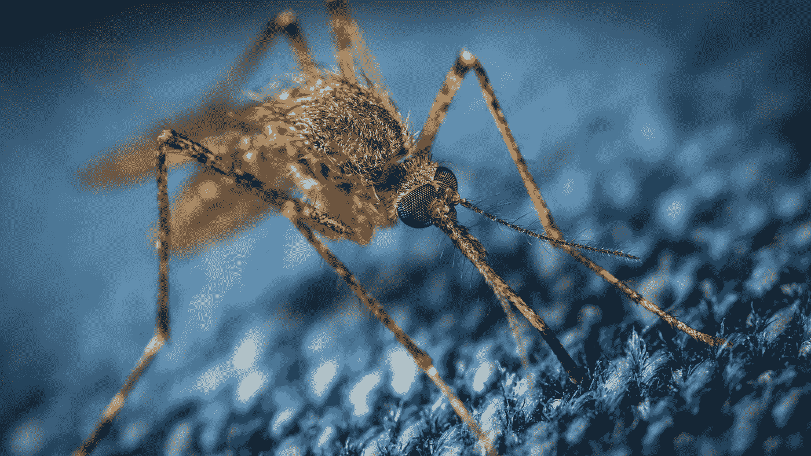

# 发展

**加载数据**

此处提供的[疟疾细胞图像数据集包含 27558 张感染和未感染疟疾细胞的图像。](https://www.kaggle.com/iarunava/cell-images-for-detecting-malaria)

在这个项目中，我们使用 cv2 来读取和存储图像的像素值。这里是加载数据的方法之一。

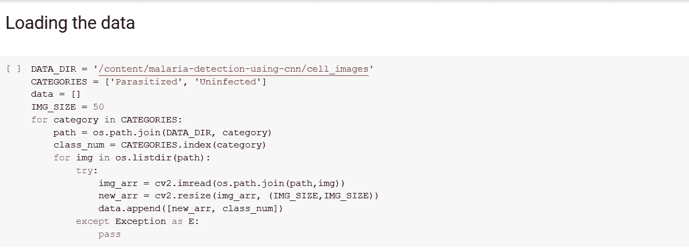

从内存加载数据

你可以在下面看到一些例子。

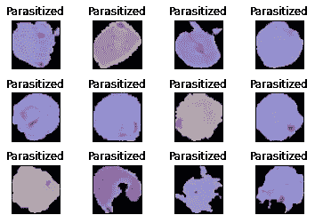

**示例图片**

该数据集包含相同数量的感染和未感染图像。

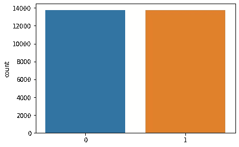

**标签计数**

**设置图像子集**

我们将图像分为三组:

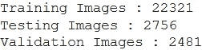

## 图像增强

图像增强是一种对原始图像应用不同变换的技术，这导致相同图像的多个变换副本。应用这些小变化不会改变它的目标类，但也提供了查看这些图像的新视角。这些图像增强技术不仅扩展了数据集，还在数据集中加入了一定程度的变化，这使得您的模型能够更好地对看不见的数据进行归纳。

在本项目中，我们使用了 ImageDataGenerator 类，因为它旨在提供实时数据增强，即在模型处于训练阶段时生成增强图像。

在这个项目中，我们使用了 4 种不同的转换技术。每一个都在下面描述。

```
• 10% — Horizontal shift
• 10% — Width shift
• 10 degree — Random rotation, in a range of 360 degrees
• 10% — Zoom 
```

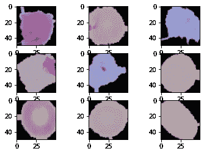

**增强图像**

## 构建 CNN 架构

这是我们项目最重要的一步。它由五部分组成——

1.  盘旋
2.  联营
3.  变平
4.  密集或完全连接
5.  拒绝传统社会的人

**卷积**

卷积的主要目的是从输入图像中提取特征。卷积通过使用输入数据的小方块学习图像特征来保持像素之间的关系。

在卷积运算中，我们从一个核开始，它只是一个小的权重矩阵。这个内核在输入数据上“滑动”,对它当前所在的输入部分执行元素级乘法，然后将结果累加成一个输出像素。

下面是 3×3 核和 7×7 输入图像的卷积运算的例子。

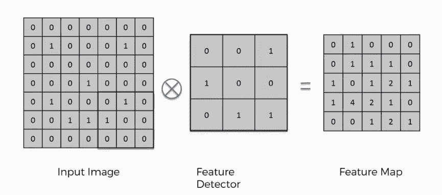

资料来源:www.superdatascience.com

**联营**

当图像太大时，池层减少了参数的数量。在这个项目中，我们使用了最大池层。

在最大池中，选择批次的最大像素值。这里的批次是指一组像素，其大小等于基于图像大小决定的过滤器大小。在以下示例中，选择了 2x2 的滤波器。池化方法的输出随着过滤器大小值的变化而变化。


资料来源:computersciencewiki.org

**展平**

*扁平化*是将数据转换成一维数组，输入到下一层。我们展平卷积层的输出，以创建单个长特征向量。并且它连接到最终的分类模型。

**密集或全连接层**

我们称之为全连接层的层，我们将矩阵展平成向量，并将其馈入像神经网络一样的全连接层。

特征映射矩阵将被转换为矢量。对于完全连接的层，我们将这些特征组合在一起以创建一个模型。最后，我们有一个激活函数，如 softmax，将输出分类为受感染或未受感染。

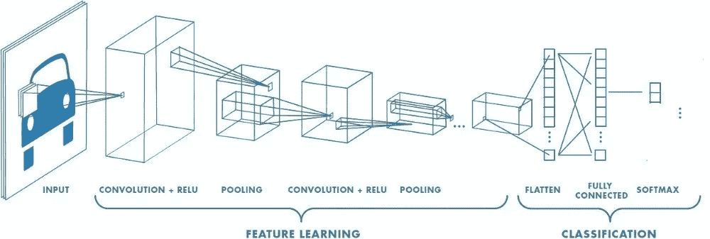

具有许多卷积层的神经网络

**辍学**

Dropout 用于防止模型过度拟合。Dropout 的工作原理是在训练阶段的每次更新时，将隐藏单元(组成隐藏层的神经元)的输出边缘随机设置为 0。

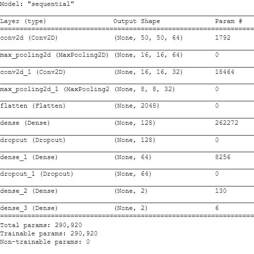

CNN 模型架构

**培训**

在测试了许多优化器之后，我选择了和 Adam 一起工作。Adam 利用自适应学习率方法的力量来为每个参数找到单独的学习率。Adam 的设计结合了 Adagrad 和 RMSprop 的优点，前者适用于稀疏渐变，后者适用于在线设置。拥有这两者使我们能够将 Adam 用于更广泛的任务。Adam 也可以看做是 RMSprop 和 SGD 与 momentum 的结合。

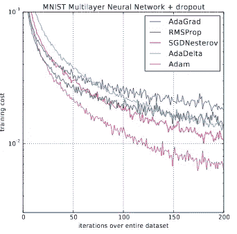

资料来源:亚当论文原文

在训练阶段，我们使用损失函数作为分类交叉熵，因为我们将训练 CNN 输出每个图像在 2 个类别上的概率，并且我们使用“准确度”作为准确度矩阵。

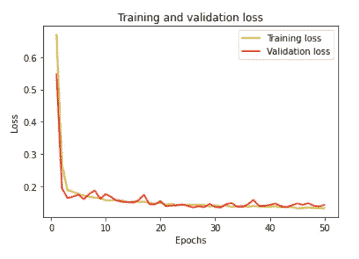

培训和验证损失的比较

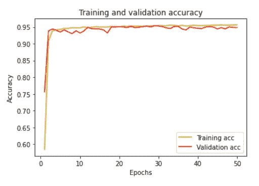

培训和验证损失的比较

**测试**

在这一点上，网络在识别训练和验证图像方面足够准确，并以超人的准确性对它们进行分类。

该网络的最终测试是查看一个完全未知的数据集，以正确分类图像。

我想象不出比这更好的结果了！该网络以 95%的惊人准确率(大约)完成了这项任务。

这个项目的所有代码都可以在我的 GitHub 配置文件中找到:

[](https://github.com/vipinkatara/malaria-detection-using-cnn) [## vipinkatara/疟疾检测-使用 cnn

### GitHub 是超过 5000 万开发人员的家园，他们一起工作来托管和审查代码、管理项目和构建…

github.com](https://github.com/vipinkatara/malaria-detection-using-cnn) [](https://linkedin.com/in/vipin-katara-951a5750) [## Vipin katara - Amity 工程学院&技术学院-新德里，德里，印度| LinkedIn

### 查看 Vipin katara 在全球最大的职业社区 LinkedIn 上的个人资料。唯品教育上市于…

linkedin.com](https://linkedin.com/in/vipin-katara-951a5750)