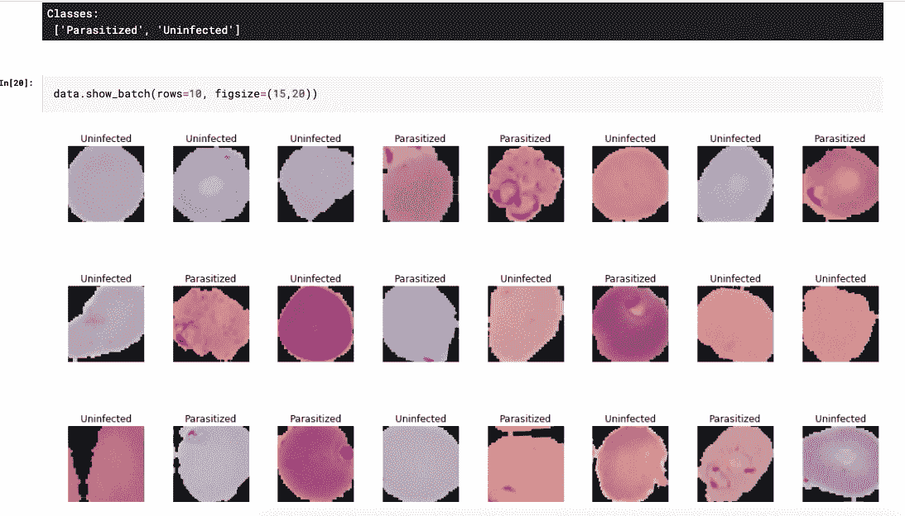

# 利用血细胞图像检测疟疾

> 原文：<https://medium.com/analytics-vidhya/detecting-malaria-using-blood-cell-images-6117f07f2862?source=collection_archive---------24----------------------->

根据世卫组织于 2019 年 12 月 4 日发布的《2019 年世界疟疾报告》, 2018 年，全球估计发生 2.28 亿例疟疾，而 2010 年为 2.51 亿例，2017 年为 2.31 亿例。恶性疟原虫是世卫组织非洲地区最流行的疟疾寄生虫，占 2018 年估计疟疾病例的 99.7%，在世卫组织东南亚地区(50%)、世卫组织东地中海地区(71%)和世卫组织西太平洋地区(65%)也是如此。从全球来看，53%的间日疟原虫(美洲世卫组织地区的一种主要寄生虫，占疟疾病例的 75%)在世卫组织东南亚地区，其中大部分在印度(47%)。

2018 年全球近 85%的疟疾死亡病例集中在世卫组织非洲地区和印度的 20 个国家。2018 年，全球估计有 40.5 万人死于疟疾，而 2017 年估计死亡人数为 41.6 万人，2010 年为 58.5 万人。5 岁以下儿童是最易受疟疾影响的群体。2018 年，他们占全球所有疟疾死亡人数的 67% (272000 人)。

迅速诊断和治疗是防止轻度疟疾发展成严重疾病和死亡的最有效方法。在公共卫生设施就诊并接受 RDT 或显微镜检查的疑似疟疾患者的比例从 2010 年的 38%上升到 2018 年的 85%。相当多的人开始意识到这样一个事实，即疾病的早期诊断可能会导致更好的早期治疗。

浓血涂片和稀血涂片疟疾试验是最常见和最准确的试验。实验室技术人员、医生或护士将抽取你的一些血液，并将其送到实验室进行染色，以清楚地显示任何寄生虫。技术人员将它铺在载玻片上，用显微镜观察。薄血涂片，也称为血膜，是一滴血在大部分载玻片上的分布。厚厚的涂片把血滴在一小块地方。正常的测试是两种都做。你血液中疟原虫的数量每天都在变化。所以你的测试可能会说你没有疟疾，即使你有。出于这个原因，你可能需要在 2-3 天内抽几次血才能达到最佳效果。

为了提高诊断的准确性和节省时间，可以开发一种系统，可以在几分钟内检测出血液涂片中的寄生虫/感染。

本文的目的是探索使用深度学习算法(如 ResNet、图像分类)来识别感染/寄生的血细胞。

国家医学图书馆(NLM)的李斯特希尔国家生物医学通讯中心(LHNCBC)的研究人员开发了一个分割细胞库，这些细胞来自疟疾筛查研究活动的薄血涂片图像。他们已经获得了每个微观视野的载玻片图像。创建的数据集包含总共 27，558 个细胞图像，具有相同的寄生和未感染细胞的实例。然后，该数据集被用于训练用于识别被寄生和未被感染的细胞的模型。

下图解释了可用于疟疾诊断的流程:

请查看以下模型的实施情况:

获取数据集的图像

该模型的特点:

1.  深度学习模型是使用 PyTorch 创建的(PyTorch 是一个基于 Python 的科学计算包，使用图形处理单元的能力。它也是首选的深度学习研究平台之一，旨在提供最大的灵活性和速度。它以提供两个最高级的特性而闻名；即，具有强大 GPU 加速支持的张量计算，以及在基于磁带的自动签名系统上构建深度神经网络。)
2.  利用预先训练好的 PyTorch 模型，得到 ResNet18 模型。

3.该模型使用 24 个历元进行训练，验证准确率达到 96.22%。

如果你对代码感兴趣，请在下面找到我的 Kaggle 和 GitHub 库的链接。

Kaggle 链接:[https://www.kaggle.com/priyapathak123/malaria-pytorch/data](https://www.kaggle.com/priyapathak123/malaria-pytorch/data)

GitHub 资源库链接:【https://github.com/PriyaPathak/Malaria_Detection_PyTorch 

链接到数据集:[https://www . ka ggle . com/iarunava/cell-images-for-detecting-malaria](https://www.kaggle.com/iarunava/cell-images-for-detecting-malaria)

注意:上面讨论的模型还没有部署。本文讨论了 PyTorch 检测疟疾感染的简单实现，有待改进。