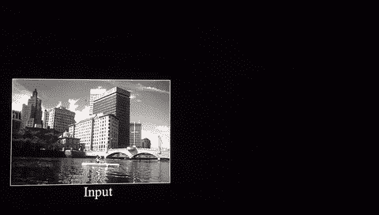

# 使用 CNN 检测疟疾

> 原文：<https://medium.com/analytics-vidhya/detecting-malaria-using-cnns-96c8b3659a6c?source=collection_archive---------7----------------------->

机器人医生！！！！

2017 年，87 个国家有 2.17 亿例疟疾病例。疟疾是由蚊子叮咬引起的非常严重和常见的疾病，主要发生在热带国家，如印度、菲律宾和非洲国家。非洲占了 92%的病例。如果没有得到正确的诊断，如果病人没有得到适当的治疗，他们可能会死于疟疾。

## 诊断疟疾

通常情况下，为了诊断疟疾，需要采集血液样本，然后将其送到实验室，在显微镜下进行检查，之后将结果发回给医生，最后患者得到所需的治疗。

很久了，对吧？如果我们可以在几秒钟内完成所有这些，而不需要把它送到实验室，会怎么样？也许我们可以用手机？

我们需要它，这样我们就可以在手机/电脑上显示血液涂片的照片，它会立即准确地告诉我们病人是否患有疟疾。这就是机器学习的用武之地！有一个巨大的神经网络，能够将图像作为输入，并将标签作为输出，称为 CNN。

# CNN？新闻网络还是神经网络？🤔

卷积神经网络(CNN/conv nets)用于学习数据中的复杂特征。这就是它非常适合物体检测和计算机视觉的原因。他们能够识别物体，如苹果、猫、汽车、街道标志，甚至人脸。他们还擅长分析文本和声音。CNN 正在推动计算机视觉的重大进步，这些进步在自动驾驶汽车、无人机、机器人和视障治疗中有明显的应用。

一个 CNN 有 **5** 种类型的层:

*   输入层
*   卷积层
*   ReLU 激活层
*   汇集层
*   全连接层

这些层是每一个 CNN 的构建块，所以要对 CNN 有一个完整的了解，了解它的层是很重要的。

# “相信卷积过程”——CNN 架构

⚠️小心！！技术乱七八糟从下面开始！！⚠️

# 输入层➡️

它保存图像的原始像素值，通常接受矩阵输入。这包括空间形式、图像宽度和高度，并且具有表示颜色通道的深度。对于我们的疟疾数据集，输入维度是 150 x 150 x 3。

# 卷积层

卷积层被认为是 CNN 的核心。其主要目的是从输入图像中提取特征。该层通过使用特征检测器(过滤器或内核也是常见名称)从输入数据的小方块中学习来实现这一点。

让我们看一个例子来更好地理解它！

假设我们有一个 5 x 5 的图像，它的像素值只有 0 和 1。

*来源:*[https://ujjwalkarn . me/2016/08/11/直观-解释-convnets/](https://ujjwalkarn.me/2016/08/11/intuitive-explanation-convnets/)

另外，考虑这个 3 x 3 滤波器:

*来源:*[https://ujjwalkarn . me/2016/08/11/直观-解释-convnets/](https://ujjwalkarn.me/2016/08/11/intuitive-explanation-convnets/)

现在，过滤器和图像的计算如下所示:

*来源:*[https://ujjwalkarn . me/2016/08/11/直观-解释-convnets/](https://ujjwalkarn.me/2016/08/11/intuitive-explanation-convnets/)

那么发生了什么？橙色滤镜在我们的图像上滑动，一次移动一个像素。对于每个位置，每个“图像整数”与“滤波器整数”相乘，然后输出全部加在一起。图像的最终输出是粉色特征图(也称为激活图)的一个元素。

下面是另一个很好的真实例子，有助于形象化:

*来源:*[https://ujjwalkarn . me/2016/08/11/直观-解释-convnets/](https://ujjwalkarn.me/2016/08/11/intuitive-explanation-convnets/)

# ReLU 激活层

有了 CNN，我们会经常看到 ReLU 功能被使用。ReLU 代表整流线性单元。它是逐像素应用的，它用 0 替换所有负像素。我们可以在上面的图表中看到这一点，其中所有的负值都是 0。使用 ReLU 的原因是将非线性引入我们的 CNN，因为大多数真实世界的数据具有非线性。

# 汇集层🌊

汇集层放在卷积层之间。他们的主要工作是减少数据表示的空间大小(宽度、高度)，使其更易于管理。池层也有助于控制过度拟合，因为它减少了网络中的参数和计算的数量。

池图层使用过滤器对输入体积进行缩减采样。最常用的设置是滑动因子为 2 的 2 x 2 滤波器。这将通过因子 2 对空间维度(宽度、高度)进行缩减采样。

# 全连接层

我们用它来计算我们将用作网络输出的类分数(标签)。术语完全连接是指前一层中的每个神经元都连接到下一层中的每个神经元。本质上，全连接层告诉我们图像是什么。在我们的情况下，它会告诉我们血液涂片是否有疟疾。

# 训练模型🏃

好了，现在我们知道了卷积神经网络是如何工作的，让我们开始用它来解决我们的问题。正如我们所知，我们需要向计算机展示带有疟疾的血液涂片是什么样的，以及没有疟疾时是什么样的。在机器学习中，我们称这个过程为“训练模型”。模型的准确性取决于模型的训练程度，而训练程度通常取决于数据量。幸运的是，我们不必创建数据集，因为国家医学图书馆已经为每个人提供了数据集。数据集有两个文件夹——感染和未感染，总共有 27，558 个图像。

在开始训练神经网络之前，我们需要将数据集分成包含训练数据和验证数据的两个文件夹。“train”文件夹包含 80%的数据集。这是模型正在学习的。拥有 20%数据集的第二个文件夹是“验证”文件夹。这是模型评估自己的依据。它还告诉我们模型有多精确。

**结果:**经过 10 个历元的训练，我们得到了 94%的准确率，还不错。然而，它可以通过使用**迁移学习和微调**来改善。

基础模型的训练结果！！

# 迁移学习和微调

迁移学习是一种提高图像分类精度的方法。本质上，正在发生的是 CNN 在第一个任务上被训练，然后在第二个完全不同的任务上被再次使用。由于用小数据集训练模型并实现更高的精度会更难，因此使用了迁移学习。

现在你想知道我们如何利用模型被训练的目的，并为另一个任务改变它？很棒的问题！

有两种主要情况:

## **使用预先训练的 CNN 并将其用作特征提取器:**

我们采用预先训练好的 CNN——如 VGG、谷歌的 Inception 模型或微软的 ResNet 模型——打开全连接层，它有分类层。我们只是添加我们自己的新分类层。我们使用训练网络的其余部分作为特征提取器，并在我们的数据集上重新训练模型。

## **用 CNN 微调:**

微调是训练完全连接的层和特征提取器的末端，所以我们得到更高的精度。顾名思义，我们只是“调整”/“微调”它。

**结果:**再次训练后，我们得到了 98%的准确率，比基础模型好很多！

# 完成了吗？终于！

现在我们已经训练好了模型，我们可以作为应用程序部署到手机上，或者制作一个 web 应用程序。我们创造的这个工具可以帮助数百万在发展中国家农村地区没有很多资源的医生。他们不需要把血样送到实验室。他们现在只需使用显微镜和电话就能轻松诊断病人是否患有疟疾。这只是这项技术的一个应用！想象一下，如果我们可以用它来检测癌症、脑瘤、基因组异常等等。可能性真的是无穷无尽！

# ML 的进一步应用

人工智能正被用于几乎每一个行业，无论是金融、农业还是教育，它正在颠覆所有这些行业。然而，让我真正兴奋的是它在医疗保健行业的应用！！

Benevolent.ai 和 Atomwise 等公司正在使用深度学习来彻底改变药物的发现方式！甚至谷歌的 DeepMind 也在致力于预测未来急性肾损伤等项目。这只是开始！在医疗保健行业的所有分支中，人们都在用深度学习做一些超级棒的事情。在未来的 5 到 10 年里，整个医疗保健行业将会发生指数级的变化！

**检查项目和代码:**

 [## shiv 246/疟疾检测器

### 这是一个图像分类器，使用 CNN 对感染疟疾的细胞进行分类。-shiv 246/疟疾检测器

github.com](https://github.com/shiv246/MalariaDetector) 

# 摘要

*   AI 正在颠覆几乎所有的行业！
*   CNN 用于从复杂的数据中提取特征，如图像
*   CNN 有 **5** 种类型的层:**输入、卷积、ReLU、池化和全连接**
*   输入层**保存图像**的原始像素值，通常接受 3D 输入
*   卷积层**从图像中提取特征**
*   ReLU layer **将所有负值替换为 0**
*   汇集层**缩小空间尺寸**
*   最后，全连接层告诉我们图像是什么
*   迁移学习和微调用于提高模型的准确性

推荐作品:

 [## 卷积神经网络的直观解释

### 什么是卷积神经网络，为什么它们很重要？卷积神经网络是…

ujjwalkarn.me](https://ujjwalkarn.me/2016/08/11/intuitive-explanation-convnets/)  [## 用于视觉识别的 CS231n 卷积神经网络

### 目录:卷积神经网络非常类似于以前的普通神经网络…

cs231n.github.io](http://cs231n.github.io/convolutional-networks/#convert)  [## 用于视觉识别的 CS231n 卷积神经网络

### (这些笔记目前处于草稿形式，正在开发中)目录:在实践中，很少有人培训…

cs231n.github.io](http://cs231n.github.io/transfer-learning/) 

书:[深度学习——实践者的方法，作者乔希·帕特森和亚当·吉布森](https://www.amazon.com/Deep-Learning-Practitioners-Josh-Patterson/dp/1491914254)

嘿嘿嘿！如果你正在读这封信，谢谢你🙏 🙏为了坚持到最后！

我也很乐意通过 [LinkedIn](https://www.linkedin.com/in/shivang-mistry-1119b818b) 联系，了解你对这个话题的想法！