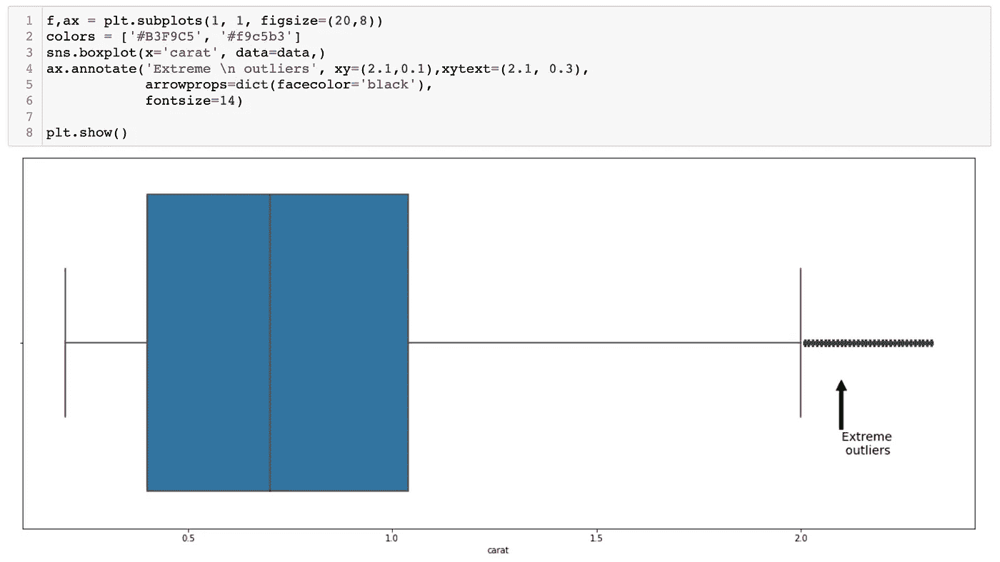
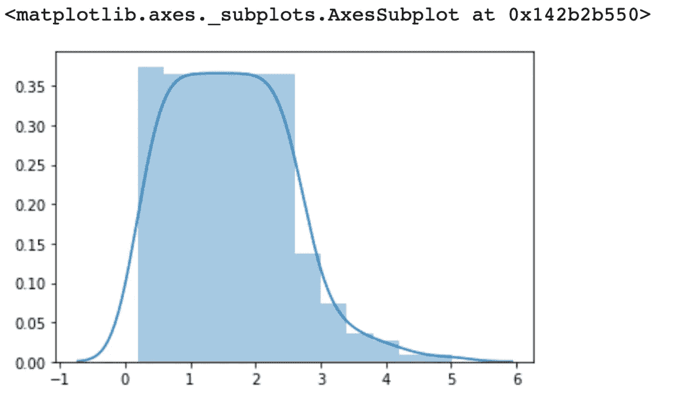
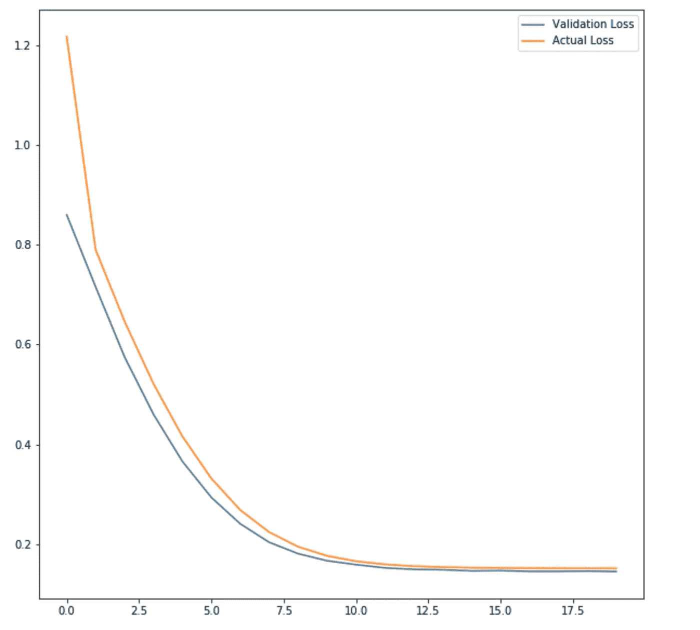
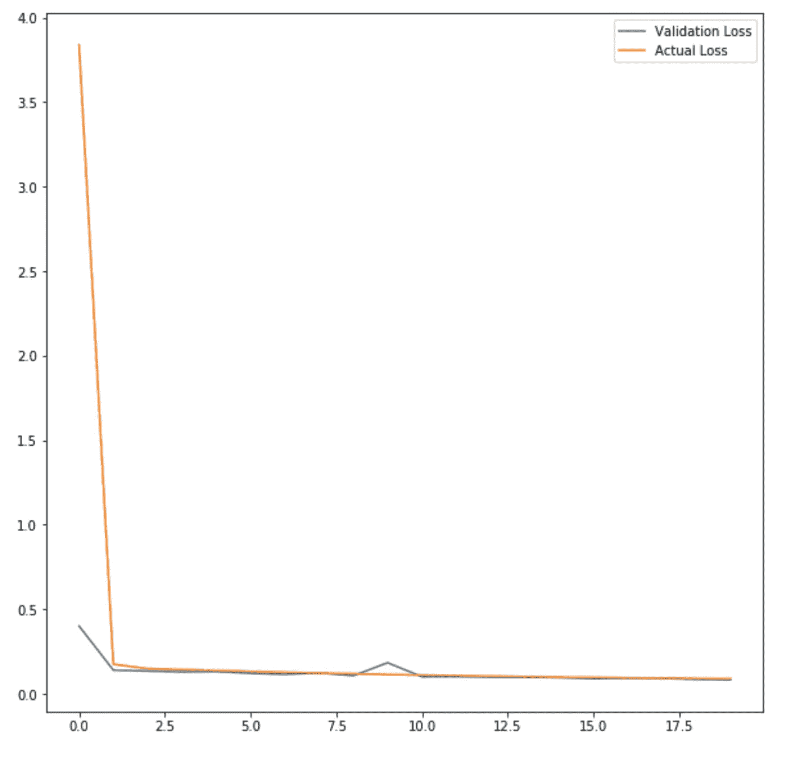

# 异常值的检测及其处理

> 原文：<https://medium.com/analytics-vidhya/detecting-outliers-and-its-treatment-e22fe67819b0?source=collection_archive---------17----------------------->

## 实验和观察


来源:[https://www . pexels . com/photo/photo-of-herd-of-of-sheep-on-grade-3379771/](https://www.pexels.com/photo/photo-of-herd-of-sheep-on-grassland-3379771/)

# 介绍

异常值是总体中不属于该总体的数据点。比如白羊群里的一只黑羊。

离群值会扭曲您的结果。或者我们可以说，它将数据的行为从被认为是真实的结果转变为不真实的结果。我们称这种偏移为**误差**。

误差是实际结果和预测结果之间的差异。如果存在不需要的数据，来自机器学习模型的预测结果会受到影响。为了确保机器学习模型做出正确的预测，我们必须确保适当地处理异常值。

在本文中，我将尝试帮助您建立一种直觉，即如何在处理异常值的同时处理机器学习问题。

为了理解这个问题，我将使用一个单变量数据集——它将有一个**自变量**和一个**因变量**。

> **注**:代码在我的 [**Github Repo**](https://github.com/Nielspace/MachineLearningBlogs) 中有。请随意检查。另外重要的一点是，我并不试图探索 ML 模型本身，而是设计和构建一个模型**来理解 ML 模型**中异常值的影响，并观察哪个模型在自变量和因变量之间建立了最佳关系。

# 寻找异常值

离群值并不难发现。我们可以使用统计方法来寻找离群值的踪迹或离群值本身。我们将研究的工具是**标准差、四分位间距和箱线图。**

**标准偏差**是对平均值的方差(或数据分布)的测量，该平均值是标度的中心，也表示为“0”。大多数数据位于第一个和第二个标准差之间。除此之外，一切都被认为是离群值。

一般来说，我们会尝试删除那些在第二个标准差之上或之外的数据点。

> 注意:当我们谈论标准差时，我们同时考虑正负标准差。


**四分位距** ( **IQR** )是一种可变性的度量，基于将数据集分成四分位。四分位数将按等级排序的数据集分成四个相等的部分。划分每个部分的值称为第一、第二和第三四分位数；它们分别用 Q1、Q2 和 Q3 表示，即 25、50 和 75 个百分点。

一旦我们有了这些值，我们就可以设置一个阈值，超过和低于这个阈值就是异常值。

下图是一个箱形图。“一个**箱线图**是一种通过四分位数图形化描述数字数据组的方法。箱形图也可能有从箱形图延伸的线(*须状图*)，表示上下四分位数之外的可变性，因此有术语**箱形须状图**和**箱形须状图**。离群值可能被标绘为单独的点”——维基百科。



一旦我们发现异常值，我们就可以相应地对待它们。

# 处理异常值

有几种方法可以处理异常值。但是在我们采取任何措施来处理异常值之前，我们应该记住某些要点。

1.  离群值有好有坏。我们面临的问题是主观的。有些问题需要异常值，例如异常检测，而其他问题则不需要，因为它会扭曲数据。
2.  移除异常值还可以减少可能导致过度拟合的观察值的数量，过度拟合是指模型过于复杂，无法了解所提供数据的简单性。我们必须确保模型的参数和数据是正确平衡的。

我们将把重点放在第二点上，因为第一点超出了本文的范围。

现在，有一些处理异常值的方法。

1.  拆卸。
2.  缩放。
3.  使用非参数模型(如随机森林)来减少影响。
4.  使用深度神经网络。

我们将涵盖上述所有要点，看看上述哪一种方法会给我们带来好的结果。

# 移除异常值

我们可以使用四分位间距来去除异常值。

```
q25, q75 = np.percentile(data.carat, 25), np.percentile(data.carat, 75)
iqr = q75 - q25; iqr
cut_off = iqr * 2 
lower, upper = q25 - cut_off, q75 + cut_off
outliers = [x for x in data.carat if x < lower or x > upper]#removing the data from the datasetdata = data.drop(data[(data.carat > upper) | (data.carat<lower)].index)
```

> 注:截止变量是平均值和标准差的乘积。

以检查是否已经从数据中移除了不必要的数据点。我们将使用两个模型，一个是参数模型——随机梯度下降回归器——和一个非参数模型。

我将使用我将要实现的所有模型的普通形式。目的是看预处理技术是否有效。

在用不包含异常值**的数据拟合模型后，我们得到了以下结果。**

```
import **math**def rmse(X,y): *return math.sqrt(((X-y)**2).mean())*def print_score(model):
    *return [rmse(model.predict(X_train), y_train),rmse(model.predict(X_test), y_test), 
     model.score(X_train, y_train), model.score(X_test, y_test)]*print('The scores for Stochastic Gradient Descent are: ', **print_score(SGD)**)print('The scores for Random Forest are: ',**print_score(rf)**)>>The scores for Stochastic Gradient Descent are: **[0.33437466833442886, 0.33492309110522206, 0.8814293026043725, 0.8808833158341957]**>>The scores for Random Forest are:  
**[0.2521855459326567, 0.25436238295812885, 0.93255480422885, 0.9312950253266471]**
```

前两个指标分别告诉我们在训练和测试数据集上执行的模型的**误差**。同样，最后两个指标告诉我们在相同的上执行的模型的准确性。

因此，我们可以看到，没有过度拟合或拟合不足。这是一个好迹象。

# 缩放异常值

缩放是一种技术，其中数据点被带到一个共同的值范围，分布的形状保持不变。

那么，为什么要缩放呢？

机器学习模型的主要任务是为每个特征找到一个值，这样它们可以更快地收敛，以达到唯一的解决方案。如果数字较大，那么对于机器学习模型来说，找到特定值就变得更加困难。因此，我们试图将它们带到一个范围内，以便更容易、更快地找到唯一的数字。

当数字较大并且相同的群体中有很多差异时，缩放是最有效的。

```
from sklearn.model_selection import train_test_splitX, y = data_raw.carat, np.log(data_raw.price)from sklearn.preprocessing import RobustScalerscaling = RobustScaler()X = scaling.fit_transform(np.array(X).reshape(-1,1))X_train, X_test, y_train, y_test = train_test_split(X,y, random_state=23, test_size=0.3)X_train = np.array(X_train).reshape(-1,1)
X_test = np.array(X_test).reshape(-1,1)
```

因为数据集中存在异常值，所以我使用了健壮的标量。稳健标量减少了异常值的影响，因为它使用了四分位数范围。

在用缩放数据拟合模型后，我们得到了以下结果。

```
print('The scores for Stochastic Gradient Descent are: ',print_score(SGD))print('*'*20)print('The scores for Random Forest are: ',print_score(rf))>>The scores for Stochastic Gradient Descent are:  **[0.3968648110452676, 0.3995578537520062, 0.8475738040346006, 0.8435787127417848]**
********************
>>The scores for Random Forest are:  **[0.2505442962295736, 0.2532557461978344, 0.9392503939398784, 0.9371572577031487]**
```



虽然随机梯度下降随机森林的分数下降了，但是分数上升了一点。这可能是因为输入数据的方差不高。大多数输入数据都在 0–2 的范围内，因此缩放后没有太大意义。但我们可以肯定的是，缩放后的值停留在四分位数范围内。

# 神经网络

神经网络是最先进的数学模型，受大脑功能的启发，可以制作预测模型并找到数据的底层结构。

我们将建立两个神经网络。两种深度学习模型在激活功能方面会有所不同。我们将比较他们彼此的表现。

同样，这里的目标是看看哪个模型对异常值是稳健的。我们将不再执行之前执行的任何预处理技术。

模型的轮廓非常简单。它将由 300 个神经元组成，这些神经元将具有 s 形激活功能。

```
model = keras.models.Sequential([
    keras.layers.Dense(300, activation="sigmoid", input_shape=X_train.shape[1:]),
    keras.layers.Dense(1),
])
model.compile(loss="mean_squared_error", optimizer=keras.optimizers.SGD(lr=1e-3))
history = model.fit(X_train, y_train, epochs=20, validation_data=(X_valid, y_valid))
mse_test = model.evaluate(X_test, y_test)
```

在 20 次迭代之后，具有 sigmoid 激活的普通神经网络表现得相当好。几乎没有过度拟合，可以忽略不计。



进入下一个具有 LeakyRelu 激活功能的深度学习模型，这是结果显示的。具有 LeakyRelu 激活功能的模型比具有 Sigmoid 功能激活的模型学习得更快，表现得更好。



# 结论

*   移除异常值会导致观察值减少，从而导致模型丢失重要的数据点，这些数据点对于建立自变量和因变量之间的关系至关重要。
*   当谈到减少离群值的影响时，缩放是一个更好的选择。在这方面，我们也应该使用**健壮标量**,因为它在处理异常值时效果最好。
*   其他缩放方法也是可用的，如标准标量、最小标量、归一化等等。阅读本文以了解更多关于缩放方法的信息。
*   我们还发现，当异常值被移除且未缩放时，参数模型工作得更好，这主要是因为大多数值聚集在 0–2 的范围内，使其对特征缩放不太有效。
*   非参数模型显示了一些不同的结果，这可能是因为非参数模型更依赖于要素的修剪，而不是为要素分配权重。
*   深度神经网络不容易出现异常值，特别是如果我们考虑激活函数的话。
*   深度神经网络经历多次迭代，允许它们校正权重，然后应用它。当有许多节点，并且每个节点都有助于获得一个唯一的解决方案时，这将更加有效。这使得深度神经网络对异常值更加鲁棒。

> 注意:我们的目的不是设计一个复杂的模型，而是设计和构建一个模型**，以了解去除异常值、缩放异常值、**、T2 的影响，以及观察哪些模型在自变量和因变量之间建立了最佳关系。

# 进一步阅读

*   [使用 Scikit-Learn 进行缩放、标准化或规范化](https://towardsdatascience.com/scale-standardize-or-normalize-with-scikit-learn-6ccc7d176a02)
*   [数据标准化 vs 规范化 vs 健壮定标器](https://stackoverflow.com/questions/51841506/data-standardization-vs-normalization-vs-robust-scaler)
*   [https://machine learning mastery . com/how-to-use-statistics-to-identify-outliers-in-data/](https://machinelearningmastery.com/how-to-use-statistics-to-identify-outliers-in-data/)