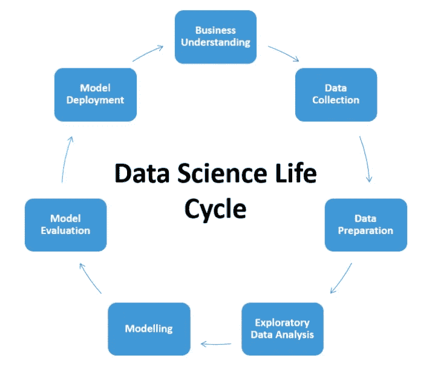
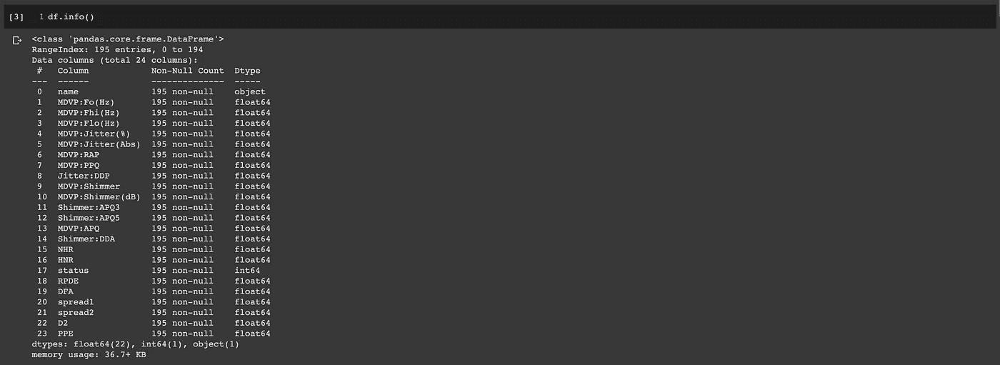
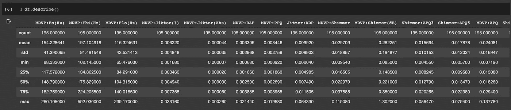
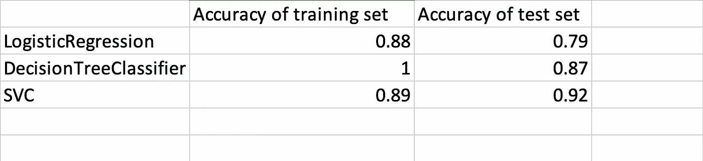

# 用机器学习检测帕金森病

> 原文：<https://medium.com/analytics-vidhya/detecting-parkinsons-disease-with-machine-learning-44c17208afce?source=collection_archive---------6----------------------->

## *继续前进*

由[布鲁诺·马丁斯](https://unsplash.com/@brunus?utm_source=medium&utm_medium=referral)在 [Unsplash](https://unsplash.com?utm_source=medium&utm_medium=referral) 上拍摄的照片

在这篇文章中，我将建立一个模型，可以准确地检测人类中帕金森病的存在。在开始之前，我们将通过数据科学生命周期来了解应该发生什么。

照片由 Srinivas Rao 在 Quora 上提供

**用数据科学生命周期解决业务问题的步骤:**
1。商业理解
2。数据采集
3。数据准备
4。探索性数据分析
5。造型
6。型号评估
7。模型部署

# #1 ~业务理解

任何项目，无论大小，都需要对业务的了解，这是有效解决业务问题的基础。

**我试图解决的问题是什么？**

在这个阶段，我需要从业务角度定义问题、项目目标和解决方案。这是用数据科学方法解决问题的第一步。在这篇文章中，我需要根据语音测量数据集准确地检测帕金森病的存在。

**什么是帕金森病？**

帕金森病是一种与年龄相关的中枢神经系统神经退行性疾病。这是仅次于阿尔茨海默病的第二常见疾病，影响大脑中产生多巴胺的神经元。它影响运动，引起震颤和僵硬。据估计，全世界有 7000 万到 1000 万人患有帕金森病。

所以是主管学习~我会用分类的方法。

# #2 ~数据收集

数据是整个机器学习最关键的部分。所以我需要考虑以下几点:

*   我有数据吗？
*   数据从哪里来？
*   我们信任数据源吗？
*   我有领域知识吗？

数据来自 UCI 唐纳德·布伦信息与计算机科学学院，你可以在这里下载。数据集有 24 列和 195 条记录。

# #3 ~数据准备& #4 ~探索性数据分析

现在，我们将进行必要的导入，并尝试将帕金森病数据集加载到 jupyter 笔记本中。

现在，让我们来看看数据集。数据集包含 195 行和 24 列。因变量为**状态**，MDVP:Fo(Hz)到 PPE 为自变量。在下图中，我们可以看到数据集中没有缺失值。

我们可以看到，所有的数字变量都列在顶部，我们有计数、均值、标准差、最小值、最大值、25%和 50%以及 75%等值。

# # 5～建模

标准化训练数据和测试数据非常重要，因为如果元素的比例相同，大多数机器学习模型会收敛得更快。进行标准化会将特征的平均值集中在 0 到 1 之间。数据将服从正态分布。为了计算这些特征的平均值和标准偏差，并将上述公式应用于每个观察值/数值，将使用 sklearn 的标准标度:

在训练我们的模型之前要做的最后一件事是分割数据集。我将这些数据随机分为 80/20 的训练集和测试集。我们需要这样做，以便我们可以通过预测测试集数据(看不见的数据)来估计我们的模型的预测结果。

物流回收

决策树分类器

交换虚拟电路

# # 6～模型评估

在这一步，我们将评估机器学习模型的性能和准确性。基于预测，我们可以看到，模型可以准确预测从逻辑回归是 0.79，决策树是 0.87，SVC 是 0.92。

# #7 ~模型部署

这是一个相对简单的项目，通常我们还需要迭代和函数选择或与其他算法进行比较。通过收集实现模型的结果，您还需要接收关于模型的性能及其对实现环境的影响的反馈。通过分析这些信息，数据科学家可以改进模型，提高其准确性，从而提高其实用性。一旦开发出令人满意的模型，就会在生产环境中实施。

感谢阅读！如果你喜欢这篇文章，请通过鼓掌来感谢你的支持(👏🏼)按钮，或者通过共享这篇文章让其他人可以找到它。

希望你对数据科学生命周期有一个基本的了解。如何在每个阶段进行思考，以帮助指导您完成一个成功的数据科学项目的方法。最后，我希望你能学会如何使用逻辑回归技术。您还可以在 [GitHub](https://github.com/kindersham/100DaysDS/tree/master/Detecting_Parkinson's_Disease) 资源库中找到完整的项目。

[1]:*‘利用非线性递归和分形标度特性进行语音障碍检测’，
Little MA，McSharry PE，Roberts SJ，Costello DAE，Moroz IM。
生物医学工程在线 2007，6:23(2007 年 6 月 26 日)*

[2]: *Max A. Little，Patrick E. McSharry，Eric J. Hunter，Lorraine O. Ramig (2008)，
“发声障碍测量对帕金森病远程监护的适用性”，
IEEE 生物医学工程汇刊(待发表)。*