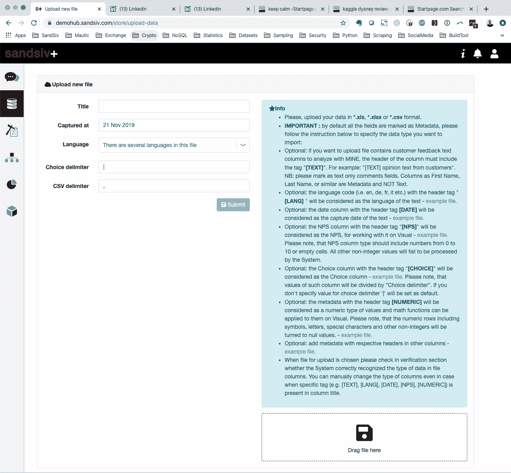

# 在不到 60 分钟的时间内发现巴黎迪士尼乐园顾客旅程中的陷阱(第一部分)

> 原文：<https://medium.com/analytics-vidhya/detecting-pitfalls-in-disneyland-paris-customer-journeys-in-less-than-60-minutes-part-1-a2def830695f?source=collection_archive---------23----------------------->

## 使用 57 种不同语言的 [sandsiv+](https://sandsiv.com/) 客户智能解决方案，为商务人士提供话题检测和情感分析

*在这一系列文章中，我将使用 kaggle.com 上公开的数据集，分析来自脸书、猫途鹰、谷歌和 Instagram 的 15，928 条对巴黎迪士尼游客的评论。此分析的主要目标是生成业务洞察，以消除客户旅程中的现有陷阱，从而提高客户满意度并主动管理客户体验。我将使用* [*sandsiv+*](https://sandsiv.com/) *一步一步地工作，以创造见解并将企业改进推进到组织中。*

**免责声明:**我是 [sandsiv+](https://sandsiv.com/) 的首席执行官，我当然有兴趣推广我的产品，但我发誓，这不是推销。我们将一起分析一个真实的数据集，并学习如何创造洞察力来改善客户体验。重要的是，这是一个写给商务人士的帖子。如果你是一个经验丰富的数据科学家，我个人并不认为这篇帖子对你有极大的兴趣，除非你是我的竞争对手之一。；-)

# 什么是主题模型和文本分类？(例如，情感分类)

在机器学习和自然语言处理中，主题模型是一种用于发现出现在文档集合中的抽象“主题”的模型。主题建模是一种常用的文本挖掘工具，用于发现文本中隐藏的语义结构。

另一方面，文本分类是根据文本的内容给文本分配标签或类别的过程。它是自然语言处理中的基本任务之一，具有广泛的应用，如情感分析、主题标注、垃圾邮件检测和意图检测。

文本形式的非结构化数据无处不在:电子邮件、聊天、网页、社交媒体、支持票、调查反馈等等。文本可以是极其丰富的信息来源，但由于其非结构化的本质，从文本中提取见解可能是困难和耗时的。企业正转向文本分类，以一种快速且经济高效的方式构建文本，从而增强决策制定和自动化流程。

假设您有一个主题建模或文本分类业务问题要解决，并且您不是能够使用 Python 或 R 编写代码的数据科学家，那么找到正确的解决方案是相当困难的。在 [sandsiv+](https://sandsiv.com/) 我们喜欢将数据分析的力量从数据科学家手中转移到商业人士手中。好奇可能会怎样？我们一起来看看吧。

最好从计划开始，我们要做什么？

1.  获取数据
2.  将数据上传到 [sandsiv+](https://sandsiv.com)
3.  运行探索性数据分析
4.  调查不同的主题
5.  训练卷积神经网络来自动检测主题(部分可用。2)
6.  在仪表板中提取见解，与巴黎迪士尼乐园组织内的其他同事分享(在第 2 部分中提供)

整个过程的目的是产生客户洞察，并将其引入组织，以改善客户体验。

# 1.获取数据

我将使用任何人都可以使用的公共数据集。你可以在这里找到数据集。这是一个法国数据集，包含来自不同来源的 30 万条记录:脸书、猫途鹰、谷歌和 Instagram。该数据集包含与巴黎迪士尼乐园相关的游客评论。它包括 2012 年至 2017 年 9 月 29 日期间的意见。


Excel 中巴黎迪士尼乐园数据集的快照

该文件包含 299，635 条记录，分为 12 列。我用 Excel 打开文件，意识到两件重要的事情:

*   这些评论都是以原文收集的(大约 57 种不同的语言)
*   很大一部分评论是空的(不适用)，有 5 星评级，但没有评论

我删除了空的注释记录，最终得到 15'928 条记录。我用谷歌的工作表功能 GoogleTranslate 自动翻译了这篇英文评论

```
GOOGLETRANSLATE(text, [source_language, target_language])
```

创建名为“review_translated”的新列。这个新字段包含翻译成英文的原始评论。或者，我可以挖掘每种特定语言的原始形式。在这种情况下，我必须在文件中添加一个“检测语言”列，并指示 sandsiv+使用该列来识别原始语言。

# 2.将数据上传到 sandsiv+

一旦 Excel 文件准备好，我们只需要上传到 [sandsiv+ VOC STORE](https://sandsiv.com/our-platform/indirect-voice-of-the-customer/) 即可。VOC STORE 是负责管理客户间接声音的应用程序。它是一个引擎，用于管理从标准 XLS 或 CSV 到平台的上传，以及从外部网站(如 Yelp)到实时 API 数据源的上传。谷歌等。)到内部应用程序(如 Salesforce、Microsoft Dynamics 等)。).别担心，你不需要给你的 IT 部门打电话，用 sandsiv+ GUI 上传文件就够了。



sandsiv+ VOC STORE GUI 加载外部数据文件

我们只需要在专用区域拖动文件，提供一些信息，文件就会自动上传到 sandsiv+ MongoDB NoSQL 数据湖。我们专有的大数据 ETL 解决方案将自动对数据执行特定任务。例如，与自然语言处理、文本降级、标记化、词性、消歧、词条化等相关。*(如果你不是专业的自然语言处理实践者，不要担心，我们只是在变魔术，让文本可以被机器理解)*

文件上传后，系统会提供有价值的信息:


sandsiv+ VOC 悬挂物控制面板检查上传和 API 数据馈送

我们可以看到所有 15928 条记录都已被加载和处理。例如，我们可以检查文件的结构。我们可以即时创建新的重新计算的变量，我们可以重新编码变量，当然，我们可以将信息链接到平台中已经可用的现有数据集，或者我们可以丰富来自在 [sandsiv+ VOC 反馈](https://sandsiv.com/our-platform/direct-voice-of-the-customer/)中运行的调查的数据。

好了，文件出来了，可以供我们进一步分析了。先来一个解释性的数据分析。

# 2.探索性数据分析

干净的数据集包含 10 个变量，总共有 15928 条记录。下面我们打开 [sandsiv+ VOC VISUAL](https://sandsiv.com/our-platform/data-visualization/) 探究数据。下面是探索性报告的一小段摘录。


评估我们可以观察到的特定变量:


评论超时分布

大多数审查发生在 2017 年，最早的审查发生在 2012 年 11 月 11 日，最近的审查发生在 2017 年 9 月 29 日。访问天数的分布显示，周日和周一是访问的两个主要日期。然而，所有其他的日子都有很好的表现。


一周中访问次数的分布(仪表板提取)

该文件包含 57 种不同语言的评论。其中大多数是法语(53.2%)、英语(14.9%)、西班牙语(6.0%)等。


查看原始语言分布

可用的最有趣的字段之一是客户体验的 5 星评估(1 星=非常糟糕的体验，5 星=极好的体验)。平均值为 4.34，中值为 5，众数为 5，我们可以立即注意到数据集包含许多积极的评论。我们可以肯定地说，巴黎迪士尼乐园为公园游客提供了非常好的客户体验和高满意度。


在 VOC VISUAL 中可视化星星分布(仪表板提取)

68%的受访者给了 5 颗星的评价，只有 6%的人给了 1 颗星。这意味着我们正在分析一个数据集，其中一小部分受访者(10%)提供了负面反馈。当我们将跨情感分析和话题检测时，这是一条重要的信息。

让我们快速浏览一下评论中包含的主题。


正负话题分布

嗯，我们可以立即看到一些需要进一步调查的负面话题:薪酬、价格、时间、排队。重要提示:这些可视化图形不是单词云，它们显示的是已经通过第一次 NLP 文本清理过程的文本。我们稍后肯定会深入探讨这些主题。我们的想法是了解不满意的驱动因素，并向整个组织提供这些见解，以改善客户体验，并有可能提高已经较高的 4.34 平均 5 星分数。

我们希望了解不满意的主要驱动因素，并实施变革管理，以消除客户旅程中的这些陷阱。让我们调查不同的话题。

# 4.调查不同的主题

我们将以两种不同的方式来处理话题检测。在第一阶段，我们将调查数据集中的主要相关主题。一开始，我们不会根据情绪来区分主题，然后，在稍后的阶段，我们会关注负面的。在第二阶段，我们将关注负面情绪数据集中隐藏的话题。这些隐藏的话题在规模上很小，但对声誉有潜在的危险。

从商业角度来看，我们努力实现以下目标:

*   理解主题和主题的重要性。
*   深入了解负面因素，了解不满意的驱动因素，并量化其程度。
*   发现目前规模较小(影响少数客户)但对声誉有潜在危险的“隐藏话题”。这些话题在未来也会影响更多的客户。
*   一旦我们有了这些见解，我们就能够制定行动计划来消除客户旅程中的陷阱。

# 4.1-调查数据集中的主要相关主题

让我们看看数据集中的主要主题。我们准备打开之前用 sandsiv+ 的 [VOC MINE 上传的数据集。VOC MINE 是由商务人士为商务人士制作的监督文本挖掘解决方案。然后，数据集分析的结果可以立即在为商务人士设计的易于使用的图形用户界面中获得。使用该工具，您不需要成为经验丰富的数据科学家。见下面截图:](https://sandsiv.com/our-platform/natural-language-processing/)


使用 sandsiv+ VOC MINE 对主题进行深入分析

好吧，我们肯定是在一个极端积极的情绪文件面前。我们已经认识到很多积极的话题，如果我们想改善客户体验，这些话题是没有用的。让我们看看这些数字。我可以在水平条形图视图中直观显示 lemmatisation 的结果，也可以在 Excel 中下载该分析的结果。让我们快速浏览一下提到最多的话题:


由 sandsiv+ VOC MINE 确定并提取到 Excel 的前 20 个主题

为了专注于改进，我们将只深入研究负面因素。因此，我们将对数据集应用过滤器，仅包括星级 1 和星级 2。当然，在 sandsiv+中，可以应用情感模型并对所有反馈进行评分，但在这样不平衡的数据集中，很明显 1 星和 2 星评级实际上是负面评价。


在 sandsiv+ VOC MINE 中应用过滤器以仅包括 1 星和 2 星评级

当然，在 sandsiv+中，可以创建并应用情绪模型来扩展对 3、4 和 5 星负面情绪的分析，但这超出了本文的范围。

一旦应用了过滤器，我们将只挖掘负面评论。我们这样做是因为我们希望主要关注能够产生见解的主题，然后我们可以将这些见解转化为运营改进。我们希望真正关注客户体验的驱动因素，消除客户体验过程中的陷阱。


负面主题的快速高级视图包括:

*   等待时间(436 条评论)
*   景点关闭(401 条评论)
*   价格与关闭景点(335 条评论)

当然，我们可以进一步探讨所有其他主题。无论如何，我们已经有了 3 个特定的主题，CX 团队可以在这些主题上构建商业案例，以便启动一些特定的项目来消除客户旅程中的这些陷阱。让我们来看看隐藏的话题。不太明显的主题，但不是因为这个原因，寻找和管理不太重要。

# 4.2 —发现隐藏的主题

还是那句话，让我们把重点放在负面(一星和二星)评论上。我们的目标是了解影响客户体验的负面驱动因素。我们要做的第一件事是在无人监督的情况下查看数据。我们不会影响机器，但我们让算法独自工作，以发现主题之间的关联，并开始识别精确的主题，然后我们将使用更受监督的方法进一步调查。

我们在 sandsiv+中运行了两个特定的分析，一个是同现，另一个是主题之间的相关性。简而言之，sandsiv+将执行两个特定任务:

*   检查连续单词的出现。从技术上来说，它们被称为 n-grams，系统检查潜在连续词的存在并对它们进行计数。
*   检查同一个文档中是否存在特定的成对单词(查看),并对它们进行计数以建立关联。

让我们先来看看共现。直接在 sandsiv+中用漂亮的图形方式就可以轻松做到。看看下面这张图。检查同一个文档中是否存在特定的成对单词(查看),并对它们进行计数以建立关联。


sandsiv+中的共现分析图

共现图已经给出了我们可以在数据集中找到的洞察力的一些很好的指示。与共现分析相关的一些初步见解带给我们以下结果:

*   价格是关系到许多景点关闭的一个重要话题
*   等待时间
*   排队是另一个话题

为了更深入地分析，让我们在主题之间进行相关性分析。它使用类似的界面。我们将绘制主题的网络，并使用滑块修改相关性的强度，以直观地检查主题之间的潜在关联。请记住，我们只考虑 1 星和 2 星的评论。如果你有时间，看看下面的动画图片，否则跳到下一张图片的结论。


用 sandsiv+探索隐藏的话题

摆弄尺子，调整相关性，我们得出 0.22 水平的数据的良好和可读的解释。让我们深入研究一下，试着找出潜在的话题。


sandsiv+中的话题相关性分析结果

1.  主题#1 与“年度护照”和“快速通行证”相关
2.  话题#2 可能与“支付过高的价格”、事实“许多景点已关闭”和“进入景点需要排长队和长时间等待”有关
3.  主题#3 需要进一步调查，它与“食品和饮料”相关
4.  第四个话题也是我们必须深入探讨的，它与语言有关，尤其是“英语和法语”。记住，我们在欧洲，特别是在法国。法国人对外语真的很敏感。
5.  主题 5 需要进一步的调查。报告了一些与招待有关的事情，尤其是早餐。
6.  主题#6 与“遇见和看见角色”相关

如您所见，在几分钟内，我们已经毫不费力地发现了 6 个与客户旅程相关的潜在隐藏问题。我们需要进一步调查这些具体问题。我们将使用之前已经使用过的工具 sandsiv+ VOC MINE 进行监督分析。它是一个受监督的文本挖掘工具，旨在方便业务人员深入挖掘非结构化数据。下面的视频让我们来看看它是如何工作的。

sandsiv+ VOC 地雷在行动——调查隐藏的主题

正如您在该视频中看到的，VOC MINE 让我们能够深入研究不同的主题，并了解其中两个具体的见解:

*   该主题是否真的存在于数据集中？这是客户正在谈论的事情吗？
*   我们是否可以量化这个主题，从而创建一个有效的业务案例来启动变更管理流程？

在视频中，我们快速调查了与我们之前在完全无监督方法主题检测期间列出的主题#2 相关的等待时间主题。让我们看看一些主题，获得上面提到的两个具体的见解。

# 话题#1

我们假设该主题与两个子主题相关:“年度护照”和“快速通行证”。让我们看看第一个。


深入探讨 sandsiv+ VOC 矿的年度通行证主题

让我们看看 sandsiv+摘录的一些评论示例:

*“总是很失望地为手头上关闭的许多景点支付年票，在你没有采取行动的情况下谈论这里或那里，这肯定会标志着我们将在明年举办”*

让我们挑选一些其他的例子:

*“没有生病的烂景点仍在外面生病的要被疏散景点几个小时后的尾巴厌倦了恶心的厕所我不更新我的年票”*

*“因为我仍然是公园的粉丝，所以我对你的等待顾客日服务完全失望，因为你对购买年度通行证(包括续订)的帮助请求做出了简短的回应，这一切都是为了告诉我要通过一个收费号码在优步 d d airbnb 实习，以理解顾客体验的含义”*

尽管与 topic ANNUAL PASS 相关的客户数量很少，但他们都在质疑该产品的性价比。这通常与客户不想续租(流失)有关。这是一个具有明显财务影响的话题。

我们来查一下第二个副题“快传”在这里可以明显看到一些联想。


深入探讨 sandsiv+ VOC 矿的快速传递主题

我想说，等待、时间和排队真的是副话题，给人一种“快速通过”有问题的感觉。我们在这里考虑总共 55 个客户，但这些不满意的客户可能会影响收入，并在社交媒体上传播负面口碑。让我们来看看一些评论。

*“太多等待了！太空山和加勒比海盗同时进行。快速通行证仅限于一天中的一部分时间，矿井列车定期对 nemo 同样失败自助服务中可悲的服务太慢，明显缺乏对服务员的培训，服务员回去取饮料，在热点地区提供咖啡甚至需要更多时间"*

例如，我现在可以将这些评论导出到 excel 中，并与组织中负责 Fast Pass 产品和体验的产品管理人员共享。


以 Excel 格式导出 sandsiv+ VOC 矿的深潜结果

当然，我会对其他 5 个主题进行同样的操作。我现在不这么做，因为我个人认为这有点耗时，而且我已经展示了该工具提取隐藏主题的能力。无论如何，我真的很好奇挖掘两个具体的隐藏话题“食物&饮料”和“早餐”。让我们检查两个。

“食物和饮料”是与公园里的餐馆有关的投诉。让我们快速检查一下哪些话题与“食物和饮料”有关。


深入探讨 sandsiv+ VOC 矿的美食话题

我们可以在价格和所有与失望相关的事物上深入挖掘。让我们过滤它们并检查一些例子。

“Y *我们的食物餐馆是个笑话，之前没有地方可以买食物，当他们开门的时候，你只有一个操作员在收银台，而队列越来越长，我对你提供的服务非常反感，你在佛罗里达州的迪士尼世界绝对不会遇到这种情况”*

*“我去了料理鼠王餐厅的厨师雷米那里，总共花了几个小时，餐厅的食物很冷，服务很差，价格也很贵”*

当我们深入研究早餐时，我们可以看到主要问题与等待时间有关。

*“我们去过新年，公园和酒店都是 Kaos 正宗的队列，外面有无数的景点，服务后排队一个半小时以上吃早餐”*

# 结论:第一部分

到目前为止，我们所做的是发现与负面情绪相关的主要话题。在很短的时间内，通过分析数据，我们发现了 6 个主要的主题领域，我们可以在这些领域启动具体的变革管理项目，以改善巴黎迪士尼乐园顾客的体验。总结一下:

*   我们将巴黎迪士尼乐园评论的数据集上传到 sandsiv+
*   我们开始分析 15K 评论，并发现客户提到的更大的主题
*   我们过滤了仅包含 1 星和 2 星评论的数据集，假设它们是负面评论
*   我们使用监督的方法来分析它们
*   我们分析它们，再次使用完全无监督的方法

在不到 60 分钟的时间里，在没有行业和特定公园运营知识的情况下，我们已经提供了一系列有价值的见解，以消除客户旅程中的陷阱，并提供更好的客户体验。以下是我们很快发现的主题列表:

*   景点和餐厅的等候时间。
*   景点关闭与价格:为什么巴黎迪士尼乐园在景点关闭时不降低门票？
*   年度护照不能提供预期价值:流失风险。
*   快速过去不像预期的那样工作，在一天中的特定时间是不可用的。
*   在餐馆排队买食物的问题。
*   食物的质量，或者食物凉了。
*   在酒店餐厅排长队吃早餐

我还深入研究了法语/英语话题，并试图以最佳的政治正确方式阐述这一话题，以避免又一场英法战争:

*   法国人抱怨公园里的很多标志都是英文的，但公园是在法国。
*   英国人抱怨，因为工作人员不能用英语适当地帮助客人。

到目前为止，您已经对 sandsiv+ 能够为巴黎迪士尼乐园这样的组织提供什么来改善客户体验有了一个快速而有限的了解。现在，想象用你自己的数据做同样的事情。您想使用您的数据集进行快速演示吗？联系我或[访问我们的网站](https://sandsiv.com/)并预订演示。

*在第 2 部分中，我将介绍如何使用主题检测阶段的结果来训练卷积神经网络，以全自动的方式检测主题，并将其显示在漂亮的仪表板上。一切都将由商人来做，并为他们而做。在 LinkedIn 或 Medium 上关注我，以便在新帖子发布时获得通知。*